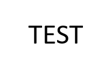

# Notice Example
**[Notice]** [This is the test notice.](https://www.youtube.com/) 
{: .notice--success}


<div class="notice--success">
Notice This is the second test notice.
<ul>
    <li> This is the little notice1. </li>
    <li> This is the little notice2. </li>
</ul>
</div>


# Image example (with function)


{: .img-width-half .align-center}

# Text example
Added message for local server test.

Right align 
{: .align-right}


# Code insert example
```matlab
clear;

v = [1, 4, 7, 2, 19];

maximum = v(1);

for i = 1:length(v)
    element = v(i);
    
    if element > maximum
        maximum = element; 
    end
end

disp('The maximum is: ');
disp(maximum);
```

# Link button example
[Youtube](https://www.youtube.com/){: .btn .btn--danger}

# Youtube video upload example


# LaTex example
This is the LaTex test: $x^2 + y^2 = 15$

$\sum_{j=1}^{n}x_j$