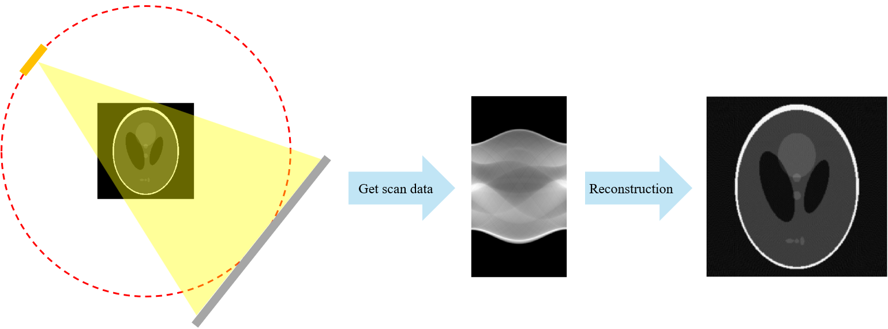
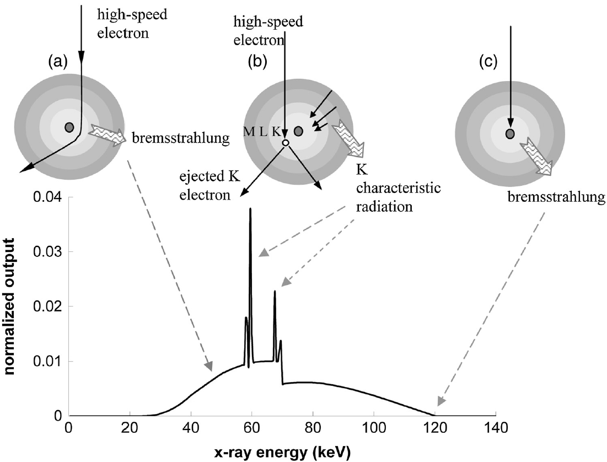

**[Reference]**  
$\bullet$ Computed Tomography: Principles, Design, Artifacts, and Recent Advances  
$\bullet$ Computed Tomography: From Photon Statistics to Modern Cone-Beam CT
{: .notice--success}

# 0.Introduction

Computed Tomography (CT) is a powerful imaging modality in the medical field that utilizes X-rays to generate detailed images of the body's internal structures. 
This non-invasive technique provides crucial diagnostic information without any invasion into body. 
While other imaging techniques like magnetic resonance imaging (MRI) and positron emission tomography (PET) have emerged, CT remains the most widely used imaging technology in diagnostic radiology due to its speed, accessibility, and high spatial resolution.

Nevertheless, CT technology still faces several challenges, such as radiation dose and image artifacts.
These limitations present exciting opportunities for improvement, particularly with the integration of modern Artificial Intelligence (AI).
To fully appreciate these challenges and potential solutions, an understanding of the basics is essential.

The image above provides a simplified illustration of the process for obtaining a medical image using CT.
* The first image depicts the data acquisition step, where an X-ray source and detector pair rotate around a central object to collect scan data.
* The second image is the acquired scan data, often called a "sinogram".
* The third image is the final reconstructed image—an estimate of the original object's cross-section—created from the scan data.

As mentioned before, the key advantage of CT is its ability to obtain a cross-sectional image like the third one non-invasively, without damaging the object.
In this post, we will begin by exploring the fundamental types of CT systems and how X-rays are generated.	


# 1.Types of CT

Types of CT can be sorted by its beam geometry. 

## 1-1) Parallel-beam geometry
{% include start-side-by-side.html
  image_src="../images/2025-06-20-CT_1/image-20250620151406465.png"
  image_alt="Fig.1.1 Parallel-beam geometry diagram."
  image_width="40%"
  font_size="0.9rem"
%}
CT with parallel-beam geometry is also known as first-generation CT.
In this design, a single, pencil-like X-ray beam is used to acquire tomographic data.
The X-ray source and a single detector move linearly together to scan the object.
After completing one linear scan, the source-detector assembly rotates by a small increment (typically 1 degree) and repeats the process until a full 180-degree rotation is complete.  
While this method was revolutionary at the time, its major drawbacks were a very long scan time and high sensitivity to motion artifacts.   


## 1-2) Fan-beam geometry
{% include start-side-by-side.html
  image_src="../images/2025-06-20-CT_1/img.png"
  image_alt="Fig.1.2 Fan-beam geometry diagram."
  image_width="40%"
  font_size="0.9rem"
%}
CT systems using fan-beam geometry are also known as third-generation CT.
Unlike the first generation's pencil beam, this generation utilizes an X-ray beam shaped like a fan.  
Consequently, the single detector is replaced by an array of detectors arranged in a curved band.
This source-detector assembly also rotates around the object, but it operates much faster than the first-generation systems.


## 1-3) Cone-beam geometry
{% include start-side-by-side.html
  image_src="../images/2025-06-20-CT_1/img-1750748174982-37.png"
  image_alt="Fig.1.3 Cone-beam geometry diagram."
  image_width="40%"
  font_size="0.9rem"
%}
Cone-beam CT (CBCT) is an advanced version of the third-generation CT.
It further widens the fan-beam into a cone-shaped X-ray beam, which is paired with a large, two-dimensional (2D) flat-panel detector.  
This key difference—using a 2D detector to capture a cone beam—allows the entire volume of an object to be scanned in a single rotation.
As a result, CBCT significantly shortens scan times compared to previous generations.



# 2.X-ray source

In the previous section, we looked at the three types of CT.
Now, we will focus on X-rays and how they are generated.

## 2-1) X-ray
{% include start-side-by-side.html
  image_src="../images/2025-06-20-CT_1/image-20250624162250674.png"
  image_alt="Fig.2.1 Illustration of the electromagnetic spectrum."
  image_width="50%"
%}
To begin, an X-ray is a form of electromagnetic wave.
However, the term "X-ray" does not apply to the entire electromagnetic spectrum.
As shown left side, the spectrum is divided into different regions, each with a unique name and characteristics. X-rays are simply one specific part of this spectrum.


What's important to note here is that the X-ray region of the spectrum is defined by its energy.
This leads to the question: how is the energy of an X-ray defined?

Energy of X-ray photon is defined as below:

$$
\text{The energy of each X-ray photon}, E=h\nu=\frac{hc}{\lambda} \quad \text{where, } 
\begin{array}{l} 
h \text{: Planck's constant}, 6.63\times10^{-34}[\text{J $\cdot$ s}] \newline
c \text{: the speed of light, } 3\times10^8[\text{m/s}] \newline
\lambda \text{: wave length of the x-ray} [\text{nm}]
\end{array}
$$

According to this definition, X-ray photons have lower energy as the wavelength becomes longer.
Conventionally, it is common to express X-ray energy in units of electron-volts [eV].

Using the conversion $1[\text{eV}] = 1.602 \times 10^{-19} [\text{J}]$, we can rewrite the previous equation as follows:

$$
\text{The energy of each X-ray photon}, E=\large{\frac{1.24 \times 10^{3}}{\lambda}[\text{eV}]}
$$
    

    Conversion process
    $$
    \small\begin{split}
    E &= h\nu = \frac{hc}{\lambda} = \frac{6.63 \times 10^{-34} [\text{J $\cdot$ s}] \times 3 \times 10^{8} [\text{m/s}]}{\lambda [\text{nm}]}\\
    & = \frac{(6.63 \times 3) \times 10^{-26}}{\lambda} \frac{[\text{J $\cdot$ m}]}{[\text{nm}]}\\
    & = \frac{ (6.63 \times 3) \times 10^{-26}}{1.602 \times 10^{-19} \times \lambda} \frac{[\text{eV $\cdot$ m}]}{[\text{nm}]}\\
    & = \frac{12.4 \times 10^{-7}}{\lambda}\frac{[\text{eV $\cdot$ m}]}{[\text{nm}]}\\
    & = \frac{1.24 \times 10^{-6}}{\lambda}\frac{[\text{eV $\cdot$ m}]}{[\text{nm}]}\\
    & = \frac{1.24 \times 10^{3}}{\lambda}\frac{[\text{eV $\cdot$ nm}]}{[\text{nm}]}\\
    & = \frac{1.24 \times 10^{3}}{\lambda}[\text{eV}]
    \end{split}
    $$
    

Therefore, using the equation above, we can determine the energy of a photon from its wavelength.
If this energy falls within the X-ray range, the photon is classified as an X-ray photon.
Typically, the X-ray energies used for medical CT range from 20 keV to 140 keV.

## 2-2) X-ray generation
So, how are X-rays generated?
X-ray photons are produced when high-speed electrons strike a target material.
In this process, the kinetic energy of the electrons is converted into electromagnetic radiation, as illustrated below.

{% include start-side-by-side.html
  image_src="../images/2025-06-20-CT_1/img-1750762484166-42.png"
  image_alt="Fig.2.2 Illustration of X-ray generation."
  image_width="55%"
%}
As shown on the left, X-rays are emitted when high-speed electrons are fired at a target material that serves as an anode.
During this process, the target material rotates as the electrons strike it.
The reason for this rotation is to dissipate the heat generated at the point of impact, as illustrated on the right. This is also why tungsten, a material with a high melting point, is used for the target.   
 

So, how do these electrons generate X-rays upon colliding with the tungsten target? 

The process is as follows:

When a high-speed electron collides with the target material, it can strike an electron within a target atom, knocking it out of its orbit and thus ionizing the atom.
Of course, not every electron interaction results in the emission of an X-ray.
In fact, most of the energy is converted into heat.
However, we will focus on the following three key interactions that do lead to X-ray generation.

<figure>
  
   <figcaption style="font-size: 20px;">
   Fig.2.3 Illustration of electron interaction with a target material and its relationship to the x-ray tube energy spectrum. (a) Bremsstrahlung radiatioin occurs. (b) Characteristic radiation occurs. (c) Full conversion of kinetic energy into x-ray energy. 
   </figcaption>
</figure>

The graph above illustrates the three interactions that occur when electrons, accelerated by a 120 kVp potential, strike a tungsten target.
Simultaneously, it shows the probability of generating photons at different energy levels (x-axis) in the form of a Probability Density Function (PDF). 

The total area under the curve of this graph is 1

What is crucial to note here is that even with a fixed accelerating voltage of 120 kVp, the resulting X-ray energy is not monoenergetic (a single energy level).
Instead, it is polychromatic, meaning it spans a wide range of energies.

### 2-2-1) The first interaction (a)

{% include start-side-by-side.html
  image_src="../images/2025-06-20-CT_1/image-20250624204253351.png"
  image_alt=" "
  image_width="50%"
  font_size="0.8rem"
%}
The first interaction occurs when a high-speed electron passes near an atomic nucleus. Attracted by the nucleus, the electron's trajectory is deflected, and this change in path emits what is known as **Bremsstrahlung** radiation.
The closer the electron passes to the nucleus, the more sharply its path is bent, resulting in higher-energy radiation.  
The graph highlights the portion of the X-ray spectrum generated by Bremsstrahlung.
The Bremsstrahlung radiation seen at the 120 keV endpoint is technically a result of the third interaction type. However, since it is still a form of Bremsstrahlung, it has been included in this part of the graph.  



### 2-2-2) The second interaction (b)

{% include start-side-by-side.html
  image_src="../images/2025-06-20-CT_1/image-20250624205635211.png"
  image_alt=""
  image_width="50%"
  font_size="0.8rem"
%}
The second interaction occurs when a high-speed electron collides with an electron in one of the target atom's shells.
If the incoming electron knocks an inner-shell electron out of its orbit, a vacancy is created. An electron from a higher energy shell then drops down to fill this vacancy. In doing so, it releases radiation with an energy equal to the difference between the two shells.   
It is important to note that this radiation, corresponding to a specific energy difference, appears as sharp peaks on the graph.
These peaks are called "**characteristic radiation**". They are so named because their energy levels are unique to each target material, acting as a fingerprint that can be used to identify it. The highlights on the graph indicates characteristic radiation peaks for tungsten.



### 2-2-3) The third interaction (c)

{% include start-side-by-side.html
  image_src="../images/2025-06-20-CT_1/img-1750766551339-48.png"
  image_alt=" "
  image_width="50%"
  font_size="0.8rem"
%}
The third interaction occurs when a high-speed electron collides directly with an atomic nucleus, also resulting in **Bremsstrahlung** radiation.
The energy released in this case is the maximum possible energy an X-ray can have, and it is equal to the operating energy of the X-ray tube.  
However, as seen on the graph, the normalized output on the y-axis for this interaction is extremely low.
This means that the probability of this interaction occurring is so low that it approaches zero.  



