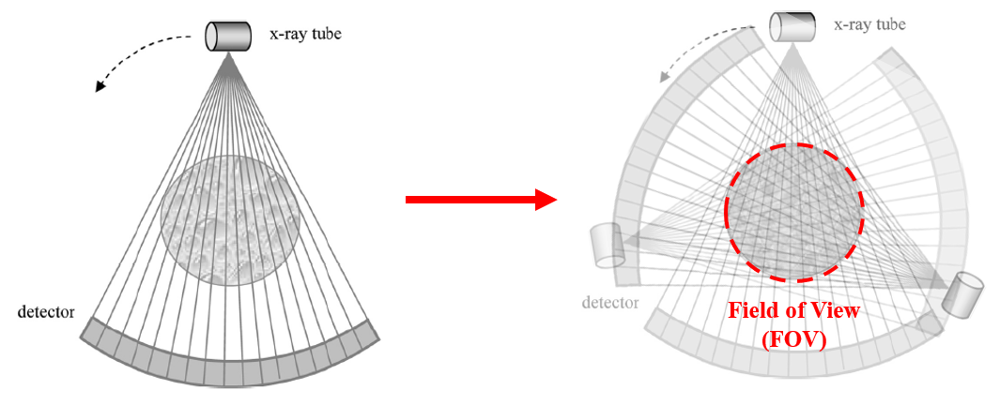

**[Reference]**  
$\bullet$ Computed Tomography: Principles, Design, Artifacts, and Recent Advances  
$\bullet$ Computed Tomography: From Photon Statistics to Modern Cone-Beam CT
{: .notice--success}

# 0.Introduction

We will take a closer look at X-ray generation and so on.

As shown in the overview diagram above, which illustrates the entire CT scan and reconstruction workflow, this corresponds to the process indicated by the orange arrow in the first figure.


# 1.Focal spot size & Anode angle

Let's examine two factors that influence image quality: the focal spot size and the anode angle.

## 1-1) Focal spot
The focal spot is the area on the target material where electrons collide to generate X-rays.

<figure>
  
   <figcaption style="font-size: 20px; margin-left: auto; margin-right: auto;">
   Fig.1.1 Illustration of X-ray source and target material.
   </figcaption>
</figure>

Ideally, all electrons would strike a single, infinitesimally small point. 
However, in reality, it's impossible for countless electrons to hit the exact same spot. Instead, they impact a small, specific area, which we call the focal spot.

The size of this focal spot directly affects image quality. 
A smaller focal spot results in higher spatial resolution. However, this comes with a trade-off: a smaller focal spot can handle less power, which means lower X-ray output and potentially longer exposure times.

## 1-2) Anode angle
Next, let's look at the anode angle, which is a key factor in determining the focal spot size.

<figure>
  
   <figcaption style="font-size: 20px; margin-left: auto; margin-right: auto;">
   Fig.1.2 Target material and its focal spot.
   </figcaption>
</figure>

The anode angle refers to the angle of inclination of the target material, as illustrated in the image above. The image shows target materials with different anode angles.  
Here's how they are related:  

* A smaller anode angle leads to a shorter "focal spot length" along the slope, resulting in a smaller effective focal spot size.
* Conversely, a larger anode angle creates a longer focal spot length, resulting in a larger effective focal spot size.

In summary, the anode angle is directly proportional to both the effective focal spot size and the power handling capacity, while being inversely proportional to the final image resolution.


Resolution, X-ray power
$\text{Rsolution} \propto \frac{1}{\text{Focal spot size}} \text{&} \frac{1}{\text{Anode angle}}$, $\text{X-ray power} \propto \text{Focal spot size} \text{&} \text{Anode angle}$
 


# 2.X-ray power

We previously saw that adjusting the focal spot size and anode angle affects X-ray power.
In addition to these two, another factor that influences X-ray power is the cathode filament size.

<figure style="display: flex; flex-direction: column; align-items: center;">
  
   <figcaption style="font-size: 20px; margin-top: -0.5em;">
   Fig.2.1 Cathod filament.
   </figcaption>
</figure> 

A larger cathode filament size results in stronger X-ray power, which in turn decreases the required scanning time.


# 3.Anode heel effect

Electrons striking the target material produce a cone-shaped beam of X-rays. At first glance, you might assume the X-ray power is uniform within this cone, but it is not. This variation in intensity is explained by the anode heel effect.

Here's how it works:

<figure style="display: flex; flex-direction: column; align-items: center;">
  
   <figcaption style="font-size: 20px; margin-top: -0.5em;">
   Fig.3.1 Illustration of anode heel effect.
   </figcaption>
</figure> 

The diagram on the right illustrates an electron striking a target with a specific anode angle. Through interaction with the target material, this electron will emit X-rays in various directions—for simplicity, let's say to the left and to the right. The key factor to focus on here is the path length that the emitted X-ray must travel through the target material itself. The X-ray traveling toward the cathode side has a clear, short path out of the target. In contrast, the X-ray traveling toward the anode side must pass through a thicker part of the target material—the "heel" of the anode—before it can escape.

This journey through the target material absorbs some of the X-ray's energy, a process called attenuation. As a result, X-rays on the anode side are weaker than those on the cathode side. This creates an intensity gradient across the beam: the beam is more intense on the cathode side and less intense on the anode side. This variation is the anode heel effect.


# 4.Position of the object

Finally, let's consider the object's position. In CT, the object to be scanned is placed between the X-ray tube and the detector. 

This raises a question: where exactly should it be positioned? 

In this section, we will explore the pros and cons of different object placements on the final image. Let's begin with a standard fan-beam geometry.

<figure>
  
   <figcaption style="font-size: 20px; margin-left: auto; margin-right: auto;">
   Fig.4.1 Illustration of Fan-beam geometry and its Field of view.
   </figcaption>
</figure>

The figure on the left depicts an object placed at the center of rotation, between the tube and the detector. As the scan proceeds, the tube and detector rotate around the object. This rotation creates a circular region that is scanned from all angles, as shown on the right. We call this fully scanned area the Field of View (FOV).
When the object is at the center of rotation, it is completely contained within the FOV. This ensures that the entire object is thoroughly scanned from all directions.
So, what happens if we move the object away from the center?


{% include start-side-by-side.html
  image_src="../images/2025-06-25-CT_2/img-1750942419011-65.png"
  image_alt="Fig.4.2 Fan-beam geometry & Object far from x-ray source."
  image_width="30%"
  font_size="0.8rem"
%}
Let's examine the case where the object moves away from the X-ray tube, as shown on the left. As the object moves farther away, the X-ray beam becomes less dense (more spread out) by the time it reaches the object.   
In this case, the spatial resolution of the final image degrades. However, the advantage is that this position allows for a larger object to be scanned, as it effectively increases the Field of View.




{% include start-side-by-side.html
  image_src="../images/2025-06-25-CT_2/img-1750943073417-68.png"
  image_alt="Fig.4.3 Fan-beam geometry & Object close to x-ray source."
  image_width="30%"
  font_size="0.8rem"
%}
Let's consider the opposite scenario, where the object is moved closer to the X-ray tube. Because it's closer, the object is hit by a denser, more concentrated X-ray beam.
This positioning results in improved spatial resolution.   
The downside, however, is that parts of the object may fall outside the scannable area, leading to incomplete data (truncation).



