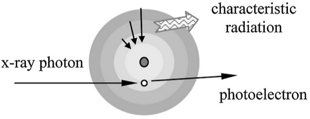
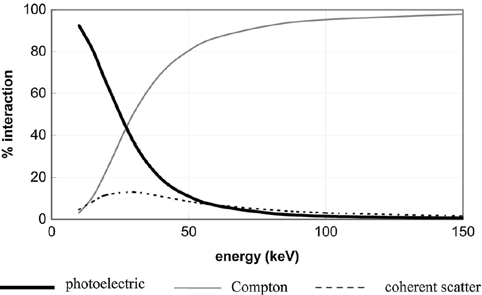
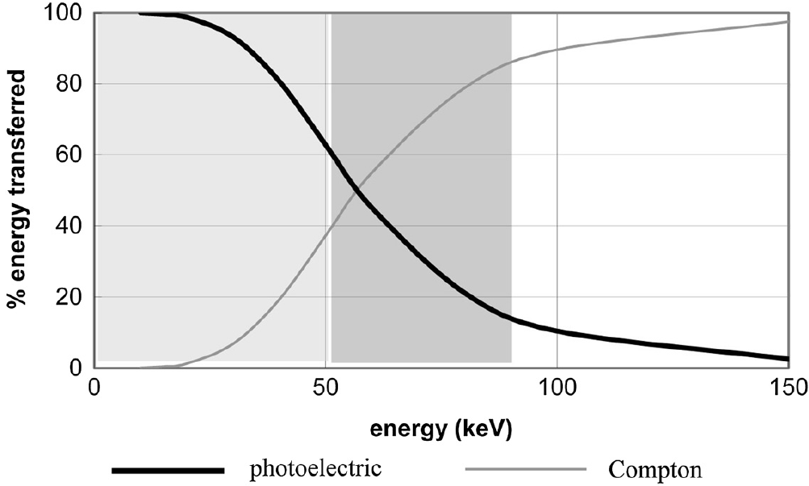
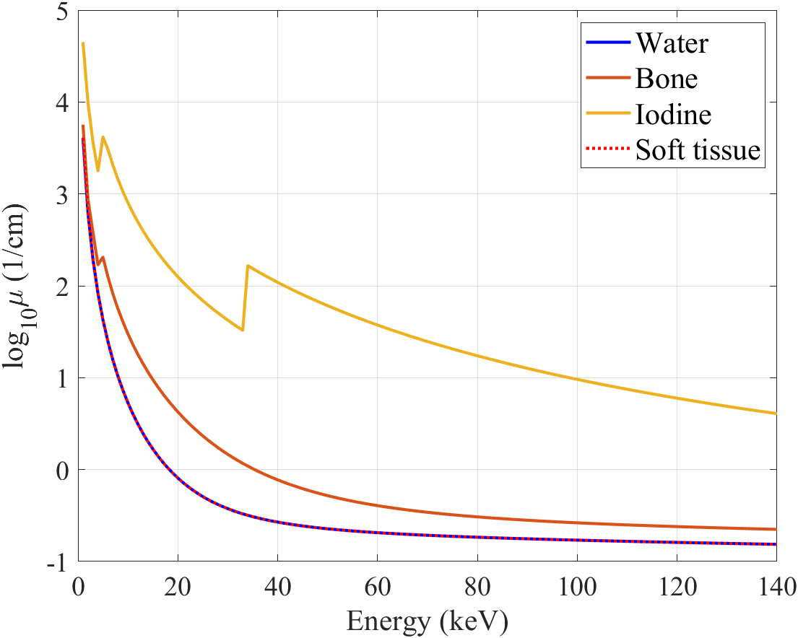
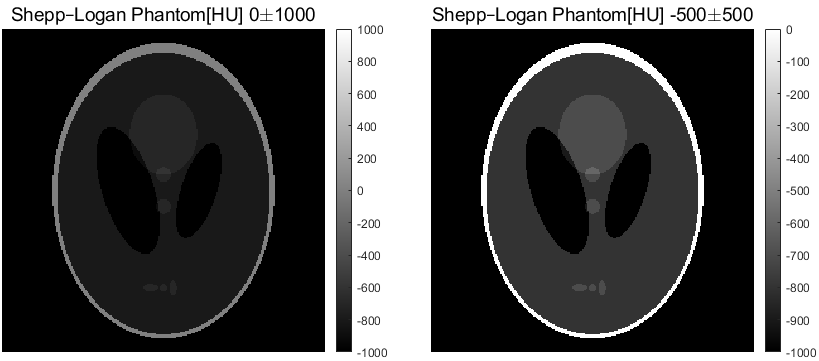

**[Reference]**  
$\bullet$ Computed Tomography: Principles, Design, Artifacts, and Recent Advances  
$\bullet$ Computed Tomography: From Photon Statistics to Modern Cone-Beam CT
{: .notice--success}

# 0.Introduction
We will explore the ways in which X-ray photons, generated by electrons striking a target material, interact with matter.
For the simplicity, we will examine the case of a single X-ray photon interacting with matter, out of the countless photons that are actually emitted.

# 1.Photon-matter interaction
The energy used in clinical X-rays typically ranges from 20 keV to 140 keV. (e.g., 120 or 140 kVp for a full-body scan, and 30 kVp for mammography).
Within this energy range, let's examine the two primary interactions that occur when X-rays pass through an object (typically the human body):  
$\qquad\qquad\qquad\qquad\qquad\qquad\qquad\rightarrow$ **the Photoelectric Effect** and **Compton Scattering**.  
The most important concept for both interactions is that they are responsible for X-ray attenuation.

## 1-1) Photoelectric effect
The photoelectric effect occurs when the energy of an X-ray photon is higher than the binding energy of an electron in an atom of the material. (Textbooks specify that this interaction is most likely when the photon's energy is just slightly higher than the electron's binding energy.)

<figure style="display: flex; flex-direction: column; align-items: center; margin-top: 0.5em; margin-bottom: 0.5em;">
  
   <figcaption style="font-size: 20px; margin-top: -0.5em;">
   Fig.1.1 Illustration of photoelectric interaction.
   </figcaption>
</figure> 

In this process, the incident X-ray photon transfers all of its energy to an electron, ejecting it from the atom, and the photon itself is completely absorbed and disappears.

* The ejected electron is called a photoelectron.
* The vacancy left by the electron is filled by another electron from an outer shell.
* This transition emits characteristic radiation (also called K-escape). However, this secondary radiation has very low energy and is quickly re-absorbed within the body, so it does not contribute to the image.

As a result of this interaction, the X-ray photon is attenuated within the body.

The photoelectric effect is most likely to occur when:
* The material's atomic number, Z is high.
* The X-ray photon energy, E is low (but still greater than the electron's binding energy).

The following formula summarizes the relationship among the probability of the photoelectric interaction ($P_{\text{photoelectric}}$), the atomic number (Z), and the photon energy (E): 

$$
P_{\text{photoelectric}} \propto \frac{Z^3}{E^3} \tag{1.1}
$$

As the formula shows, the probability of the photoelectric effect is proportional to Z$^3$. Because of this strong dependence, even a small difference in atomic number between two tissues can cause a large difference in photoelectric absorption. Therefore, attenuation due to the photoelectric effect produces high contrast in an X-ray image, making it easy to distinguish between different types of tissue.

## 1-2) Compton (incoherent) scattering
Compton scattering is the dominant interaction when the incident X-ray photon's energy is significantly higher than the binding energy of an electron in the material.

<figure style="display: flex; flex-direction: column; align-items: center; margin-top: 0.5em; margin-bottom: 0.5em;">
  
   <figcaption style="font-size: 20px; margin-top: -0.5em;">
   Fig.1.2 Illustration of Compton scattering.
   </figcaption>
</figure> 

As shown in the figure above, the process unfolds as follows:
* An incident X-ray photon collides with an electron and ejects it from the atom. This ejected electron is called a recoil electron.
* Unlike the photoelectric effect, the photon is not absorbed. Instead, it is deflected or scattered in a new direction, having lost some of its initial energy. (Note: Low-energy photons are more likely to be backscattered, while high-energy photons tend to scatter in a forward direction.)

Since a significant amount of energy remains with the scattered photon, it can continue to cause further interactions until it exits the body. The probability of Compton scattering can be represented by the following formula:

$$
\begin{split}
P_{\text{compton}} \propto Z &\Biggl( \frac{1 + \alpha}{\alpha^2} \left[ \frac{2(1 + \alpha)}{1 + 2\alpha} - \frac{1}{\alpha} \ln(1 + 2\alpha) \right] \\
& \qquad + \frac{1}{2\alpha} \ln(1 + 2\alpha) - \frac{(1 + 3\alpha)}{(1 + 2\alpha)^2} \Biggr)
\end{split}
\tag{1.2}
$$$$
* \text{Klein-Nishina funtion, }\alpha = \frac{E}{510.975} [keV]
$$

Compared to the photoelectric effect, Compton scattering is less dependent on the atomic number, Z. This means it produces low contrast between tissues with similar atomic numbers, making them difficult to distinguish from one another. For this reason, in most medical CT applications, efforts are made to minimize the effects of Compton scattering.

## 1-3) Rayleigh scattering (Coherent scattering)
In addition to the photoelectric effect and Compton scattering, there is a third type of interaction called Rayleigh scattering.
However, in the 20-140 keV energy range typically used for clinical CT, the contribution of Rayleigh scattering is negligible compared to the other two interactions. For this reason, it is generally not a significant consideration in medical imaging discussions.

## 1-4) Relative importance of three types of interactions
The following graph shows the percentage of three types of interactions in water as a function of photon energy.

<figure style="display: flex; flex-direction: column; align-items: center; margin-top: 0.5em; margin-bottom: 0.5em;">
  
   <figcaption style="font-size: 20px; margin-top: -0.5em;">
   Fig.1.3 Percentages of different types of interactions as a function of energy in water.
   </figcaption>
</figure> 

From the graph, we can observe the following:
* The percentage of photoelectric interactions decreases sharply as X-ray energy increases.
* The percentage of Compton scattering increases rapidly as X-ray energy increases.

Now, let's look at the next graph, which shows the "percent of energy transferred as a function of X-ray photon energy for different processes." Here, we can confirm that at low energies, most of the energy is transferred via the photoelectric process.

<figure style="display: flex; flex-direction: column; align-items: center; margin-top: 0.5em; margin-bottom: 0.5em;">
  
   <figcaption style="font-size: 20px; margin-top: -0.5em;">
   Fig.1.4 Percentages of energy transfer of different interactions in water.
   </figcaption>
</figure> 

This graph can be divided into three distinct regions, as marked in the figure:
* ~50 keV: Photoelectric absorption is dominant.
* 50-90 keV: Both photoelectric and Compton interactions are significant.
* 90-150 keV: Compton interaction is dominant.
  

# 2.Attenuation
Previously, we looked at how X-ray photons interact with matter. 
In this section, we will focus on attenuation, which is the outcome of these interactions.

## 2-1) Linear attenuation coefficeint (LAC) & Mass attenuation coefficeint (MAC)
Attenuation occurs because X-ray photons are absorbed (via the photoelectric effect) or scattered (via Compton scattering) as they pass through a material. 
The degree of this attenuation can be described by the material's Linear Attenuation Coefficient (LAC). 
The LAC is a function of both the X-ray energy, E and the material's atomic number, Z.
The LAC represents the fraction of photons that are removed from the beam per unit of thickness (e.g., per 1 cm). 

$$
\text{LAC of material a at E: } \mu_a(Z_a,E) [\text{cm}^{-1}] \tag{2.1}
$$

In other words, the thicker the material, the more attenuation occurs.

While the LAC relates attenuation to a material's thickness, the mass attenuation coefficient(MAC) relates it to density.

$$
\text{MAC of material a at E: } \frac{\mu_a(Z_a,E)}{\rho_a} [\text{cm}^{2}/\text{g}] \tag{2.2}
$$

## 2-2) LAC by energy
We previously established that the Linear Attenuation Coefficient (LAC) is a function of the incident photon's energy, E. Let's now examine a graph that shows how the LAC changes with X-ray energy for various materials.

<figure style="display: flex; flex-direction: column; align-items: center; margin-top: 0.5em; margin-bottom: 0.5em;">
  
   <figcaption style="font-size: 20px; margin-top: -0.5em;">
   Fig.2.1 Linear attenuation coefficients for different materials.
   </figcaption>
</figure> 

The graph above shows the change in the linear attenuation coefficient, $\mu$ for water, bone, soft tissue and iodine as a function of energy. 
From this, we can draw several key conclusions:
* Water and soft tissue have very similar LAC values across the energy spectrum. This is understandable, given that soft tissue is primarily composed of water.
* In general, attenuation is greater at lower X-ray energies. For all materials, the coefficient tends to decrease as energy increases.
* Iodine has a significantly higher LAC than water or soft tissue. This property is why iodine is widely used as a contrast agent.
* There are sharp, abrupt jumps, or discontinuities, in the curves. This phenomenon is known as the K-edge, and it occurs at the energy corresponding to the binding energy of the K-shell electrons for that specific material. The energy at which the K-edge appears is unique to each element.

## 2-3) Hounsfield unit (HU, CT number)
### 2-3-1) Definition of Hounsfield unit
While we will cover this in more detail later, the process of reconstructing a CT image from scan data results in an image where each pixel value corresponds to the LAC of the material at that location.
But what happens if two different materials have very similar LAC values? 
In the image, there would be almost no contrast between their corresponding pixels, making them nearly impossible to distinguish. 
This would significantly reduce the diagnostic value of the scan.
Therefore, to amplify these subtle differences in LACs and improve contrast, we apply the following scaling transformation called **CT number** to the pixel values of the reconstructed CT image:

$$
\text{CT number of $\mu$ = } \frac{\mu - \mu_{water}}{\mu_{water}} \times 1000 [HU] \tag{2.3}
$$

The unit of the pixels transformed to CT number is called the Hounsfield Unit (HU). 
After this transformation, water has a value of 0 HU and air has a value of -1000 HU. 
This standardized scale allows us to extract much more information from the image.

### 2-3-2) Description of Hounsfield unit
An image converted to Hounsfield Units (HU) has values ranging from approximately -1000 to +1000 [HU]. 
Because of this wide range, if the image is visualized directly, the subtle differences between pixels with intermediate values are nearly impossible for the human eye to distinguish.
Therefore, for a CT image in [HU], the display's grayscale range must be adjusted. 
This adjustment is typically performed using two parameters:  
$\qquad\qquad\qquad\qquad\qquad\qquad\qquad \rightarrow$ **Window Level (WL)** & **Window Width (WW)**.  

Here is an example of how this works:

<figure style="display: flex; flex-direction: column; align-items: center; margin-top: 0.5em; margin-bottom: 0.5em;">
  
   <figcaption style="font-size: 20px; margin-top: -0.5em;">
   Fig.2.2 Shepp-Logan phantoms [HU] with different WL/WW.
   </figcaption>
</figure> 

{% include start-side-by-side.html
  image_src="../images/2025-06-27-CT_3/img-1751270769886-6.png"
  image_alt="Fig.2.3 Illustration of WL/WW."
  image_width="40%"
%}
The display range is expressed using Window Width and Window Level, often written as WL/WW. 
$\bullet$ Window Level (WL) specifies the center of the Hounsfield Unit range you want to view. 
$\bullet$ Window Width (WW) specifies the total range (or width) of HU values to be displayed around that center level.


<!-- # 1.Number of photons, $N_0$
When we scan the object, X-ray and object are interact. Before we delve into these interactions, let's first establish the number of photons we are dealing with. The diagram below illustrates a basic X-ray tube and detector setup. 

<figure style="display: flex; flex-direction: column; align-items: center;">
  
   <figcaption style="font-size: 20px; margin-top: -0.5em;">
   Fig.1.1 Simple illustration of x-ray source and detector set.
   </figcaption>
</figure> 

Let's assume an X-ray tube operating at 120 kVp and 1 mA. A detector with a 1 mm$^2$ area, placed 1m away, detects $2.2 \times 10^6$ photons per second. We will define this as the total number of incident photons, $N_0$. -->
