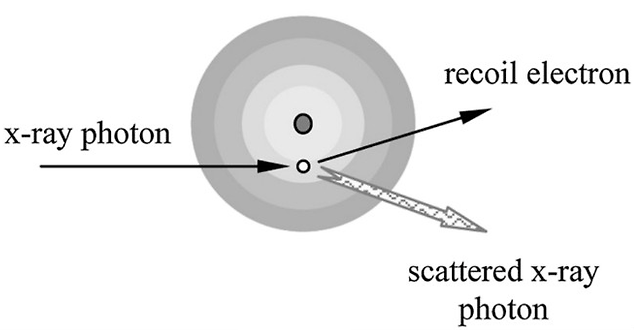

**[Reference]**  
$\bullet$ Computed Tomography: Principles, Design, Artifacts, and Recent Advances  
$\bullet$ Computed Tomography: From Photon Statistics to Modern Cone-Beam CT
{: .notice--success}

# 0.Introduction
We will explore the ways in which X-ray photons, generated by electrons striking a target material, interact with matter.
For the simplicity, we will examine the case of a single X-ray photon interacting with matter, out of the countless photons that are actually emitted.

# 1.Photon-matter interaction
The energy used in clinical X-rays typically ranges from 20 keV to 140 keV. (e.g., 120 or 140 kVp for a full-body scan, and 30 kVp for mammography).
Within this energy range, let's examine the two primary interactions that occur when X-rays pass through an object (typically the human body):  
$\qquad\qquad\qquad\qquad\qquad\qquad\qquad\rightarrow$ **the Photoelectric Effect** and **Compton Scattering**.  
The most important concept for both interactions is that they are responsible for X-ray attenuation.

## 1-1) Photoelectric effect
The photoelectric effect occurs when the energy of an X-ray photon is higher than the binding energy of an electron in an atom of the material. (Textbooks specify that this interaction is most likely when the photon's energy is just slightly higher than the electron's binding energy.)

<figure style="display: flex; flex-direction: column; align-items: center; margin-top: 0.5em; margin-bottom: 0.5em;">
  
   <figcaption style="font-size: 20px; margin-top: -0.5em;">
   Fig.1.1 Illustration of photoelectric interaction.
   </figcaption>
</figure> 

In this process, the incident X-ray photon transfers all of its energy to an electron, ejecting it from the atom, and the photon itself is completely absorbed and disappears.

* The ejected electron is called a photoelectron.
* The vacancy left by the electron is filled by another electron from an outer shell.
* This transition emits characteristic radiation (also called K-escape). However, this secondary radiation has very low energy and is quickly re-absorbed within the body, so it does not contribute to the image.

As a result of this interaction, the X-ray photon is attenuated within the body.

The photoelectric effect is most likely to occur when:
* The material's atomic number, Z is high.
* The X-ray photon energy, E is low (but still greater than the electron's binding energy).

The following formula summarizes the relationship among the probability of the photoelectric interaction ($P_{\text{photoelectric}}$), the atomic number (Z), and the photon energy (E): 

$$
P_{\text{photoelectric}} \propto \frac{Z^3}{E^3} \tag{1.1}
$$

As the formula shows, the probability of the photoelectric effect is proportional to Z$^3$. Because of this strong dependence, even a small difference in atomic number between two tissues can cause a large difference in photoelectric absorption. Therefore, attenuation due to the photoelectric effect produces high contrast in an X-ray image, making it easy to distinguish between different types of tissue.

## 2.Compton (incoherent) scattering
Compton scattering is the dominant interaction when the incident X-ray photon's energy is significantly higher than the binding energy of an electron in the material.

<figure style="display: flex; flex-direction: column; align-items: center; margin-top: 0.5em; margin-bottom: 0.5em;">
  
   <figcaption style="font-size: 20px; margin-top: -0.5em;">
   Fig.1.2 Illustration of Compton scattering.
   </figcaption>
</figure> 

As shown in the figure above, the process unfolds as follows:
* An incident X-ray photon collides with an electron and ejects it from the atom. This ejected electron is called a recoil electron.
* Unlike the photoelectric effect, the photon is not absorbed. Instead, it is deflected or scattered in a new direction, having lost some of its initial energy. (Note: Low-energy photons are more likely to be backscattered, while high-energy photons tend to scatter in a forward direction.)

Since a significant amount of energy remains with the scattered photon, it can continue to cause further interactions until it exits the body. The probability of Compton scattering can be represented by the following formula:

$$
P_{\text{compton}} \propto \text{Compton scattering} \propto Z \left( \frac{1 + \alpha}{\alpha^2} \left[ \frac{2(1 + \alpha)}{1 + 2\alpha} - \frac{1}{\alpha} \ln(1 + 2\alpha) \right] + 
\frac{1}{2\alpha} \ln(1 + 2\alpha) - \frac{(1 + 3\alpha)}{(1 + 2\alpha)^2} \right) \tag{1.2}
$$

<!-- # 1.Number of photons, $N_0$
When we scan the object, X-ray and object are interact. Before we delve into these interactions, let's first establish the number of photons we are dealing with. The diagram below illustrates a basic X-ray tube and detector setup. 

<figure style="display: flex; flex-direction: column; align-items: center;">
  
   <figcaption style="font-size: 20px; margin-top: -0.5em;">
   Fig.1.1 Simple illustration of x-ray source and detector set.
   </figcaption>
</figure> 

Let's assume an X-ray tube operating at 120 kVp and 1 mA. A detector with a 1 mm$^2$ area, placed 1m away, detects $2.2 \times 10^6$ photons per second. We will define this as the total number of incident photons, $N_0$. -->
