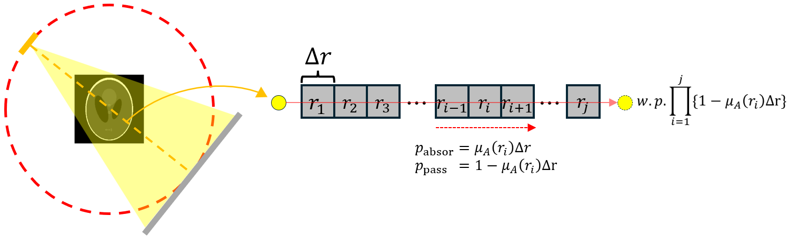

**[Reference]**  
$\bullet$ Computed Tomography: Principles, Design, Artifacts, and Recent Advances  
$\bullet$ Computed Tomography: From Photon Statistics to Modern Cone-Beam CT
{: .notice--success}

# 0.Introduction
We will discuss the probability of detection (Mathematical modeling of photon-detection).
More specifically, we will focus on the probability that a photon, from the moment it is generated by the X-ray source, passes through an object, and is finally detected.

As shown in the overview diagram above, which illustrates the entire CT scan and reconstruction workflow, this corresponds to the process indicated by the three orange circles in the first figure.

It is important to note that for this discussion, **we will assume the X-ray source is monoenergetic**, meaning it emits photons of a single energy level.
Consequently, the LAC, which was previously expressed as a function of both the spatial parameter, r and energy E, $\mu(r,E)$, now simplifies to a function dependent only on the spatial parameter, r:

$$
\mu(r, E) \rightarrow \mu(r)
$$

# 1.Mathematical modeling for monochromatic X-ray

## 1-1) Probability for X-ray photon generation
{% include start-side-by-side.html
  image_src="../images/2025-06-30-CT_4/image-20250701191124217.png"
  image_alt=""
  image_width="30%"
%}
Let's mathematically model the generation of photons from an X-ray source. (Monoenergetic!) 
This corresponds to the process occurring in the area marked by the orange circle in the left figure.  


1. Let N be the number of electrons striking the anode during the time interval [0, T], and let $p_1$ be the probability that a single electron successfully generates an X-ray photon.

2. Let the random variable X be the number of successful X-ray photon generations from these N electrons.

3. Under these conditions, the probability of generating exactly n photons from N electrons, P(X = n), follows a binomial distribution: 
$P(X = n) = \binom{N}{n} p_{1}^n (1 - p_1)^{N - n}$

4. In a realistic scenario, the number of electrons N is extremely large ($N \rightarrow \infty$) while the probability of success $p_1$ is very small ($p_1 \rightarrow 0$).  If their product, the expected value $E(X)=\lambda=N\cdot p_1=N_0$, remains constant, this binomial distribution can be approximated by a Poisson distribution: 

$P(X = n) = \lim\limits_{N \to \infty, p_1 \to 0} \binom{N}{n} p_{1}^n (1 - p_{1})^{N - n} = \frac{e^{-N_0} N_0^n}{n!} $

 
Here, $N_0$ is the expected average number of X-ray photons to be generated (a value often provided in reference data or by the manufacturer).

## 1-2) Probability for X-ray photon transmission
{% include start-side-by-side.html
  image_src="../images/2025-06-30-CT_4/image-20250701212408002.png"
  image_alt=""
  image_width="30%"
%}
Let's create a mathematical model for the probability of an X-ray photon passing through an object.  


1. Given that n photons are generated at the source, our goal is to find the probability that M of them will successfully transmit through the object. To do this, we will first derive the probability for a single photon and then extend it to M photons.

2. As shown in the figure below, let's consider a single, continuous object as a series of many small, discrete objects $(r_1, r_2, \dots, r_k)$. The length of each small object is denoted by $\Delta r$. {: .align-center} The probability that a single photon is absorbed as it travels from segment $j-1$ to $j$ is given by $\mu_a(r_i)\Delta r$. Therefore, the probability that the photon is not absorbed and successfully passes from segment $j-1$ to $j$ is $1-\mu_a (r_i) \Delta r$.  
\begin{array}{l} p_{\text{absor}} = \mu_a(r_j)\Delta r \\ p_{\text{pass}}=1-\mu_a(r_j)\Delta r \end{array}

3. Consequently, the probability that a photon passes through all $k$ segments without being absorbed is the product of the individual probabilities:  
$\text{Probability for a photon will transmit the object, p}_2 = \prod_{i=1}^{k} \left\{ 1 - \mu_a(\mathbf{r}_i) \Delta \mathbf{r} \right\}$

4. Now, we can simplify this expression by making the object segments infinitesimally small and infinitely numerous ($k \rightarrow \infty, \Delta r \rightarrow 0$).   The probability $p_2$ that a photon transmits through the object becomes:   
\begin{split} p_2 &= \lim\limits_{k \to \infty, \Delta \mathbf{r} \to 0} \prod_{i=1}^{k} \left\{ 1 -\mu_a(\mathbf{r}_j) \Delta \mathbf{r} \right\} = \lim\limits_{k \to \infty, \Delta \mathbf{r} \to 0} e^{\left\{ \ln \left( \prod_{i=1}^{k} \left\{ 1 - \mu_a(\mathbf{r}_j) \Delta \mathbf{r} \right\} \right) \right\}} \\ \\
&= \lim\limits_{k \to \infty, \Delta \mathbf{r} \to 0} e^{\left\{ \sum\limits_{i=1}^{k} \ln \left( 1 - \mu_a(\mathbf{r}_j) \Delta \mathbf{r} \right) \right\}} \\ \\ &\bigg\downarrow \small{\left(\lim\limits_{x \to 0}\frac{\ln(1+x)}{x} = 1 \rightarrow \lim\limits_{x \to 0} \ln(1+x) = x \right) }\\ \\
& = \lim\limits_{k \to \infty, \Delta \mathbf{r} \to 0} e^{\left\{ \sum_{i=1}^{k} \left( -\mu_a(\mathbf{r}_j) \Delta \mathbf{r} \right) \right\}} = e^{\left\{ \int -\mu_a(\mathbf{r}) \, dr \right\}}
\end{split}

The probability that a single photon will be absorbed as it passes through one of these small segments is $\mu_a(r_i)\Delta r$. Therefore, the probability that the photon will transmit without being absorbed is $1-(\mu_a (r_i) \Delta r)$. 

