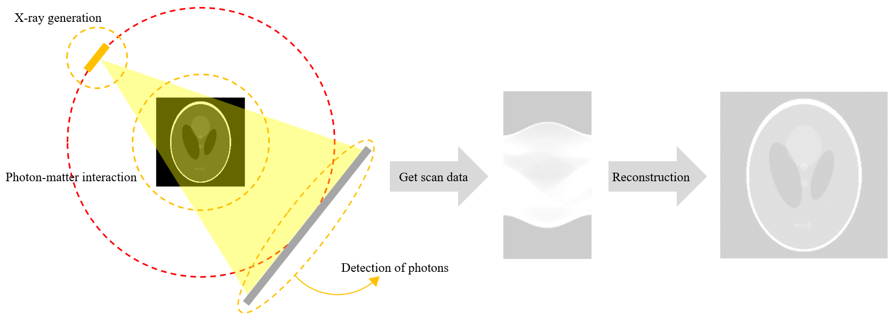
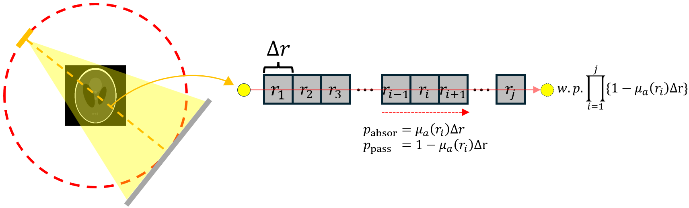
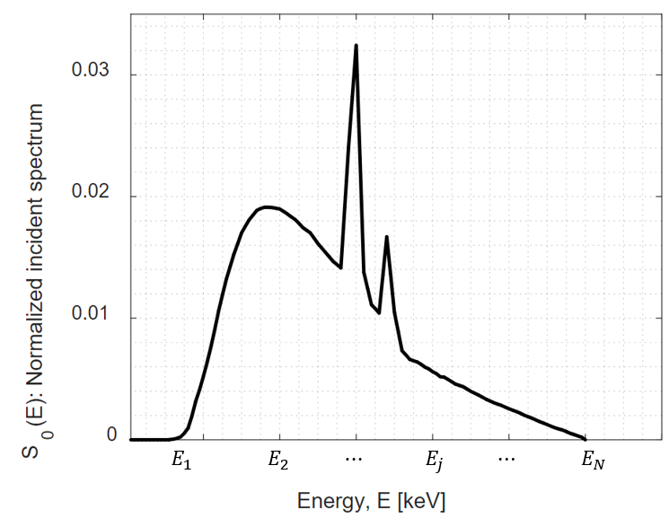

**[Reference]**  
$\bullet$ Computed Tomography: Principles, Design, Artifacts, and Recent Advances  
$\bullet$ Computed Tomography: From Photon Statistics to Modern Cone-Beam CT
{: .notice--success}

# 0.Introduction
We will discuss the probability of detection (Mathematical modeling of photon-detection).
More specifically, we will focus on the probability that a photon, from the moment it is generated by the X-ray source, passes through an object, and is finally detected.

As shown in the overview diagram above, which illustrates the entire CT scan and reconstruction workflow, this corresponds to the process indicated by the three orange circles in the first figure.

It is important to note that for this discussion, **we will assume the X-ray source is monochromatic**, meaning it emits photons of a single energy level.
Consequently, the LAC, which was previously expressed as a function of both the spatial parameter, r and energy E, $\mu(r,E)$, now simplifies to a function dependent only on the spatial parameter, r:

$$
\mu(r, E) \rightarrow \mu(r)
$$

# 1.Mathematical modeling for monochromatic X-ray

## 1-1) Probability for X-ray photon generation
{% include start-side-by-side.html
  image_src="../images/2025-06-30-CT_4/image-20250701191124217.png"
  image_alt=""
  image_width="30%"
%}
Let's mathematically model the generation of photons from an X-ray source. (Monochromatic!) 
This corresponds to the process occurring in the area marked by the orange circle in the left figure.  


1. Let $N$ be the number of electrons striking the anode during the time interval [0, T], and let $p_1$ be the probability that a single electron successfully generates an X-ray photon.

2. Let the random variable $X$ be the number of successful X-ray photon generations from these $N$ electrons.

3. Under these conditions, the probability of generating exactly $n$ photons from $N$ electrons, $P(X = n)$, follows a binomial distribution: 
$$P(X = n) = \binom{N}{n} p_{1}^n (1 - p_1)^{N - n} \tag{1.1}$$

4. In a realistic scenario, the number of electrons $N$ is extremely large ($N \rightarrow \infty$) while the probability of success $p_1$ is very small ($p_1 \rightarrow 0$).  If their product, the expected value $E(X)=N\cdot p_1=N_0$, remains constant, this binomial distribution can be approximated by a Poisson distribution: 

$$P(X = n) = \lim\limits_{N \to \infty, p_1 \to 0} \binom{N}{n} p_{1}^n (1 - p_{1})^{N - n} = \frac{e^{-N_0} N_0^n}{n!} \tag{1.2}$$

 
Here, $N_0$ is the expected average number of X-ray photons to be generated (a value often provided in reference data or by the manufacturer).

## 1-2) Probability for X-ray photon transmission
{% include start-side-by-side.html
  image_src="../images/2025-06-30-CT_4/image-20250701212408002.png"
  image_alt=""
  image_width="30%"
%}
Let's create a mathematical model for the probability of an X-ray photon passing through an object.  



1. Given that $n$ photons are generated at the source, our goal is to find the probability that $M$ of them will successfully transmit through the object. To do this, we will first derive the probability for a single photon and then extend it to $M$ photons.

2. As shown in the figure below, let's consider a single, continuous object as a series of many small, discrete objects $(r_1, r_2, \dots, r_j)$. The length of each small object is denoted by $\Delta r$. {: .align-center} For an infinitesimally small segment $\Delta r$, the probability that a single photon is absorbed as it travels from segment $i-1$ to $i$ is approximately $\mu_a(r_i)\Delta r$*. Therefore, the probability that the photon is not absorbed and successfully passes from segment $i-1$ to $i$ is approximately $1-\mu_a (r_i) \Delta r$.  
$$\begin{array}{l} p_{\text{absor}} = \mu_a(r_i)\Delta r \\ p_{\text{pass}}=1-\mu_a(r_i)\Delta r \end{array} \tag{1.3}$$

3. Consequently, the probability that a photon passes through all $j$ segments without being absorbed is the product of the individual probabilities:  
$$\text{Probability for a photon will transmit the object, p}_2 = \prod_{i=1}^{j} \left\{ 1 - \mu_a(\mathbf{r}_i) \Delta \mathbf{r} \right\} \tag{1.4}$$

4. Now, we can simplify this expression by making the object segments infinitesimally small and infinitely numerous ($j \rightarrow \infty, \Delta r \rightarrow 0$).   The probability $p_2$ that a photon transmits through the object becomes:   
$$\begin{split} p_2 &= \lim\limits_{j \to \infty, \Delta \mathbf{r} \to 0} \prod_{i=1}^{j} \left\{ 1 -\mu_a(\mathbf{r}_i) \Delta \mathbf{r} \right\} = \lim\limits_{j \to \infty, \Delta \mathbf{r} \to 0} e^{\left\{ \ln \left( \prod_{i=1}^{j} \left\{ 1 - \mu_a(\mathbf{r}_i) \Delta \mathbf{r} \right\} \right) \right\}} \\ \\
&= \lim\limits_{j \to \infty, \Delta \mathbf{r} \to 0} e^{\left\{ \sum\limits_{i=1}^{j} \ln \left( 1 - \mu_a(\mathbf{r}_i) \Delta \mathbf{r} \right) \right\}} \\ \\ &\bigg\downarrow \small{\left(\lim\limits_{x \to 0}\frac{\ln(1+x)}{x} = 1 \rightarrow \lim\limits_{x \to 0} \ln(1+x) = x \right) }\\ \\
& = \lim\limits_{j \to \infty, \Delta \mathbf{r} \to 0} e^{\left\{ \sum_{i=1}^{j} \left( -\mu_a(\mathbf{r}_i) \Delta \mathbf{r} \right) \right\}} = e^{-\int \mu_a(\mathbf{r}) \, dr }\end{split} \tag{1.5}$$
 This equation is the **Beer-Lambert law**, describing the intensity attenuation of a radiation beam traversing a macroscopically homogeneous medium.

5. Then, let's consider the number of photons that are pass the object. Let $Y$ be the random variable for the number of transmitted photons, given that $X=n$ photons were incident on the object. Since each of the $n$ photons has an independent transmission probability of $p_2$, the number of successfully transmitted photons $Y$ follows a binomial distribution, conditioned on $X=n$: 
$$\small{P(Y=M\mid X=n)=\binom{n}{M}p_2^M (1-p_2)^{n-M}, \quad \text{for } M \le n} \tag{1.6}$$

 
 *Why $p_{\text{absor}} \approx \mu_a(r_j)\Delta r$?
 1. We assume that when an X-ray photon travels through a material, its probability of interacting (being absorbed or scattered) within an infinitesimally small distance $dx$ is proportional to that length. We define this proportionality constant as the LAC, $\mu_a(x)$.  
$P_{(\text{interaction in infinitesimal length $dx$})}=\mu_a(x) dx$

$\small{\text{(Assume that the probabilities of interaction in any two non-overlapping intervals are independent.)}}$

 2. Let $P(x)$ be the probability that a photon reaches position $x$ without interacting. Then, the probability of surviving up to position $x+dx$, denoted as $P(x+dx)$, can be seen as two consecutive events: 
$$\begin{array}{l}1)\text{Surviving up to position } x \text{(with probability: $P(x)$)} \\ 2)\text{Then surviving the subsequent small interval } [x+dx] \text{ with probability: $1-\mu_a(x)dx$} \\ \\ \rightarrow P(x+dx) = P(x)\cdot (1-\mu_a(x)dx) \\ \rightarrow P(x+dx) - P(x) = -P(x) \mu_a(x) dx \\ \rightarrow \frac{P(x+dx) - P(x)}{dx} = -P(x) \mu_a(x) \\ \xrightarrow[]{dx \to 0} \frac{dP(x)}{dx} = - \mu_a(x) P(x) \\ \end{array}$$

 3. This differential equation can be solved using the method of separation of variables. 
$$\frac{1}{P(x)} dP(x) = - \mu_a(x) dx$$
Integrate both sides (from the starting point 0 to a distance L):
$$\begin{align} \int_{P(0)}^{P(L)} \frac{1}{P} dP &= \int_0^L -\mu_a(x) dx \\ [\ln P]_ {P(0)}^{P(L)} &= -\int_0^L \mu_a(x) dx \\ \ln P(L) - \ln P(0) &= -\int_0^L \mu_a(x) dx \end{align}$$
Before the photon enters the material (at $x=0$), its survival probability is 1. $\rightarrow P(0)=1$
 Thus, the survival probability $P(L)$ after traveling a distance L is: 
$$\begin{align}\ln P(L) &= -\int_0^L \mu_a(x) dx \\ P(L) &= e^{-\int_0^L \mu_a(x) dx} \end{align}$$
If the material is homogeneous (i.e, $\mu_a(x)$ is a constant, $\mu_a$) and the distance is $\Delta r$, this equation simplifies to: 
$$\begin{align} P_{\text{pass}}(\Delta r) &= e^{-\mu_a \Delta r} \\ P_{\text{absor}}(\Delta r) &= 1 - e^{-\mu_a \Delta r} \end{align}$$
When $\Delta r$ becomes infinitesimal, this equation becomes ($$ x \approx 0 \to e^{-x} \approx 1 -x $$):<be>
$$\begin{align} P_{\text{pass}}(\Delta r) &\approx 1 - \mu_a \Delta r \\ P_{\text{absor}}(\Delta r) &\approx \mu_a \Delta r \end{align}$$
 
    
  

## 1-3) Probability for X-ray photon detection
{% include start-side-by-side.html
  image_src="../images/2025-06-30-CT_4/image-20250702143825061.png"
  image_alt=""
  image_width="30%"
%}
Now, let's model what happens when the photons reach the detector.  



1. The photons that have successfully passed through the object are the ones that are incident on the detector. Therefore, the random variable for the number of photons arriving at the detector is the same as the random variable for the number of transmitted photons, which we have already defined as $Y$.  (We assume no photons are lost between the object and the detector.)

2. Each of these $M$ incident photons is then registered by the detector with a certain probability, $q$, known as the detector's quantum efficiency. This efficiency accounts for the fact that not every photon hitting the detector will produce a measurable electronic signal.

3. Let $Z$ be the random variable for the number of photons finally registered by the detector. Given that $Y=M$ photons arrive at the detector, the detection of each photon is an independent Bernoulli trial with success probability $q$. Thus, the number of registered photons, $Z$, follows a binomial distribution, conditioned on the number of arriving photons, $M$: 
$$\small{P(Z=m\mid Y=M)=\binom{M}{m}q^m (1-q)^{M-m}, \quad \text{for $m \le M$}} \tag{1.7}$$

4. To find the unconditional probability distribution of the detected photons, $P(Z=m)$, we need to consider the entire chain of events. A remarkable property of cascaded Poisson and binomial processes is that the final distribution is also a Poisson distribution. The expected number of detected photons, $E[Z]$, can be found using the law of total expectation: 
$$\small{E[Z]=E_Y [E_Z [Z\mid Y]] = E_Y[Y \cdot q] = q \cdot E_Y[Y]} \tag{1.8}$$
Similarly,  
$$\small{E[Y] = E_X[E_Y [Y\mid X]] = E_X[X \cdot p_2]=p_2 \cdot E_X[X] = p_2 \cdot N_0} \tag{1.9}$$
Combining these, the expected number of detected photons is: 
$$\small{\lambda_{det} = E[Z]=N_0 \cdot p_2 \cdot q} \tag{1.10}$$
Since the initial process is Poisson and it undergoes two independent binomial thinnings (transmission and detection), the resulting random variable $Z$ also follows a Poisson distribution with the new mean $\lambda_{det}$. Therefore, the final probability of detecting exactly $m$ photons is given by: 
$$\small{P(Z=m)=\frac{e^{-N_0 p_2 q}(N_0 p_2 q)^m}{m!}, \quad \text{where  } \begin{array}{l} N_0: \text{the mean of incident photons} \\ p_2 = e^{-\int \mu_a(r)dr} \text{: the transmission probability} \\ q: \text{the detector quantum efficiency} \end{array}} \tag{1.11}$$

 
 *$E[Z]=E_Y [E_Z [Z \mid Y]] = E_Y[Y \cdot q] = q \cdot E_Y[Y]$
 1. $E_Z[Z \mid Y]$: This term asks, "Given that the value of $Y$ is a specific value $M$ (i.e., $Y=M$), what is the conditional expectation of $Z$?"  As shown before, $P(Z=m\mid Y=M)$ follows a binomial distribution with parameters $(M, q)$.  The expected value of this distribution is $M \cdot q$. 
$$\rightarrow E_Z[Z \mid Y=M] = M \cdot q$$

 2. If we write this for the general random variable $Y$, this expectation changes depending on the value of $Y$.   Thus, $E_Z[Z \mid Y] = Y \cdot q$ becomes a new random variable itself, which is a function of $Y$.

 3. $E_Y[E_Z[Z \mid Y]]$: It means taking the expectation of the new random variable we just found, $Y \cdot q$, with respect to the probability distribution of $Y$. 
$$E_Y [Y \cdot q] = q \cdot E_Y[Y]$$

 4. As a result,  
$$E[Z]=E_Y [E_Z [Z \mid Y]] = E_Y[Y \cdot q] = q \cdot E_Y[Y]$$

 

 
 **$E[Y] = E_X[E_Y [Y\mid X]] = E_X[X \cdot p_2]=p_2 \cdot E_X[X] = p_2 \cdot N_0$
 1. $E_Y[Y \mid X]$: This term asks, "Given that the value of $X$ is a specific value $n$ (i.e., $X=n$), what is the conditional expectation of $Y$?" As shown before, $P(Y=M \mid X=n)$ follows a binomial distribution with parameters $(n, p_2)$. The expected value of a binomial distribution with n trials and a success probability of $p_2$ is $n \cdot p_2$. 
$$\rightarrow E_Y[Y \mid X=n] = n \cdot p_2$$

 2. Writing this for the general random variable $X$, $E_Y[Y \mid X] = X \cdot p_2$ becomes a new random variable that is a function of $X$.

 3. $E_X[E_Y[Y \mid X]]$: It involves taking the expectation of the new random variable $X \cdot p_2$ with respect to the probability distribution of $X$. 
$E_X[X \cdot p_2] = p_2 \cdot E_X[X]$

 4. As a result, 
$$ E_Y[Y] = E_X[E_Y[Y \mid X]] = E_X[X \cdot p_2] = p_2 \cdot E_X[X] $$

 


# 2. Mathematical modeling for polychromatic X-ray
Building upon the previous mathematical model, let's now examine the modeling for a polychromatic X-ray spectrum.  
(For this discussion, we will assume a detector efficiency of $\textbf{q=1}$.)

## 2-1) Extension from monochromatic to polychromatic
Since we assumed a detector efficiency of $q=1$, the number of photons reaching the detector is equal to the number of photons that transmitted through the object. For a monochromatic X-ray beam, the number of transmitted photons is given by equation (1.10) as:

$$\lambda_{det} = N_0\cdot p_2 = N_0 e^{-\int \mu_a(r)dr} \tag{2.1}$$

This equation was calculated under the assumption that all $N_0$ generated photons have a specific, constant energy $E'$. The extension from the monoenergetic model to the polychromatic model begins here. A real polychromatic X-ray beam has photons with various energies, and the proportion of photons generated differs for each energy. This must be reflected in equation (2.1).

However, there is one more step required to do so. A real-world X-ray spectrum is a continuum of energies. In other words, the photons generated when electrons strike the target material have continuous energy levels (a PDF). Extending equation (2.1) for these continuous energy levels is difficult, which necessitates discretization. To work with this mathematically, we will approximate the continuous spectrum by discretizing it. 

Let's imagine the spectrum is divided into $N$ distinct energy "bins": $E_1, E_2, \dots, E_j, \dots, E_N$, where each bin has a width of $\Delta E$.

<figure style="display: flex; flex-direction: column; align-items: center; margin-top: 0.5em; margin-bottom: 0.5em;">
  
   <figcaption style="font-size: 20px; margin-top: -0.5em;">
   Fig.2.1 A normalized, discretized incident X-ray spectrum.
   </figcaption>
</figure> 

The graph $S_0$ above is a discretized representation of the normalized X-ray incident spectrum (PMF). It shows the probability of photon generation for each energy level, which occurs when electrons, accelerated by a peak voltage of $E_N$, strike the target material. 

Therefore, using the spectrum $S_0$, we can extend equation (2.1) as follows:

$$\lambda_{det}(E_j) = N_0S_0(E_j) e^{-\int \mu_a(r, E_j)dr} \tag{2.2}$$

In the polychromatic case, the expected number of photons for each discretized energy level $E_j$ is not $N_0$ but rather $N_0 S_0(E_j)$.
Additionally, we can see that the LAC is also updated to $ \mu_a (r, E_j) $ to account for its energy dependence.

## 2-2) Number of tranmitted photons in polychromatic X-ray
Let $Y_j$ be the number of photons with energy $E_j$ that transmit through the object. As we established earlier, this process can be modeled as a binomial distribution. However, given that the number of incident photons ($N_0 S_0(E_j)$) is extremely large and the transmission probability is often very small, we can approximate this with a Poisson distribution. Therefore, $Y_j$ follows a Poisson distribution with the parameter $\lambda(E_j) = N_0 S_0(E_j)e^{-\int \mu_a (r, E_j)dr}$. 
The total number of transmitted photons, $Y$, is the sum of photons from all energy bins:

$$Y = \sum_{j=1}^{N} Y_j \tag{2.3}$$

Since each $Y_j$ is an independent Poisson random variable, their sum, $Y$, also follows a Poisson distribution. The parameter $\lambda$ for $Y$ is the sum of the individual parameters:

$$\lambda = \sum_{j=1}^{N} \lambda(E_j)= \sum_{j=1}^{N} N_0 S_0(E_j)e^{-\int \mu_a (r, E_j)dr} \tag{2.4}$$

This sum represents the expected number of transmitted photons for a discretized spectrum. To model the truly continuous case, we take the limit as the energy interval $\Delta E$ approaches zero. This transforms the summation into an integral, giving us the mean number of transmitted photons for the polychromatic beam:

$$\lambda = \int N_0 S_0(E) e^{-\int \mu_a(\mathbf{r}, E) d\mathbf{r}} dE \tag{2.5}$$

