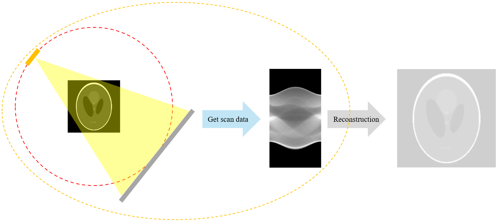
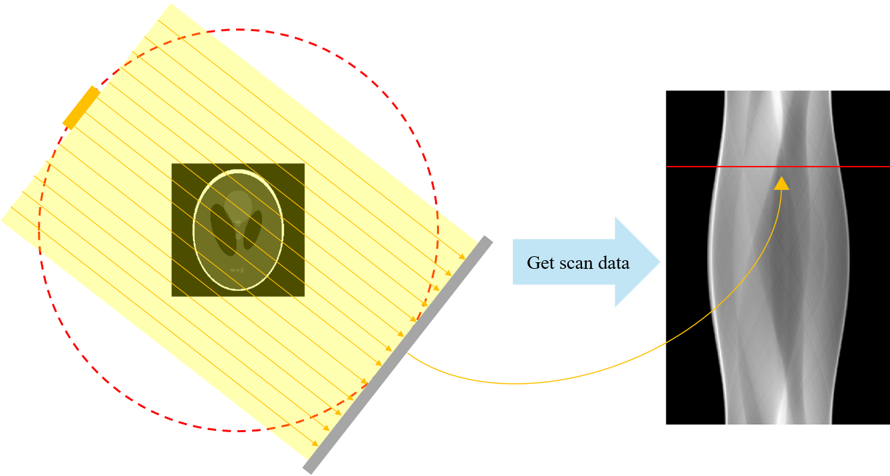
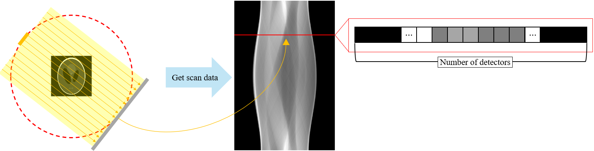
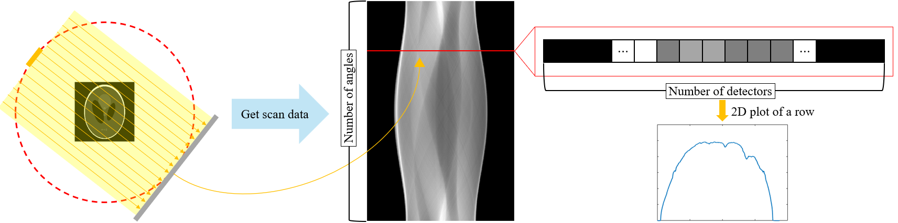

**[Reference]**  
$\bullet$ Computed Tomography: Principles, Design, Artifacts, and Recent Advances  
$\bullet$ Computed Tomography: From Photon Statistics to Modern Cone-Beam CT
{: .notice--success}

# 0.Introduction

In previous posts, we explored the journey of an X-ray photon: from its generation at the source, through its attenuation as it passes through an object, to its arrival at the detector. In this section, we will examine how to extract reconstructible projection data, called sinogram, from object. This corresponds to the process indicated by the orange circle in the above figure.

# 1.Scan condition and Sinogram
Before we look at how the projection data, called sinogram, is extracted, let's first establish the scanning environment, or projection sampling geometry. For our discussion, we will assume that the data is acquired using a parallel-beam projection, which consists of parallel X-ray beams, as shown below.

<figure style="display: flex; flex-direction: column; align-items: center; margin-top: 0.5em; margin-bottom: 0.5em;">
  
   <figcaption style="font-size: 20px; margin-top: -0.5em;">
   Fig.1.1 Illustration of parallel-beam and sinogram data at specific angle.
   </figcaption>
</figure> 

In this setup, the sinogram shown on the right is formed by stacking the projection data obtained from the rotating X-ray source and detector pair. 
Each horizontal line in the sinogram represents the projection data from a single angle. The figure shows a sinogram acquired over a full $2π$ (360-degree) rotation.
(Note: While a π (180-degree) rotation is theoretically sufficient for a parallel-beam geometry, we use $2π$ here to maintain consistency with fan-beam scenarios.)

The figure below shows a magnified view of the sinogram data. 

<figure style="display: flex; flex-direction: column; align-items: center; margin-top: 0.5em; margin-bottom: 0.5em;">
  
   <figcaption style="font-size: 20px; margin-top: -0.5em;">
   Fig.1.2 Illustration of parallel-beam and sinogram data at specific angle (in detail).
   </figcaption>
</figure> 

A single horizontal line (a row) in the sinogram consists of the projection data acquired at a specific angle. 
Each pixel within that row corresponds to the measurement from a single detector element.
Therefore, the number of rows in the sinogram is equal to the number of angles sampled over the $2π$ rotation, and the number of pixels in each row (the number of columns) is equal to the number of detectors.

# 2.Radon transform
We now understand that a sinogram is composed of rows, with each row representing the set of detector measurements from a single projection angle. 
In this section, we will examine how the data value for a single detector element is calculated.

<figure style="display: flex; flex-direction: column; align-items: center; margin-top: 0.5em; margin-bottom: 0.5em;">
  
   <figcaption style="font-size: 20px; margin-top: -0.5em;">
   Fig.2.1 Illustration of parallel-beam and sinogram data at specific angle with 2D plot of a single row.
   </figcaption>
</figure> 

The figure above is a 2D plot of a single row taken from a sinogram. 
In this plot, the x-axis corresponds to the detector index, while the y-axis represents the value measured at each detector. 
Our focus here is to understand the method, called **Radon transform**, used to calculate these y-axis values.

## 2-1) A coordinate system $(\xi, \eta)$
To understand how the Radon transform builds a sinogram, the key is to think in a new, rotated coordinate system, which we'll call $(\xi, \eta)$. 
This is shown below. 


 
  {% include start-side-by-side.html
  image_src="../images/2025-07-03-CT_5/image-20250707123337628.png"
  image_alt="Fig.2.2 Object with a fixed, standard $(x, y)$ coordinate system."
  image_width="40%"
  margin_top = "-4em"
  margin_bottom = "-4.5em"
  %}
  Imagine the object we want to scan (the patient's cross-section) exists in a fixed, standard (x, y) coordinate system. 
  The value at any point is given by its LAC, $\mu(x,y)$.
  
 

 
  {% include start-side-by-side.html
  image_src="../images/2025-07-03-CT_5/image-20250707124736150.png"
  image_alt="Fig.2.3 Object with a rotational $(\xi, \eta)$ coordinate system."
  image_width="40%"
  margin_top = "-4em"
  margin_bottom = "-4.5em"
  %}
  Let's introduce our second coordinate system, $(\xi, \eta)$. 
  The crucial part is that this system rotates with the X-ray source and detector. 
  The angle of this rotation, relative to the fixed $(x, y)$ system, is $\gamma$ ($\in [0, 2\pi]$).
  
 

 
  {% include start-side-by-side.html
  image_src="../images/2025-07-03-CT_5/image-20250707145613369.png"
  image_alt="Fig.2.4 Object with a rotational $(\xi, \eta)$ coordinate system and $i-th$ detector value at angle $\gamma$."
  image_width="40%"
  margin_top = "-4em"
  margin_bottom = "-4.5em"
  %}
  The Radon transform mathematically simulates what a single detector "sees". For a given projection angle $\gamma$ ($\in [0, 2\pi]$):
  * It defines a straight line, L, through the object. This line is parallel to the $\eta$-axis and is offset from the center by a distance $\xi_i$. Think of this line as the path of a single X-ray beam.
  * It then sums up (integrates) all the object's pixel values ($\mu(x,y)$) that lie directly on this line L.
  * This sum becomes a single data point in our sinogram, $p(\xi_i, \gamma)$,corresponding to the detector at position $\xi_i$.
  
  This entire process is repeated for all possible lines (all $\xi$ values) across the object to create one full row of the sinogram for that specific angle $\gamma$. In essence, the Radon Transform is the mathematical way of describing how an object casts an "X-ray shadow" from a specific angle.
  To make these calculation simple, we defined new coordinate $(\xi, \eta)$.
  
 


## 2-2) Mathematical equation of Radon transform
So, how do we practically calculate $p(\xi, \gamma)$, the line integral of $\mu(x,y)$?  
The mathematical definition is: 

$$p_{\gamma}(\xi) = p(\xi, \gamma) = \int_{\mathbf{r} \in L(x,y)} \mu(\mathbf{r}) \, d\mathbf{r} \tag{2.1}$$

$$p_{\gamma}(\xi) = \mathcal{R}_2 \{ f(x,y) \}$$ is called 2D Radon transform.

This means we need to sum up all the pixel values along a specific line L.
Trying to do this directly in the fixed $(x, y)$ coordinate system is a nightmare. 
For every single projection angle $\gamma$, we would have to recalculate the complex equation of each line $L$ and figure out which pixels fall on it. 
This is computationally inefficient and complex.

There's a much more elegant solution: perform the calculation in the rotated $(\xi, \eta)$ coordinate system.
Why is this better? Because in the rotated system, the line $L$ is no longer a complicated, angled line. 
For any given projection angle $\gamma$, the line L is simply defined by $\xi = \text{constant}$. 
This massively simplifies the integration.
To make this switch, we first need a way to convert any point from the $(x, y)$ system to the $(\xi, \eta)$ system. 
We can do this using the following linear transformation.


 {% include start-side-by-side.html
 image_src="../images/2025-07-03-CT_5/image-20250707155631610.png"
 image_alt="Fig.2.5 Object with a fixed, standard $(x, y)$ coordinate system."
 image_width="30%"
 margin_top = "-3em"
 margin_bottom = "-3em"
 %}
 
$$\begin{bmatrix} x \\ y \end{bmatrix} = \begin{bmatrix} \cos \gamma & -\sin \gamma \\ \sin \gamma & \cos \gamma \end{bmatrix} \begin{bmatrix} \xi \\ \eta \end{bmatrix} = \begin {bmatrix} \xi \cos \gamma  -\eta \sin \gamma \\ \xi \sin \gamma + \eta \cos \gamma \end{bmatrix} \tag{2.2}$$
 
 


Now that we have this bridge between the two coordinate systems, we are finally ready to rewrite our original line integral.
The Radon transform, $p(\xi, \gamma)$, can now be expressed in the much more convenient $(\xi,\eta)$ coordinates as follows:

$$\begin{split}
p(\xi, \gamma) &= p_{\gamma}(\xi) \\
&= \int_{\mathbf{r} \in L(x,y)} \mu(\mathbf{r}) d\mathbf{r}\\
&= \int \mu(\xi \cos \gamma - \eta \sin \gamma, \xi \sin \gamma + \eta \cos \gamma) d\eta\
\end{split} \tag{2.3}$$

## 2-3) Practical Radon transform
In this section, we will link the mathematical model of the Radon transform, which we previously examined, to the number of X-ray photons.
First, let's recall from [4. Probability of detection] that the expected number of incident photons generated is $N_0$. 

From this, we derived that the expected number of photons that transmit through the object is:

$$\text{Number of transmitted photons, }\lambda = \int N_0 S_0(E) e^{-\int \mu_a(\mathbf{r}, E) d\mathbf{r}} dE \tag{2.4}$$

This integral is still complex. 
To simplify it and connect it directly to the line integral of the Radon transform, we will transform this equation using the Mean Value Theorem.


$$\begin{split}
\lambda &= \int_{E_1}^{E_2} N_0 S_0(E) e^{-\int \mu_a(\mathbf{r}, E) d\mathbf{r}} dE \\
&= e^{-\int \mu_a(\mathbf{r}, \hat{E}) d\mathbf{r}} \int_{E_1}^{E_2} N_0 S_0(E) dE \\
&= e^{-\int \mu_a(\mathbf{r}, \hat{E}) d\mathbf{r}} \lambda_0 \quad \text{where, } \lambda_0 = N_0: \text{the expected number of incident photons}
\end{split} \tag{2.5}$$

 
 [Mean value theorem] 
 This theorem states that for an integral involving the product of two functions, $f(x)$ and $g(x)$, we can effectively pull one function out of the integral by evaluating it at a special "mean value" point, $\hat{x}$.  
 More formally, for some $\hat{x}$ in the interval $(x_1, x_2)$, the following relationship is true: 
 
$$ \int_{x_1}^{x_2} f(x)g(x)dx = f(\hat{x})\int_{x_1}^{x_2} g(x) dx $$

 


Here, $E_1$ and $E_2$ are the minimum and maximum photon energies, and $\lambda_0$ is equal to $N_0$, the expected number of incident X-ray photons.
By taking the natural logarithm and rearranging the equation, we can isolate the term we are truly interested in:



$$-\ln \left( \frac{\lambda}{\lambda_0} \right) = \int \mu_a(\mathbf{r}, \hat{E}) d\mathbf{r} \tag{2.5}$$

 
 This equation is the very foundation of CT reconstruction:
 * The left side is a value we can measure. It's calculated from the initial number of photons ($\lambda_0$) and the number of photons that our detector measures ($\lambda$).
 * The right side is the value we want to find. It is precisely the Radon transform—the line integral of the effective attenuation coefficient—which is the projection data needed to build a sinogram.
 


In other words, the integral of the attenuation coefficient over a specific line path r through the object, which is the Radon transform, is equal to the negative natural logarithm of the ratio of transmitted photons to incident photons.

However, the equation so far is for an ideal case. 
In reality, we must account for quantum noise, $\epsilon$, in the number of transmitted photons, $\lambda$.

$$\text{Practical Radon transform}: -\ln \left( \frac{\lambda + \epsilon}{\lambda_0} \right) = \int \mu_a(\mathbf{r}, \hat{E}) d\mathbf{r} \tag{2.6}$$

Up to this point, we have successfully linked the incident photons to the Radon transform, which represents attenuation. 
However, there is still one part that needs more explanation: the effective energy, $\hat{E}$, which is assumed to lie between the minimum and maximum photon energies. 
This $\hat{E}$ affects the Radon transform in the following way. 

When we calculate a single projection $p_i$, the formula looks like this:

$$p_i = -\ln \frac{\lambda_i + \epsilon_i}{\lambda_0} \approx \int \mu_a (\mathbf{r}, \hat{E}_i) \, d\mathbf{r} \tag{2.7}$$

The core problem is that the effective energy $\hat{E}_i$ is not a constant. 
It changes depending on the path the X-ray beam takes through the object. 
If a path passes through dense material (like bone), the attenuation is high, and $\hat{E}_i$ will be different than for a path through soft tissue.
Why does $\hat{E}_i$ change? 
This is due to a phenomenon called beam hardening.

* A polychromatic X-ray beam contains photons with a wide range of energies.
* Low-energy ("soft") photons are much more likely to be absorbed by the object.
* High-energy ("hard") photons are more likely to pass through.

As a result, the beam that emerges from the object is "harder" on average—its average energy has increased because the soft photons have been filtered out. 
The more material the beam passes through, the more pronounced this effect becomes.

This inconsistency—where our model assumes a single $\hat{E}$ but reality provides a path-dependent one—leads to errors during image reconstruction. 
These errors manifest as characteristic artifacts that degrade image quality. 
This entire process is known as the **beam-hardening effect**.