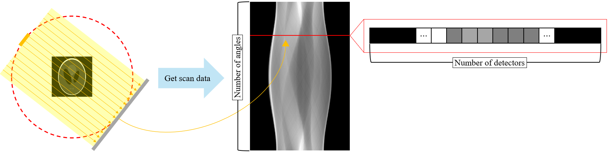

**[Reference]**  
$\bullet$ Computed Tomography: Principles, Design, Artifacts, and Recent Advances  
$\bullet$ Computed Tomography: From Photon Statistics to Modern Cone-Beam CT
{: .notice--success}

# 0.Introduction

In previous posts, we explored the journey of an X-ray photon: from its generation at the source, through its attenuation as it passes through an object, to its arrival at the detector. In this section, we will examine how to extract reconstructible projection data, called sinogram, from object. This corresponds to the process indicated by the orange circle in the above figure.

# 1.Scan condition and Sinogram
Before we look at how the projection data, called sinogram, is extracted, let's first establish the scanning environment, or projection sampling geometry. For our discussion, we will assume that the data is acquired using a parallel-beam projection, which consists of parallel X-ray beams, as shown below.

<figure style="display: flex; flex-direction: column; align-items: center; margin-top: 0.5em; margin-bottom: 0.5em;">
  
   <figcaption style="font-size: 20px; margin-top: -0.5em;">
   Fig.1.1 Illustration of parallel-beam and sinogram data at specific angle.
   </figcaption>
</figure> 

In this setup, the sinogram shown on the right is formed by stacking the projection data obtained from the rotating X-ray source and detector pair. 
Each horizontal line in the sinogram represents the projection data from a single angle. The figure shows a sinogram acquired over a full $2π$ (360-degree) rotation.
(Note: While a π (180-degree) rotation is theoretically sufficient for a parallel-beam geometry, we use $2π$ here to maintain consistency with fan-beam scenarios.)

The figure below shows a magnified view of the sinogram data. 

<figure style="display: flex; flex-direction: column; align-items: center; margin-top: 0.5em; margin-bottom: 0.5em;">
  
   <figcaption style="font-size: 20px; margin-top: -0.5em;">
   Fig.1.2 Illustration of parallel-beam and sinogram data at specific angle (in detail).
   </figcaption>
</figure> 

A single horizontal line (a row) in the sinogram consists of the projection data acquired at a specific angle. 
Each pixel within that row corresponds to the measurement from a single detector element.
Therefore, the number of rows in the sinogram is equal to the number of angles sampled over the $2π$ rotation, and the number of pixels in each row (the number of columns) is equal to the number of detectors.

# 2.Radon transform
We now understand that a sinogram is composed of rows, with each row representing the set of detector measurements from a single projection angle. 
In this section, we will examine how the data value for a single detector element is calculated.

<figure style="display: flex; flex-direction: column; align-items: center; margin-top: 0.5em; margin-bottom: 0.5em;">
  
   <figcaption style="font-size: 20px; margin-top: -0.5em;">
   Fig.2.1 Illustration of parallel-beam and sinogram data at specific angle with 2D plot of a single row.
   </figcaption>
</figure> 

The figure above is a 2D plot of a single row taken from a sinogram. 
In this plot, the x-axis corresponds to the detector index, while the y-axis represents the value measured at each detector. 
Our focus here is to understand the method, called **Radon transform**, used to calculate these y-axis values.

## 2-1) A coordinate system $(\xi, \eta)$

