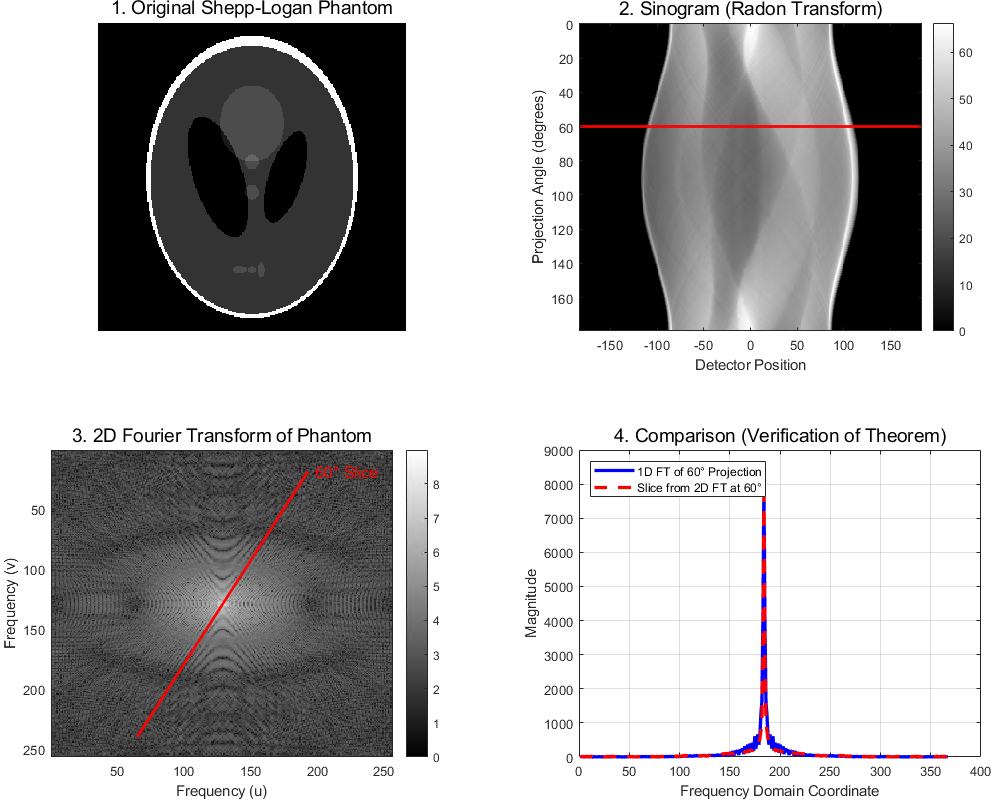
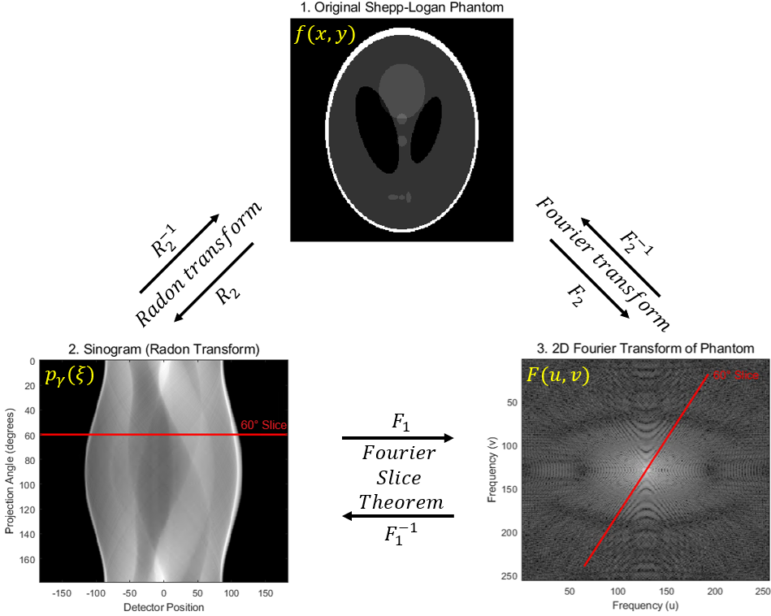
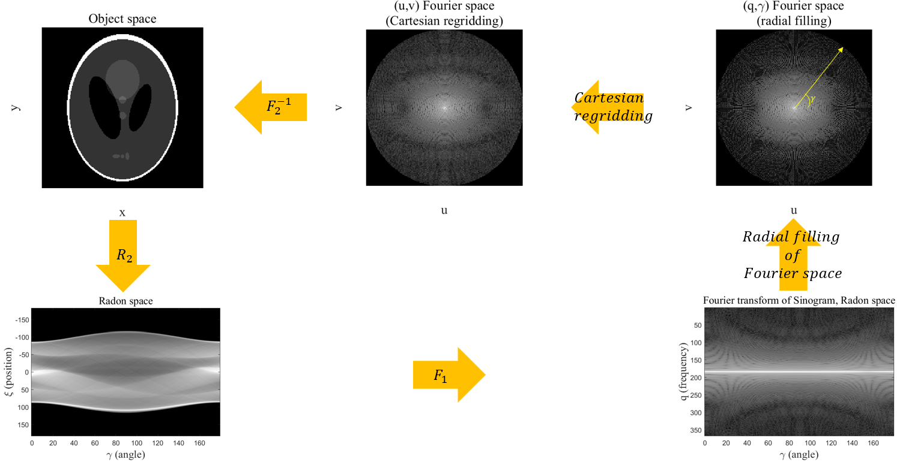

**[Reference]**  
$\bullet$ Computed Tomography: Principles, Design, Artifacts, and Recent Advances  
$\bullet$ Computed Tomography: From Photon Statistics to Modern Cone-Beam CT
{: .notice--success}

# 0.Introduction
Following our discussion of the Radon transform, this section will explore how to reconstruct the spatial distribution of the linear attenuation coefficient, $f(x,y) = \mu(\xi, \eta)$, from the projection data, $p_{\gamma}(\xi)$.
To achieve this, we will first introduce a fundamental principle known as the **Fourier Slice Theorem**.

This is can be divided into three stpes below.

$\text{[Fourier slice theorem]}$

Step 1. Calculation of the Fourier transform of $p_{\gamma} (\xi)$

$$p_{\gamma}(\xi) \longrightarrow P_{\gamma}(q)$$

Step 2. Construction of the Fourier transform of $f$ from $P$

$$P_{\gamma}(q) \longrightarrow F(u,v)$$

Step 3. Calculation of the inverse Fourier transform of $F$ provides the desired function $f$

$$F(u,v) \longrightarrow f(x,y)$$

The ultimate meaning of the Fourier Slice Theorem is as follows:

The 1D Fourier transform of a projection at a specific angle $\gamma$ (which is a single row/column in the sinogram) is equivalent to a slice taken at the exact same angle $\gamma$ through the 2D Fourier transform of the original image.
In other words, this means that if we acquire a sinogram by CT scanning an object, we can use Fourier transforms to reconstruct its internal image without any physical damage.

# 1.Preliminaries
Before we delve into the Fourier Slice Theorem, let's review a few key concepts.

## 1-1) Relation between the coordinate systems $(\xi, \eta)$ and $(x,y)$ 
To describe the relation between the coordinate systems $(\xi, \eta)$ and $(x,y)$, the unit vectors below shold be defined first.



$$\mathbf{n}_{\xi} = \begin{pmatrix}\cos (\gamma) \\ \sin (\gamma) \end{pmatrix} \tag{1.1}$$
$$\mathbf{n}_{\eta} = \begin{pmatrix} -\sin (\gamma) \\ \cos (\gamma) \end{pmatrix} \tag{1.2}$$



These vectors span the rotating fram, $(\xi, \eta)$. To describe the projection path and integral along the path in the fixed object coordinate system, geometric relations should be defined as below.


<figure style="display: flex; flex-direction: column; align-items: center; margin-top: 0.5em; margin-bottom: 0.5em;">
  
   <figcaption style="font-size: 20px; margin-top: -0.5em;">
   Fig.1.1 Illustration of unit vectors and the definition of the rotating sampling system $(\xi, \eta)$.
   </figcaption>
</figure> 

$$\xi = (\mathbf{r}^T \cdot \mathbf{n}_{\xi}) = x \cos (\gamma) + y \sin (\gamma) \tag{1.3}$$
$$\eta = (\mathbf{r}^T \cdot \mathbf{n}_{\eta}) = -x \sin (\gamma) + y \cos (\gamma) \tag{1.4}$$



Using equation (1.3) and (1.4), the LAC on the image, $\mu(x,y)$ at the point $\mathbf{r}=(x,y)^T$, can be desribed as:

$$\begin{split} \mu(x,y) &= \mu(\xi(x,y), \eta(x,y)) \\ \\ &= \mu \left( (\mathbf{r}^T \cdot \mathbf{n}_{\xi}), (\mathbf{r}^T \cdot \mathbf{n}_{\eta}) \right) \end{split} \tag{1.5}$$

## 1-2) Informations about each steps
Let's rewrite steps of the Fourier Slice Theorem

Step 1. Calculation of the Fourier transform of $p_{\gamma} (\xi)$

$$p_{\gamma}(\xi) \longrightarrow P_{\gamma}(q)$$

Step 2. Construction of the Fourier transform of $f$ from $P$

$$P_{\gamma}(q) \longrightarrow F(u,v)$$

Step 3. Calculation of the inverse Fourier transform of $F$ provides the desired function $f$

$$F(u,v) \longrightarrow f(x,y)$$

While steps 1 and 3 can be directly carried out by the simple calculation of the Fourier transform & inverse Fourier transform respectively, step 2 requires knowledge of a identity of the Fourier transform of $f(x,y)$ and $p_{\gamma}(\xi)$.
However, the Fourier transform does not change the nature of the coordinate system.
This means that in step 2 a change in coordinates has to be carried out because the Radon transform $p_{\gamma}(\xi)$ and its Fourier transform $P_{\gamma}(q)$ are given in polar coordinates $(\xi, \gamma)$ and $(q,\gamma)$ respectively. 
Figure below shows this relation. 


<figure style="display: flex; flex-direction: column; align-items: center; margin-top: 0.5em; margin-bottom: 0.5em;">
  
   <figcaption style="font-size: 20px; margin-top: -0.5em;">
   Fig.1.2 Illustration of steps of the Fourier slice theorem.
   </figcaption>
</figure> 

The spatial vector $\mathbf{\xi} = \xi(\xi, \gamma)$ points in the same direction as the spectral vector $\mathbf{q} = \mathbf{q}(q,\gamma)$.
This is due to the rotational variance of the Fourier transform.
As shown in Fig.1.2, we can make relationship between $\mathbf{q}$ and $(u,v)$ as below:

$$ \begin{split} u=q \cos (\gamma) \\ v = q \sin (\gamma) \end{split} \tag{1.6} $$



The transformations in the vertical direction are given by the Fourier transform in each case.
The transformation from left to right is given by a change in coordinates from polar to Cartesian.

With these key ideas in mind, let's now examine the Fourier Slice Theorem step-by-step.

# 2.Fourier Slice Theorem

## 2-1) Step 1: Calculate $P_{\gamma}(q)$, the Fourier transform of $p_{\gamma}(\xi)$
As a first step of the Fourier Slice Theorem, let's calculate $P_{\gamma}(q)$.



$$P_{\gamma}(q) = \int_{-\infty}^{\infty} p_{\gamma}(\xi) e^{-2\pi i q \xi} \mathrm{d}\xi \tag{2.1}$$



It is important to remember that $P_{\gamma}(q)$ in equation (2.1) is calculated from the projection measurement, which is the line integral, as shown below:



$$ P_{\gamma}(q) = \int_{-\infty}^{\infty} \left( \int_{-\infty}^{\infty} \mu(\xi, \eta) d\eta \right) e^{-2\pi i q \xi} \mathrm{d}\xi \tag{2.2} $$



It should be noted that the integration limits for the inner term of equation (2.2) are defined this way under the assumption that no attenuation occurs outside the object (i.e., the attenuation coefficient is zero).

## 2-2) Step 2: Construction of the Fourier transform of $f$ from $P$, Change of coordinate system
As a second step, the coordinate system has to be changed from the rotating sampling system $(\xi, \eta)$ to the patient system $(x,y)$.
Since both systems are of Cartesian, the integration element, $\mathrm{d}\xi \mathrm{d}\eta$, can be directly replaced with $\mathrm{d}x \mathrm{d}y$ as below:



$$P_{\gamma}(q) = \int_{-\infty}^{\infty} \int_{-\infty}^{\infty} \mu \left( \xi(x,y), \eta(x,y) \right) e^{-2\pi i q (\mathbf{r}^T \cdot \mathbf{n}_{\xi})} \mathrm{d}x\mathrm{d}y \tag{2.3}$$



The replacement of $\xi = \mathbf{r}^T \cdot \mathbf{n}_{\xi}$ can be found at equation (1.3). 
Also, $\mu \left( \xi(x,y), \eta(x,y) \right)$ can be replaced by $f(x,y)$ in fixed system. 



$$P_{\gamma}(q) = \int_{-\infty}^{\infty} \int_{-\infty}^{\infty} f(x,y) e^{-2\pi i q (\mathbf{r}^T \cdot \mathbf{n}_{\xi})} \mathrm{d}x\mathrm{d}y \tag{2.4}$$



To prove that equation (2.3) is identical to the two-dimensional Fourier transform of the object, one starts with the Cartesian formulation of the Fourier transform of the tomographic section $f(x,y)$ in the fixed patient coordiante system. 



$$\begin{split} F(u,v) &= \int_{-\infty}^{\infty} \int_{-\infty}^{\infty} f(x,y) e^{-2\pi i (xu+yv)} \mathrm{d}x\mathrm{d}y \\ \\
&= \int_{-\infty}^{\infty} \int_{-\infty}^{\infty} f(x,y) e^{-2\pi i (xq \cos (\gamma) + yq \sin (\gamma))} \mathrm{d}x\mathrm{d}y \\ \\ 
&= \int_{-\infty}^{\infty} \int_{-\infty}^{\infty} f(x,y) e^{-2\pi i q(\mathbf{r}^T \cdot \mathbf{n}_{\xi})} \mathrm{d}x\mathrm{d}y \end{split} \tag{2.5}$$



The replacement of $u = q \cos (\gamma)$ and $v = q \sin (\gamma)$ can be found at equation (1.6).
The result of equation (2.5) is equal to equation (2.3), whereby it is say below:



$$\begin{split} F(u,v)|_{\begin{split} u=q \cos (\gamma) \\ v = q \sin (\gamma) \end{split}} = P_{\gamma}(q) \end{split} \tag{2.6}$$



Below is the core result of the Fourier Slice Theorem and the most important result for all Fourier-based reconstruction methods.

<figure style="display: flex; flex-direction: column; align-items: center; margin-top: 0.5em; margin-bottom: 0.5em;">
  
   <figcaption style="font-size: 20px; margin-top: -0.5em;">
   Fig.2.1 Schematic of the Fourier Slice Theorem.
   </figcaption>
</figure> 

## 2-3) Step 3: Calculation of the inverse Fourier transform of $F$ provides the desired function $f$, Inverse Radon Transform
As a last step, we can get a object reconstruction $f(x,y)$ from equation (2.6).
To obtain the object reconstruction $f(x,y)$, we must first convert the polar spectral data, $P_{\gamma}(q)$—which is obtained by Fourier transforming the sinogram—into the spectral Cartesian coordinate system $(u,v)$.
Through this process, we obtain $F(u,v)$. 
Finally, by applying an inverse Fourier transform to $F(u,v)$, we get the tomogram $f(x,y)$ that we want to reconstruct.

Below figure shows these process visually.

<figure style="display: flex; flex-direction: column; align-items: center; margin-top: 0.5em; margin-bottom: 0.5em;">
  
   <figcaption style="font-size: 20px; margin-top: -0.5em;">
   Fig.2.2 Flow chart of the direct reconstruction through the Fourier slcie theorem.
   </figcaption>
</figure> 

