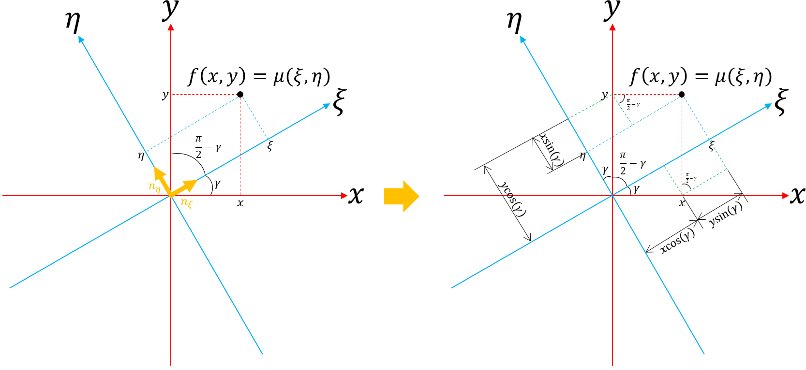
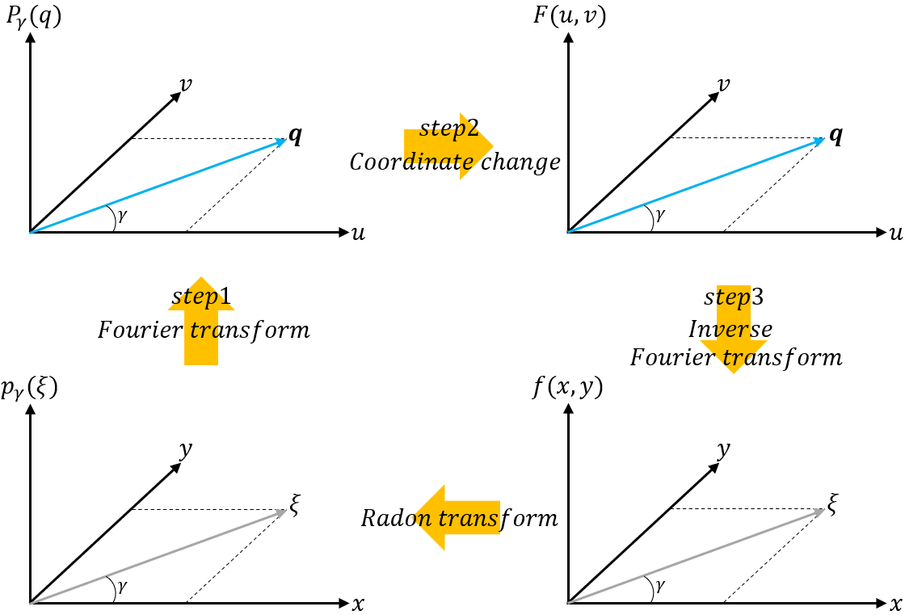

**[Reference]**  
$\bullet$ Computed Tomography: Principles, Design, Artifacts, and Recent Advances  
$\bullet$ Computed Tomography: From Photon Statistics to Modern Cone-Beam CT
{: .notice--success}

# 0.Introduction
Following our discussion of the Radon transform, this section will explore how to reconstruct the spatial distribution of the linear attenuation coefficient, $f(x,y) = \mu(\xi, \eta)$, from the projection data, $p_{\gamma}(\xi)$.
To achieve this, we will first introduce a fundamental principle known as the **Fourier Slice Theorem**.

This is can be divided into three stpes below.

$\text{[Fourier slice theorem]}$

Step 1. Calculation of the Fourier transform of $p_{\gamma} (\xi)$

$$p_{\gamma}(\xi) \longrightarrow P_{\gamma}(q)$$

Step 2. Construction of the Fourier transform of $f$ from $P$

$$P_{\gamma}(q) \longrightarrow F(u,v)$$

Step 3. Calculation of the inverse Fourier transform of $F$ provides the desired function $f$

$$F(u,v) \longrightarrow f(x,y)$$

# 1.Preliminaries
Before we delve into the Fourier Slice Theorem, let's review a few key concepts.

## 1-1) Relation between the coordinate systems $(\xi, \eta)$ and $(x,y)$ 
To describe the relation between the coordinate systems $(\xi, \eta)$ and $(x,y)$, the unit vectors below shold be defined first.



$$\mathbf{n}_{\xi} = \begin{pmatrix}\cos (\gamma) \\ \sin (\gamma) \end{pmatrix} \tag{1.1}$$
$$\mathbf{n}_{\eta} = \begin{pmatrix} -\sin (\gamma) \\ \cos (\gamma) \end{pmatrix} \tag{1.2}$$



These vectors span the rotating fram, $(\xi, \eta)$. To describe the projection path and integral along the path in the fixed object coordinate system, geometric relations should be defined as below.


<figure style="display: flex; flex-direction: column; align-items: center; margin-top: 0.5em; margin-bottom: 0.5em;">
  
   <figcaption style="font-size: 20px; margin-top: -0.5em;">
   Fig.1.1 Illustration of unit vectors and the definition of the rotating sampling system $(\xi, \eta)$.
   </figcaption>
</figure> 

$$\xi = (\mathbf{r}^T \cdot \mathbf{n}_{\xi}) = x \cos (\gamma) + y \sin (\gamma) \tag{1.3}$$
$$\eta = (\mathbf{r}^T \cdot \mathbf{n}_{\eta}) = -x \sin (\gamma) + y \cos (\gamma) \tag{1.4}$$



Using equation (1.3) and (1.4), the LAC on the image, $\mu(x,y)$ at the point $\mathbf{r}=(x,y)^T$, can be desribed as:

$$\begin{split} \mu(x,y) &= \mu(\xi(x,y), \eta(x,y)) \\ \\ &= \mu \left( (\mathbf{r}^T \cdot \mathbf{n}_{\xi}), (\mathbf{r}^T \cdot \mathbf{n}_{\eta}) \right) \end{split} \tag{1.5}$$

## 1-2) Informations about each steps
Let's rewrite steps of the Fourier Slice Theorem

Step 1. Calculation of the Fourier transform of $p_{\gamma} (\xi)$

$$p_{\gamma}(\xi) \longrightarrow P_{\gamma}(q)$$

Step 2. Construction of the Fourier transform of $f$ from $P$

$$P_{\gamma}(q) \longrightarrow F(u,v)$$

Step 3. Calculation of the inverse Fourier transform of $F$ provides the desired function $f$

$$F(u,v) \longrightarrow f(x,y)$$

While steps 1 and 3 can be directly carried out by the simple calculation of the Fourier transform & inverse Fourier transform respectively, step 2 requires knowledge of a identity of the Fourier transform of $f(x,y)$ and $p_{\gamma}(\xi)$.
However, the Fourier transform does not change the nature of the coordinate system.
This means that in step 2 a change in coordinates has to be carried out because the Radon transform $p_{\gamma}(\xi)$ and its Fourier transform $P_{\gamma}(q)$ are given in polar coordinates $(\xi, \gamma)$ and $(q,\gamma)$ respectively. 
Figure below shows this relation. 

<figure style="display: flex; flex-direction: column; align-items: center; margin-top: 0.5em; margin-bottom: 0.5em;">
  
   <figcaption style="font-size: 20px; margin-top: -0.5em;">
   Fig.1.2 Illustration of steps of the Fourier slice theorem.
   </figcaption>
</figure> 

In a first step, the Radon space data $p(\xi, \eta)=p_{\gamma}(\xi)$ are seen as one dimensional functions of the detector coordinate $\xi$ parameterized by the projection angle $\gamma$. This means that for every projection angle $\gamma$ a one dimensional spectrum is obtained:

$$P(q,\gamma) = P_{\gamma}(q) = \int_{\infty}^{\infty} p_{\gamma}(\xi) e^{-2\pi q \xi} d\xi \tag{1.6}$$

