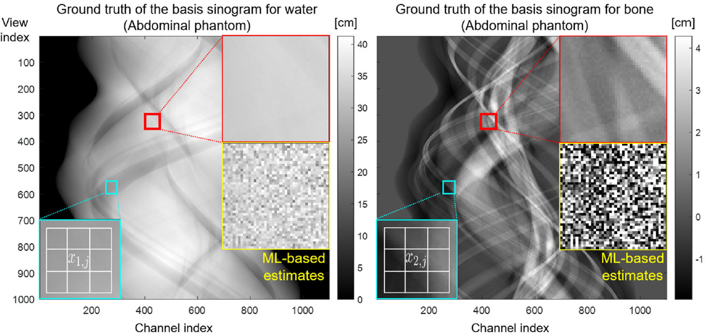
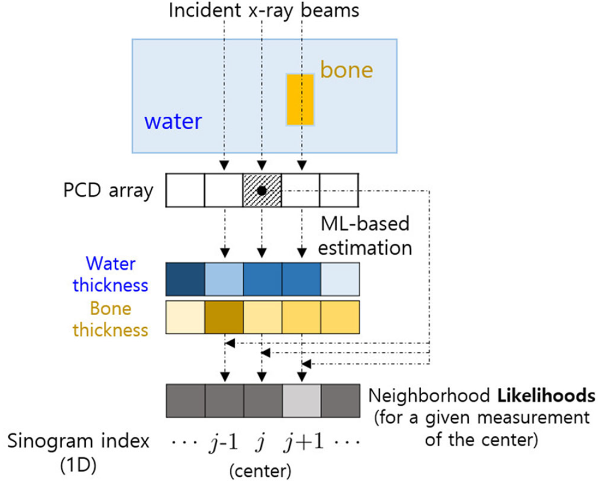
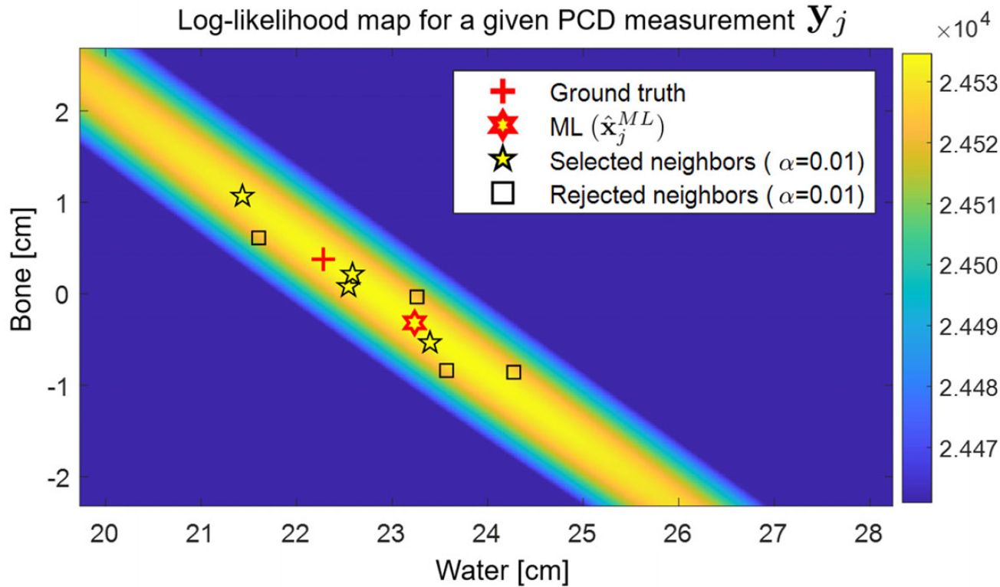

**[Link to the paper]**  
[Likelihood-based bilateral filters for pre-estimated basis sinograms using photon-counting CT](https://pubmed.ncbi.nlm.nih.gov/36705079/)
{: .notice--success}

# Abstract

$\bullet$ Background
: Photon-Counting CT (PCCT) is promising but suffers from noise amplification during material decomposition. Current noise-reduction methods often degrade spatial resolution and accuracy.

$\bullet$ Purpose
: This paper proposes a "Likelihood-Based Bilateral Filter" (LBF) which can be aplllied to pre-estimated basis sinogram. Unlike conventional filters that compare pixel intensity, this filter compares the statistical likelihood of neighboring measurements to more effectively reduce noise while preserving edges.

$\bullet$ Method
: 1.Perform maximum-likelihood (ML)-based estimation in the projection domain to obtain basis sinograms.  
: 2.Calculate the neighborhood likelihoods for a given measurement at the center pixel using the neighborhood estimates.  
: 3.Design the weights based on the distance of these likelihoods. Furthermore, the paper introduces two variations of this filter: one that uses statistical significance levels instead of empirical hyperparameters, and another measurement-based version applicable even without system models.

$\bullet$ Validation
: The proposed methods (the main LBF and its variations) were validated by analyzing the local property of noise and spatial resolution and the global trend of noise and bias. They were compared to the conventional neighborhood filters and the model-based iterative reconstruction with an edge-preserving penalty applied in the basis images.


# 1.INTRODUCTION

Photon-counting coumputed tomography (PCCT) has great potential in many clinical applications via material decomposition.
- Diagnoising coronary artery calcification
- Diagnoising breast cancer
- Reducing metal artifacts while preserving an anatomical texture.
- Generate virtural noncontrast images for contrast-enhanced imaging
- Nano-particle agent distribution for target identificaiton

The maximum likelihood (ML) principle has been a gold standard for material decomposition due to the asymptotic efficiency. 

The estimates are unbiased and achieve the Cramer-Rao lower bound (CRLB). 
However, because the CRLB is fundamentally dependent on the x-ray dose level, the low-dose used in clinical settings result in an inherently high noise. Consequently, ML-based estimates, despite their mathematical optimality, may fail to meet the quality standards required for clinical applications.

One may apply a regularizaiton with the ML criterion to reduce the noise in the estimates. 

Edge-preserving functions such as (pseudo) Huber penalty.

The estimates are calculated iteratively, and it is called statistical iterative reconstruction (SIR) in this paper. 
- SIR can reduce the noise in the estimates
- Still, degradation of spatial resolution occurs
- Regularization affects the accuracy when the noise level is substantial

Recently, learing-based material decomposition has been an active research field. However, the robustness of the data mismatch needs to be addressed, and a sufficient number of training data is not always available. 

Domain of training data and input data can be different.

This study assumes the latter case and focuses on traditional material decomposition.

Edge-preserving filtering in the image domain is another active reserach topic for spectral material decomposition. 
- HYPR-NLM: The modified local highlY constrained backPRojection reconstruction (HYPR-LR) for spectral CT by substituting the nonlocal mean (NLM) for the low-pass filtering (LPF) in HYPR-LR. 
- Dual-energy vectoriazaiton (DE-vec) and amplitude image-guided bilateral filter (BF) 
Both NLM and BF are effective edge-preserving denoising methods in the image processing field.

Both methods exploit neighborhood patches and pixels to reduce the noise while preserving structural information. However, when the noise level in the image is substantial, the may introduce bias due to lack of the noise statistics in the methods. 

Both methods only use pixel difference without considering the underlying noise characteristics. 
This highlights a key limitation: because both filters operate 'blindly' to noise and rely only on apparent pixel values, they often misinterpret severe noise as genuine image features in high-noise environments. 
This misjudgment can lead to flawed filtering that ultimately distorts the image instead of cleaning it.

 

Furthermore, when the filters are applied to the bin-wise images, it is challenging to obtain noise statistics in the denoised images and perform unbiased material decomposition.

This creates a two-fold problem for the subsequent material decomposition step: 
- Corruption of Noise Statistics: The original noise in each bin-wise image follows a predictable statistical distribution (e.g., Gaussian or Poisson). However, non-linear filters fundamentally alter these properties. The residual noise in the "denoised" image no longer follows a simple model; it becomes complex and statistically uncharacterized.
- Destruction of Noise Correlation: More critically, the noise across different energy channels is inherently correlated. Filtering each bin-wise image independently breaks this crucial inter-channel correlation.

This paper proposes statistical bilateral filtering algorithms in the sinogram domain. It is a post-processing method applied to the ML-based estimates of basis sinograms to reduce the noise in the estimates while minimally affecting spatial resolution and accuracy. In this paper, the following terms are defined as follows:

- pixel: a specific position in the sinogram.
- pixel value: the associated ML-based estimates of the basis line integrals.

The conventional BF gives large weight to the neighborhood pixel, whose value is closer to the center pixel of interest. 

<figure style="display: flex; flex-direction: column; align-items: center; margin-top: 0.5em; margin-bottom: 0.5em;">
  
   <figcaption style="font-size: 20px; margin-top: -0.5em;">
   Fig.1 An example of the ground truth of the basis sinograms of water and bone and the associated ML-based estimates for the abdominal phantom used in the simulation study. An example of a $3\times3$ window centered at pixel j is also shown at the bottom left. ML, maximum likelihood.
   </figcaption>
</figure> 

However, as shown in Fig.1, the ML-based estimates have a large variations.

It indicates that pixel value-dependent filtering like the BF will be futile.

The proposed filter uses neighborhood likelohoods instead of pixel value-dependent weights. It is called a likelihood-based bilateral filter (LBF). For example, Fig.2 illustrates a toy example of the two-material decomposition of water and bone; a two-dimensinal object and a one-dimensional sinogram.

<figure style="display: flex; flex-direction: column; align-items: center; margin-top: 0.5em; margin-bottom: 0.5em;">
  
   <figcaption style="font-size: 20px; margin-top: -0.5em;">
   Fig.2 An illustration of a toy example for the ML-based estimates of the water and bone (one-dimensional sinogram) and the corresponding neighborhood likelihoods when the center pixel is j. (The brighter the pixel, it intends the less value for the thickness and the likelihood).ML, maximum likelihood.
   </figcaption>
</figure> 

The ML-based estimator can be applied to each photon-counting detector (PCD) measurement and produce the estimates of line integrals for water (blue) and bone (yellow-red). Suppose the center pixel is indexed by $j$. In that case, it is desirable to have a large weight at $j-1$ and a small at $j+1$ to reduce the noise while preserving spatial resolution and accuracy (the ground truth of the basis line integral is only different at the pixel $j+1$). However, in practice, the information for the ground truth is unknown. 

So, the LBF considers the PCD measurements at the center (the shaded area in Fig.2) as a sample observation from the unknown population parameter (the ground truth of the basis line integrals at $j$) and calculates the corresponding neighborhood likelihoods using the ML-based estimates.

The larger value of the neighborhood likelihood (i.e, the smaller difference from the center one, the ML), the larger weight it applies to the estimates since it is more involved in obtaining the measurement as the sample observation. 
Then it uses additional Gaussian spatial weight as in the conventional BF.

A preliminary concept and results for the LBF can be found in this [LINK](https://www.spiedigitallibrary.org/conference-proceedings-of-spie/12304/2647049/Likelihood-based-bilateral-filtration-in-material-decomposition-for-photon-counting/10.1117/12.2647049.full).

This study also provides statistical analysis for the proposed LBF.
The weight in the LBF depends on the difference between the neighborhood (log) likelihood and the center one, which can be interpreted as the likelihood ratio test statistics.

More specifically, it introduces hypothesis testing to provide a statistical criterion to select which neighborhood pixels to be considiered for the filtering.
It shows that the weight for the LBF can be modeled by a fucntion of the likelihood ratio test statistic for the hypothesis testing.

Then, it proposes a variation of the LBF (LBF*) based on the testing. 
The variation of the filter assigns the weight of either one or zero to the neighborhood pixels for a given statistical significance level (e.g., $\alpha = 0.05, 0.01$).

- It shows comparable performance to the original version of the LBF.
- No hyperparameter need to be empirically determined. 
- It introduces one more variation of the LBF, a reversed LBF (rLBF).

rLBF considers the likelihood in the reversed order. 
It can be approximated by measurement-based weights so that one can apply it when accurate estimates are given without system models.

The proposed method was validated using thorax and abdominal phantoms for a two-material decomposition (water and bone). 
It was compared to the...

- Conventional LPF and BF applied to the ML-based estimates of the basis sinograms
- SIR with an edge-preserving penalty applied in the basis images
- HYPR-NLM and DE-vec in the image domain

The mehtods were analyzed in terms of...

- Local noise-FWHM (full width at half maximum)
- Global trend of noise 
- Global trend of bias

The proposd LBF (and its variations) reduced noise while minimally sacrificing spatial resolution and accuracy compared to the conventional ones.

Proposed LBF (and its variations) only needs to calculate the likelihood of neighborhood estimates for filtering and additional thresholding for the variation.
It is computationally efficient.



# 2.METHODS

This section describes the conventional ML-based estimator with forward imaging model for the PCCT.
Then, it explains the proposed method applied to the ML-based estimates, starting from the description of the conventional neighborhood filters.

## 2.1 The ML-based estimator
The counts in energy bins of the PCD were assumed to be independent Poisson random variables with the expected value $\lambda_b(\mathbf{x}_j)$ for the $b$th energy bin and the $j$th sinogram pixel (or the $j$th ray), which is ginven by 

$$\lambda_b(\mathbf{x}_j) = \int S_b(E) e^{\left( -\sum\limits_{m=1}^{M}x_{m,j} \phi_m(E) \right)} \mathrm{d}E, \quad \text{for } b=1,2,\dots, B \tag{1}$$

- $S_b(E)$: the bin-wise energy-dependent function, including the x-ray incident spectrum and detector response fucntion.
- $B$: the total number of energy bins
- $M$: the number of basis materials
- $\phi_m(E) [cm^{-1}]$: the energy-dependent basis function for the $m$th material
- $\mathbf{x}\_{j} = [x\_{1,j}, x\_{2,j}, \dots, x\_{M,j}]^{T} \in \mathbb{R}^M [cm]$: the vector of basis line integrals for the $j$th ray.

For a given vector of PCD measurements $\mathbf{y}\_j = [y\_{1,j}, y\_{2,j}, \dots, y\_{B,j}]^T \in \mathbb{R}^B$, the log-likelihood of the basis line intergrals $\mathbf{x}\_j$ is given by 

$$\ln \mathcal{L}(\mathbf{x}_j | \mathbf{y}_j) = \sum\limits_{b=1}^{B} y_{b,j} \ln \lambda_b(\mathbf{x}_j) - \lambda_b(\mathbf{x}_j) \tag{2}$$

- $y\_{b,j}$: the number of photons measured at the $b$th energy bin for the $j$th pixel
- The constant terms were discarded in Equation (2) for simplicity

The ML-based estimates for the $j$th sinogram pixel can be calculated by minimizing the following cost function, the negative log-likelihood,

$$\hat{\mathbf{x}}_{j}^{ML} = \arg\min_{\mathbf{x} \in \mathbb{R}^M} -\ln \mathcal{L} (\mathbf{x} | \mathbf{y}_j) \text{s.t. } \mathrm{x}_m^{min} \lt \mathrm{x}_m \lt \mathrm{x}_m^{max}, \text{for } m=1,2,\dots, M. \tag{3} $$

Search range can be limited as shown in Equation (3) to prevent excessively large estimates.

After all estimates are  collected for PCD channels and projection views, one can reconstruct the basis images by filtered backprojection (FBP).  

## 2.2 Conventional neighborhood filters
The conventional bilateral filter (BF) applied to the ML-based estimates can be described as follows for the $j$th sinogram pixel:

$$\hat{\mathbf{x}}_j^{BF} = \mathcal{C}(j)\sum_{i\in\mathcal{N}_j}\hat{\mathbf{x}}_i^{ML} \mathcal{G}(i,j,\sigma_1) \mathcal{H}(i,j,\sigma_2) \tag{4}$$

- $\mathcal{N}_j$: The set of neighborhood pixels centerd by the $j$th pixel (Fig.1 illustrates an example of a $3\times3$ window in the sinogram)
- $\mathcal{G} (i,j,\sigma_1)$: A function of the spatial distance between the center ($j$) and the nieghborhood $(i \in \mathcal{N}_j)$   (Two-dimensional Gaussian filter is used in this study)
- $\sigma_1$: The degree of smoothing 
- $\mathcal{H}(i,j,\sigma\_{2})$ = $e^{- \frac{\left\|\left\| \hat{\mathbf{x}}^{ML}\_{i} - \hat{\mathbf{x}}^{ML}\_{j} \right\|\right\| ^2}{\sigma\_{2}^2}}$: a function of the distance for the neighborhood estimates from the center
- $\sigma_2$: The degree of smoothing
- $\left\|\left\| \cdot \right\| \right\|$: Standard $\mathcal{l}_2$ norm (Euclidean distance)
- $\mathcal{C}(j)$: The weighting coefficients for normalization (To make sum of the coefficients one), $\mathcal{C}(j)\sum_{i\in\mathcal{N}_j} \mathcal{G}(i,j,\sigma_1) \mathcal{H}(i,j,\sigma_2) = 1$

Note that the estimates are vectors in $\mathbb{R}^M$ ($M$: the number of basis materials). 
When $\mathcal{H}(i,j,\sigma_2) = 1$, or when $\sigma_2 \to \infty$, it becomes the conventional low-pass filter (LBF) as follows: 

$$\hat{\mathbf{x}}_j^{LPF} = \mathcal{C}(j)\sum_{i\in\mathcal{N}_j}\hat{\mathbf{x}}_i^{ML} \mathcal{G}(i,j,\sigma_1) \tag{5}$$

## 2.3 The proposed likelihood-based bilateral filter (LBF)
The proposed likelihood-based bilateral filter (LBF) uses a new weighting factor, $\mathcal{S}(i,jm\sigma_2)$, which is given by

$$\hat{\mathbf{x}}_j^{LPF} = \mathcal{C}(j)\sum_{i\in\mathcal{N}_j}\hat{\mathbf{x}}_i^{ML} \mathcal{S}(i,j,\sigma_1) \tag{6}$$

- $\mathcal{S}(i,j,\sigma_{2})$ = $e^{- \frac{\left( \ln \mathcal{L}(\mathbf{x}^{ML}\_{i} \vert \mathbf{y}\_{j}) - \ln \mathcal{L}(\mathbf{x}^{ML}\_{j} \vert \mathbf{y}\_{j}) \right)^2}{\sigma\_{2}^2} }$
- $\mathcal{C}(j)$: A normalization factor
- $\sigma\_{2}$: Need to be determined empirically

It uses the log-likelihood instead of likelihood to make the compuation feasible.
The proposed one uses the distance of probabilities instead of the estimates.
It calculates the neighborhood likelihoods for a given measurement of the center pixel $(\mathbf{y}\_{j})$.

For example,
- If the likelihood of $\hat{\mathbf{x}}^{ML}\_{j-1}$ is the larger than that of $\hat{\mathbf{x}}^{ML}\_{j+1}$, one is more likely to obtain $\mathbf{y}\_{j}$ from $\hat{\mathbf{x}}^{ML}\_{j-1}$ than $\hat{\mathbf{x}}^{ML}\_{j+1}$
- It gives more wieght to the $(j-1)$th pixel than the $(j+1)$th pixel
- The likelihood of $\hat{\mathbf{x}}^{ML}\_{j}$ at the center is the ML, so it gives more weight if the neighborhood likelihood is closer to the center, as described in $\mathcal{S}(i,j,\sigma\_{2})$

The proposed LBF suggests that one should rely on the probability, not the estimates, for the following reasons...

- (1) The ML-based estimates are sinsitive to noise
- (2) The basis line integrals are correlated

Fig.3 is the example of the correlation. 
It illustrates a log-likelihood map calculated for various basis line integrals (different combinations of water and bone thicknesses) for a given PCD measurement $\mathbf{y}_j$.

<figure style="display: flex; flex-direction: column; align-items: center; margin-top: 0.5em; margin-bottom: 0.5em;">
  
   <figcaption style="font-size: 20px; margin-top: -0.5em;">
   Fig.3 A log-likelihood map calculated for various water and bone thicknesses for a given PCD measurements vector $\mathbf{y}_j$ from the abdominal phantom simulation study. The total nine marks (except the cross: the ground truth $\mathbf{x}_j$ ) are the neighborhood ML estimates (3 × 3 window with the center j). ML,maximum likelihood; PCD, photon-counting detector.
   </figcaption>
</figure> 

The pixel $j$ is the center of a $3\times3$ window applied to the basis sinograms.
The likelihood map cleary shows the negative correlation between water and bone.
At Fig.3, the original BF gives more weight to the squares near the center $(\hat{\mathbf{x}}^{ML}_j)$, but it is less likely to obtain $\mathbf{y}_j$ from them compared to the stars, even the farthest one from $\hat{\mathbf{x}}^{ML}_j$, alomost along the major axis of the elliptical contour of the map.
It illustrates the necessity of using the probability for the weighting scheme in the neighborhood filters.

## 2.4 Statistical analysis of the LBF (LBF*)
This section provides a statistical analysis of the proposed LBF and introduces a variation of the LBF that requires no hyperparameter $\sigma_2$.
The proposed weighting factor can be rewritten as

$$\begin{split} \mathcal{S}(i,j,\sigma_2) &= e^{- \frac{\left( \ln \mathcal{L} (\mathbf{x}_{i}^{ML} | \mathbf{y}_{j}) - \ln \mathcal{L} (\mathbf{x}_{j}^{ML} | \mathbf{y_{j}})\right)^2 }{\sigma_2^2}} \\ &= e^{- \frac{\Lambda^{i} (\mathbf{y}_j)^2}{4\sigma_2^2}} \end{split} \tag{7}$$

- $\Lambda^{i} (\mathbf{y}_\{j})^2 = -2 \ln \frac{ \mathcal{L}( \hat{\mathbf{x}}\_{i}^{ML} \vert \mathbf{y}\_{j} ) }{ \mathcal{L}( \hat{\mathbf{x}}\_{j}^{ML} \vert \mathbf{y}\_{j} ) } \quad (8)$

$\Lambda^{i} (\mathbf{y}_\{j})^2$ is the likelihood ratio test statistic for the following hypothesis testing:

$$\begin{split} H_0: \mathbf{x} &= \hat{\mathbf{x}}_{i}^{ML} \\ H_1: \mathbf{x} &\neq \hat{\mathbf{x}}_{i}^{ML}  \end{split} \tag{9}$$

$\mathbf{x}$: the population parameter for $\textit{Poisson}(\lambda_{j}(\mathbf{x}))$, where $\lambda_{j}(\mathbf{x}) = [\lambda_{1,j}(\mathbf{x}), \lambda_{2,j}(\mathbf{x}), \dots, \lambda_{B,j}(\mathbf{x})]^T \in \mathbb{R}^B$ 

Assume that an observation $$\mathbf{y}_{j}$$ (the PCD measurement at the cneter pixel) is given, which came from the population $\textit{Poisson}(\lambda_{j}(\mathbf{x}))$, and the population parameter $\mathbf{x}$ (the ground truth of the basis line integrals) is unknown. 

One can set $\mathbf{x} = \hat{\mathbf{x}}_{i}^{ML}$ as the null hypothesis adn reject it (i.e. accept $H_1$) if statistically significant evidence is found.

One popular criterion for the testing is based on the following likelihood ratio:

$$ -2 \ln \frac{ \sup\limits_{\mathbf{x} \in \{ \hat{\mathbf{x}}_{i}^{ML} \}} \mathcal{L} (\mathbf{x} \vert \mathbf{y}_j) }{ \sup\limits_{\mathbf{x} \in \mathbb{R}^M} \mathcal{L} (\mathbf{x} \vert \mathbf{y}_j)} \ge c \tag{10}$$

- Left-hand side: the likelihood ratio test statistic
- Right-hand side, $c \ge 0$: the threshold value

- If the test statistic is larger than some given threshold value, one can reject $H\_0$.

The proposed LBF gives less weight to the neighborhood pixel $i$ when the testing (9) is more likely to reject $H_0$.

A variation of the LBF (LBF*) is proposed as follows:

$$ \hat{\mathbf{x}}_{j}^{LBF^*} = \mathcal{C}(j) \sum\limits_{i \in \mathcal{N}_j} \hat{\mathbf{x}}_{i}^{ML} \mathcal{G}(i,j,\sigma_1) \mathcal{S}^{*} (i,j,\alpha) \tag{11}$$

- $$\mathcal{S}^{*} (i,j,\alpha) = \begin{cases} 1, \text{when } \Lambda^{i}(\mathbf{y}_{j}) \lt c(\alpha) \\ 0, \text{otherwise} \end{cases} \tag{12}$$

The variation of the weighting factor $\mathcal{S}^{*} (i,j,\alpha)$ gives eighter one (when $H_0$ is accepted) or zero (when $H_0$ is rejected) for a given significance level $\alpha$ by which the threshold value $c(\alpha)$ is determined. 

- It applies the same weight to the accepted neighborhood estimates
- The spatial weight $\mathcal{G} (i,j, \sigma\_1)$ provides some variations on the weights

One remaining issue is how to determine the threshold value $c(\alpha)$ that guarantess the level $\alpha$ test. 
One can determine the threshold value for a given level $\alpha$ according to the following equation:

$$ 1-P (\mathcal{X}^2_M \le c(\alpha) = \alpha \tag{13}$$

- $\mathcal{X}^2\_M$: the chi-squared random variabble with degress of freedom (DOF) M (the number of basis materials)
- $P(\mathcal{X}^2\_M \le c(\alpha))$: the cumulative distribution function of $c(\alpha)$ for $\mathcal{X}^2\_M$

- The threshold values $c(\alpha)$ for $\alpha=0.05, 0.01 \text{ and } 0.001$ are 5.99, 9.21 and 13.82, respectively, when M=2 

Both LBF and LBF* are based on neighborhood likelihoods. 
The difference is that the weights in the LBF are continuous variables while the ones in the LBF* are bianry (0 or 1) for a given level $\alpha$.

## 2.5 Reversed LBF (rLBF)



# 3.SIMULATION SETTINGS



# 4.RESULTS



# 5.DISCUSSIONS AND CONCLUSIONS

