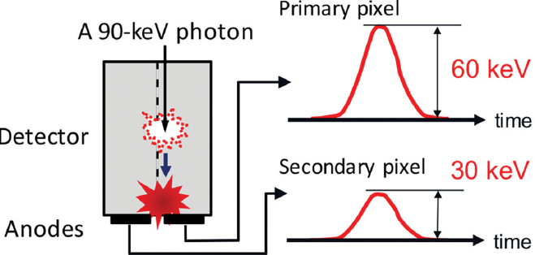
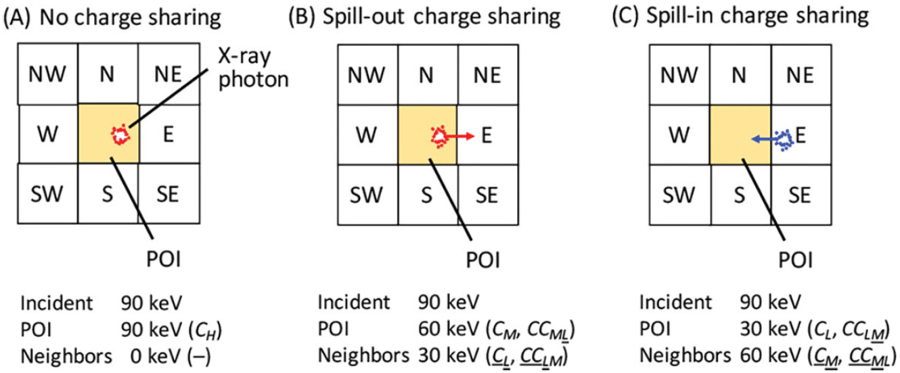
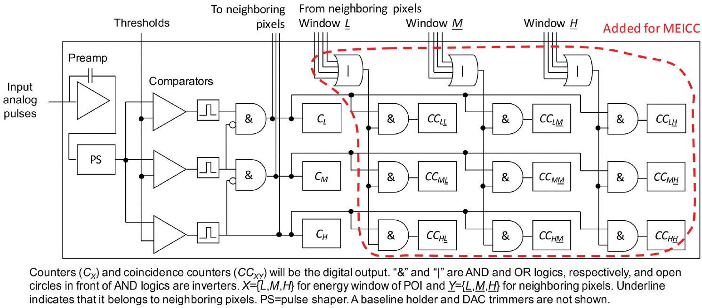

**[Link to the paper]**  
[Multi-energy inter-pixel coincidence counters for charge sharing correction and compensation in photon counting detectors](https://pubmed.ncbi.nlm.nih.gov/31984498/)
{: .notice--success}

# Abstract

$\bullet$ Purpose
: Smaller pixel sizes of x-ray photon counting detectors (PCDs) have
  

  Advantages
  - Better count rate capability
  

  

  Disadvantages
  - Charge sharing (The split of an x-ray photon energy) 
    

    - One photon may produce two or more counts at adjacent pixels
    - 90keV photon can be measured as 30keV and 90keV
    - Hard to fix position of measured photon
  

  This "double-counting" produced by charge sharing increases noise variance and degrades the spectral response. 
  In this reason, charge sharing has negative impact on the PCD-based computed tomography (CT) performance.
  But, charge sharing is impossible to avoid. (It is induced by the detection physics and occurs regardless of count rates)
  In this paper, a method that has a potential to address both noise and bias added by charge sharing is proposed.

$\bullet$ Methods
: In this paper, a multi-energy inter-pixel coincidence cunter (MEICC) technique is proposed.
  This technique uses energy-dependent coincidence counters, keeps the book of charge sharing envents during data acquisition and provieds the exact number of charge sharing occurrences, which can be used to either correct of compensate for them after the acquisition is completed.
  

  This process does not interfere with the primary couting process
  

  Authors evaluated Cramer-Rao lower bound (CRLB) of PCDs with and without MEICC using Monte Carlo simulation.



# 1. Introduction

## 1-1) Charge sharing in photon counting detectors (PCDs)
Photon counting detector-based x-ray computed tomography (PCD-CT) has many advantages. 

- Higher spatial resolution
- Better soft tissue contrast
- Stronger contrast agent enhancement
- Radiation dose reduction
- Quantitative CT imaging and biomarkers
- Accurate soft tissue material characteriazaiton 
- K-edge imaging
- Simultaneous multi-contrast agent imaging

However, the performnace of the prototype PCD-CT did not meet high expectations because of a "charge sharing" or spatio-energetic corss talk between PCD pixels.

<figure style="display: flex; flex-direction: column; align-items: center; margin-top: 0.5em; margin-bottom: 0.5em;">
  
   <figcaption style="font-size: 20px; margin-top: -0.5em;">
   Fig.1. Charge sharing.
   </figcaption>
</figure> 

In this paper, charge sharing includes fluoresence x-ray emission and its reabsorption.

Split of the energy of an incident x-ray photon into multiple charge clouds onto different pixels.

<figure style="display: flex; flex-direction: column; align-items: center; margin-top: 0.5em; margin-bottom: 0.5em;">
  
   <figcaption style="font-size: 20px; margin-top: -0.5em;">
   Fig.2. Three charge sharing cases.
   </figcaption>
</figure> 

When an x-ray photon hits a detector pixel,  

No charge sharing
: PCD adds one count to an energy window that corresponds to the photon's energy (Fig. 2A).

Charge sharing (Most cases)
: The energy of the x-ray photon is split between two adjacecnt pixels, which produce two counts at lower energies (Fig. 2B-2C).
This is called double-counting and it increases noise variance, degrades the spatial resolution, and degrades the energy response.

In some cases, the realistic PCD-CT was comparable to or even worse than dual-energy CT.
Addressing the charge sharing will create PCDs close to the perfect PCD with decreased noise, enhanced signals, and improved image quality overall.

Charge sharing is impossible to avoid because it is inherent to the detection physics.
A probability of charge sharing is ~70% with a pixel size of 225$\mu$m.
Larger pixel size could decrease the probability and mitigate charge sharing. 
However, larger pixel size increases the x-ray photon's incoming rate per pixel and exacerbates the problem of "pulse pileup".

Given the current detector speed and x-ray intensity for clinical CT, the pixel size probably needs to be smaller than 500 $\mu$m, and consequently, charge sharing needs to be addressed.

## 1-2) PCDs with charge sharing correction and compensation schemes
Detectors that handle charge sharing have been proposed and many patents have been filed.
Their shemes can be categorized into two groups.

An event-based real-time charge sharing correction/rejection
- Event-based real-time charge sharing correction
: There are two types of correction - analog and digital. However, both versions are inherently and intricately integrated with the primary couting process, and there is a concern that it would degrade PCD's counting capability at high count rates.

- Event-based real-time charge sharing rejection
: These PCDs reject charge shared events by separating them from non-charge shared events. This have fewer processes than charge sharing correction schemes, therefore, can be more efficient. However, by setting aside any coincidence events, this approach may exclude too many photons including spill-out charge sharing.

A reading-based post-acquisition correction/compensation
- Reading-based post-acquisition charge sharing correction
: These schems simply record additional information and are independent of the primary counting process. 
They include one coincidence counter presented by Hsieh and a list-mode acquisition.

- One coincidence counter
: Hsieh proposed to add one coincidence counter per pixel to the standard PCD in order to count the number of double-counting events with four neighboring pixels. It is intriguing but with no energy resolution in the coincidence counter, it cannot tell how many events were spill-in and how many were spill-out, nor can it tell how many counts went into each energy window. Therefore, its ability to correct for charge sharing is of interset and authors assessed the performance of this approach compairng with the their proposed method.

- List-mode acquisition

- Model-based post-acquisition charge sharing compensation
: This algorithm is a software solution. This algorithms can address the bias using a charge sharing model. However, they cannot estimate the noise added by charge sharing. Thus, the signal-to-noise ratio of the processed data is expected to be worse than what would be achieved by PCDs without charge sharing.

In this paper, authors proposed a reading-based post-acquisition correction/compensation method to address both noise and bias added by charge sharing.
The design concept is similar to the one coincidence counter method proposed by Hsieh, but the method proposed here keeps spectral information in charge sharing (while method of Hsieh records intensity information only). 

This paper is organized as follows:

- Section 2: Proposed method, Monte Carlo (MC) simulation program and evaluation methods will be introduced.
- Section 3: Results
- Section 4: Disscusion and Colclusion 



# 2. Methods


## 2-1) Multi-energy inter-pixel coincidence counter (MEICC)
Authors proposed the multi-energy inter-pixel coincidence counter (MEICC) (Fig.3) method to address charge sharing.

<figure style="display: flex; flex-direction: column; align-items: center; margin-top: 0.5em; margin-bottom: 0.5em;">
  
   <figcaption style="font-size: 20px; margin-top: -0.5em;">
   Fig.3. The basic architecture of a PCD pixel with MEICC.
   </figcaption>
</figure> 

MEICC uses energy-dependent coincidence counters, keeps the book of charge sharing events during the data acquisiton, and outputs the exact number of the occurrences that can be used to correct them after the acquisition is completed.  
Since MEICC dose not interfere with the primary counting process, PCDs with MEICC will remain fast.

Let's see how MEICC works using an example:

At Fig.3, we can see a PCD with three energy windows, L, M, and H for 20-50keV, 50-80keV, and $\ge$80 keV, respectively.
And there are also three counters, $C_L$, $C_M$, $C_H$. 
Either eight or four neighboring pixels are considered for each pixel (Fig.2).
The central pixel is called pixel-of-interest (POI).
MEICC has $3\times3=9$ coincidence counters ($CC_{X\underline{Y}}$), each of which concerns coincident events between window $X$ of POI and window $\underline{Y}$ of the neighboring pixels.

The underline indicates that it belongs to thte neighboring pixels.

When a count is added coincidently to counter $C_{X}$ and counter $C_{\underline{Y}}$, a count is also added to $CC_{X\underline{Y}}$ of the POI. 


[No charge sharing (Fig. 2A)]  
  {% include start-side-by-side.html
  image_src="../images/2025-07-31-PR_2/image-20250805103336484.png"
  image_alt=""
  image_width="20%"
  margin_top = "-4em"
  margin_bottom = "-4em"
  %}
  When a 90-keV photon is incident onto the POI and detected with no charge sharing, it generates a count at counter $C_H$ accurately.
  



[With charge sharing (Fig. 2B)]  
  {% include start-side-by-side.html
  image_src="../images/2025-07-31-PR_2/image-20250805103356041.png"
  image_alt=""
  image_width="20%"
  margin_top = "-4em"
  margin_bottom = "-4em"
  %}
  When a 90-keV photon is incident onto the POI and detected with charge sharing, the photon may deposit 60keV at the POI and 30keV at one of the neighboring pixels, e.g., pixel $E$.In this case, a count at $C_M$ of the POI and another count at $\underline{C_L}$ of pixel $E$ is added.
  And coincidence counter $CC_{ML}$ will add one count as a trace of the "spill-out" charge sharing.
  



[With charge sharing (Fig. 2C)]  
  {% include start-side-by-side.html
  image_src="../images/2025-07-31-PR_2/image-20250805103407830.png"
  image_alt=""
  image_width="20%"
  margin_top = "-4em"
  margin_bottom = "-4em"
  %}
  When a 90-keV photon is incident onto the neighboring pixels e.g., $E$ and detected with charge sharing, the photon may deposit 30keV at the POI and 60keV at pixel $E$.
  In this case, a count at $C_L$ of the POI and another count at $\underline{C_{M}}$ of the pixel $E$ is added.
  And coincidence counter $CC_{LM}$ of the POI will add one count as a trace of the "spill-in" charge sharing.
  


When data are read out after one projection (e.g., 200$\mu$s), both of the charge sharing types can be corrected using counts stored in coincidence counters.

- $CC_{ML}$ (the number of spill-out charge sharing) are likely to have migrated from window $H$ to window $M$ during the acquisition.
- $CC_{LM}$ (the exact number of spill-in charge sharing) are added to window L.

MEICC keeps the book of the number of charge sharing events in both of the directions, separeated from the number of no-charge sharing events.
The quality of the information from coincidence counters may degrade at very high count rates; however, authors have a control of how to use the coincidence counter data.

Effectiveness of MEICC was assessed using MC simulations.
The MEICC parameters are as follows:

- The number of counters ($N_C$)
- The threshold energies
- The number of coincidence counters ($N_{CC}$)
- The number of neighboring pixels (eight of four) 
- How energy windows of the POI and those of neighboirng pixels are connected with coincidence counters

## 2-2) Monte Carlo (MC) simulations
Authors assessed the performance of three imaging tasks, which require spectral information with different levels of accuracy, with two acquisition schemes.

Three imaging tasks
- Density image of water
- Density image of bone
- Mono-energetic CT imaging at 60keV and K-edge imaging with gold

Two acquisition schemes
- A single-pixel acquisition
: Focus on the output of one pixel, which is the highest possible spatial frequency
- A super-pixel acquisition (Consider $3\times3$ pixel as one big pixel)
: Assess the zero-frequency detective quantum efficiency (DQE) or cases when the output of neighboring pixels were summed

Authors developed an MC simulation program by cascading the following processes:

(1) Photon generations with randomized energies and time intervals for a Poisson distribution 
(2) Charge sharing based on a randomized location and interaction and detection processes 
(3) Pulse train generations with electronic noise 
(4) Comparator signal generation by pulse height analyzers with set energy thresholds 
(5) Counting and coincidence processing 


[For the single-pixel measurements] 
Photons were randomly incident onto $3\times3$ PCD pixels, and these processes were performed for each of the $3\times3$ pixels in parallel.
The MC program output the counts saved at counters $C_X$, $X=1,2,\dots, N_C$ and coincidence counters $CC_{X\underline{Y}}$, $X=1,2,\dots, N_C$ and $\underline{Y} = 1,2,\dots,N_C$ for the POI. 
Pulse pileups were ignored using an impulse pulse shape in (3) in this study.



[For the super-pixel measurements] 
Photons were incident onto the central pixel (POI) only, while the above processes were performed for all of the $3\times3$ pixels in parallel.
Then the counts saved at counters $C_X$ and coincidence counters $CC_{XY}$, respectively, of $3\times3$ pixels were added.


Since charge sharing is main topic of this study, pulse pileup effect is ignored.
And assume that all of the pixels has same physical properties in this study. (Symmetry)

The probabilities of "spill-out" from center pixel to left or right pixel are same. 

With absence of pulse pileup and the symmetry, this scheme accurately simulates super-pixel data with flat field irradiation including the effect of double-counting.

For step (2), authors created a look-up table for relative charge energies deposited at each of the $3\times3$ pixels given a location and a type of interaction using Photon Counting Toolkit (PcTK), which they developed previously and had excellent agreement with another MC simulation program.

Authors made a look-up table to avoid complecated calculation which occurs when photon collide with detector

- Triple/Quadruple-counting were included (although the probability is very low)
- The probability of location of incident photon at $3\times3$ detector are all same
- The probability of interaction types followed x-ray physics
- The probability of the secondary charge location (due to fluorescence x-ray) relative to the primary charge was computed using the probabilty of attenuation with Beer's law and uniform probability of emission angles.

- The interaction types (Compton scattering and Rayleigh scattering was not included)
: No detection 
: The photoelectric effect 
- The sub-interaction types for the photoelectric effect (the number of interactions is limited to one)
: Total absorption
: K-escape
: Fluorescence x-ray emission followed by its reabsorption

Authors perforemed three sets of 5,000 noise realizations (15,000 noise realizations in total).

- 1ms acquisition with x-rays at 140kVp and 450mA
- Object: 10cm water and 1cm bone
- About 4,100 incident photons per pixel per noise realization on average

The simulated cadmium telluride PCD had a pixel size of (225$\mu$m)$^2$, a thickness of 1.6mm, and electronics noise with a standard deviation of 2.0keV added to a pulse train.

- Very small size pixel is used and it makes charge sharing easier
- Authors tried to prove their method in this hard situation

Authors studied the effect of the five parameters and evaluated a PCD with no charge sharing for comparison (called "ideal PCD").

- The number of counters ($N_C$, also called the number of energy windows): 2, 3, 4, 6, 8, 12
- The threshold energies: divide energy range 20-140keV uniformly (Ex. $N_C$=4, 30keV increment $\rightarrow$ 20, 50, 80, 110keV)
- The number of coincidence counters ($N_{CC}$)

- 0 for no MEICC
- 1 for record only occurrence of "charge sharing"
- $N_{C}^{2}$ for record all combination of energies

- The number of neighboring pixels (eight of four) 
- How energy windows of the POI and those of neighboirng pixels are connected with coincidence counters

In this study, the detector authors made had other degradation factors such as electronic noise, K-escape and non-perfect detection efficiency.
They only consider about charge sharing in this study. 

The changes in the mean values were estimated by adding a small amount of eighter wtaer, bone, or gold.
The Fisher information matrix was then computed numerically with two assumptions:

(1) Measured counts were multivariate Gaussian distributed with a set of basis material thickness as parameters
: This assumption is proper since the mean counts were larger than 30 with energy window withds of 10-60keV

(2) Covaraiance remained unchanged with an additional small amount of attenuator
: This assumption makes CRLB worse, but it was necessary to make the computation stable

The size of the FIsher information matrix was $3\times3$ for K-edge imaging and $2\times2$ for the other imaging tasks.

The inverse of the Fisher information matrix was calculated and the CRLB of the variance of each basis material was the corresponding diagonal element of the inverse matrix.
The CRLB of the mono-energetic CT images was computed from the CRLBs of water and bone estimates.
An unbiased sample standard deviation of CRLB values over the three sets of 5,000 noise realization was computed.



