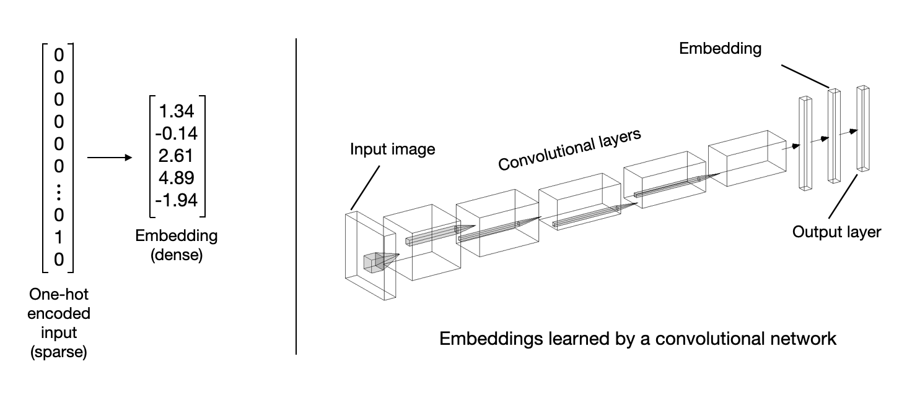
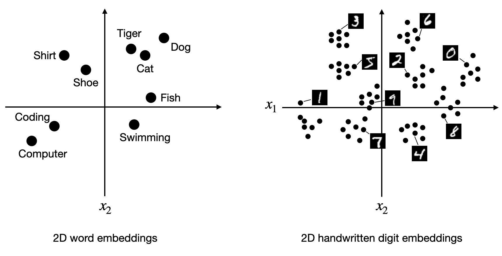
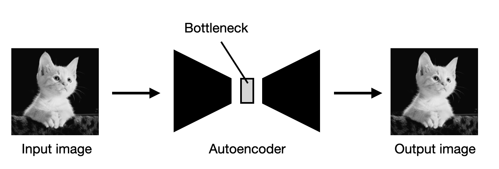

**[Reference]**  
$\bullet$ [Machine Learning Q and AI](https://sebastianraschka.com/books/ml-q-and-ai/#table-of-contents)
{: .notice--success}

# Introduction

In deep learning, the terms embedding vectors, representations, and latent space are often used interchangeably. 
However, there are subtle difference. 

* Embedding vectors
: Representation of input data where similar items are close to each other. 

* Latent vectors
: Intermediate representation of input data. 

* Representation 
: Encloded versions of the original input. 


# 1. Embeddings

Embedding vectors or embeddings for short, encod relatively high-dimensional data into relatively low-dimensional vectors.
We can apply embedding methods to create a continuous and dense vector. 

<figure style="display: flex; flex-direction: column; align-items: center; margin-top: 0.5em; margin-bottom: 0.5em;">
  
   <figcaption style="font-size: 20px; margin-top: -0.5em;">
   Fig.1.1. An input embedding (left) and an embedding from a neural network (right).
   </figcaption>
</figure> 

Taking it to the extreme, embedding methods can be used to encode data into two-dimensional dense and continuous representations. 

For visualization, and clustering analysis etc. 

<figure style="display: flex; flex-direction: column; align-items: center; margin-top: 0.5em; margin-bottom: 0.5em;">
  
   <figcaption style="font-size: 20px; margin-top: -0.5em;">
   Fig.1.2. Mapping words (left) and images (right) to a two-dimensional feature space.
   </figcaption>
</figure> 

A fundamental property of embeddings is that they encode distance or similarity. 

This means that embeddings capture the semantics of the data such that similar inputs are close in the embeddings space.



# 2. Latent space

Latent space is typically used synonymously with embedding space.
Exact meaning of the latent space is the space into which embedding vectors are mapped.
Preservation of similarity is not necessary condition for latent space.

Similar items can appear close in the latent space or not. 

Loosely, latent space can be think as any feature space that contains the features (a compressed version of the original input features).
The bottleneck of an autoencoder shown below is the example of the latent space.

<figure style="display: flex; flex-direction: column; align-items: center; margin-top: 0.5em; margin-bottom: 0.5em;">
  
   <figcaption style="font-size: 20px; margin-top: -0.5em;">
   Fig.1.3. An autoencoder that reconstructs the input image after passing through a bottleneck layer.
   </figcaption>
</figure> 

In the autoencoder, the bottleneck layer encodes or maps the input image into a lower-dimensional representation. 
In short, the input image is encoded into an embedding vector, and an autoencoder learns how to map this vector to an appropriate location within the latent space.


# 3. Representation 

A representation is an encoded, typically intermediate form of an input.
For instance, an embedding vector or vector in the latent space is a representation of the input.
However, simpler form of encoded vectors like one-hot encoded vectors also can be considered representation. 


