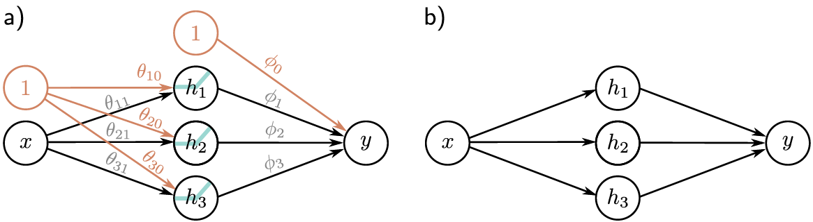

**[Reference]**  
$\bullet$ [Understanding Deep Learning](https://udlbook.github.io/udlbook/)
{: .notice--success}

# Introduction

In this page, components of neural network and deep learning will be introduced.


# 1. Components of neural networks

Neural network is consist of Linear transform and Activation function. 
Assume that we have input data $x$, and output result $y$ for some neural network about input $x$.
The relationship of them can be written as

$$y=\sigma(Wx+b), \tag{1.1}$$

where the term $Wx+b$ is linear tranform of input $x$ and function $\sigma(\cdot)$ is activation function. 

## 1-1) Linear transform
Linear tranform of input $x$ can be written as 

$$f_{\text{Linear}}(x) = Wx+b \tag{1.2}$$

This linear transform is consist of slope $W$ and bias $b$. This functino projects the data into a different coordinate sysstem, continually transforming the feature space.

## 1-2) Activation function 
Activation function, $\sigma(\cdot)$, has various version and should be selected by user.
It injects nonlinearity, enabling the network to approximate complex functions that simple linear models cannot.   


# 2. Neural network 

## 2-1) Neural network example
Let's see the example of shallow neural network.
Assume that shallow neural networks are functions $y=f[x, \phi]$ that maps a scalar input $x$ to a scalar output $y$ and has ten parameters $\phi = [\phi_0, \phi_1, \phi_2, \phi_3, \theta_{10}, \theta_{11}, \theta_{20}, \theta_{21}, \theta_{30}, \theta_{31} ] $:

$$\begin{split} y &= f[x,\phi] \\ &= \phi_0 + \phi_1 \sigma(\theta_{10} + \theta_{11}x) + \phi_2 \sigma(\theta_{20} + \theta_{21}x) + \phi_3 \sigma(\theta_{30} + \theta_{31}x) \end{split} \tag{2.1}$$

We can break down this calculation into three parts:
First, we compute three linear functions of the input data.

$\theta_{10} + \theta_{11}x, \theta_{20} + \theta_{21}x, \theta_{30} + \theta_{31}x$

Second, we pass the three results through an activation function $\sigma(\cdot)$.

Third, we weight the three resulting activations with $\phi_1, \phi_2$ and $\phi_3$, sum them, and add an offset $\phi_0$.
To complete the description, let's define the activation function as the rectified linear unit (ReLU): 

$$\sigma(z) = \text{ReLU}(z) = \begin{cases} &0 \quad z \lt 0 \\ &z \quad z \ge 0 \end{cases} \tag{2.2}$$

<figure style="display: flex; flex-direction: column; align-items: center; margin-top: 0.5em; margin-bottom: 0.5em;">
  
   <figcaption style="font-size: 20px; margin-top: -0.5em;">
   Fig.1.1. Rectified linear unit (ReLU).
   </figcaption>
</figure> 

If we know ten parameters, we can predict output $y$ for a given input $x$.
Additionally, if we can define a loss function, the parameters can be trained for given dataset. 
Training the model is the process of searching the values of parameters that minimize loss function. 

## 2-2) Neural network intuition
In fact, equation (2.1) represents a family of continuous piecewise linear functions (fig.2.1) with up to four linear regions. 

<figure style="display: flex; flex-direction: column; align-items: center; margin-top: 0.5em; margin-bottom: 0.5em;">
  
   <figcaption style="font-size: 20px; margin-top: -0.5em;">
   Fig.2.1. Family of functions defined by equation 2.1. a–c) Functions for three different choices of the ten parameters $\phi$. In each case, the input/output relation is piecewise linear. However, the positions of the joints, the slopes of the linear regions between them, and the overall height vary.
   </figcaption>
</figure> 

We now break down equation 2.1 and show why it describes this family. 
To make this easier to understand, we split the function into two parts. 

First, we introduce the intermediate quantities:

$$\begin{split} h_1 &= a(\theta_{10} + \theta_{11}x) \\ h_2 &= a(\theta_{20} + \theta_{21}x) \\ h_3 &= a(\theta_{30} + \theta_{31}x), \end{split} \tag{2.3}$$

where we refer to $h_1, h_2$ and $h_3$ as hidden units. 

Second, we compute the output by combining these hidden units with a linear function: 

$$y = \phi_0 + \phi_1 h_1 + \phi_2 h_2 + \phi_3 h_3 \tag{2.4}$$

Figure 2.2 shows the flow of computation that creats the function in figure 2.1a. 

<figure style="display: flex; flex-direction: column; align-items: center; margin-top: 0.5em; margin-bottom: 0.5em;">
  
   <figcaption style="font-size: 20px; margin-top: -0.5em;">
   Fig.2.1. Computation for function in figure 2.1a.
   </figcaption>
</figure> 

- Each hidden unit contains a linear functino $\theta_{\bullet 0}+\theta_{\bullet 1}x$ of the input
- And calculated line is clipped by the ReLU function $\sigma(\cdot)$ below zero (Clipped unit is called inactivated unit)
- The positions where the three lines cross zero become the three “joints” in the final output.
- The three clipped lines are then weighted by $\phi_1, \phi_2$ and $\phi_3$, respectively.
- Finally, the offset $\phi_0$ is added, which controls the overall height of the final function.

The slope of each linear region is determined by the original slopes $\theta_{\bullet 1}$ of the active inputs for this region and the weights $\phi_{\bullet}$ that were subsequently applied.
Each hidden unit contributes one “joint” to the function, so with three hidden units, there can be four linear regions.

## 2-3) Depicting neural networks
The discussed neural network with one input, three hidden units and one output can be visualized as fig. 2.2a.

<figure style="display: flex; flex-direction: column; align-items: center; margin-top: 0.5em; margin-bottom: 0.5em;">
  
   <figcaption style="font-size: 20px; margin-top: -0.5em;">
   Fig.2.1. Depicting neural networks.
   </figcaption>
</figure> 

To simplify this representation, we do not typically draw the intercept parameters, so this network is usually depicted as in figure 2.2b.


# 3. Universal approximation theorem

Universal function approximation is that when sufficient capacity is given, neural network can approximate any continuous function on a compact domain to an arbitrary degree of accuracy. 
In other words, they serve as an "any-function" approximator, capable of flexibly modeling a wide variety of mappings between inputs and outputs. 


