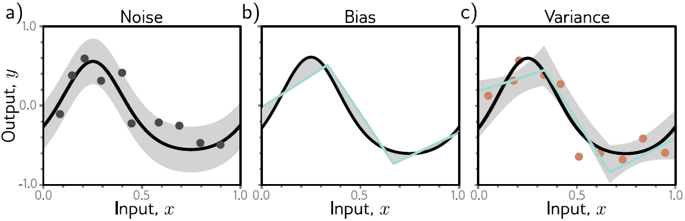
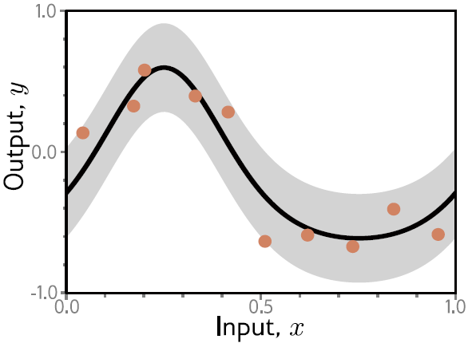

**[Reference]**  
$\bullet$ [Understanding Deep Learning](https://udlbook.github.io/udlbook/)
{: .notice--success}

# Introduction

This page considers how to measure the performance of the trained model. 


# 1. Goal of training/learning

The main goal of training/learning of model is minimizing error.


# 2. Soucres of error

There are three possible sources of error, which are known as noise, bias, and variance respectively.

<figure style="display: flex; flex-direction: column; align-items: center; margin-top: 0.5em; margin-bottom: 0.5em;">
  
   <figcaption style="font-size: 20px; margin-top: -0.5em;">
   Fig.2.1. Sources of test error. a) Noise. Data generation is noisy, so even if the model exactly replicates the true underlying function (black line), the noise in the
            test data (gray points) means that some error will remain (gray region represents two standard deviations). b) Bias. Even with the best possible parameters, the three-region model (cyan line) cannot exactly fit the true function (black line). This bias is another source of error (gray regions represent signed error). c) Variance. In practice, we have limited noisy training data (orange points). When we fit the model, we don’t recover the best possible function from panel (b) but a slightly different function (cyan line) that reflects idiosyncrasies of the training data. This provides an additional source of error (gray region represents two standard deviations). 
   </figcaption>
</figure> 

## 2-1) Noise 
The data generation process includes the addition of noise. 
This source of error is insurmountable for the test data. (e.g. Physical sensor noise, Labeling human error, etc)

## 2-2) Bias
Model inflexibility (related to capacity) prevents perfectly fitting true function.

Ex) The three-region neural network model cannot exactly describe the quasi-sinusoidal function

This is known as bias.

## 2-3) Variance
Limited data causes variability in learned model outcomes

If using partial data, the estimation varies within some ranges



# 3. Mathematical formulation of test error

Consider a 1D regression problem where the data generation process has additive noise with variance $\sigma^2$ (Fig 3.1).

<figure style="display: flex; flex-direction: column; align-items: center; margin-top: 0.5em; margin-bottom: 0.5em;">
  
   <figcaption style="font-size: 20px; margin-top: -0.5em;">
   Fig.3.1. Data and noise with variance $\sigma^2$.
   </figcaption>
</figure> 

For a given dataset, the error comes from 

$$\mathbb{E}_{\mathcal{D}}\big[\mathbb{E}_{y}[L[x]]\big] = \underbrace{\mathbb{E}_{\mathcal{D}}\Big[ \big(f[x, \phi[\mathcal{D}]] - f_{\mu}[x]\big)^{2} \Big]}_{\text{variance}} + \underbrace{\big(f_{\mu}[x] - \mu[x]\big)^{2}}_{\text{bias}} + \underbrace{\sigma^{2}}_{\text{noise}}\tag{3.1}$$

Thus, reducing error means reducing variance and bias.
