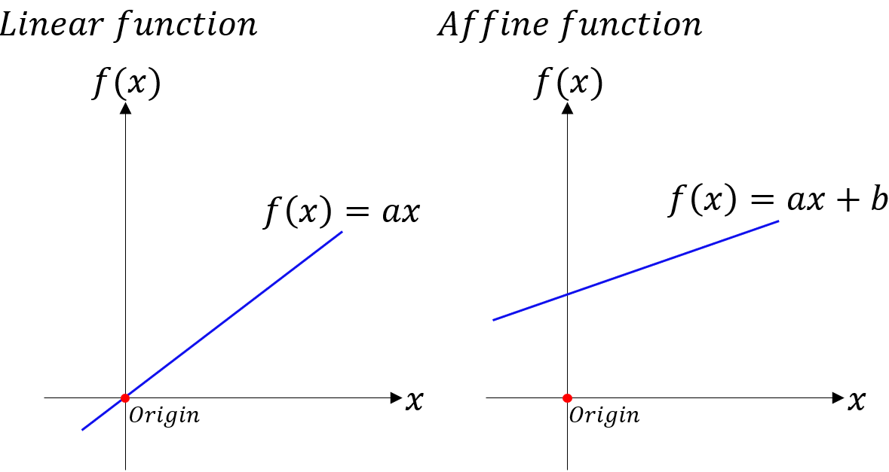

**[Reference]**  
$\bullet$ [MATHEMATICS FOR MACHINE LEARNING](https://mml-book.github.io/)
{: .notice--success}

# Introduction 

Linear algebra is the study of vectors and certain rules to manipulate vectors.
Here, an arrow ($\rightarrow$) over letter represents a vector. 


# 7. Linear Mappings

We will study mappings on vector spaecs that preserve their structure.

To define the concept of a coordinate

Consider two real vector spaces $V$,$W$.
A mapping $\Phi: V \rightarrow W$ preserves the structure of the vector space if 
$$\Phi(\vec{x}+\vec{y}) = \Phi(\vec{x}) + \Phi(\vec{y}) \tag{7.1}$$
$$\Phi(\lambda \vec{x}) = \lambda \Phi(\vec{x}) \tag{7.2}$$
for all $\vec{x}, \vec{y} \in V$ and $\lambda \in \mathbb{R}$.

We can summarize this in the following definition:


**Definition 2.15 (Linear Mapping)** 
For vector spaces $V,W$, a mapping $\Phi: V \rightarrow W$ is called a **_linear mapping_** (or _vector space homomorphism_ / _linear transformation_) if

$$\forall \vec{x}, \vec{y} \in V \forall \lambda \in \mathbb{R}: \Phi(\lambda \vec{x} + \psi \vec{y}) = \lambda \Phi(\vec{x} + \psi \Phi(\vec{y})) \tag{7.3}$$




**Definition 2.16 (Injective, Surjective, Bijective)** 
Consider a mapping $\Phi: \mathcal{V} \rightarrow \mathcal{W}$, where $\mathcal{V}, \mathcal{W}$ can be arbitrary sets. Then $\Phi$ is called

- **_Injective_**
    

    if $\forall \vec{x}, \vec{y} \in \mathcal{V}: \Phi(\vec{x}) = \Phi({\vec{y}}) \Rightarrow \vec{x} = \vec{y}$
    

- **_Surjective_**
    

    if $\Phi(\mathcal{V}) = \mathcal{W}$
    

- **_Bijective_**
    

    if it is injective and surjective There exists a mapping $\psi: \mathcal{W} \rightarrow \mathcal{V}$ which is inverse of $\Phi$, denoted by $\Phi^{-1}$
    



There are special cases of linear mappings between vector spaces $V$ and $W$:
- **_Isomorphism_**
    

    $\phi: V \rightarrow W$ linear and bijective
    

- **_Endomorphism_**
    

    $\phi: V \rightarrow V$ linear 
    

- **_Automorphism_**
    

    $\phi: V \rightarrow V$ linear and bijective
    

- $id_{V}$
    

    $V \rightarrow V, x \mapsto x$: _identity mapping_ or _identity automorphism_ in $V$
    


**Theorem 2.17** 
Finite-dimensional vector spaces $V$ and $W$ are _isomorphic_ if and only if dim($V$) = dim($W$).

It states that there exists a linear, bijective mapping between two vector spaces of the same dimension.

For two vector spaces of the same dimension, they can be transformed into each other without incurring any loss



## 7-1) Matrix Representation of Linear Mappings
Any $n$-dimensional vector space is isomorphic to $\mathbb{R}^n$ (Theorem 2.17).
Consider a ordered basis of $n$-dimensional vector space $V$.

$$B = (\vec{b}_1, \dots, \vec{b}_n) \tag{7.4}$$

and call this $n$-tuple an **_ordered basis_** of $V$.


Notations for ordered/unordered basis and matrix 
- Ordered basis: $B = (\vec{b}_1, \dots, \vec{b}_n)$
- Unordered basis: $$\mathcal{B} = \{\vec{b}_1, \dots, \vec{b}_n \}$$
- Matrix: $[\vec{b}_1, \dots, \vec{b}_n]$ where $\vec{b}$ is column vectors



**Definition 2.18 (Coordinates)** 
Consider a vector space $V$ and an ordered basis $B = (\vec{b}_1, \dots, \vec{b}_n)$ of $V$.
For any $x \in V$, we obtain a unique representation (linear combination)

$$\vec{x} = \alpha_1 \vec{b}_1 + \dots + \alpha_n \vec{b}_n \tag{7.5}$$

of $\vec{x}$ with respect to $B$. 
Then $\alpha_1, \dots, \alpha_n$ are the **_coordinates_** of $\vec{x}$ with repsect to $B$, and the vector

$$\vec{\alpha} = \begin{bmatrix} \alpha_1 \\ \vdots \\ \alpha_n \end{bmatrix} \in \mathbb{R}^n \tag{7.6}$$

is the **_coordinate vector_**/**_coordinate_** representation of $\vec{x}$ with respect to the ordered basis $B$.

A basis defines a coordiate system!



Then, let's look at connection between matrices and linear mappings between finite-dimensional vector spaces.


**Definition 2.19 (Transformation Matrix)** 
Consider vector spaces $V, W$ with corresponding (ordered) bases $B=(\vec{b}_1, \dots, \vec{b}_n)$ and $C = (\vec{c}_1, \dots, \vec{c}_m)$.
Consider a linear mapping $\Phi: V \rightarrow W$, for $j = \in \{ 1, \dots, n \}$.

$$\Phi(\vec{b}_j) = \alpha_{1j}\vec{c}_1 + \dots + \alpha_{mj}\vec{c}_m = \sum_{i=1}^{m}\alpha_{ij}\vec{c}_i \tag{7.7}$$

The coordinates of $$\Phi(\vec{b}_j)$$ are the $j$-th column of $A_{\Phi}$

is the unique representation of $$\Phi(\vec{b}_j)$$ with respect to $C$.
Then, we call the $m \times n$-matrix $A_{\Phi}$, whose elements are given by 

$$A_{\Phi}(i,j) = \alpha_{ij}, \tag{7.8}$$

the transformation matrix of $\Phi$ (with respect to ordered basis $B$ of $V$ and $C$ of $W$).


Consider (finite-dimensional) vector spaces $V,W$ with ordered bases $B, C$ and a linear mapping $\Phi: V \rightarrow W$ with transformation matrix $A_{\Phi}$.
If $\hat{\vec{x}}$ is the coordinate vector of $\vec{x} \in V$ with respect to $B$ and $\hat{\vec{y}}$ the coordinate vector of $\vec{y} = \Phi(\vec{x}) \in W$ with respect to $C$, then 

$$\hat{\vec{y}} = A_{\Phi} \hat{\vec{x}} \tag{7.9}$$

This means that the transformation matrix can be used to map coordinates from one basis to another basis.


**Example** 
Consider a homomorphisim $\Phi: V \rightarrow W$ and ordered bases $B = (\vec{b}_1, \dots, \vec{b}_3)$ of $V$ and $C = (\vec{c}_1, \dots, \vec{c}_4)$ of $W$. With 

$$\begin{aligned}
\Phi(b_1) &=  c_1 - c_2 + 3c_3 - c_4 \\
\Phi(b_2) &= 2c_1 + c_2 + 7c_3 + 2c_4 \\
\Phi(b_3) &= \qquad 3c_2 + c_3 + 4c_4
\end{aligned} \tag{7.10}$$

the transformation matrix is can be written as $$\Phi(\vec{b}_k) = \sum_{i=1}^{4} \alpha_{ik}\vec{c}_i$$ for $k=1,\dots,3$ and is given as 

$$A_{\Phi} = [\alpha_1, \alpha_2, \alpha_3] = 
\begin{bmatrix}
 1 & 2 & 0 \\
-1 & 1 & 3 \\
 3 & 7 & 1 \\
-1 & 2 & 4
\end{bmatrix} \tag{7.11}$$

where the $\alpha_j, j=1,2,3$, are the coordinate vectors of $\Phi(\vec{b}_j)$ with respect to $C$.


## 7-2) Basis Change
Let's look at how transformation matrices of a linear mapping $\Phi: V \rightarrow W$ change if we change the bases in $V$ and $W$.
Consider two ordered bases

$$B = (\vec{b}_1, \dots, \vec{b}_n), \quad \tilde{B} = (\tilde{\vec{b}_1}, \dots, \tilde{\vec{b}_n}) \tag{7.12}$$

of $V$ and two ordered bases

$$C = (\vec{c}_1, \dots, \vec{c}_m), \quad \tilde{C} = (\tilde{\vec{c}_1}, \dots, \tilde{\vec{c}_m}) \tag{7.13}$$

of $W$.

Let 

- $A_{\Phi} \in \mathbb{R}^{m \times n}$: the transformation matrix of the linear mapping $\Phi: V \rightarrow W$ with bases $B$ and $C$
- $\tilde{A}_{\Phi} \in \mathbb{R}^{m \times n}$: the transformation matrix of the linear mapping $\Phi: V \rightarrow W$ with bases $\tilde{B}$ and $\tilde{C}$

In the following, we can see how $A$ and $\tilde{A}$ are related.

How/whether we can transform $A_{\Phi}$ into $\tilde{A}_{\Phi}$ if we choose to perform a basis change from $B, C$ to $\tilde{B}, \tilde{C}$

This process is useful when the transformation matrix $A_{\Phi}$ is complex or difficult to interpret, and a simpler form, such as a diagonal matrix, is desired.


**Example** 
Consider a tranformation matrix 

$$A = \begin{bmatrix} 2 & 1 \\ 1 & 2 \end{bmatrix} \tag{7.14}$$

with respect to the canonical basis in $\mathbb{R}^2$. ((Coordinates in canonical basis) $\rightarrow$ ((Coordinates in canonical basis)))

If we define a new basis 

$$B = \left( \begin{bmatrix} 1 \\ 1 \end{bmatrix}, \begin{bmatrix} 1 \\ -1 \end{bmatrix} \right) = (\vec{b}_1, \vec{b}_2), \tag{7.15}$$

we can calculate new transformation matrix as below:

$$\begin{split} A\vec{b}_1 = \begin{bmatrix} 2 & 1 \\ 1 & 2 \end{bmatrix}\begin{bmatrix} 1 \\ 1 \end{bmatrix} = \begin{bmatrix} 3 \\ 3 \end{bmatrix} = 3\begin{bmatrix} 1 \\ 1 \end{bmatrix} + 0\begin{bmatrix} 1 \\ -1 \end{bmatrix} \\ A\vec{b}_2 = \begin{bmatrix} 2 & 1 \\ 1 & 2 \end{bmatrix}\begin{bmatrix} 1 \\ -1 \end{bmatrix} = \begin{bmatrix} 3 \\ 3 \end{bmatrix} = 0\begin{bmatrix} 1 \\ 1 \end{bmatrix} + 1\begin{bmatrix} 1 \\ -1 \end{bmatrix} \end{split} \tag{7.16}$$

Then, we obatain a diagonal transformation matrix

$$\hat{A} = \begin{bmatrix} 3 & 0 \\ 0 & 1 \end{bmatrix} \tag{7.17}$$

with respect to $B$, which is easier to work with than $A$. ((Coordinates in basis $B$) $\rightarrow$ ((Coordinates in basis $B$)))


Next, let's look at mappings that transform coordinate vectors with respect to one basis into coordinate vectors with respect to a different basis.


**Theorem 2.20 (Basis change)** 
For a linear mapping $\Phi: V \rightarrow W$, ordered bases

$$B = (\vec{b}_1, \dots, \vec{b}_n), \quad \tilde{B} = (\tilde{\vec{b}_1}, \dots, \tilde{\vec{b}_n}) \tag{7.18}$$

of $V$ and 

$$C = (\vec{c}_1, \dots, \vec{c}_m), \quad \tilde{C} = (\tilde{\vec{c}_1}, \dots, \tilde{\vec{c}_m}) \tag{7.19}$$

of $W$, and a transformation matrix $A_{\Phi}$ of $\Phi$ with repect to $B$ and $C$, the corresponding transformation matrix $\tilde{A_{\Phi}}$ with respect to the bases $\tilde{B}$ and $\tilde{C}$ is given as 

$$\tilde{A_{\Phi}} = T^{-1} A_{\Phi} S \tag{7.20}$$

- $S \in \mathbb{R}^{n \times n}$: the transformation matrix of id$_V$ that maps coordinates with respect to $\tilde{B}$ onto coordinates with respect to $B$
- $T \in \mathbb{R}^{m \times m}$: the transformation matrix of id$_W$ that maps coordinates with respect to $\tilde{C}$ onto coordinates with respect to $C$



Theorem 2.20 tells us that with a basis change in $V$ ($B \rightarrow \tilde{B}$) and $W$ ($C \rightarrow \tilde{C}$), the transformation matrix $A_{\Phi}$ of a linear mapping $\Phi: V \rightarrow W$ is replaced by an equivalent matrix $\tilde{A_{\Phi}}$ with 

$$\tilde{A_{\Phi}} = T^{-1} A_{\Phi} S \tag{7.21}$$

Figure.7.1 illustrates this relation.

<figure style="display: flex; flex-direction: column; align-items: center; margin-top: 0.5em; margin-bottom: 0.5em;">
  
   <figcaption style="font-size: 20px; margin-top: -0.5em;">
   Fig.7.1. For a homomorphism $\Phi : V \to W$ and ordered bases $B, \tilde{B}$ of $V$ and $C, \tilde{C}$ of $W$ (marked in blue), we can express the mapping $\Phi_{CB}$ with respect to the bases $\tilde{B}, \tilde{C}$ equivalently as a composition of the homomorphisms $\Phi_{\tilde{C}\tilde{B}} = \Xi_{\tilde{C}C} \circ \Phi_{CB} \circ \Psi_{B\tilde{B}}$ with respect to the bases in the subscripts. The corresponding transformation matrices are in red.
   </figcaption>
</figure> 


**Example (Basis change)** 
Consider a linear mapping $\Phi: \mathbb{R}^3 \rightarrow \mathbb{R}^4$ whose transformation matrix is 

$$A_{\Phi} = \begin{bmatrix} 
1 & 2 & 0 \\
-1 & 1 & 3 \\
3 & 7 & 1 \\
-1 & 2 & 4 
\end{bmatrix} \tag{7.22}$$

with respect to the standard bases 

$$B = \left( \begin{bmatrix} 1 \\ 0 \\ 0 \end{bmatrix}, \begin{bmatrix} 0 \\ 1 \\ 0 \end{bmatrix}, \begin{bmatrix} 0 \\ 0 \\ 1 \end{bmatrix} \right), \quad C = \left( \begin{bmatrix} 1 \\ 0 \\ 0 \\ 0 \end{bmatrix}, \begin{bmatrix} 0 \\ 1 \\ 0 \\ 0 \end{bmatrix}, \begin{bmatrix} 0 \\ 0 \\ 1 \\ 0 \end{bmatrix}, \begin{bmatrix} 0 \\ 0 \\ 0 \\ 1 \end{bmatrix} \right) \tag{7.23}$$

Let's find the transformation matrix $\tilde{A}_{\Phi}$ of $\Phi$ with respect to the new bases

$$\tilde{B} = \left( \begin{bmatrix} 1 \\ 1 \\ 0 \end{bmatrix}, \begin{bmatrix} 0 \\ 1 \\ 1 \end{bmatrix}, \begin{bmatrix} 1 \\ 0 \\ 1 \end{bmatrix} \right) \in \mathbb{R}^3, \quad \tilde{C} = \left( \begin{bmatrix} 1 \\ 1 \\ 0 \\ 0 \end{bmatrix}, \begin{bmatrix} 1 \\ 0 \\ 1 \\ 0 \end{bmatrix}, \begin{bmatrix} 0 \\ 1 \\ 1 \\ 0 \end{bmatrix}, \begin{bmatrix} 1 \\ 0 \\ 0 \\ 1 \end{bmatrix} \right). \tag{7.24}$$

Then, 

$$S = \begin{bmatrix} 
1 & 0 & 1 \\
1 & 1 & 0 \\
0 & 1 & 1 
\end{bmatrix}, \quad 
T = \begin{bmatrix}
1 & 1 & 0 & 1 \\
1 & 0 & 1 & 0 \\
0 & 1 & 1 & 0 \\
0 & 0 & 0 & 1
\end{bmatrix}, \tag{7.25}$$

where $S: \mathbb{R}^3 \rightarrow \mathbb{R}^3$ is the transformation matrix that maps coordinates $\tilde{B} \rightarrow B$ and $T: \mathbb{R}^4 \rightarrow \mathbb{R}^4$ is the transformation matrix that maps coordinates $\tilde{C} \rightarrow C$.

The matrices $S$ and $T$ appear to be a simple combination of the bases for $\tilde{B}$ and $\tilde{C}$.  
This is because $B$ and $C$ are the standard bases.

Then we can calculate $\tilde{A}_{\Phi}$ as below:

$$\begin{aligned}
\tilde{A}_{\Phi} = T^{-1}A_{\Phi}S = \frac{1}{2}
\begin{bmatrix}
 1 &  1 & -1 & -1 \\
 1 & -1 &  1 & -1 \\
-1 &  1 &  1 &  1 \\
 0 &  0 &  0 &  2
\end{bmatrix}
\begin{bmatrix}
 3 & 2 & 1 \\
 0 & 4 & 2 \\
10 & 8 & 4 \\
 1 & 6 & 3
\end{bmatrix}
=
\begin{bmatrix}
-4 & -4 & -2 \\
 6 &  0 &  0 \\
 4 &  8 &  4 \\
 1 &  6 &  3
\end{bmatrix}.
\end{aligned} \tag{7.26}$$



## 7-3) Image and Kernel
The **_image_** and **_kernel_** of a linear mapping are vector subspaces with certain important prperties.


**Definition 2.23 (Image and Kernel)**
For $\Phi: V \rightarrow W$, we define the **_kernel_**/**_null space_**

$$\text{ker}(\Phi) := \Phi^{-1}(\vec{0}_W) = \{ v \in V: \Phi(v) = \vec{0}_W \} \tag{7.27}$$

and the **_image_**/**_range_**

$$\text{Im}(\Phi) := \Phi(V) = \{ w \in W \vert \exists v \in V: \Phi(v) = w \} \tag{7.28}$$

 
<figure style="display: flex; flex-direction: column; align-items: center; margin-top: 0.5em; margin-bottom: 0.5em;">
  
   <figcaption style="font-size: 20px; margin-top: -0.5em;">
   Fig.7.2. Illustration of image and kernel.
   </figcaption>
</figure> 

Here, we also call $V$ and $W$ the **_domain_** and **_codomain_** of $\Phi$ respectively.

- kernel/null space
: The set of vectors $v \in V$ that $\Phi$ maps onto the neutral element $\vec{0}_W \in W$ It always holds that $\Phi(\vec{0}_V) = \vec{0}_W$, therefore $\vec{0}_V \in \text{ker}(\Phi)$ $\Phi$ is injective (one-to-one) if and only if $$\text{ker}(\Phi) = \{\vec{0}\}$$ $\text{ker}(\Phi)$ is the solution set of the homogeneous system of linear equations $A\vec{x} = \vec{0}$

- image/range
: The set of vectors $w \in W$ that can be reached by $\Phi$ from any vector in $V$ $\text{Im}(\Phi) \subseteq W$ is a subspace of $W$, and $\text{ker}(\Phi) \subseteq V$ is a subspcae of $V$ Let $\Phi:\mathbb{R}^n \rightarrow \mathbb{R}^m, x \mapsto Ax$ where $A \in \mathbb{R}^{m \times n}$, then the image is the span of the columns of $A$, which is called **_column space_**.
    

    $\text{rk}(A) = \text{dim}(\text{Im}(\Phi))$
    




**Theorem 2.24 (Rank-Nullity Theorem)**
For vector spaces $V, W$ and a linear mapping $\Phi:V \rightarrow W$ it holds that 

$$\text{dim}(\text{ker}(\Phi)) + \text{dim}(\text{Im}(\Phi)) = \text{dim}(V) \tag{7.29}$$

The following are censequences of Rank-Nullity Theorem.

- $\text{dim}(\text{Im}(\Phi)) \lt \text{dim}(V)$
    

    $\text{ker}(\Phi)$ is non-trivial: kernel contains more than $\vec{0}_V$ and $\text{dim}(\text{ker}(\Phi)) \ge 1$
    

- For $A_{\Phi}$, $\text{dim}(\text{Im}(\Phi)) \lt \text{dim}(V)$
    

    $A_{\Phi}\vec{x}=\vec{0}$ has infinitely many solutions
    

- $\text{dim}(V) = \text{dim}(W)$
    

    $\Phi$ is injective $\Leftrightarrow$ $\Phi$ is surjective $\Leftrightarrow$ $\Phi$ is bijective since $\text{Im}(\Phi) \subseteq W$ In this case, $\Phi$ defines $\vec{y} = A\vec{x}$, where $A$ is regular
    




# 8. Affine Spaces

We will take a look at spaces that are offset from the origin, i.e., spaces that are no longer vector subspaces.

<figure style="display: flex; flex-direction: column; align-items: center; margin-top: 0.5em; margin-bottom: 0.5em;">
  
   <figcaption style="font-size: 20px; margin-top: -0.5em;">
   Fig.7.3. Linear and Affine fucntion.
   </figcaption>
</figure> 

## 8-1) Affine Subspaces

**Definition 2.25 (Affine Subspace)** 
Let $V$ be a vector space, $\vec{x}_0 \in V$ and $U \subseteq V$ a subspace. 
Then the subset

$$\begin{split} L &= \vec{x}_0 + U := \{ \vec{x}_0 + \vec{u}: \vec{u} \in U \} \\ &= \{ \vec{v} \in V \vert \exists \vec{u} \in U: \vec{v} = \vec{x}_0 + \vec{u} \} \subseteq V \end{split} \tag{8.1}$$

is called **_affine subspace_** or **_linear manifold_** of $V$.

An affine subspace is a set created by taking a linear subspace $U$ (which must pass through the origin) and translating every vector in it by a specific vector $\vec{x}_0$.

$U$ is called **_direction_** or **_direction space_**, and $\vec{x}_0$ is called **_support point_**.

The definition of an affine subspace excludes $\vec{0}$ if $\vec{x}_0 \notin U$.

An affine subspace is not a (linear) subspace (vector subspace) of $V$ for $\vec{x}_0 \notin U$ Examples of affine subspaces are points, lines, and planes in $\mathbb{R}^3$, which **do not go through the origin**




Consider two affine subspaces of vector space $V$.

- $L = \vec{x}_0 + U$
- $\tilde{L} = \tilde{\vec{x}}_0 + \tilde{U}$

Then, $L \subseteq \tilde{L}$ if and only if $U \subseteq \tilde{U}$ and $\vec{x}_0 - \tilde{\vec{x}}_0 \in \tilde{U}$.

Affine subspaces are often described by parameters.
Consider a $k$-dimensional affine space $L = \vec{x}_0 + U$ of $V$ where $(\vec{b}_1, \dots, \vec{b}_k)$ is an ordered basis of $U$.
Then every element $x \in L$ can be uniquely described as 

$$\vec{x} = \vec{x}_0 + \lambda_1 \vec{b}_1 + \dots + \lambda_k \vec{b}_k \tag{8.2}$$

where $\lambda_1, \dots, \lambda_k \in \mathbb{R}$.
This representation is called **_parametric equation_** of $L$ with directional vectors $\vec{b}_1, \dots, \vec{b}_k$ and **_parameters_** $\lambda_1, \dots, \lambda_k$.



**Example (Affine subspaces)**

<figure style="display: flex; flex-direction: column; align-items: center; margin-top: 0.5em; margin-bottom: 0.5em;">
  
   <figcaption style="font-size: 20px; margin-top: -0.5em;">
   Fig.8.1. Lines are affine subspaces. Vectors $y$ on a line $\vec{x}_0$ + $\lambda \vec{b}_1$ lie in an affine subspace $L$ with support point $\vec{x}_0$ and direction $\vec{b}_1$.
   </figcaption>
</figure> 

- One-dimensional affine subspaces are called **_lines_**.
    

    $\vec{y} = \vec{x}_0 + \lambda \vec{b}_1 \quad \text{where } \lambda \in \mathbb{R} \text{ and } U = \text{span}[\vec{b}_1] \subseteq \mathbb{R}^n$ This means that a line is defined by a support point $\vec{x}_0$ and a vector $\vec{b}_1$
    

- Two-dimensional affine subspaces of $\mathbb{R}^n$ are called **_planes_**.
    

    $\vec{y} = \vec{x}_0 + \lambda_1 \vec{b}_1 + \lambda_2 \vec{b}_2 \quad \text{where } \lambda_1, \lambda_2 \in \mathbb{R} \text{ and } U = \text{span}[\vec{b}_1, \vec{b}_2] \subseteq \mathbb{R}^n$ This means that a plane is defined by a support point $\vec{x}_0$ and two linearly independent vectors $\vec{b}_1, \vec{b}_2$
    

- In $\mathbb{R}^n$, the $(n-1)$-dimensional affine subspaces are called **_hyperlanes_**.
    

    $$\vec{y} = \vec{x}_0 + \sum_{i=1}^{n-1}\lambda_i \vec{b}_i \quad \text{where } \vec{b}_1, \dots, \vec{b}_{n-1} \text{form a basis of an $(n-1)$-dimensional subspace $U$ of $\mathbb{R}^n$} \text{ and } U = \text{span}[\vec{b}_1, \vec{b}_2] \subseteq \mathbb{R}^n$$ This means that a hyperplane is defined by a support point $$\vec{x}_0$$ and $(n-1)$ linearly independent vectors $$\vec{b}_1, \dots, \vec{b}_{n-1}$$ that span the direction space In $\mathbb{R}^2, \mathbb{R}^3$, a line and a plane are hyperplane respectively
    



