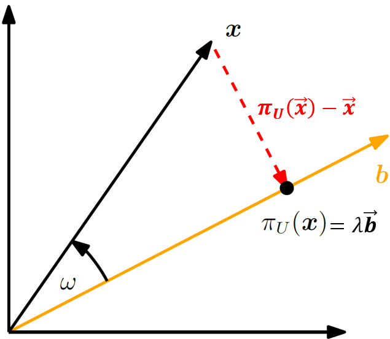
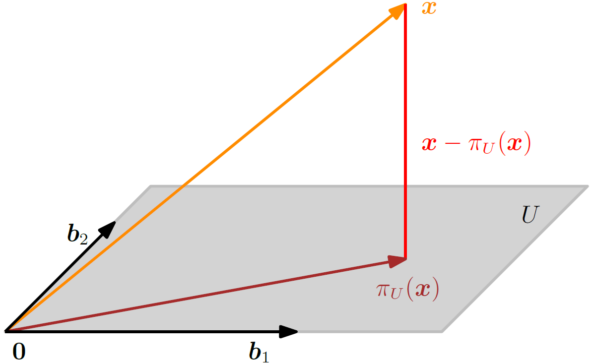
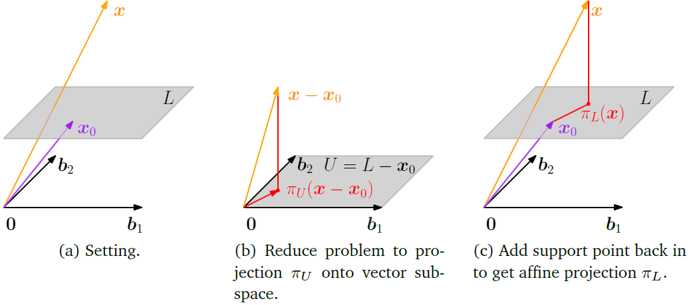
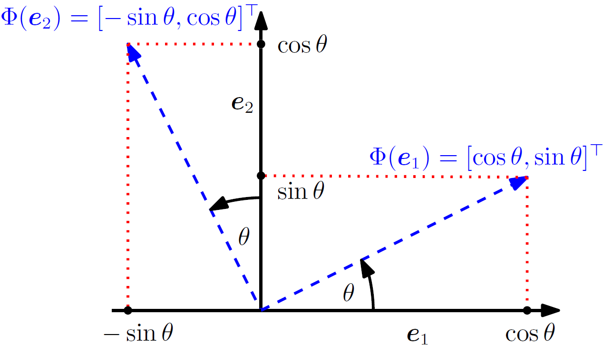

**[Reference]**  
$\bullet$ [MATHEMATICS FOR MACHINE LEARNING](https://mml-book.github.io/)
{: .notice--success}

# Introduction 

We will add some geometric interpretation and intuition to concenpts of vectors, vector spaces, and linear mappings. 
To look at geometric vectors and compute their lengths and distances or angles between two vectors, we need to equip the vector space with an inner product that induces the geometry of the vector space. 

- Inner product and their corresponding norms and metrics
    

    Similarity and distances for support vector machine in Ch.12
    

- Lengths and angles between vectors
    

    Orthogonal projections for principal component analysis in Ch.10 
    Regression via maximum likelihood estimation in Ch.9
    



# 5. Orthonormal Basis

We will discuss the special case where the basis vectors are orthogonal to each other and where the length of each basis vector is 1.
This basis is called **_orthonormal basis_**.


**Definition 3.9 (Orthonormal Basis)** 
Consisder $n$-dimensional vector space $V$ and a basis $\{ \vec{b}_1, \dots, \vec{b}_n \}$ of V.
If

$$<\vec{b}_i, \vec{b}_j> = 0 \text{ for } i \neq j \tag{5.1}$$

for all $i,j=1. \dot, n$ then the basis is called an **_orthogonal basis_**.

Additionally, 

$$<\vec{b}_i, \vec{b}_i> = 1 \tag{5.2}$$

is satisfied, the basis is called an **_orthonormal basis_** (ONB).

From unorthogonal basis, we can struct orthogonal basis by **_Gram-Schmidt process_**.



# 6. Orthogonal Complement

Consider a $D$-dimensional vector space $V$ and an $M$-dimensional subspace $U \subseteq V$.

Then orthogonal complement of subspace $U$, $U^{\top}$, is defined as
- $(D-M)$-dimensional subspace of $V$
- Contains all vectors in $V$ that are orthogonal to every vector in $U$

Furthermore, $U \cap U^{\top} = \{ \vec{0} \}$ so that any vector $\vec{x} \in V$ can be uniquely decomposed into 

$$\vec{x} = \sum_{m=1}^{M} \lambda_m \vec{b}_m + \sum_{j=1}^{D-M} \psi_j \vec{b}_j^{\perp}, \quad \lambda_m, \psi_j \in \mathbb{R}, \tag{5.3}$$

where $$(\vec{b}_1, \dots, \vec{b}_M)$$ in a basis of $U$ and $$(\vec{b}_1^{\top}, \dots, \vec{b}^{\top}_{D-M})$$ is a basis of $U^{\top}$.

For a linear mapping represented by a matrix $A \in \mathbb{R}^{n \times n}$, the soluiton of $A \vec{x} = \vec{0}$ is row$(A)^{\perp}$.

row$(A)^{\perp}$: row space of $A$

In other words, row$(A)^{\perp}$ = ker$(A)$.


# 7. Inner Product of Functions

We will look at inner products of functions. 
The inner products we discussed so far were defined for vectors with a finite number of entreis. 
We can think of a vector $\vec{x} \in \mathbb{R}^n$ as a function with $n$ function values.
The concept of an inner product can be generalized to continuous-valued functions.

An inner product of two functions $u: \mathbb{R} \rightarrow \mathbb{R}$ and $v: \mathbb{R} \rightarrow \mathbb{R}$ can be defined as the definite integral

$$\langle u, v \rangle := \int_{a}^{b} u(x)v(x)dx, \quad a,b \lt \infty \tag{7.1}$$

As with our usual inner product, if it evaluates to 0, the functions $u$ and $v$ are orthogonal.


The collection of functions 

$$\{ 1, \cos(x), \cos(2x), \cos(3x), \dots \} \tag{7.2}$$

is orthogonal if we integrate from $-\pi$ to $\pi$.

If any pair of functions are orthogonal to each other

The collection of functions in (7.2) spans a large subspace of the functions that are even and periodic on $[-\pi, \pi)$, and projecting functions onto this subspace is the fundamental idea behind Fourier series.



# 8. Orthogonal Projections

In machine learning, we often deal with high-dimensional data.

High-dimensional data is often hard to analyze or visualize

However, they often possesses the property that only a few dimensions contain most information, and most other dimensions are not essential for key propoerties of the data.
When we compress high-demensional data, we will lose information.

To minimize compression loss, we ideally find the most informative dimensions in the data

We can project the high-dimensional data onto a lower-dimensional feature space and work in lower-dimensional space to learn more about the dataset and extract relevant patterns.

Ex. Machine learning - PCA(principal component analysis), Deep learning

For a given lower-dimensinoal subspace, orthogonal projections of high-dimensional data are most effective for minimization of the difference/error between the original data.
Let's see what a projection actually is first.


**Definition 3.10 (projection)** 
Let $V$ be a vector space and $U \subseteq V$ a subspace of $V$.
A linear maapping $\pi: V \rightarrow U$ is called a **_projection_** if $\pi^2 = \pi \circ \pi = \pi$.

The key condition for this transformation to be called a projection is that the result of applying it twice is the same as applying it once.

Since linear mappings can be expressed by transformation matrices, projection also can be expressed as matrices, $P_\pi$.

$P_{\pi}^2 = P_{\pi}$



In the following, we will derive orthogonal projections of vectors in the inner product space $(\mathbb{R}^n, \langle \cdot, \cdot \rangle)$ onto subspaces.
We assume the dot product $\langle \vec{x}, \vec{y} \rangle = \vec{x}^{\top}\vec{y}$ as the inner product.

## 8-1) Projection onto One-Dimensional Subspaces (Lines)
Assume we are given a line (one-dimensional subspace) through the origin with basis vector $\vec{b} \in \mathbb{R}^n$.

$U \subseteq \mathbb{R}^n$ spanned by $\vec{b}$

When we project $\vec{x} \in \mathbb{R}^n$ onto $U$, we seek the vector $\pi_U (\vec{x}) \in U$ that is closest to $\vec{x}$.

<figure style="display: flex; flex-direction: column; align-items: center; margin-top: 0.5em; margin-bottom: 0.5em;">
  
   <figcaption style="font-size: 20px; margin-top: -0.5em;">
   Fig.8.1 Projection of $\vec{x} \in \mathbb{R}^2$ onto a subspace $U$ with basis vector $\vec{b}$.
   </figcaption>
</figure> 


1.Since projection $\pi_U (\vec{x})$ is closest to $\vec{x}$, the distance $\Vert \vec{x} - \pi_U(\vec{x}) \Vert$ should be minimum.

$\pi_U (\vec{x}) - \vec{x}$ is orthogonal to $U$, and therefore the basis vector $\vec{b}$

$$\langle \pi_U(\vec{x}-\vec{x}, \vec{b}) \rangle = 0$$

2.The projection $\pi_U (\vec{x})$ of $\vec{x}$ onto $U$ must be an element of $U$.
    
$$\pi_U (\vec{x}) = \lambda \vec{b}$$

3.Finding coordinate $\lambda$

$$\langle \vec{x} - \pi_U(\vec{x}), \vec{b} \rangle = 0 \stackrel{\pi_U(\vec{x})=\lambda \vec{b}}{\Longleftrightarrow} \langle \vec{x} - \lambda \vec{b}, \vec{b} \rangle = 0 \tag{8.1}$$

$$\langle \vec{x}, \vec{b} \rangle - \lambda \langle \vec{b}, \vec{b} \rangle = 0 \Longleftrightarrow \lambda = \frac{\langle \vec{x}, \vec{b} \rangle}{\langle \vec{b}, \vec{b} \rangle} = \frac{\langle \vec{b}, \vec{x} \rangle}{\Vert \vec{b}\Vert^2} = \frac{\vec{b}^\top \vec{x}}{\vec{b}^\top \vec{b}} = \frac{\vec{b}^\top \vec{x}}{\Vert \vec{b}\Vert^2} \tag{8.2}$$

4.Finding the projection point $\pi_U (\vec{x}) \in U$ and the projection matrix $P_{\pi}$.

$$\pi_U(\vec{x}) = \lambda \vec{b} = \vec{b} \lambda = \vec{b} \frac{\vec{b}^\top \vec{x}}{\|\vec{b}\|^2} = \frac{\vec{b}\vec{b}^\top}{\vert \vec{b}\vert^2} \vec{x} \tag{8.3}$$

$$P_{\pi} = \frac{\vec{b}\vec{b}^\top}{\vert\vec{b}\vert^2} \tag{8.4}$$

Note that $\vec{b}\vec{b}^{\top}$ (and, consequently, $P_{\pi}$) is a symmetric matrix of rank 1, and $\Vert \vec{b} \Vert^2 = \langle \vec{b}, \vec{b} \rangle$ is a scalar.



If we use the dot product as an inner product, we get

$$\Vert \pi_U(\vec{x}) \Vert \stackrel{(\pi_U(\vec{x}) = \frac{\vec{b}\vec{b}^\top}{\vert \vec{b}\vert^2} \vec{x})}{=} \frac{|\vec{b}^\top \vec{x}|}{\Vert\vec{b}\Vert^2} \Vert\vec{b}\Vert \stackrel{(\cos \omega = \frac{<\vec{x}, \vec{y}>}{\Vert \vec{x} \Vert \Vert \vec{y} \Vert})}{=} \vert \cos\omega \vert \Vert\vec{x}\Vert \Vert\vec{b}\Vert \frac{\Vert\vec{b}\Vert}{\Vert\vec{b}\Vert^2} = |\cos\omega| \Vert\vec{x}\Vert $$



## 8-2) Projection onto General Subspaces
We will look at orthogonal projections of vectors $\vec{x} \in \mathbb{R}^n$ onto lower-dimensional subspaces $U \subseteq \mathbb{R}^n$ with dim$(U) = m \ge 1$.

<figure style="display: flex; flex-direction: column; align-items: center; margin-top: 0.5em; margin-bottom: 0.5em;">
  
   <figcaption style="font-size: 20px; margin-top: -0.5em;">
   Fig.8.2 Projection onto a two-dimensional subspace $U$ with basis $\vec{b}_1, \vec{b}_2$. The projection $\pi_U(\vec{x})$ of $\vec{x} \in \mathbb{R}^3$ onto $U$ can be expressed as a linear combination of $\vec{b}_1, \vec{b}_2$ and the displacement vector $\vec{x} - \pi_U(\vec{x})$ is orthogonal to both $\vec{b}_1$ and $\vec{b}_2$.
   </figcaption>
</figure> 

Assume that $(\vec{b}_1, \dots, \vec{b}_m)$ is an ordered basis of $U$.

Any projection $\pi_U (\vec{x})$ onto $U$ is an element of $U$: $\pi_U (\vec{x}) = \sum_{i=1}^{m} \lambda_i \vec{b}_i$


1.Find the coordinates $\lambda_1, \dots, \lambda_m$ of the projection.

$$\pi_U(\vec{x}) = \sum_{i=1}^{m} \lambda_i \vec{b}_i = B\vec{\lambda}, \tag{8.5}$$ 

$$B = [\vec{b}_1, \dots, \vec{b}_m] \in \mathbb{R}^{n \times m}, \quad \vec{\lambda} = [\lambda_1, \dots, \lambda_m]^\top \in \mathbb{R}^m, \tag{8.6}$$

2.Minimum condition
To make projected vector closest to $\vec{x} \in \mathbb{R}^n$, distance between $\vec{x}$ and projected vector $\pi_U(\vec{x})$ should be minimum. 

It implies that the vector connecting $\pi_U (\vec{x}) \in U$ and $x \in \mathbb{R}^n$ must be orthogonal to all basis vectors of $U$

$$\begin{align}
    \langle \vec{b}_1, \vec{x} - \pi_U(\vec{x}) \rangle &= \vec{b}_1^\top(\vec{x} - \pi_U(\vec{x})) = 0 \tag{8.7} \\
    &\vdots \nonumber \\
    \langle \vec{b}_m, \vec{x} - \pi_U(\vec{x}) \rangle &= \vec{b}_m^\top(\vec{x} - \pi_U(\vec{x})) = 0 \tag{8.8}
\end{align}$$

which, with $\pi_U (\vec{x}) = B\lambda$, can be written as

$$\begin{gather*}
\vec{b}_1^\top(\vec{x} - B\vec{\lambda}) = 0 \tag{8.9}\\
\vdots \\
\vec{b}_m^\top(\vec{x} - B\vec{\lambda}) = 0 \tag{8.10}
\end{gather*}$$

and

$$\begin{align}
\begin{bmatrix} \vec{b}_1^\top \\ \vdots \\ \vec{b}_m^\top \end{bmatrix}
[\vec{x} - B\vec{\lambda}] = \vec{0}
&\Longleftrightarrow B^\top(\vec{x} - B\vec{\lambda}) = \vec{0} \tag{8.11} \\
&\Longleftrightarrow B^\top B \vec{\lambda} = B^\top \vec{x}. \tag{8.12}
\end{align}$$

The last expression is called **_normal equation_**.
Since $\vec{b}_1, \dots, \vec{b}_m$ are a basis of $U$ and, therefore, linearly independent, $B^{\top}B \in \mathbb{R}^{m \times m}$ is regular and can be inverted.
So, we can write

$$\vec{\lambda} = (B^\top B)^{-1} B^\top \vec{x}. \tag{8.13}$$

The matrix $(B^\top B)^{-1} B^\top$ is called the **_pseudo-inverse_** of $B$, which can be computed for non-square matrices $B$.

It requires that full rank of $B$

3.Find the projection $\pi_U (\vec{x}) \in U$.

$$\pi_U(\vec{x}) = B\lambda = B(B^\top B)^{-1} B^\top \vec{x}. \tag{8.14}$$

4.Find the projection matrix $P_{\pi}$ from $\pi_U (\vec{x}) = P_{\pi} \vec{x}$.

$$P_{\pi} = B(B^\top B)^{-1} B^\top. \tag{8.15}$$



There is a special case where we can calculate the projection vector more easily.
In general, the projection vector is calculated as:

$$\pi_U(\vec{x}) = B\lambda = B(B^\top B)^{-1} B^\top \vec{x}$$

The difficulty with this equation is that we need to compute the inverse of $B^{\top}B$, where $B$ is the basis matrix of $U$.
However, if we choose an orthonormal basis (ONB) for $U$, the calculation simplifies significantly since $B^{\top}B＝I$.
In this case, the projection equation simplifies to:

$$\pi_U(\vec{x}) = BB^\top\vec{x} \tag{8.16}$$

i.e.,

$$\lambda = B^{\top}\vec{x} \tag{8.17}$$

This means that we no longer have to compute the inverse of $B^{\top}B$.


## 8-3) Gram-Schmidt Orthogonalization
The Gram-Schmidt method allows us to transform any basis $(\vec{b}_1, \dots, \vec{b}_n)$ of an $n$-dimensional vector space $V$ into an orthogonal/orthonormal basis $(\vec{u}_1, \dots, \vec{u}_n)$ of $V$.

It always exists and span$[\vec{b}_1, \dots, \vec{b}_n]$ = span$[\vec{u}_1, \dots, \vec{u}_n]$

It iteratively constructs an orthogonal basis $(\vec{u}_1, \dots, \vec{u}_n)$ from any basis $(\vec{b}_1, \dots, \vec{b}_n)$ of V as follows:

$$\begin{align}
\vec{u}_1 &:= \vec{b}_1 \tag{8.18} \\
\vec{u}_k &:= \vec{b}_k - \pi_{\text{span}[\vec{u}_1, \dots, \vec{u}_{k-1}]}(\vec{b}_k), \quad k=2, \dots, n. \tag{8.19}
\end{align}$$

Repeating this procedure for all $n$ basis vectors $\vec{b}_1, \dots, \vec{b}_n$ yields an orthogonal basis $(\vec{u}_1, \dots, \vec{u}_n)$ of V.
If we normalize the $\vec{u}_k$, we obtain an ONB.

## 8-4) Projection onto Affine Subspaces
We will look at a projecting a vector onto an affine subspace.

<figure style="display: flex; flex-direction: column; align-items: center; margin-top: 0.5em; margin-bottom: 0.5em;">
  
   <figcaption style="font-size: 20px; margin-top: -0.5em;">
   Fig.8.3. Projection onto an affine space. (a) original setting; (b) etting shifted by $-\vec{x}_0$ so that $\vec{x} - \vec{x}_0$ can be projected onto the direction space $U$; (c) projection is translated back to $\vec{x}_0 + \pi_U(\vec{x}-\vec{x}_0)$, which gives the final orthogonal projection $\pi_L(\vec{x})$.
   </figcaption>
</figure> 

We are given an affine space $L=\vec{x}_0 + U$, where $\vec{b}_1, \vec{b}_2$ are basis vectors of $U$.
To determine the orthogonal projection $\pi_L (\vec{x})$ of $\vec{x}$ onto L, we transform the problem into that we know the solution.

The projection onto a vector subspace


1.Subtract the support point $\vec{x}_0$ from $\vec{x}$ and from $L$.

$L-\vec{x}_0 = U$ is exactly the vector subspace $U$

Now we can use the orthogonal projections onto a subspace.

Obtaine the projection $\pi_U(\vec{x} - \vec{x}_0)$, (Fig.8.3.(b))

2.Back translate into $L$ by adding $\vec{x}_0$.
We obtain the orthogonal projection onto an affine space $L$

$$\pi_L(\vec{x}) = \vec{x}_0 + \pi_U(\vec{x} - \vec{x}_0), \tag{8.20}$$



# 9. Rotations

Length and angle preservation are the two characteristics of linear mappings with orthogonal transformation matrices.
We will look at specific orthogonal transformation matrices describing rotations.

A **_rotation_** is a linear mapping that rotates a plane by an angle $\theta$ about the fixed origin.

## 9-1) Rotations in $\mathbb{R}^2$
Consider the standard basis $$\left\{ \vec{e}_1 = \begin{bmatrix} 1 \\ 0 \end{bmatrix}, \vec{e}_2 = \begin{bmatrix} 0 \\ 1 \end{bmatrix} \right\}$$ of $\mathbb{R}^2$.

<figure style="display: flex; flex-direction: column; align-items: center; margin-top: 0.5em; margin-bottom: 0.5em;">
  
   <figcaption style="font-size: 20px; margin-top: -0.5em;">
   Fig.8.4. Rotation of the standard basis in $\mathbb{R}^2$ by an angle $\theta$.
   </figcaption>
</figure> 

We aim to rotate this coordinate system by an angle $\theta$ as in Fig.8.4.
Rotations $\Phi$ are linear mappings so that we can express them by a **_rotation matrix_** $R(\theta)$.
As illustrated in Fig.8.4, we obtain, 

$$\Phi(\vec{e}_1) = \begin{bmatrix} \cos\theta \\ \sin\theta \end{bmatrix}, \quad \Phi(\vec{e}_2) = \begin{bmatrix} -\sin\theta \\ \cos\theta \end{bmatrix}. \tag{9.1}$$

Therefore, the rotation matrix that performs the basis change into the rotated coordinates $R(\theta)$ is given as 

$$R(\theta) = \begin{bmatrix} \Phi(\vec{e}_1) & \Phi(\vec{e}_2) \end{bmatrix} = \begin{bmatrix} \cos\theta & -\sin\theta \\ \sin\theta & \cos\theta \end{bmatrix}. \tag{9.2}$$

