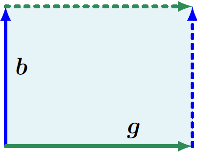
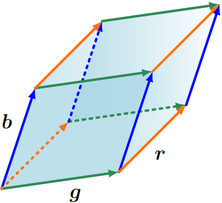

**[Reference]**  
$\bullet$ [MATHEMATICS FOR MACHINE LEARNING](https://mml-book.github.io/)
{: .notice--success}

# Introduction 

In this chapter, three aspects of matrices will be presented:

- How to summarize matrices
- How matrices can be decomposed
- How these decomposition can be used for matrix approximation



# 1.Determinant and Trace

A **_determinant_** is a mathematical object in the analysis and solution of systems of linear equations.
Determinants are only defined for square matrices $A \in \mathbb{R}^{n \times n}$.

$$\det(\mathbf{A}) = \begin{vmatrix} 
a_{11} & a_{12} & \dots & a_{1n} \\ 
a_{21} & a_{22} & \dots & a_{2n} \\ 
\vdots & \vdots & \ddots & \vdots \\ 
a_{n1} & a_{n2} & \dots & a_{nn} 
\end{vmatrix} \tag{1.1}$$

The determinant of a square matrix $A \in \mathbb{R}^{n \times n}$ is a function that maps $A$ onto a real number.


**Theorem 4.1** 
Let a square matrix $A \in \mathbb{R}^{n \times n}$, then

$$A \text{ is invertible.} \leftrightarrow \text{det}(A) \neq 0. \tag{1.2}$$

Let a square matrix $T \in \mathbb{R}^{n \times n}$ an upper-triangular matrix. Then, 

$$\det(\mathbf{T}) = \prod_{i=1}^{n} T_{ii}. \tag{1.3}$$




**Determinants as Measures of Volume** 
Determinant can be considered as a mapping from a set of $n$ vectors spanning an object in $\mathbb{R}^n$.
The determinant $\det(A)$ is the signed volume of an $n$-dimensional parallelepiped formed by columns of the matrix $A$.

<figure style="display: flex; flex-direction: column; align-items: center; margin-top: 0.5em; margin-bottom: 0.5em;">
  
   <figcaption style="font-size: 20px; margin-top: -0.5em;">
   Fig.1.1. The area of the parallelogram (shaded region) spanned by the vectors b and g is $\vert \det([\vec{b}, \vec{g}]) \vert$.
   </figcaption>
</figure> 

<figure style="display: flex; flex-direction: column; align-items: center; margin-top: 0.5em; margin-bottom: 0.5em;">
  
   <figcaption style="font-size: 20px; margin-top: -0.5em;">
   Fig.1.2. The volume of the parallelepiped (shaded volume) spanned by vectors $\vec{r}, \vec{b}, \vec{g}$ is $\vert \det([\vec{r}, \vec{b}, \vec{g}]) \vert$.
   </figcaption>
</figure> 


Computing the determinant of an $n \times n$ matrix for $n \gt 3$ requires a general algorithm.
Theorem 4.2 below reduces the problem of computing the determinant of an $n \times n$ matrix to computing the determinant of $(n-1) \times (n-1)$ matrices.
By recursively applying this theorem, we can compute determinants of $n \times n$ by computing determinants of $2 \times 2$ matrices.


**Theorem 4.2 (Laplace Expansion)** 
Consisder a matrix $A \in \mathbb{R}^{n \times n}$. For all $j=1,\dots, n$:

1. Expansion along column $j$

$$\det(\mathbf{A}) = \sum_{k=1}^{n} \underbrace{(-1)^{k+j} a_{kj} \underbrace{\det(\mathbf{A}_{k,j})}_{\text{minor}}}_{\text{cofactor}}. \tag{1.4}$$

2. Expansion along row $j$

$$\det(\mathbf{A}) = \sum_{k=1}^{n} \underbrace{(-1)^{k+j} a_{jk} \underbrace{\det(\mathbf{A}_{j,k})}_{\text{minor}}}_{\text{cofactor}}. \tag{1.5}$$

Here, $A_{k,j} \in \mathbb{R}^{(n-1) \times (n-1)}$: the submatrix of $A$ that we obtain when deleting row $k$ and column $j$. 



**Properties of determinant** 
For $A \in \mathbb{R}^{n \times n}$ the determinant exhibits the following properties:

- The determinant of a matrix product is the product of the corresponding determinants, $\det(AB) = \det(A)\det(B)$.
- Determinants are invariant to transposition, i.e., $\det(A) = \det(A^\top)$.
- If $A$ is regular (invertible), then $\det(A^{-1}) = \frac{1}{\det(A)}$.
- Similar matrices (Definition 2.22) possess the same determinant. Therefore, for a linear mapping $\Phi : V \to V$ all transformation matrices $A_\Phi$ of $\Phi$ have the same determinant. Thus, the determinant is invariant to the choice of basis of a linear mapping.
- Adding a multiple of a column/row to another one does not change $\det(A)$.
- Multiplication of a column/row with $\lambda \in \mathbb{R}$ scales $\det(A)$ by $\lambda$. In particular, $\det(\lambda A) = \lambda^n \det(A)$.
- Swapping two rows/columns changes the sign of $\det(A)$.

Because of the last three propoerties, we can use Gaussian elimination to compute $\det(A)$ by bringing $A$ into row-echelon form.



**Theorem 4.3** 
Let square matrix $A \in \mathbb{R}^{n \times n}$. Then, 

$$\det(A) \neq 0 \leftrightarrow \text{rk}(A)=n \tag{1.6}$$ 




**Definition 4.4 (Trace)** 
The **_trace_** of a square matrix $A \in \mathbb{R}^{n \times n}$ is defined as

$$\text{tr}(\mathbf{A}) := \sum_{i=1}^{n} a_{ii}, \tag{1.7}$$

The properties of trace:

- $\text{tr}(\mathbf{A} + \mathbf{B}) = \text{tr}(\mathbf{A}) + \text{tr}(\mathbf{B})$ for $\mathbf{A}, \mathbf{B} \in \mathbb{R}^{n \times n}$ 
- $\text{tr}(\alpha\mathbf{A}) = \alpha\text{tr}(\mathbf{A})$, $\alpha \in \mathbb{R}$ for $\mathbf{A} \in \mathbb{R}^{n \times n}$ 
- $\text{tr}(\mathbf{I}_n) = n$
- $\text{tr}(\mathbf{A}\mathbf{B}) = \text{tr}(\mathbf{B}\mathbf{A})$ for $\mathbf{A} \in \mathbb{R}^{n \times k}, \mathbf{B} \in \mathbb{R}^{k \times n}$

- For $A \in \mathbb{R}^{\alpha \times k}$, $K \in \mathbb{R}^{k \times l}$, $L \in \mathbb{R}^{l \times \alpha}$, $\text{tr}(AKL) = \text{tr}(KLA)$ $\quad (1.8)$
    - As a speical case of (1.8), for two vectors $\vec{x}, \vec{y} \in \mathbb{R}^{n}$, 

    $$\text{tr}(\vec{x}\vec{y}^\top) = \text{tr}(\vec{y}^\top\vec{x}) = \vec{y}^\top\vec{x} \in \mathbb{R}. \tag{1.9}$$

- Assume that a linear mapping $\phi: V \rightarrow V$, where $V$ is a vector space. For a two different basis of V, $A$ and $B$, 

$$\text{tr}(A) = \text{tr}(B) \tag{1.10}$$

The trace of a linear mapping is independent of the basis!




**Definition 4.5 (Characteristic Polynomial)** 
Let $\lambda \in \mathbb{R}$ and a square matrix $A \in \mathbb{R}^{n \times n}$. 

$$\begin{align}
p_{A}(\lambda) :&= \det(A - \lambda\mathbf{I}) \tag{1.11a} \\
&= c_0 + c_1\lambda + c_2\lambda^2 + \dots + c_{n-1}\lambda^{n-1} + (-1)^n\lambda^n, \tag{1.11b}
\end{align}$$

$c_0, \dots, c_{n-1} \in \mathbb{R}$, is the **_characteristic polynomial_** of $A$. 

In particular, 

$$\begin{align}
c_0 &= \det(A), \tag{1.12} \\
c_{n-1} &= (-1)^{n-1}\text{tr}(A). \tag{1.13}
\end{align}$$




# 2.Eigenvalues and Eigenvectors

We will look at a new way to characterize a matrix and its associated linear mapping.
We can interpret linear mappings and their associated transformation matrices by performing an "eigen" analysis.


**Definition 4.6** 
Let $\mathbf{A} \in \mathbb{R}^{n \times n}$ be a square matrix. 
Then, $\lambda \in \mathbb{R}$ is an **_eigenvalue_** of $\mathbf{A}$ and $$\vec{x} \in \mathbb{R}^n \text{\\} \{\vec{0}\}$$ is the corresponding **_eigenvector_** of $\mathbf{A}$ if 

$$\mathbf{A}\vec{x} = \lambda \vec{x}. \tag{2.1}$$

The **_eigenvalue equation_**

$\lambda \in \mathbb{R}$ is an _eigenvalue_ of $\mathbf{A} \in \mathbb{R}^{n \times n}$ if and only if $\lambda$ is a root of the _characteristic polynomial_ $p_{\mathbf{A}}(\lambda)$ of $\mathbf{A}$ (Theorem 4.8).

Let a square matrix $\mathbf{A}$ have an eigenvalue $\lambda_i$. 
- The **_algebraic multiplicity_** of $\lambda_i$ is the number of times the root appears in the characteristic polynomial (**Definition 4.9**).
- The **_geometric multiplicity_** of $\lambda_i$ is the number of linearly independent eigenvectors associated with $\lambda_i$ (**Definition 4.11**).
    

    The dimensionality of the eigenspace spanned by the eigenvectors associated with $\lambda_i$.
    

An eigenvalue's geometric multiplicity cannot exceed its algebraic multiplicity, but it may be lower.

(geometric multiplicity) $\le$ (algebraic multiplicity)

The _eigenvectors_ $$\vec{x}_1, \dots, \vec{x}_n$$ of a matrix $\mathbf{A} \in \mathbb{R}^{n \times n}$ with $n$ distinct _eigenvalues_ $\lambda_1, \dots, \lambda_n$ are **_linearly independent_** (**Theorem 4.12**).

The determinant of a matrix $\mathbf{A} \in \mathbb{R}^{n \times n}$ is the product of its eigenvalues (**Theorem 4.16**). 

$$\det(\mathbf{A}) = \prod_{i=1}^{n} \lambda_i \quad (2.2)$$ where $\lambda_i \in \mathbb{C}$ are (possibly repeated) eigenvalues of $\mathbf{A}$.

The trace of a matrix $\mathbf{A} \in \mathbb{R}^{n \times n}$ is the sum of its eigenvalues (**Theorem 4.17**). 

$$\text{tr}(\mathbf{A}) = \sum_{i=1}^{n} \lambda_i \quad (2.3)$$ where $\lambda_i \in \mathbb{C}$ are (possibly repeated) eigenvalues of $\mathbf{A}$.

 

The following statements are equivalent:
- $\lambda$ is an eigenvalue of $\mathbf{A} \in \mathbb{R}^{n \times n}$. 
- There exists an $$\vec{x} \in \mathbb{R}^n \setminus \{\vec{0}\}$$ with $\mathbf{A}\vec{x} = \lambda\vec{x}$, or equivalently, $(\mathbf{A} - \lambda\mathbf{I}_n)\vec{x} = \mathbf{0}$ can be solved non-trivially, i.e., $\vec{x} \neq \vec{0}$. 
- $\text{rk}(\mathbf{A} - \lambda\mathbf{I}_n) < n$.
    

    For the equation $(\mathbf{A}-\lambda \mathbf{I})\vec{x}=0$ to have a non-zero solution, the column vectors of the $n \times n$ matrix $(\mathbf{A}-\lambda \mathbf{I})\vec{x}=0$ must be linearly dependent.
    

- $\det(\mathbf{A} - \lambda\mathbf{I}_n) = 0$.



- A matrix $\mathbf{A}$ and $\mathbf{A}^\top$ possess the same eigenvalues, but not necessarily the same eigenvectors. 
- The eigenspace $E_\lambda$ is the null space of $\mathbf{A} - \lambda\mathbf{I}$.
$$\begin{align*}
    \mathbf{A}\vec{x} = \lambda\vec{x} &\Longleftrightarrow \mathbf{A}\vec{x} - \lambda\vec{x} = \mathbf{0} \tag{2.4} \\
    &\Longleftrightarrow (\mathbf{A} - \lambda\mathbf{I})\vec{x} = \mathbf{0} \Longleftrightarrow \vec{x} \in \ker(\mathbf{A} - \lambda\mathbf{I}). \tag{2.5}
\end{align*}$$ 
- Similar matrices (see Definition 2.22) possess the same eigenvalues. 
    

    Eigenvalues, determinant and the trace, key characteristic parameters of a linear mapping are all invariant under basis change. 
    

- Symmetric, positive definite matrices always have positive, real eigenvalues.





**Definition 4.7 (Collinearity and Codirection)** 
- **_codirected_**: Two vectors that point in the same direction
- **_collinear_**: Two vectors that point in the same or opposite direction

For the eigenvalue equation with any $$c \in \mathbb{R} \setminus \{0\}$$, it holds that $c\vec{x}$ is an eigenvector of $\mathbf{A}$.

$$\mathbf{A}(c\vec{x}) = c\mathbf{A}\vec{x} = c\lambda\vec{x} = \lambda(c\vec{x}). \tag{2.6}$$

All vectors that are collinear to $\vec{x}$ are also eigenvectors of $\mathbf{A}$




**Definition 4.10 (Eigenspace and Eigenspectrum)** 
For $\mathbf{A} \in \mathbb{R}^{n \times n}$, 

- The **_eigenspace_** of $\mathbf{A}$ with respect to $\lambda$, $E_{\lambda}$
: A subspace of $\mathbb{R}^n$ spanned by the set of all eigenvectors of $\mathbf{A}$ associated with an eigenvalue $\lambda$

- The **_eigenspectrum_**, or just **_spectrum_**, of $\mathbf{A}$
: The set of all eigenvalues of $\mathbf{A}$.

If $\lambda$ is an eigenvalue of $\mathbf{A} \in \mathbb{R}^{n \times n}$, then the corresponding eigenspace $E_{\lambda}$ is the solution space of the homogeneous system of linear equations $(\mathbf{A} - \lambda\mathbf{I})\vec{x} = \vec{0}$. 

Geometrically, the eigenvector corresponding to a nonzero eigenvalue points in a direction that is stretched by the linear mapping. 
The eigenvalue is the factor by which it is stretched. 
If the eigenvalue is negative, the direction of the stretching is flipped.

An eigenvector represents a special direction that is only scaled (stretched or shrunk) by the transformation, without changing its direction.




**Graphical Intuition in Two Dimensions** 
Below figures depict five transformation matrices $\mathbf{A}_1, \dots , \mathbf{A}_5$ and their impact on a square grid of points, centered at the origin:


  {% include start-side-by-side.html
  image_src="../images/2025-09-26-MfML_6/Fig_3.png"
  image_alt=""
  image_width="50%"
  margin_top = "-4em"
  margin_bottom = "-4em"
  %}
  $$\mathbf{A}_1 = \begin{bmatrix} \frac{1}{2} & 0 \\ 0 & 2 \end{bmatrix}$$, eigenvalues: $\lambda_1 = 2$ and $\lambda_2 = \frac{1}{2}$, eigenvectors: $$\begin{bmatrix} 0 \\ 1 \end{bmatrix}_{\lambda_1}$$ and $$\begin{bmatrix} 1 \\ 0 \end{bmatrix}_{\lambda_2}$$  
  This transformation is a non-uniform scaling that compresses by a factor of 0.5 along the x-axis and stretches by a factor of 2 along the y-axis, with no rotation.
  



  {% include start-side-by-side.html
  image_src="../images/2025-09-26-MfML_6/Fig_4.png"
  image_alt=""
  image_width="50%"
  margin_top = "-4em"
  margin_bottom = "-4em"
  %}
  $$\mathbf{A}_2 = \begin{bmatrix} 1 & \frac{1}{2} \\ 0 & 1 \end{bmatrix}$$, eigenvalues: $\lambda_1 = \lambda_2 = 1$, eigenvectors: $$\begin{bmatrix} k \\ 0 \end{bmatrix} \text{ for } k \in \mathbb{R}$$  
  The transformation $\mathbf{A}_2$ first identifies the x-axis as a fixed line that does not change (due to its eigenvectors and the eigenvalue $\lambda=1$), and then slides all other points parallel to this line. The sliding distance is determined by how far each point is from the fixed line (its y-coordinate), which is dictated by the $\frac{1}{2}$ value in the matrix.
  



  {% include start-side-by-side.html
  image_src="../images/2025-09-26-MfML_6/Fig_5.png"
  image_alt=""
  image_width="50%"
  margin_top = "-4em"
  margin_bottom = "-4em"
  %}
  $$\mathbf{A}_3 = \begin{bmatrix} \cos(\frac{\pi}{6}) & -\sin(\frac{\pi}{6}) \\ \sin(\frac{\pi}{6}) & \cos(\frac{\pi}{6}) \end{bmatrix} = \frac{1}{2} \begin{bmatrix} \sqrt{3} & -1 \\ 1 & \sqrt{3} \end{bmatrix}$$,  eigenvalues: $\lambda_1 = \frac{\sqrt{3}}{2} - i\frac{1}{2}$ and $\lambda_2 = \frac{\sqrt{3}}{2} + i\frac{1}{2}$,  eigenvectors: $$\begin{bmatrix} 1 \\ i \end{bmatrix}_{\lambda_1}$$ and $$\begin{bmatrix} 1 \\ -i \end{bmatrix}_{\lambda_2}$$  
  By definition, an eigenvector is a vector whose direction is unchanged by a transformation. However, a 30° rotation changes the direction of every vector. Therefore, no real eigenvectors exist for this transformation.
      



  {% include start-side-by-side.html
  image_src="../images/2025-09-26-MfML_6/Fig_6.png"
  image_alt=""
  image_width="50%"
  margin_top = "-4em"
  margin_bottom = "-4em"
  %}
  $$\mathbf{A}_4 = \begin{bmatrix} 1 & -1 \\ -1 & 1 \end{bmatrix}$$, eigenvalues: $\lambda_1 = 0$ and $\lambda_2 = 2$, eigenvectors: $$\begin{bmatrix} 1 \\ 1 \end{bmatrix}_{\lambda_1}$$ and $$\begin{bmatrix} 1 \\ -1 \end{bmatrix}_{\lambda_2}$$  
  The transformation projects every vector onto its image, the line $y=−x$ (the eigenspace for $\lambda_2=2$), and then stretches it by a factor of 2. The orthogonal direction, the line $y=x$, is the null space (the eigenspace for $\lambda_1=0$), meaning any component along this line is annihilated.
  



  {% include start-side-by-side.html
  image_src="../images/2025-09-26-MfML_6/Fig_7.png"
  image_alt=""
  image_width="50%"
  margin_top = "-4em"
  margin_bottom = "-4em"
  %}
  $$\mathbf{A}_5 = \begin{bmatrix} 1 & \frac{1}{2} \\ \frac{1}{2} & 1 \end{bmatrix}$$, eigenvalues: $\lambda_1 = \frac{1}{2}$ and $\lambda_2 = \frac{3}{2}$, eigenvectors: $$\begin{bmatrix} 1 \\ -1 \end{bmatrix}_{\lambda_1}$$ and $$\begin{bmatrix} 1 \\ 1 \end{bmatrix}_{\lambda_2}$$  
  This transformation is a non-uniform scaling that stretches vectors by a factor of $\frac{3}{2}$ along the $y=x$ axis and compresses them by a factor of $\frac{1}{2}$ along the orthogonal $y=−x$ axis.
  




**Definition 4.13** 
A square matrix $\mathbf{A} \in \mathbb{R}^{n \times n}$ is $\textit{defective}$ if it possesses fewer than $n$ linearly independent eigenvectors.

A non-defective matrix $\mathbf{A} \in \mathbb{R}^{n \times n}$ does not necessarily require $n$ distinct eigenvalues, but it does require that the eigenvectors form a basis of $\mathbb{R}^n$. 
Looking at the eigenspaces of a defective matrix, it follows that the sum of the dimensions of the eigenspaces is less than $n$. 
Specifically, a defective matrix has at least one eigenvalue $\lambda_i$ with an algebraic multiplicity $m > 1$ and a geometric multiplicity of less than $m$.



**Theorem 4.14** 
Given a matrix $\mathbf{A} \in \mathbb{R}^{m \times n}$, 

$$ \mathbf{S} := \mathbf{A}^\top \mathbf{A} \rightarrow \text{Always symmetric, positive semidefinite matrix}. \tag{2.7} $$

If $\text{rk}(\mathbf{A}) = n$, then $\mathbf{S} := \mathbf{A}^\top \mathbf{A}$ is symmetric, positive definite.



**Theorem 4.15 (Spectral Theorem)** 
If $\mathbf{A} \in \mathbb{R}^{n \times n}$ is symmetric, there exists an orthonormal basis of the corresponding vector space $V$ consisting of eigenvectors of $\mathbf{A}$, and each eigenvalue is real.



# 3.Cholesky Decomposition

For symmetric, positive definite matrices, we can choose from a number of square-root equivalent operations. 
The **_Cholesky decomposition_** provides a square-root equivalent operation on symmetric, positive definite matrices.


**Theorem 4.18 (Cholesky decomposition)** 
A _symmetric_, _positive definite matrix_ $\mathbf{A}$ can be factorized into a product $\mathbf{A} = \mathbf{L}\mathbf{L}^{\top}$, where $\mathbf{L}$ is a lower triangular matrix with positive diagonal elements:

$$\begin{bmatrix} 
a_{11} & \dots & a_{1n} \\ 
\vdots & \ddots & \vdots \\ 
a_{n1} & \dots & a_{nn} 
\end{bmatrix} 
= 
\begin{bmatrix} 
l_{11} & \dots & 0 \\ 
\vdots & \ddots & \vdots \\ 
l_{n1} & \dots & l_{nn} 
\end{bmatrix} 
\begin{bmatrix} 
l_{11} & \dots & l_{n1} \\ 
\vdots & \ddots & \vdots \\ 
0 & \dots & l_{nn} 
\end{bmatrix}. \tag{3.1}$$

$\mathbf{L}$ is called **_Cholesky factor_** of $\mathbf{A}$, and it is unique.

The Cholesky decomposition allows us to compute determinants efficiently.

$\det(\mathbf{A}) = \det(\mathbf{L}) \det(\mathbf{L}^\top) = \det(\mathbf{L})^2$ also since $\mathbf{L}$ is a triangular matrix, the determinant is the product of its diagonal elements.
$\rightarrow \det(\mathbf{A}) = \prod_i l_{ii}^2$


