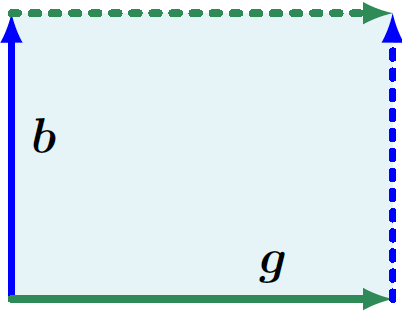
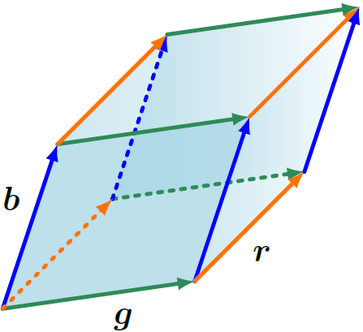

**[Reference]**  
$\bullet$ [MATHEMATICS FOR MACHINE LEARNING](https://mml-book.github.io/)
{: .notice--success}

# Introduction 

In this chapter, three aspects of matrices will be presented:

- How to summarize matrices
- How matrices can be decomposed
- How these decomposition can be used for matrix approximation



# 1.Determinant and Trace

A **_determinant_** is a mathematical object in the analysis and solution of systems of linear equations.
Determinants are only defined for square matrices $A \in \mathbb{R}^{n \times n}$.

$$\det(\mathbf{A}) = \begin{vmatrix} 
a_{11} & a_{12} & \dots & a_{1n} \\ 
a_{21} & a_{22} & \dots & a_{2n} \\ 
\vdots & \vdots & \ddots & \vdots \\ 
a_{n1} & a_{n2} & \dots & a_{nn} 
\end{vmatrix} \tag{1.1}$$

The determinant of a square matrix $A \in \mathbb{R}^{n \times n}$ is a function that maps $A$ onto a real number.


**Theorem 4.1** 
Let a square matrix $A \in \mathbb{R}^{n \times n}$, then

$$A \text{ is invertible.} \leftrightarrow \text{det}(A) \neq 0. \tag{1.2}$$

Let a square matrix $T \in \mathbb{R}^{n \times n}$ an upper-triangular matrix. Then, 

$$\det(\mathbf{T}) = \prod_{i=1}^{n} T_{ii}. \tag{1.3}$$



**Determinants as Measures of Volume** 
Determinant can be considered as a mapping from a set of $n$ vectors spanning an object in $\mathbb{R}^n$.
The determinant $\det(A)$ is the signed volume of an $n$-dimensional parallelepiped formed by columns of the matrix $A$.

<figure style="display: flex; flex-direction: column; align-items: center; margin-top: 0.5em; margin-bottom: 0.5em;">
  
   <figcaption style="font-size: 20px; margin-top: -0.5em;">
   Fig.1.1. The area of the parallelogram (shaded region) spanned by the vectors b and g is $\vert \det([\vec{b}, \vec{g}]) \vert$.
   </figcaption>
</figure> 

<figure style="display: flex; flex-direction: column; align-items: center; margin-top: 0.5em; margin-bottom: 0.5em;">
  
   <figcaption style="font-size: 20px; margin-top: -0.5em;">
   Fig.1.2. The volume of the parallelepiped (shaded volume) spanned by vectors $\vec{r}, \vec{b}, \vec{g}$ is $\vert \det([\vec{r}, \vec{b}, \vec{g}]) \vert$.
   </figcaption>
</figure> 


Computing the determinant of an $n \times n$ matrix for $n \gt 3$ requires a general algorithm.
Theorem 4.2 below reduces the problem of computing the determinant of an $n \times n$ matrix to computing the determinant of $(n-1) \times (n-1)$ matrices.
By recursively applying this theorem, we can compute determinants of $n \times n$ by computing determinants of $2 \times 2$ matrices.


**Theorem 4.2 (Laplace Expansion)** 
Consisder a matrix $A \in \mathbb{R}^{n \times n}$. For all $j=1,\dots, n$:

1. Expansion along column $j$

$$\det(\mathbf{A}) = \sum_{k=1}^{n} \underbrace{(-1)^{k+j} a_{kj} \underbrace{\det(\mathbf{A}_{k,j})}_{\text{minor}}}_{\text{cofactor}}. \tag{1.4}$$

2. Expansion along row $j$

$$\det(\mathbf{A}) = \sum_{k=1}^{n} \underbrace{(-1)^{k+j} a_{jk} \underbrace{\det(\mathbf{A}_{j,k})}_{\text{minor}}}_{\text{cofactor}}. \tag{1.5}$$

Here, $A_{k,j} \in \mathbb{R}^{(n-1) \times (n-1)}$: the submatrix of $A$ that we obtain when deleting row $k$ and column $j$. 



**Properties of determinant** 
For $A \in \mathbb{R}^{n \times n}$ the determinant exhibits the following properties:

- The determinant of a matrix product is the product of the corresponding determinants, $\det(AB) = \det(A)\det(B)$.
- Determinants are invariant to transposition, i.e., $\det(A) = \det(A^\top)$.
- If $A$ is regular (invertible), then $\det(A^{-1}) = \frac{1}{\det(A)}$.
- Similar matrices (Definition 2.22) possess the same determinant. Therefore, for a linear mapping $\Phi : V \to V$ all transformation matrices $A_\Phi$ of $\Phi$ have the same determinant. Thus, the determinant is invariant to the choice of basis of a linear mapping.
- Adding a multiple of a column/row to another one does not change $\det(A)$.
- Multiplication of a column/row with $\lambda \in \mathbb{R}$ scales $\det(A)$ by $\lambda$. In particular, $\det(\lambda A) = \lambda^n \det(A)$.
- Swapping two rows/columns changes the sign of $\det(A)$.

Because of the last three propoerties, we can use Gaussian elimination to compute $\det(A)$ by bringing $A$ into row-echelon form.



**Theorem 4.3** 
Let square matrix $A \in \mathbb{R}^{n \times n}$. Then, 

$$\det(A) \neq 0 \leftrightarrow \text{rk}(A)=n \tag{1.6}$$ 




**Definition 4.4 (Trace)** 
The **_trace_** of a square matrix $A \in \mathbb{R}^{n \times n}$ is defined as

$$\text{tr}(\mathbf{A}) := \sum_{i=1}^{n} a_{ii}, \tag{1.7}$$

The properties of trace:

- $\text{tr}(\mathbf{A} + \mathbf{B}) = \text{tr}(\mathbf{A}) + \text{tr}(\mathbf{B})$ for $\mathbf{A}, \mathbf{B} \in \mathbb{R}^{n \times n}$ 
- $\text{tr}(\alpha\mathbf{A}) = \alpha\text{tr}(\mathbf{A})$, $\alpha \in \mathbb{R}$ for $\mathbf{A} \in \mathbb{R}^{n \times n}$ 
- $\text{tr}(\mathbf{I}_n) = n$
- $\text{tr}(\mathbf{A}\mathbf{B}) = \text{tr}(\mathbf{B}\mathbf{A})$ for $\mathbf{A} \in \mathbb{R}^{n \times k}, \mathbf{B} \in \mathbb{R}^{k \times n}$

- For $A \in \mathbb{R}^{\alpha \times k}$, $K \in \mathbb{R}^{k \times l}$, $L \in \mathbb{R}^{l \times \alpha}$, $\text{tr}(AKL) = \text{tr}(KLA)$ $\quad (1.8)$
    - As a speical case of (1.8), for two vectors $\vec{x}, \vec{y} \in \mathbb{R}^{n}$, 

    $$\text{tr}(\vec{x}\vec{y}^\top) = \text{tr}(\vec{y}^\top\vec{x}) = \vec{y}^\top\vec{x} \in \mathbb{R}. \tag{1.9}$$

- Assume that a linear mapping $\phi: V \rightarrow V$, where $V$ is a vector space. For a two different basis of V, $A$ and $B$, 

$$\text{tr}(A) = \text{tr}(B) \tag{1.10}$$

The trace of a linear mapping is independent of the basis!




**Definition 4.5 (Characteristic Polynomial)** 
Let $\lambda \in \mathbb{R}$ and a square matrix $A \in \mathbb{R}^{n \times n}$. 

$$\begin{align}
p_{A}(\lambda) :&= \det(A - \lambda\mathbf{I}) \tag{1.11a} \\
&= c_0 + c_1\lambda + c_2\lambda^2 + \dots + c_{n-1}\lambda^{n-1} + (-1)^n\lambda^n, \tag{1.11b}
\end{align}$$

$c_0, \dots, c_{n-1} \in \mathbb{R}$, is the **_characteristic polynomial_** of $A$. 

In particular, 

$$\begin{align}
c_0 &= \det(A), \tag{1.12} \\
c_{n-1} &= (-1)^{n-1}\text{tr}(A). \tag{1.13}
\end{align}$$




# 2.Eigenvalues and Eigenvectors





**Definition . ()** 




