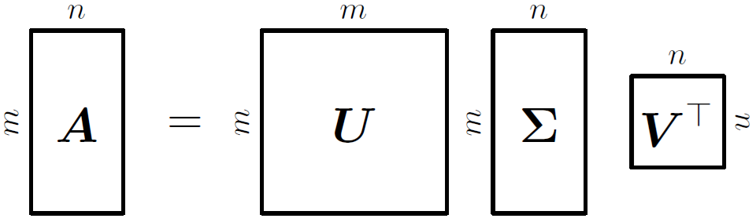

**[Reference]**  
$\bullet$ [MATHEMATICS FOR MACHINE LEARNING](https://mml-book.github.io/)
{: .notice--success}

# Introduction 

In this chapter, three aspects of matrices will be presented:

- How to summarize matrices
- How matrices can be decomposed
- How these decomposition can be used for matrix approximation



# 4.Eigendecomposition and Diagonalization

A diagonal matrix is a matrix that has value zero on all off-diagonal elements:

$$\mathbf{D} = \begin{bmatrix} 
c_1 & \dots & 0 \\ 
\vdots & \ddots & \vdots \\ 
0 & \dots & c_n 
\end{bmatrix} \tag{4.1}$$

A diagonal matrix allow fast computation of determinants, power, and inverses.

- $$\det(\mathbf{D}) = \prod_{i=1}^{n} c_i = c_1 \cdot c_2 \cdots c_n$$
- $$\mathbf{D}^k = \begin{pmatrix} c_1^k & & 0 \\ & \ddots & \\ 0 & & c_n^k \end{pmatrix}$$
- $$\mathbf{D}^{-1} = \begin{pmatrix} c_1^{-1} & & 0 \\ & \ddots & \\ 0 & & c_n^{-1} \end{pmatrix}$$

We will discuss how to transform matrices into diagonal form.


**Definition 4.19 (Diagonalizable)** 
A matrix $\mathbf{A} \in \mathbb{R}^{n \times n}$ is **_diagonalizable_** if there exists an invertible matrix $\mathbf{P} \in \mathbb{R}^{n \times n}$ such that $\mathbf{D} = \mathbf{P}^{-1}\mathbf{A}\mathbf{P}$.

In the following, we will see that diagonalizing a matrix $\mathbf{A} \in \mathbb{R}^{n \times n}$ is a way of expressing the same linear mapping but in another basis - egenvectors of $\mathbf{A}$.

Let $$\begin{align} &\mathbf{A} \in \mathbb{R}^{n \times n} \\ &\lambda_1, \dots, \lambda_n: \text{a set of scalars} \\ &p_1, \dots, p_n: \text{a set of vectors in $\mathbb{R}^n$} \end{align}$$ and $$\begin{align} &P := [p_1, \dots, p_n] \\ &\mathbf{D} \in \mathbb{R}^{n \times n}: \text{a diagonal matrix with diagonal entries $\lambda_1, \dots, \lambda_n$}  \end{align}$$.

If $\lambda_1, \dots, \lambda_n$ are the eigenvalues of $\mathbf{A}$, and $p_1, \dots, p_n$ are corresponding eigenvectors of $\mathbf{A}$, we can show that 

$$\mathbf{A}\mathbf{P} = \mathbf{P}\mathbf{D} \tag{4.2}$$

Because, 

$$\begin{align}
\mathbf{A}\mathbf{P} &= \mathbf{A}[\vec{p}_1, \dots, \vec{p}_n] = [\mathbf{A}\vec{p}_1, \dots, \mathbf{A}\vec{p}_n], \tag{4.3} \\
\mathbf{P}\mathbf{D} &= [\vec{p}_1, \dots, \vec{p}_n] \begin{bmatrix} \lambda_1 & & 0 \\ & \ddots & \\ 0 & & \lambda_n \end{bmatrix} = [\lambda_1\vec{p}_1, \dots, \lambda_n\vec{p}_n]. \tag{4.4}
\end{align}$$

and it implies that 

$$\begin{align}
    \mathbf{A}\vec{p}_1 &= \lambda_1\vec{p}_1 \tag{4.5} \\
    &\vdots \nonumber \\
    \mathbf{A}\vec{p}_n &= \lambda_n\vec{p}_n. \tag{4.6}
\end{align}$$

Therefore, the columns of $\mathbf{P}$ must be eigenvectors of $\mathbf{A}$.

Our definition of diagonalization ($\mathbf{D} = \mathbf{P}^{-1}\mathbf{A}\mathbf{P}$) requires that $\mathbf{P} \in \mathbb{R}^{n \times n}$.

$\mathbf{P}$ has full rank. $\rightarrow$ $\mathbf{A}$ has $n$ linearly independent eigenvectors $p_1, \dots, p_n$ and they form a basis of $\mathbb{R}^n$.


By using properties of diagonal matrices $\mathbf{D}$, we can easily compute various form of $\mathbf{A}$.

- $\mathbf{A}^k = (\mathbf{P}\mathbf{D}\mathbf{P}^{-1})^k = \mathbf{P}\mathbf{D}^k\mathbf{P}^{-1} \quad (4.7)$
- $\det(\mathbf{A}) = \det(\mathbf{P}\mathbf{D}\mathbf{P}^{-1}) = \det(\mathbf{P})\det(\mathbf{D})\det(\mathbf{P}^{-1}) = \det(\mathbf{D}) = \prod_i d_{ii} \quad (4.8)$




**Theorem 4.20 (Eigendecomposition)** 
A square matrix $\mathbf{A} \in \mathbb{R}^{n \times n}$ can be factored into

$$\mathbf{A} = \mathbf{P}\mathbf{D}\mathbf{P}^{-1} \tag{4.9},$$

where the matrix $\mathbf{P}$ is the matrix whose columns are $n$ linearly independent eigenvectors of $\mathbf{A}$, and $\mathbf{D}$ is the diagonal matrix whose diagonal entries are the corresponding eigenvalues of $\mathbf{A}$.

A matrix $\mathbf{A}$ is diagonalizable if and only if it has $n$ linearly independent eigenvectors. 
More specifically, only non-defective matrices can be diagonalized.




**Theorem 4.21** 
A _symmetric matrix_ $\mathbf{S} \in \mathbb{R}^{n \times n}$ can always be diagonalized.

This statemnet follows directly from the spectral theorem (4.15). 
Moreover, the spectral theorem states that we can find an ONB of eigenvectors of $\mathbb{R}^n$. 
This makes $\mathbf{P}$ an orthogonal matrix so that $\mathbf{D} = \mathbf{P}^\top \mathbf{A} \mathbf{P}$.

A symmetric matrix is always orthogonally diagonalizable.




**Geometric Intuition for the Eigendecomposition** 
We can interpret the eigendecomposition of a matrix as follows:


  {% include start-side-by-side.html
  image_src="../images/2025-10-01-MfML_7/Fig_1.png"
  image_alt="Fig.4.1. Geometric intuition for the eigendecomposition."
  image_width="45%"
  margin_top = "-4em"
  margin_bottom = "-4em"
  %}
  1.$\mathbf{P}^{-1}$: Changes the perspective from the standard coordinate system $(\vec{e}_1, \vec{e}_2)$ to the eigenvector coordinate system (eigenbasis, $\vec{p}_1, \vec{p}_2$).  
  2.$\mathbf{D}$: With respect to the new eigenvector axes, this step simply stretches or shrinks the space along each axis.  
  3.$\mathbf{P}$: Takes the scaled result from the eigenbasis and transforms it back to the original standard coordinate system.
  

The seemingly complex transformation $\mathbf{A}$ (top-left $\rightarrow$ top-right) is equivalent to a three-step process: changing to a special coordinate system defined by the eigenvectors ($\mathbf{P}^{−1}$), performing a simple scaling along those new axes ($\mathbf{D}$), and then changing back to the original coordinate system ($\mathbf{P}$).



# 5.Singular Value Decomposition

The singular value decomposition (SVD) of a matrix is a central matrix decomposition method in linear algebra.
SVD can be applied to all matrices, not only to square matrices, and it always exists.
In the following, we will see that the SVD of a matrix $\mathbf{A}$, which represents a linear mapping $\Phi: V \rightarrow W$, quantifies the change between the underlying geometry of these two vector spaces.


**Theorem 4.22 (SVD Theorem)** 
Let $\mathbf{A} \in \mathbb{R}^{m \times n}$ be a **_rectangular matrix_** of rank $r \in [0,\min(m,n)]$.
The SVD of $\mathbf{A}$ is a decomposition of the form  with an orthogonal matrix $\mathbf{U} \in \mathbb{R}^{m \times m}$ with column vectors $$\vec{u}_{i}$$, $i=1,\dots,m$, and an orthogonal matrix $\mathbf{V} \in \mathbb{R}^{n \times n}$ with column vectors $$\vec{v}_{j}$$, $j=1,\dots, n$ and $m \times n$ matrix $\Sigma$ with $$\Sigma_{ii}=\sigma_{i} \ge 0$$ and $$\Sigma_{ij}=0$$, $i \neq j$.

<figure style="display: flex; flex-direction: column; align-items: center; margin-top: 0.5em; margin-bottom: 0.5em;">
  
   <figcaption style="font-size: 20px; margin-top: -0.5em;">
   (5.1)
   </figcaption>
</figure> 

The diagonal entries $$\sigma_{i}$$, $i=1,\dots,r$, of $\Sigma$ are called the **_singular values_**, $$\vec{u}_{i}$$ are called the **_left-singular vectors_**, and $$\vec{v}_{i}$$ are called **_right-singular vectors_**.
By convention, the singular values are oreder, $\sigma_{1} \ge \sigma_{2} \ge \dots \ge \sigma_{r} \ge 0$.


The _singular value matrix_ $\mathbf{\Sigma}$ is unique, but it requires some attention. 
Observe that the $\mathbf{\Sigma} \in \mathbb{R}^{m \times n}$ is rectangular. 

$m \times n$ size same as $\mathbf{A}$

This means that $\mathbf{\Sigma}$ has a diagonal submatrix that contains the singular values and needs additional zero padding. 

Specifically, if $m > n$, then the matrix $\mathbf{\Sigma}$ has diagonal structure up to row $n$ and then consists of $\mathbf{0}^\top$ row vectors from $n+1$ to $m$ below so that

$$\mathbf{\Sigma} = \begin{bmatrix} \sigma_1 & 0 & 0 \\ 0 & \ddots & 0 \\ 0 & 0 & \sigma_n \\ \hline 0 & \dots & 0 \\ \vdots & & \vdots \\ 0 & \dots & 0 \end{bmatrix}. \tag{5.2}$$

If $m < n$, the matrix $\mathbf{\Sigma}$ has a diagonal structure up to column $m$ and columns that consist of $\mathbf{0}$ from $m+1$ to $n$:

$$\mathbf{\Sigma} = \left[ \begin{array}{ccc|ccc}\sigma_1 & 0 & 0 & 0 & \dots & 0 \\0 & \ddots & 0 & \vdots & \ddots & \vdots \\0 & 0 & \sigma_m & 0 & \dots & 0\end{array} \right]. \tag{5.3}$$




## 5-1) Geometric Intuitions for the SVD
The SVD offers geometric intuitions to describe a transformation matrix $\mathbf{A}$.

SVD can be considered as sequential linear transformations perforemd on the bases. The SVD of a matrix can be interpreted as a decomposition of a corresponding linear mapping $\Phi: \mathbb{R}^n \rightarrow \mathbb{R}^m$ into three operations.

Assume we are given a transformation matrix of a linear mapping $\Phi : \mathbb{R}^n \to \mathbb{R}^m$ with respect to the standard bases $\mathcal{B}$ and $\mathcal{C}$ of $\mathbb{R}^n$ and $\mathbb{R}^m$, respectively. 
Moreover, assume a second basis $\tilde{\mathcal{B}}$ of $\mathbb{R}^n$ and $\tilde{\mathcal{C}}$ of $\mathbb{R}^m$. Then


  {% include start-side-by-side.html
  image_src="../images/2025-10-01-MfML_7/Fig_3.png"
  image_alt="Fig.4.2. Geometric intuition for the SVD."
  image_width="45%"
  margin_top = "-4em"
  margin_bottom = "-4em"
  %}
  1.The matrix $\mathbf{V}$ performs a basis change in the domain $\mathbb{R}^n$ from $\tilde{\mathcal{B}}$ (represented by the red and orange vectors $\vec{v}_1$ and $\vec{v}_2$ in the top-left of Figure) to the standard basis $\mathcal{B}$. 
  

  $\mathbf{V}^\top = \mathbf{V}^{-1}$ performs a basis change from $\mathcal{B}$ to $\tilde{\mathcal{B}}$. The red and orange $\mathbf{V}$ vectors are now aligned with the canonical basis in the bottom-left of Figure.
  

  
  2.Having changed the coordinate system to $\tilde{\mathcal{B}}$, $\mathbf{\Sigma}$ scales the new coordinates by the singular values $\sigma_i$ (and adds or deletes dimensions).
  

  $\mathbf{\Sigma}$ is the transformation matrix of $\Phi$ with respect to $\tilde{\mathcal{B}}$ and $\tilde{\mathcal{C}}$, represented by the red and orange vectors being stretched and lying in the $\vec{e}_1$-$\vec{e}_2$ plane, which is now embedded in a third dimension in the bottom-right of Figure.
  

  
  3.$\mathbf{U}$ performs a basis change in the codomain $\mathbb{R}^m$ from $\tilde{\mathcal{C}}$ into the canonical basis of $\mathbb{R}^m$, represented by a rotation of the red and orange vectors out of the $\vec{e}_1$-$\vec{e}_2$ plane. This is shown in the top-right of Figure.
  

The SVD expresses a change of basis in both the domain and codomain.
What makes the SVD special is that these two different bases are simultaneously linked by the singular value matrix $\Sigma$.

## 5-2) Construction of the SVD
We will disccus why the SVD exists and show how to compute it.
Computing the SVD of $\mathbf{A} \in \mathbb{R}^{m \times n}$ is equivalent to finding two sets of orthonormal bases $\mathbf{U} = (\vec{u}_1, \dots, \vec{u}_m)$ and $\mathbf{V} = (\vec{v}_1, \dots, \vec{v}_n)$ of the codomain $\mathbb{R}^m$ and the domain $\mathbb{R}^n$, respectively.


**1.EVD of $\mathbf{A}^\top\mathbf{A}$** 
The spectral theorem tells us that the eigenvectors of a symmetric matrix form an ONB.

Symmetric matrix can be diagonalized always.

For any rectangular matrix $\mathbf{A} \in \mathbb{R}^{m \times n}$, we can always construct a symmetric, positive semidefinite matrix $\mathbf{A}^{\top}\mathbf{A} \in \mathbb{R}^{n \times n}$. Thus, 

$$\mathbf{A}^\top\mathbf{A} = \mathbf{P}\mathbf{D}\mathbf{P}^\top = \mathbf{P} \begin{bmatrix} \lambda_1 & \dots & 0 \\ \vdots & \ddots & \vdots \\ 0 & \dots & \lambda_n \end{bmatrix} \mathbf{P}^\top, \tag{5.4}$$

where $\mathbf{P}$ is an orthogonal matrix, which is composed of the orthonormal eigenbasis.
$\lambda_i \ge 0$ are the eigenvalues of $\mathbf{A}^\top\mathbf{A}$.

**2.Finding $\mathbf{V}$ and $\mathbf{\Sigma}$**  
Assume the SVD of $\mathbf{A}$ exists.

$\mathbf{A} = \mathbf{U} \mathbf{\Sigma} \mathbf{V}^{\top}$ where $\mathbf{U}, \mathbf{V}$ are orthogonal matrices.

Then, 

$$\begin{split} \mathbf{A}^\top\mathbf{A} &= (\mathbf{U}\mathbf{\Sigma}\mathbf{V}^\top)^\top(\mathbf{U}\mathbf{\Sigma}\mathbf{V}^\top) = \mathbf{V}\mathbf{\Sigma}^\top\mathbf{U}^\top\mathbf{U}\mathbf{\Sigma}\mathbf{V}^\top \\ &= \mathbf{V}\mathbf{\Sigma}^\top\mathbf{\Sigma}\mathbf{V}^\top = \mathbf{V} \begin{bmatrix} \sigma_1^2 & & 0 \\ & \ddots & \\ 0 & & \sigma_n^2 \end{bmatrix} \mathbf{V}^\top.
 \end{split} \tag{5.5}$$

Comparing (5.4) and (5.5), we identify

$$\begin{align}
\mathbf{V}^\top &= \mathbf{P}^\top, \tag{5.6} \\
\sigma_i^2 &= \lambda_i. \tag{5.7}
\end{align}$$

**3.Finding $\mathbf{U}$** 
To obtain the left-singular vectors $\mathbf{U}$, multiply $\mathbf{V}$ both side on the $\mathbf{A} = \mathbf{U} \mathbf{\Sigma} \mathbf{V}^{\top}$.

$$\mathbf{A}\mathbf{V} = \mathbf{U}\mathbf{\Sigma}\mathbf{V}^\top\mathbf{V} = \mathbf{U}\mathbf{\Sigma}$$

In the perspective of column vectors, above equaiton can be written as

$$\begin{align*} \mathbf{A} \begin{pmatrix} | & & | \\ \vec{v}_1 & \dots & \vec{v}_n \\ | & & | \end{pmatrix} &= \begin{pmatrix} | & & | \\ \vec{u}_1 & \dots & \vec{u}_m \\| & & | \end{pmatrix} \begin{pmatrix} \sigma_1 & & 0 \\ 
& \ddots & \\ 0 & & \sigma_n \end{pmatrix} \\ \begin{pmatrix} | & & | \\ \mathbf{A}\vec{v}_1 & \dots & \mathbf{A}\vec{v}_n \\ | & & | \end{pmatrix} &= \begin{pmatrix} | & & | \\ \sigma_1\vec{u}_1 & \dots & \sigma_n\vec{u}_n \\ | & & | \end{pmatrix} \end{align*} \tag{5.8}$$

To complete the SVD construction, we need left-singular vectors that are orthonormal:

$$\vec{u}_i := \frac{\mathbf{A}\vec{v}_i}{\Vert\mathbf{A}\vec{v}_i\Vert} = \frac{1}{\sqrt{\lambda_i}}\mathbf{A}\vec{v}_i = \frac{1}{\sigma_i}\mathbf{A}\vec{v}_i, \tag{5.9}$$



From (5.9), we can obtain the **_singular value equation_**

$$\mathbf{A}\vec{v}_i = \sigma_i\vec{u}_i, \quad i=1, \dots, r. \tag{5.10}$$


**The Meaning of the Remaining Vectors (For Rectangular Matrices)** 
When the matrix $\mathbf{A}$ is a rectangular m×n matrix, "leftover" vectors appear in either $\mathbf{U}$ or $\mathbf{V}$. 
SVD assigns an important role to these vectors.

**Case 1: When $m < n$ (a "wide" matrix)**

- While $\mathbf{V}$ is an $n \times n$ matrix, there are at most $m$ non-zero singular values. This leaves $n-m$ vectors in $\mathbf{V}$ to account for.
- For these remaining $\vec{v}_i$ vectors (where $i > m$), the corresponding singular value $\sigma_i$ is 0.
- Therefore, the core relationship becomes $\mathbf{A}\vec{v}_i = 0 \cdot \vec{u}_i = 0$, which means $\mathbf{A}\vec{v}_i = 0$.
- A vector that satisfies $\mathbf{A}\vec{x} = 0$ is, by definition, part of the _null space_ (or _kernel_).
- Conclusion: The remaining right-singular vectors ($$\vec{v}_{m+1}, \dots, \vec{v}_n$$) form an _orthonormal basis_ for the null space of $\mathbf{A}$.

**Case 2: When $m > n$ (a "tall" matrix)**

- While $\mathbf{U}$ is an $m \times m$ matrix, only $n$ $\vec{u}_i$ vectors are defined through the core relationship. This leaves $m-n$ vectors in $\mathbf{U}$ to be defined.
- In the SVD construction, these remaining $\vec{u}_i$ vectors are chosen to complete the orthonormal basis for the entire space $\mathbb{R}^m$.
- Conclusion: The remaining left-singular vectors ($$\vec{u}_{n+1}, \dots, \vec{u}_m$$) form an _orthonormal basis_ for the left null space of $\mathbf{A}$ (which is the null space of $\mathbf{A}^\top$).

SVD is a powerful tool that not only decomposes a matrix but also provides an orthonormal basis for each of the four fundamental subspaces.


## 5-3) Eigenvalue Decomposition vs. Singular Value Decomposition
Let us consider the eigendecomposition $\mathbf{A} = \mathbf{P}\mathbf{D}\mathbf{P}^{-1}$ and the SVD $\mathbf{A} = \mathbf{U}\mathbf{\Sigma}\mathbf{V}^\top$.

- Existence 
The SVD always exists for any matrix $\mathbb{R}^{m \times n}$. 
The EVD is only defined for square matrices $\mathbb{R}^{n \times n}$ and only if we can find a basis of eigenvectors of $\mathbb{R}^n$.

- $\mathbf{P}$ and $\mathbf{U}, \mathbf{V}$ 
The vectors in $\mathbf{P}$ are not necessarily orthogonal. 
The vectors in $\mathbf{U}$ and $\mathbf{V}$ are orthonormal.

- Common things 
Change of basis in the domain 
Independent scailing of each new basis vector and mapping from domain to codomain 
Change of basis in the codomain

- Projections 
The left-singular vectors of $\mathbf{A}$ are eigenvectors of $\mathbf{A}\mathbf{A}^\top$. 
The right-singular vectors of $\mathbf{A}$ are eigenvectors of $\mathbf{A}^\top\mathbf{A}$. 
The nonzero singular values of $\mathbf{A}$ are the square roots of the nonzero eigenvalues of both $\mathbf{A}\mathbf{A}^\top$ and $\mathbf{A}^\top\mathbf{A}$.

## 5-4) Reduced SVD
It is possible to define the SVD of a rank-$r$ matrix $\mathbf{A}$ so that $\mathbf{U}$ is an $m \times r$ matrix, $\mathbf{\Sigma}$ a diagonal matrix $r \times r$, and $\mathbf{V}$ an $r \times n$ matrix. 
This construction is very similar to our definition, and ensures that the diagonal matrix $\mathbf{\Sigma}$ has only nonzero entries along the diagonal. 
The main convenience of this alternative notation is that $\mathbf{\Sigma}$ is diagonal, as in the eigenvalue decomposition.

$$\mathbf{A} = \underbrace{\mathbf{U}}_{m \times r} \underbrace{\mathbf{\Sigma}}_{r \times r} \underbrace{\mathbf{V}^\top}_{r \times n} \tag{5.11}$$



# 6.Matrix Approximation





**Definition . ()** 






