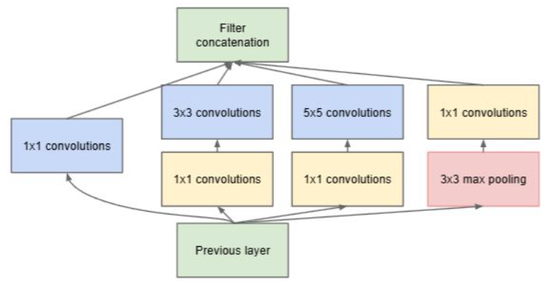
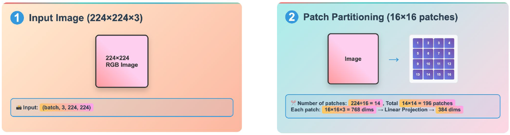
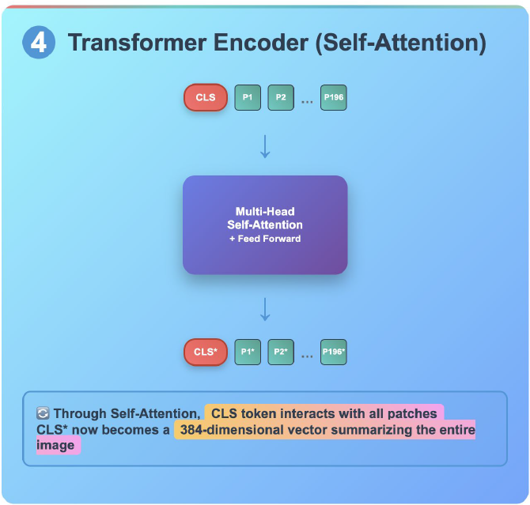

**[Reference]** <br>
$\bullet$ [Machine Learning Q and AI](https://sebastianraschka.com/books/ml-q-and-ai/#table-of-contents)
{: .notice--success}

# W1-2

## 1.Embeddings
- Embedding vectors or embeddings for short, encod relatively high-dimensional data into relatively low-dimensional vectors. 
    <div class="indented-paragraph" markdown="1">
    We can apply embedding methods to create a $\underbrace{\text{dense and continuous}}_{\text{Two characteristics of embedding}}$ vector.<br>
        - Dense: Embedding transform sparse vector into dense vector.<br>
        - Continuous: Similar data are embedded into similar vector by embedding.
    </div>

- Similar inputs are mapped to nearby locations (similarity is preserved).

- Mainly used for similarity and distance computations.

## 2.Latent space
The space into which embedding vectors are mapped (feature space).<br>
Preservation of similarity is not necessary condition for latent space.

## 3.Representation
A representation is an encoded, typically intermediate form of an input. <br>
For instance, an embedding vector or vector in the latent space is a representation of the input. <br>
However, simpler form of encoded vectors like one-hot encoded vectors also can be considered representation.



# W2-1


## 1.Neural Network
What we do in deep learning: Transform (refine) input features into better embedding.

Essential components of a Neural Network: **Linear transformation** and **Activation function**.


1) Linear transformation

$$y=Wx+b$$

Projects the data into a different coordinate system, continually transforming the feature space.




2) Activation function

$$\hat{y} = \sigma(y)$$

Injects nonlinearity, enabling the network to approximate complex functions that simple linear models cannot.

Ex) ReLU: $\text{ReLU}(x) = \max(0,x)$



## 2.Universal Approximation Theorem (UAT)
A neural network with a single hidden layer, provided it has a sufficient number of neurons (capacity), can approximate any continuous function to a desired level of accuracy. 


## 3.Deep learning
Essential components of Deep learning: **Neural network**, **Loss function** and **Optimizer**.


**Softmax function**<br>
: Usually used for final layer of classification model. 

Each class's output value is transformed into a number  between 0 and 1.<br>
Total sum of all classes should be 1. 




**Cross-entropy Loss**<br>
: To calculate the dissimilarity between the predicted probability distribution and the true probability distribution.

It is usually used in classification model. 





# W2-2


## 1.Pytorch basics

**1-1) Tensor**<br>
The core data structure used in PyTorch, taking the form of a multi-dimensional array.<br>
The inputs, outputs, and all parameters (like weights) of a deep learning model are represented in the form of Tensors. 

**Key attributes**
- `shape`: Describes the dimensions or shape of the Tensor (e.g., (3, 4) for a 3x4 matrix). 

- `dtype`: The data type of the elements stored in the Tensor (e.g., float32). 

- `device`: Indicates which hardware the Tensor is stored on (CPU or GPU/CUDA).

**Basic operations**
- Addition/Multiplication: Element-wise operations like `x + y` and `x * y` are supported. 

- Reshaping: You can change a Tensor's shape without altering its data using methods like `.view()`. 

- Matrix Multiplication: `torch.matmul(a, b)` performs matrix multiplication, which is a core operation in the layers of an MLP (Multi-layer Perceptron). 

```python
import torch

# Define the first matrix (mat1) with a shape of (2, 3)
mat1 = torch.tensor([
    [1, 2, 3],
    [4, 5, 6]
])

# Define the second matrix (mat2) with a shape of (3, 2)
# For matmul, the number of columns in mat1 must equal the number of rows in mat2.
mat2 = torch.tensor([
    [10, 20],
    [30, 40],
    [50, 60]
])

# Perform matrix multiplication
result = torch.matmul(mat1, mat2)

# --- Print the inputs and the final result ---

print("Input Matrix 1 (mat1):")
print(mat1)
print("\nShape:", mat1.shape)
print("-" * 30)

print("Input Matrix 2 (mat2):")
print(mat2)
print("\nShape:", mat2.shape)
print("-" * 30)

print("Result of torch.matmul(mat1, mat2):")
print(result)
print("\nShape:", result.shape)
```
```python
Input Matrix 1 (mat1):
tensor([[1, 2, 3],
        [4, 5, 6]])

Shape: torch.Size([2, 3])
------------------------------
Input Matrix 2 (mat2):
tensor([[10, 20],
        [30, 40],
        [50, 60]])

Shape: torch.Size([3, 2])
------------------------------
Result of torch.matmul(mat1, mat2):
tensor([[220, 280],
        [490, 640]])

Shape: torch.Size([2, 2])
```


**1-2) Batch**<br>
A unit that groups multiple data points into a single Tensor to be processed all at once. For example, if a single 28x28 image has a shape of (28, 28), a batch of 4 such images would have a shape of (4, 28, 28). 

Q: Why Batch?
- Individual Processing: If you process 100 images one by one, the model must perform 100 separate matrix multiplication operations. This is highly inefficient as it fails to properly utilize the parallel processing power of a GPU. 

- Batch Processing: By grouping 100 images into a single batch tensor (e.g., [100, 784]), the model can process all 100 images with just one single, large matrix multiplication operation. 

In conclusion, batch processing is essential because it maximizes the parallel computing capabilities of modern hardware (especially GPUs) to significantly speed up the training of deep learning models.




**1-3) einsum**<br>
`einsum` is a powerful function that allows you to perform complex multiplications, summations, and dimension changes on multi-dimensional Tensors using a concise string-based notation. 

- How it works: Based on the Einstein summation convention, it defines an operation by specifying the dimensions of the input and output tensors in a string. For example, 'ij, jk -> ik' defines matrix multiplication: it takes a matrix of shape i x j and another of shape j x k, and produces an output matrix of shape i x k. 

- Usefulness:

    - Beyond simple matrix multiplication, it can intuitively express complex operations on tensors with many dimensions.

    - einsum can simply implement a more complex operation, such as summing over the channel dimension (c) of a batch of color images (b, c, h, w) to effectively make them grayscale ('bchw -> bhw'). 

```python
import torch

print("--- Example 1: Matrix Multiplication ('ij,jk->ik') ---")

# Define two matrices with simple integers
mat1 = torch.tensor([[1, 2, 3], [4, 5, 6]])      # Shape: (2, 3) -> Dimensions 'i, j'
mat2 = torch.tensor([[10, 20], [30, 40], [50, 60]]) # Shape: (3, 2) -> Dimensions 'j, k'

# Perform matrix multiplication using einsum.
# The notation 'ij,jk->ik' means:
# 1. Take a tensor with dimensions (i, j) and another with (j, k).
# 2. Multiply them and sum over the common dimension 'j'.
# 3. The resulting output tensor should have dimensions (i, k).
result_einsum = torch.einsum('ij,jk->ik', mat1, mat2)

# --- Print the inputs and the result ---
print("Input Matrix 1 (Shape: 2,3):")
print(mat1)

print("\nInput Matrix 2 (Shape: 3,2):")
print(mat2)

print("\nResult from einsum('ij,jk->ik'):")
print(result_einsum)
```
```python
--- Example 1: Matrix Multiplication ('ij,jk->ik') ---
Input Matrix 1 (Shape: 2,3):
tensor([[1, 2, 3],
        [4, 5, 6]])

Input Matrix 2 (Shape: 3,2):
tensor([[10, 20],
        [30, 40],
        [50, 60]])

Result from einsum('ij,jk->ik'):
tensor([[220, 280],
        [490, 640]])
```
<br>
```python
import torch

print("\n--- Example 2: Summing a Dimension ('bchw->bhw') ---")

# Create a batch of 2 "images". Each image has 3 channels (RGB) and is 2x2 pixels.
# Shape: (batch, channels, height, width) -> (2, 3, 2, 2)
image_batch = torch.tensor([
    # Image 1
    [[[1, 1], [1, 1]],  # Channel 0 (R)
     [[2, 2], [2, 2]],  # Channel 1 (G)
     [[3, 3], [3, 3]]], # Channel 2 (B)

    # Image 2
    [[[4, 4], [4, 4]],  # Channel 0 (R)
     [[5, 5], [5, 5]],  # Channel 1 (G)
     [[6, 6], [6, 6]]]  # Channel 2 (B)
])

# Sum over the channel dimension 'c'.
# The input is 'bchw' and the output is 'bhw', so the 'c' dimension is summed and removed.
result_sum = torch.einsum('bchw->bhw', image_batch)

# --- Print the inputs and the result ---
print("Input Batch of Images (Shape: 2,3,2,2):")
print(image_batch)

print("\nResult from einsum('bchw->bhw'):")
print(result_sum)

print("\nResult Shape:", result_sum.shape)
```
```python
--- Example 2: Summing a Dimension ('bchw->bhw') ---
Input Batch of Images (Shape: 2,3,2,2):
tensor([[[[1, 1],
          [1, 1]],

         [[2, 2],
          [2, 2]],

         [[3, 3],
          [3, 3]]],


        [[[4, 4],
          [4, 4]],

         [[5, 5],
          [5, 5]],

         [[6, 6],
          [6, 6]]]])

Result from einsum('bchw->bhw'):
tensor([[[ 6,  6],
         [ 6,  6]],

        [[15, 15],
         [15, 15]]])

Result Shape: torch.Size([2, 2, 2])
```



## 2.Autograd

Autograd is the automatic differentiation engine in PyTorch. 

- $\textbf{Model and Loss Function:}$
  - Linear Model: $\hat{\vec{y}} = \vec{x}\mathbf{W} + \vec{b}$
  - Loss Function (MSE): $\mathcal{L} = \frac{1}{N} \sum_{i=1}^{N} (\hat{y}_i - y_i)^2$

- $\textbf{Manual Calculation (Analytic form):}$ Differentiating the loss function $\mathcal{L}$ with respect to the parameters $\mathbf{W}$ and $\vec{b}$ yields complex expressions:
  - $\frac{\partial\mathcal{L}}{\partial\mathbf{W}} = \frac{2}{N} \sum_{i=1}^{N} \vec{x}_i(\hat{y}_i - y_i)$
  - $\frac{\partial\mathcal{L}}{\partial\vec{b}} = \frac{2}{N} \sum_{i=1}^{N} (\hat{y}_i - y_i)$

```python
import torch

# 1. Create Sample Data
# We'll create some simple data points since they aren't defined in the PDF snippet.
# Let's assume the true relationship is y = 2x + 1
data = torch.tensor([[0.0], [1.0], [2.0], [3.0]])   # Input data (x)
target = torch.tensor([[1.0], [3.0], [5.0], [7.0]]) # True labels (y)

# 2. Define Model Parameters (from PDF page 35)
# We set 'requires_grad=True' to tell PyTorch to track gradients for these tensors.
W = torch.tensor([[1.0]], requires_grad=True)
b = torch.tensor([0.0], requires_grad=True)

# 3. Forward Pass: Calculate the model's prediction
# Linear model: prediction = xW + b
prediction = data @ W + b

# 4. Calculate the Loss (from PDF page 34)
# We use the Mean Squared Error (MSE) loss function.
loss = torch.mean((prediction - target)**2)

# 5. Backward Pass: Compute gradients using autograd
# This single command calculates the gradient of the loss
# with respect to all tensors that have requires_grad=True (i.e., W and b).
loss.backward()

# --- Print the results ---

print(f"The calculated loss is: {loss.item():.4f}\n")

# The computed gradients are now stored in the .grad attribute of the parameters.
print("Autograd Gradient of loss with respect to W:")
print(W.grad)

print("\nAutograd Gradient of loss with respect to b:")
print(b.grad)
```
```python
The calculated loss is: 4.5000

Autograd Gradient of loss with respect to W:
tensor([[-7.]])

Autograd Gradient of loss with respect to b:
tensor([-3.])
```


## 3. Goal of Deep learning

**Goal of Deep Learning**<br>
The Ultimate Goal of Deep Learning: Generalization<br>
The ultimate goal of deep learning is not simply to master the training data. The true objective is to minimize the error on new, unseen test data. This capability is known as  generalization.

While the Universal Approximation Theorem states that a network with enough capacity can mimic any function, is a bigger, "deeper" network always better?<br> 
This question introduces the primary obstacle to achieving good generalization: **overfitting**.



**Overfitting**<br>
Overfitting: The Main Obstacle to Generalization.<br>
Overfitting is what happens when a model learns the training data too well, to the point where it starts to memorize not only the underlying patterns but also the random noise within the data.

The goal of deep learning is not to achieve zero error on the training set.<br> 
It is to build a model that minimizes the test-time error by finding the right balance between fitting the data and avoiding overfitting, thus achieving good generalization.

Test-time error is the error a machine learning model produces when evaluated on new, unseen data that was not used during its training. The ultimate goal of deep learning is to minimize this error, as it measures how well the model can generalize to real-world scenarios.


## 4. The Three Sources of Test-Time Error

The ultimate goal of a deep learning model is to minimize the test-time error on unseen data.  This error can be broken down into three primary sources: **Noise**/**Bias**/**Variance**


**Noise**<br>
This is the unavoidable, random error inherent in the data itself. It can come from sources like physical sensor noise or human errors during data labeling. This component of the error is irreducible.



**Bias**<br>
Bias is the error that arises when a model is too simple (i.e., has low capacity) to capture the true underlying function or patterns in the data. A model with high bias is in a state of 
underfitting and cannot fit the training data well. For example, the error that occurs when trying to approximate a complex sine wave with only a few ReLU units is due to bias.



**Variance**<br>
Variance is the error that arises from a model's sensitivity to small fluctuations in the training data. This typically happens when a model is too complex (i.e., has high capacity) and learns the noise in the training data instead of the true signal. A high-variance model will change significantly if the training data changes slightly, which leads to overfitting.


For a given dataset, the error comes from 

$$\mathbb{E}_{\mathcal{D}}[\mathbb{E}_y[L[x]]] = \mathbb{E}_{\mathcal{D}}[\underbrace{(f[x, \phi[\mathcal{D}]] - f_{\mu}[x])^2}_{\text{variance}}] + \underbrace{(f_{\mu}[x] - \mu[x])^2}_{\text{bias}} + \underbrace{\sigma^2}_{\text{noise}}.$$

Thus, reducing error means reducing variance and bias.


**Bias-Variance Trade-off**<br>
The test error can be mathematically expressed as the sum of variance, squared bias, and noise.<br>
Since noise is irreducible, minimizing the total error requires minimizing both bias and variance.<br> 

However, these two sources of error are often in opposition to each other:

- As you increase the model's capacity (e.g., by using a deeper network or more neurons), the model can learn more complex functions, which causes the bias to decrease. 

- But, for a fixed amount of training data, increasing the model's capacity also makes it more likely to fit the noise in that specific dataset, which causes the variance to increase. 

This inverse relationship, where decreasing one error source tends to increase the other, is known as the **Bias-Variance Trade-off**.<br>

Therefore, our goal in training a model is to find a "**sweet spot**"—a point of optimal model capacity that minimizes the combined sum of bias and variance.<br> 
A model that is too simple will have high bias, and a model that is too complex will have high variance.<br>
The key is to build a model that is just right to achieve the best generalization performance.



## 5.Double descent

**Classical vs. Modern Perspectives**<br>
- Classical Machine Learning: Previously, we learned that as a model's complexity increases past a certain point, the test error continuously increases due to overfitting, following a U-shaped curve. This is the traditional viewpoint of the Bias-Variance Trade-off. 

- Modern Machine Learning: However, a different phenomenon is observed in modern deep learning models, which are often over-parameterized—meaning they have far more parameters than there are data points.



**What is the Double Descent Phenomenon?**<br>
The Double Descent phenomenon describes how, as a model's complexity continues to increase, the test error, after reaching a peak, starts to decrease again instead of continuously increasing as classical theory would suggest. 

1.Under-fitting Regime: When model complexity is low, both training and test error decrease. 

2.Classical Overfitting Regime: As the model's complexity approaches the point where it can memorize the training data, the test error begins to rise. 

3.Interpolation Point: This is the point where the model perfectly memorizes the training data. The test error reaches its peak here. 

4.Modern Overfitting / Double Descent Regime: Surprisingly, as the model's complexity (number of parameters) increases far beyond this threshold, the test error begins to decrease again. 



**Double Descent in Practice (Empirical Evidence)**<br>
The double descent phenomenon challenges the classical wisdom that making a model too complex will inevitably lead to worse performance due to overfitting.<br> 
Instead, it suggests that in modern deep learning, making models extremely large and entering the over-parameterized regime can actually lead to better generalization and lower test error.<br> 
This is a key theory that helps explain why the massive models used today, such as Large Language Models (LLMs), can perform so well. 



# W3-1


## 1.Bias-Variance Trade-off

**The Root of the Problem: Over-reliance on Data**<br>
The lecture material identifies the data itself as the fundamental cause of overfitting. <br>
This is because the data we use is always limited in quantity and is merely a sample representing a partial observation of the real world. <br>
Overfitting occurs when a model depends too heavily on this imperfect data, memorizing its random noise instead of learning its true underlying patterns.<br>

Therefore, the question of how to suppress overfitting leads to the question: "How can we reduce the influence that the data has on the model?".



**The Philosophical Solution: The Bayesian Perspective**<br>
Core Philosophy: A good model should not rely solely on the observed data (the Likelihood).<br>
Instead, it must also incorporate a reasonable predefined belief (the Prior) that we hold before even seeing the data.<br>

Key Terms:
- Observation (Likelihood): The data that we actually observe and measure.

- Prior Belief: The assumptions or beliefs we have about the model before observing any data.

- Posterior: The updated, more refined belief that is formed by combining the observation (Likelihood) and the prior belief (Prior).

**The Coin Toss Example**<br>
The coin toss example in the lecture slides provides a simple illustration of this concept.

- Prior Belief: "I believe this coin is fair".

- Observation (Likelihood): "When I tossed the coin 10 times, 6 of them came up heads".

- Posterior Belief: "Based on the results, the coin might be slightly biased toward heads".

As this example shows, the Bayesian perspective is a rational method of reasoning that continuously updates our existing beliefs using new data, rather than blindly trusting the data alone.



**Bayes' Rule: The Mathematical Formulation of the Philosophy**<br>

This Bayesian philosophy is formalized by the mathematical equation known as Bayes' Rule.<br>

$$p(\theta \vert \mathcal{D}) = \frac{p(\mathcal{D} \vert \theta)p(\theta)}{p(\mathcal{D})}$$

- $p(\theta \vert D)$ (Posterior): This is what we want to find. It's the probability of our model parameters θ being correct, given the data D.

- $p(D \vert \theta)$ (Likelihood): The influence of the data. It's the probability of observing our data D, given our current model parameters θ.

- $p(\theta)$ (Prior): The influence of our prior belief. It's our initial belief in the probability of the model parameters 

$\theta$ being correct, before seeing any data.

In conclusion, the Bayesian perspective provides a philosophical and mathematical foundation for preventing a deep learning model from overfitting to the training data ($p(D \vert \theta)$).<br> 
It does this by introducing a reasonable constraint based on what the parameters should look like ($p(\theta)$).<br> 
This is the core idea that leads directly to the next step: Regularization.


## 2.MAP estimation and L2 regularization

**MAP (Maximum a Posteriori) Estimation**<br>
Training a deep learning model is the process of finding the most plausible model parameters ($\theta$) for a given set of data (D).<br>
From a Bayesian perspective, this goal is defined as maximizing the posterior probability, a method known as MAP (Maximum a Posteriori) estimation. <br>

Mathematical Expression:

$$\theta_{\text{MAP}} = \arg\max_{\theta} p(\theta | \mathcal{D})$$

According to Bayes' Rule, this is equivalent to maximizing the product of the Likelihood and the Prior.<br> 

Transformed Equation:

$$\theta_{\text{MAP}} = \arg\max_{\theta} \left( p(\mathcal{D}|\theta)p(\theta) \right)$$

Because multiplication is computationally complex to differentiate, we apply a logarithm, which converts the product into a sum without changing the location of the maximum value.<br>

Log-Transformed Equation:

$$\theta_{\text{MAP}} = \arg\max_{\theta} \left( \log p(\mathcal{D}|\theta) + \log p(\theta) \right)$$

Our goal is now to find the parameters $\theta$ that maximize the sum of the log-likelihood (the probability of the data) and the log-prior (the probability of our belief).



**The Core Assumption: A Prior Belief that "Good Weights are Small"**<br>
This is where the key idea to prevent overfitting is introduced.<br> 
We establish a prior belief that "the parameters ($\theta$) of a good model should be small and close to zero."<br>

Mathematical Assumption: This belief is mathematically formalized by assuming that the parameters $\theta$ follow a zero-mean Gaussian (normal) distribution.<br>  


**Why zero mean prior assumption?**<br>
The reason for the zero-mean prior assumption is to create a robust model whose output is not overly sensitive to small changes in the input data, which is achieved by keeping the magnitude of the model's parameters (weights) small.<br> 

Detailed Explanation Definition of a "Good Model": a good model is "robust to input data distribution's disturbance".<br> 
This means a stable model whose output does not significantly change even when there is slight noise or variation in the input data.<br>   

The Connection to L2 Regularization: Mathematically applying the prior belief that "parameters follow a zero-mean Gaussian distribution" has the same effect as adding an L2 Regularization term ($\lambda \Vert \theta \Vert^2$) to the objective function.<br> 
This penalty term forces the model to keep the magnitude of its parameters ($\Vert \theta \Vert^2$, the squared norm) as small as possible during training.<br>   
In conclusion, the zero-mean prior assumption is the mathematical implementation of the belief that "a good model should have parameters with small magnitudes."<br> 
It guides the model to find a stable and robust solution that is not overly sensitive to small variations in the input data.


The log of this distribution's probability density function takes the following form:

$$\log p(\theta) \propto - \frac{\lambda}{2} \Vert\theta\Vert^2$$

Data Term (Likelihood) Assumption: Similarly, we assume that the error between the model's prediction and the true value also follows a zero-mean Gaussian distribution.<br>  
Taking the log of this results in a form similar to the commonly used Mean Squared Error (MSE).

$$\log p(\mathcal{D}|\theta) \propto - \Vert \vec{y} - f_{\theta}(\vec{x}) \Vert^2$$






**The Birth of L2 Regularization: Connecting Theory and Practice**<br>
By substituting the two assumptions from the previous step into the log-transformed MAP equation and then converting the maximization problem into a minimization problem (by flipping the sign), we arrive at the final equation. 

Final Derived Equation:

$$\theta_{\text{MAP}} = \arg\min_{\theta} \left( \Vert \vec{y} - f_{\theta}(\vec{x}) \Vert^2 + \lambda\Vert\theta\Vert^2 \right)$$

The meaning of this final equation is as follows:

$\Vert y-f_{\theta}(x) \Vert ^2$: This is the **Loss Function**, representing the error between the model's prediction and the true value. 

$\lambda \Vert \theta \Vert ^2$: This is the **L2 Regularization term**, which acts as a penalty proportional to the squared magnitude of the model's parameters (weights). 


In conclusion, by mathematically applying a reasonable prior belief ("weights should be small") from a Bayesian perspective, we naturally derive the L2 Regularization technique used in practice to prevent overfitting.<br> 
This shows that using L2 regularization is not just a technical trick, but a practical implementation of the Bayesian philosophy of finding an optimal solution that considers both the data and a prior belief.


## 3.Effect of regularization 

**Beyond the Loss Function to the Objective Function**<br> 
When we train a deep learning model, we are not just minimizing the error on the data (the loss).<br> 
When applying regularization, we are actually minimizing an Objective Function. <br>
This is defined as: 

**Objective Function = Residual Function + Regularization Function** 

**Residual Function**: This is the same as the traditional Loss Function.<br> 
<div class="indented-paragraph" markdown="1">
It measures the error between the model's predictions and the actual data. 
</div>
**Regularization Function**: This is the term that adds a penalty to prevent the model's parameters (weights) from becoming too large. 



**The Effect of Regularization Strength ($\lambda$)**<br>
$\lambda$ is a hyperparameter that controls the strength of the regularization.<br>
The model's learned outcome varies significantly depending on the value of $\lambda$.<br> 

- $\lambda = 0$ (No Regularization): The model only tries to reduce the data error (the residual function).<br> 
As a result, it learns the noise in the training data, leading to a state of overfitting with a highly complex and fluctuating prediction curve.<br> 

- When $\lambda$ is appropriate (e.g., 0.001): The model must reduce the data error while also keeping the magnitude of its weights small.<br> 
This results in a smoother, more generalized prediction curve that is less affected by noise.<br> 

- When $\lambda$ is too large (e.g., 0.1): The penalty for large weights becomes too strong, preventing the model from learning the underlying pattern in the data.<br> 
This leads to a state of underfitting, where the prediction is overly simplistic. 



**The Changing Loss Landscape**<br>
Regularization also has a positive effect on the optimization process.<br> 

- Before Regularization (Loss): The original loss surface can be very complex, rugged, and contain many local minima.<br> 
An optimizer, like gradient descent, is at risk of getting trapped in one of these local minima and failing to find the global optimum. <br>

- After Regularization (Loss + Regularization): When the regularization term (which has a simple, bowl-like shape) is added, the surface of the total objective function becomes much smoother, and the number of local minima is reduced.<br> 
On this gentler landscape, the optimizer can more reliably and stably find a good solution.



# W3-2


## 1.Gradient Descent

**The Goal of Model Training: Minimizing the Objective Function**<br>
Training a model is ultimately a process of minimizing the value of an Objective Function, which represents the model's performance.<br> 
This objective function is generally composed of the sum of a 'Residual' term, which is the difference between the predicted and actual values, and a 'Regularization' term, which prevents the model from overfitting.

This objective function can be considered as a 'Loss surface', which looks like a parabolic graph (e.g., $y=x^2$).<br> 
Our goal is to find the lowest point on this surface, the very bottom of the valley.



**The Principle of Gradient Descent**<br>
Gradient Descent is the most fundamental method for finding the minimum point of the loss surface.<br> 
This method consists of two key components:

- Direction: In which direction from the current position does the loss value decrease the fastest? 

- Amount: How large of a step should be taken in that direction? 

These two factors are expressed in the core update formula for Gradient Descent:

$$\theta \leftarrow \theta - \eta \nabla f(\theta)$$

- $\nabla f(\theta)$(The Gradient): This determines the 'direction'. The gradient indicates the direction of the steepest ascent in the function's value from the current position ($\theta$). Therefore, we must move in the opposite direction (indicated by the - sign) to reduce the loss.

- $\eta$ (The Learning Rate): This determines the 'amount', or the size of the step to be taken.



**Controlling the Step Size: The Importance of the Learning Rate**<br>
The **learning rate** ($\eta$) is a crucial hyperparameter that can determine the success or failure of model training.

- If the learning rate is too small (e.g., lr=0.05): The model moves towards the minimum very slowly and incrementally, resulting in long training times.

- If the learning rate is too large (e.g., lr=0.8): The step size is too big, which can cause it to completely miss the minimum and jump to the other side, a phenomenon known as **overshooting**. In this case, the process might continue to oscillate around the minimum or, in worse cases, diverge as the loss value increases.

The optimal learning rate is often found **empirically**.<br> 
A generally effective strategy is to start with a large learning rate and gradually decrease it as training progresses.



**Automating Step Size Control: The Learning Rate Scheduler**<br>
Since manually adjusting the learning rate can be cumbersome, a **Learning Rate Scheduler** is used to automatically adjust the learning rate during the training process.<br> 
The lecture materials introduce several schedulers available in PyTorch:

- **StepLR**: Decreases the learning rate by a set ratio (gamma) at a specific interval (step_size).

- **Exponential Decay**: The learning rate decreases exponentially at each step.

- **Cosine Annealing**: The learning rate follows the shape of a cosine curve, decreasing smoothly and sometimes slightly increasing again.


## 2.Backpropagation

**Three Methods for Calculating Gradients**<br>

- **Analytic Gradient**

- **Numerical Differentiation**

- **Automatic Differentiation**: This is the standard method used in deep learning.  Its core algorithm is backpropagation.



**The Core Principle of Backpropagation: The Chain Rule**<br>
A neural network is essentially one giant composite function, equivalent to a "**chain of simple functions**" nested one after another. 

$$y = f_4(f_3(f_2(f_1(x))))$$

Therefore, no matter how complex the neural network is, we can calculate its overall gradient by differentiating each component and then multiplying these derivatives together according to the Chain Rule. 



**Visualizing the Process: The Computational Graph**

<figure style="display: flex; flex-direction: column; align-items: center; margin-top: 0.5em; margin-bottom: 0.5em;">
  
   <figcaption style="font-size: 20px; margin-top: -0.5em;">
   The Computational Graph
   </figcaption>
</figure> 

- **The Forward Pass**
This is the process where the input $x$ and parameters $W$ and $b$ pass sequentially through each operation in the network (multiplication, addition, activation function, etc.) to compute the final loss value, $L$.  This is like a river flowing from upstream to downstream.

- **The Backward Pass**
This process works in the opposite direction of the forward pass. It starts from the final output, the loss $L$, and calculates the gradients in reverse using the **Chain Rule**. 
Let's break down the calculation process:

  - **Step 1**: The final output is the loss $L$. The derivative of $L$ with respect to $L$, $\frac{\partial L}{\partial L}$, is naturally 1. This is the starting point of backpropagation.
  - **Step 2**: The loss $L$ is defined as $(a−y)^2$, so the derivative of $L$ with respect to $a$ is $\frac{\partial L}{\partial a}=2(a−y)$. 
  - **Step 3**: To find the gradient with respect to $z$, $\frac{\partial L}{\partial z}$, we use the chain rule:

  $$\frac{\partial \mathcal{L}}{\partial z} = \frac{\partial \mathcal{L}}{\partial a} \cdot \frac{\partial a}{\partial z} = 2(a-y) \cdot \sigma'(z)$$

  We simply multiply the gradient from the previous step, $\frac{\partial L}{\partial a}$, by the local derivative of the current node ($\sigma '(z)$). 
  - **Step 4**: Now we calculate the gradients for the parameters we need to update, $W$ and $b$. This also uses the chain rule, leveraging the gradient $\frac{\partial L}{\partial z}$calculated in the previous step:
    - **Gradient of W**: $\frac{\partial\mathcal{L}}{\partial\mathbf{W}} = \frac{\partial\mathcal{L}}{\partial z} \cdot \frac{\partial z}{\partial\mathbf{W}} = \frac{\partial\mathcal{L}}{\partial z} \cdot \vec{x}$
    - **Gradient of b**: $\frac{\partial\mathcal{L}}{\partial\vec{b}} = \frac{\partial\mathcal{L}}{\partial z} \cdot \frac{\partial z}{\partial\vec{b}} = \frac{\partial\mathcal{L}}{\partial z} \cdot 1$

In this way, backpropagation efficiently computes the gradients for all parameters by moving from the output layer to the input layer, reusing the gradient calculated in the preceding step. Because this process happens sequentially and reuses results, it can be implemented simply and recursively, which is why it's called Automatic Differentiation. 


## 3.Adam optimizer

**The Limitations of Standard Gradient Descent**<br>
While standard Gradient Descent ($\theta \leftarrow \theta − \eta \nabla(\theta)$) is a good method for finding the minimum of an objective function, it isn't always efficient.<br> 
This method can be slow or struggle to find the optimal path on complex loss surfaces because it only considers the gradient at the current position and moves with a fixed learning rate ($\eta$).

The Adam (Adaptive Moment Estimation) optimizer was introduced to overcome these limitations. 
Adam is now one of the most widely used optimization algorithms in deep learning. 



**Adam's Two Key Improvements**<br>
Adam significantly enhances training efficiency by extending the concepts of '**Direction**' and '**Amount**' from standard Gradient Descent.

**1. Momentum: A Smarter Direction**
- **Standard Method**: Moves only in the direction of the gradient at the current position. 
- **Adam's Improvement**: Considers a moving average of past gradients. This is like a ball rolling down a hill, gaining inertia (momentum) that helps it to continue moving in a consistent direction with more speed. This allows for faster and more stable convergence, especially in situations where the gradient direction changes frequently. 

**2. Adaptive Scaling: A Smarter Step Size**
- Standard Method: Applies the same fixed learning rate (η) to all parameters. 
- Adam's Improvement: Adaptively adjusts the learning rate for each parameter individually.  This is achieved by tracking the variance of each parameter's past gradients.
    - If a parameter's gradient has been consistently large (high variance), it means it has already moved a lot, so its learning rate is reduced to make finer adjustments.
    - Conversely, if a parameter's gradient has been small (low variance), the learning rate is increased to accelerate its learning.

The table from the lecture material clearly illustrates the difference between standard Gradient Descent (GD) and Adam.

| Method | Direction term | Scaling term (Step Size) |
|:---|:---|:---|
| **GD** | $\nabla f(\theta)$ (current gradient) | $\eta$ (fixed) |
| **Adam** | $\hat{m}_t$ (momentum) | $\frac{\eta}{\sqrt{\hat{v}_t} + \epsilon}$ (adaptive) |

Here, $$\hat{m}_t$$ is the moving average of the 1st moment (the mean) of the gradients, and $\hat{v}_t$ is the moving average of the 2nd moment (the uncentered variance).<br>

Adaptive optimizers like Adam can be seen converging to the optimal point (the red star) much more quickly and reliably than standard stochastic gradient descent (sgd).


## 4.The Problem with Deep Neural Networks and its Solution: Residual Connections

**The Problem: Are Deeper Networks Always Better?**<br>
Theoretically, stacking more layers in a neural network should allow it to learn more complex patterns and thus improve its performance. However, in practice, after a certain depth, stacking more layers leads to a **degradation problem**, where the network's performance gets worse.

<figure style="display: flex; flex-direction: column; align-items: center; margin-top: 0.5em; margin-bottom: 0.5em;">
  
   <figcaption style="font-size: 20px; margin-top: -0.5em;">
   </figcaption>
</figure> 

The graph on page 50 of the lecture material clearly illustrates this issue. When trained on the CIFAR-10 dataset, a deeper 56-layer network shows higher training error and test error than a shallower 20-layer network.

The key takeaway here is that this is **not overfitting**. If it were overfitting, the training error would be very low while the test error would be high. Instead, this result indicates that the training process itself is failing for the deeper network. 

**The Cause**: **The Vanishing Gradient Problem**
The fundamental reason for the training failure in very deep networks is the Vanishing Gradient Problem.<br>
During backpropagation, the gradient is passed from the output layer to the input layer by continuously multiplying the Jacobian matrices of each layer according to the Chain Rule.

$$\frac{\partial\mathcal{L}}{\partial\vec{x}} = \left( \prod_{k=1}^{L} \mathbf{J}_k^\top \right) \frac{\partial\mathcal{L}}{\partial\vec{h}^{(L)}}, \text{where } J^{\top}_{k}=\frac{\partial h^{(k)}}{\partial h^{(k-1)}}$$

The problem is that the values in these matrices (e.g., the derivatives of activation functions or the weights themselves) are often less than 1.<br> 
When these small numbers are multiplied together dozens or hundreds of times, the gradient value shrinks exponentially, eventually becoming close to zero.<br> 
As a result, the earlier layers (those closer to the input) receive almost no gradient signal, their parameters are not updated, and learning effectively stops.



**The Solution: Residual Learning and Residual Connections**<br>
To solve this vanishing gradient problem, Kaiming He et al. proposed an innovative method in 2016 called **Residual Learning**.

- **The Core Idea**: Instead of having a network block learn a complex transformation directly, the structure is changed to have the block learn only the **difference (the residual)** from the input.

- **The Implementation**: This is achieved using a structure called a **Residual Connection** or **Skip Connection**. This connection takes the input to a block ($x$) and adds it directly to the block's output ($F(x)$) before passing it to the next layer.
  - **Standard Block**: $F(x)$
  - **Residual Block**: $F(x) + x$

<figure style="display: flex; flex-direction: column; align-items: center; margin-top: 0.5em; margin-bottom: 0.5em;">
  
   <figcaption style="font-size: 20px; margin-top: -0.5em;">
   </figcaption>
</figure> 

The diagrams visually contrast these structures. While a standard network has a sequential data flow ($f_1 \rightarrow f_2 \rightarrow f_3 \rightarrow f_4$), a residual network (ResNet) has "shortcuts" that bypass a block and add the input to the output. 



**The Effect of Residual Connections: A Gradient Highway**<br>
This simple $+x$ operation solves the vanishing gradient problem for the following reason:<br>

During backpropagation, the gradient can flow back through this skip connection without being diminished.<br> 
In essence, it creates a "**highway**" for the gradient to travel back to earlier layers.<br> 
Because the derivative of the $+x$ identity path is 1, it ensures that a non-zero gradient can always be propagated, preventing it from vanishing even in very deep networks.<br> 
This allows for stable training of much deeper architectures.



# W4-1


## 1.What is Computer Vision?

**Computer vision**<br>
Computer Vision is a field of artificial intelligence that enables machines to "see" and understand the visual world.

**1. Image Recognition & Understanding**
- Classification
- Detection
- Segmentation
- Caption Generation

**2. Image Generation & Transformation**
- Synthesis
- Inpainting
- Style Transfer
- Super-resolution

**3. 3D Spatial Understanding**
- Depth Prediction & Scene Reconstruction


## 2.The Dawn of the Deep Learning Revolution: ImageNet and AlexNet

**The Stagnation of Computer Vision and the Emergence of ImageNet**<br>
The ImageNet Challenge brought a revolutionary change in computer vision.

**What is ImageNet?:**<br> 
ImageNet is a massive dataset consisting of millions of high-resolution images (specifically 14,197,122) labeled with over a thousand categories (specifically 21,841).  Beyond its sheer scale, the dataset captured the complexity of the real world, with objects shown from various angles, under different lighting conditions, against cluttered backgrounds, and with occlusions, making it an extremely difficult challenge for the algorithms of the time . The ImageNet Challenge was a competition to see which model could achieve the best image classification performance on this dataset.



**The Dawn of the Deep Learning Era: The Shocking Debut of AlexNet (2012)**<br>
In 2012, a pivotal event occurred at the ImageNet Challenge that would change the course of computer vision history. A deep learning model called AlexNet, developed by Professor Geoffrey Hinton and his students, won the competition with an astonishingly low error rate of 16%. This was a massive leap forward compared to the second-place model, which had an error rate in the 26% range, and it served as a powerful demonstration of deep learning's potential to the entire world.

This event marked a complete paradigm shift in computer vision research from traditional methods to deep learning. In the years that followed, even deeper and more sophisticated models like VGG, GoogLeNet, and ResNet emerged, drastically reducing the error rate year after year. By 2015, a model finally surpassed the human error rate (approximately 5%).



**The Keys to AlexNet's Success**<br>
How was AlexNet able to win by such a large margin?

**1. Revival of Deep Learning with GPUs**:<br> 
The concept of deep learning had existed for a long time, but it was not considered practical due to the immense computational power required to train networks with so many parameters. The AlexNet team solved this computational bottleneck by using GPUs (Graphics Processing Units), which are optimized for parallel processing. This allowed them to successfully train a deep neural network that was previously thought to be infeasible.

**2. Rediscovery of Convolutional Neural Networks (CNNs)**:<br> 
AlexNet adopted the Convolutional Neural Network (CNN) architecture, which is exceptionally effective for image processing. A CNN is a model specialized for extracting features while preserving the spatial structure of an image. The power of the CNN architecture was brought back into the spotlight through AlexNet's success.


## 3.How CNNs Work: The Core Components

**1. Convolution: The Task of Extracting Image Features**<br>
The most critical operation in a CNN is **convolution**. This is the process of detecting visual features such as lines, edges, textures, and color patterns in an image.

- **How it Works**:<br> 
A small matrix called a **Kernel** or **Filter** (e.g., 3x3) slides sequentially across the input image. At each position, the kernel performs an element-wise multiplication with the corresponding region of the image, and the results are summed up to produce a single value. By repeating this process across the entire image, a new matrix called a **Feature Map** is generated. 

- **The Role of the Kernel**:<br> 
The values within the kernel determine what kind of feature it can detect. For example, the kernel [[-1, -1, -1], [0, 0, 0], [1, 1, 1]] shown on page 41 of the lecture material is designed to detect horizontal edges.  In deep learning, the values for these kernels are learned automatically during the training process.



**2. Channels: The Depth of Color and Features**<br>
- **Input Channels (in_channels)**: 
This refers to the depth of the input data. For instance, a grayscale image has 1 channel, while a color (RGB) image has 3 channels for Red, Green, and Blue. When applying a convolution to a 3-channel image, a single **Kernel Set** consisting of three separate kernels (one for each channel) is used. The results from each channel's operation are then summed to produce a **single output channel**.

- **Output Channels (out_channels)**:<br> 
This is determined by the number of Kernel Sets used. If you use two different kernel sets (i.e., you want to extract two different types of features simultaneously), two output channels (feature maps) will be generated. In the PyTorch code, nn.Conv2d(in_channels=1, out_channels=32, ...) means the layer takes a 1-channel (grayscale) image as input and extracts 32 different types of features, producing a feature map with 32 channels.



**3. Padding: Preserving Image Size**<br>
The convolution operation naturally causes the output feature map to be smaller than the input image. This can lead to the loss of information at the edges and becomes problematic when building deep networks, as the feature map can become too small.

- **The Role of Padding**: To solve this, a border of values (usually zeros) is added around the input image to artificially increase its size. This process is called **padding**. By using appropriate padding, you can **maintain the same height and width for the input and output** of a convolution operation.



**4. Pooling: Feature Compression and Generalization**<br>
**Pooling** is a **downsampling** process that reduces the size of the feature map extracted by the convolution layer.

- **How it Works**: Similar to a kernel, it slides over a region and compresses the values in that region into a single representative value.
  - **Max Pooling**: Selects the **largest value** from the region. This has the effect of emphasizing the most prominent features detected in that area.

- **The Purpose of Pooling**:
  - **Computational Efficiency**: It reduces the size of the feature map, which decreases the number of parameters and the computational load for subsequent layers.
  - **Translation Invariance**: It makes the model more robust by helping it recognize a feature even if its position changes slightly in the image.
  - **Enlarging the Receptive Field**: It allows subsequent layers to see a summary of a wider area of the original input.


## 4.Why Use CNNs?: Efficiency and Inductive Bias

**1. Overwhelming Efficiency: A Reduction in the Number of Parameters**<br>
An MLP ignores the 2D structure of an image, flattening all pixels into a one-dimensional vector. This means that every single input pixel must be connected to every neuron in the next layer, which causes the required number of parameters (weights) to grow exponentially as the image size increases.

In contrast, a CNN utilizes the core idea of weight sharing.

- **For an MLP**: 68 parameters are needed to process a 4x4 image into 4 outputs. 

- **For a CNN**: The same task can be accomplished with a single 3x3 kernel that has only 10 parameters. 

Because this small kernel (filter) is reused and **shared** across the entire image, it can learn to extract features effectively with far fewer parameters. The MNIST example from the lecture material confirms this, showing that the simpler CNN model uses fewer parameters than the more complex MLP model (CNN: 421,642 vs. MLP: 535,818).



**2. Smart Priors: Inductive Bias**<br>
**Inductive Bias** refers to the assumptions or constraints that a model has built-in to help it generalize beyond the training data. CNNs have two powerful inductive biases that are extremely well-suited for the characteristics of image data.

- **Locality**:<br> 
This is the assumption that a pixel is more highly correlated with its **immediate neighbors** than with pixels that are far away. CNNs naturally leverage this by using small kernels that only look at local regions of an image.

- **Translation Invariance and Weight Sharing**:<br> 
This is the assumption that a feature that is useful in one part of the image (e.g., a cat's eye) will be equally useful in another part. A CNN satisfies this assumption by applying the same kernel across the entire image (weight sharing). This allows the same "eye detector" kernel to find a cat's eye whether it's on the left or right side of the image.

Thanks to this inductive bias, a CNN can learn the structure of image data much more efficiently. This acts as a form of regularization, improving the model's ability to generalize. The graph on page 59 clearly demonstrates this: the CNN, with far fewer parameters, shows a smaller gap between its training and test error and ultimately achieves a lower test error than the fully connected network (MLP). 

**The Proof in the Experiments**<br>
The experimental results on pages 54 and 57 of the lecture material clearly show the effectiveness of CNNs.

- **MNIST Dataset**:<br> 
On simple digit images, both the MLP and CNN perform well, but the CNN achieves a slightly higher accuracy with fewer parameters (CNN 98.16% vs. MLP 96.19%).

- **Tiny ImageNet Dataset**:<br> 
The difference is stark on more complex, real-world images. The MLP essentially fails to learn (7.05% test accuracy), whereas the CNN performs significantly better (21.74%). Notably, the ResNet18 model pre-trained on ImageNet achieves overwhelming performance (51.51%), proving the importance of the CNN architecture and pre-training for complex image problems.


## 5.CNN's Limitations and Evolution

**The Limitation of Basic CNNs: The Limited Receptive Field**<br>
Despite their many advantages, basic CNNs have a distinct limitation: a **limited receptive field**.<br>  
The receptive field is the size of the region in the input image that affects a single pixel in the output feature map.<br> 
Even when stacking many layers, a single output pixel ultimately only "sees" a relatively small area of the original input.<br> 
This makes it difficult for the network to grasp the broader, global context of an entire image.<br>

To overcome this limitation and effectively utilize information from wider areas, various advanced CNN architectures have been developed.



**1. Capturing Multi-Scale Features Simultaneously: Inception (GoogLeNet)**<br>
<figure style="display: flex; flex-direction: column; align-items: center; margin-top: 0.5em; margin-bottom: 0.5em;">
  
   <figcaption style="font-size: 20px; margin-top: -0.5em;">
   </figcaption>
</figure> 

Instead of using a single fixed-size kernel, the Inception architecture applies **kernels of various sizes** (e.g., 1x1, 3x3, 5x5) and a **pooling layer in parallel**.<br> 
The resulting feature maps are then concatenated. This allows the model to capture features at multiple scales simultaneously, from small, local details to larger, more abstract patterns. 



**2. Expanding the Receptive Field without More Parameters: Dilated Convolution**<br>
<figure style="display: flex; flex-direction: column; align-items: center; margin-top: 0.5em; margin-bottom: 0.5em;">
  
   <figcaption style="font-size: 20px; margin-top: -0.5em;">
   </figcaption>
</figure> 
**Dilated (or Atrous) Convolution** is a technique that effectively expands the receptive field without increasing the number of parameters by inserting "holes" into the kernel.<br>  This allows the kernel to cover a wider area "sparsely," enabling it to incorporate broader context while maintaining computational efficiency.<br> 
This method is widely used in tasks like semantic segmentation, where pixel-level prediction is crucial. 



**3. Utilizing Hierarchical Feature Maps: Pyramid Scene Parsing Network (PSPNet)**<br>
<figure style="display: flex; flex-direction: column; align-items: center; margin-top: 0.5em; margin-bottom: 0.5em;">
  
   <figcaption style="font-size: 20px; margin-top: -0.5em;">
   </figcaption>
</figure> 
This method involves **dividing a feature map into grids of various sizes**, **applying pooling to each grid**, and then concatenating these results.<br> 
This allows the model to hierarchically understand information from objects and regions of different sizes within the image, such as trees, buildings, and the sky.



**4. Combining Low-Level and High-Level Features: U-Net (Skip Connection)**<br>
<figure style="display: flex; flex-direction: column; align-items: center; margin-top: 0.5em; margin-bottom: 0.5em;">
  
   <figcaption style="font-size: 20px; margin-top: -0.5em;">
   </figcaption>
</figure> 
**U-Net** features a symmetric, U-shaped architecture with a downsampling **encoder** path and an upsampling **decoder** path.<br> 
The key innovation is the use of **skip connections** that directly link feature maps from the encoder layers to their corresponding layers in the decoder.<br>

This structure allows the decoder to use not only the compressed, high-level semantic information from the end of the encoder but also the precise, low-level spatial and boundary information from the early encoder layers, enabling highly accurate predictions.



**Beyond CNNs: The Vision Transformer (ViT)**<br>
<figure style="display: flex; flex-direction: column; align-items: center; margin-top: 0.5em; margin-bottom: 0.5em;">
  
   <figcaption style="font-size: 20px; margin-top: -0.5em;">
   </figcaption>
</figure> 
Recently, there have been attempts in image recognition to move beyond the inductive biases (like locality) inherent in CNNs.<br> 
The **Vision Transformer (ViT)** is an architecture that divides an image into a series of smaller patches and feeds them as a sequence into a Transformer model, which has achieved great success in natural language processing.<br>  
ViTs have a more flexible structure than CNNs and, when trained on very large datasets, have shown the potential to outperform them.



# W4-2

## 1.Deconstructing CNN: Convolution as a Linear Operation
We've learned that the basic structure of a neural network is a repetition of a '**linear transformation** (`Wx+b`) followed by a **non-linear activation function**'. So, how can the core operation of a CNN, convolution, be understood within this fundamental structure? This section looks inside the convenient `nn.Conv2d` function to show that convolution is essentially a large-scale matrix multiplication—in other words, a **linear transformation** (`WX+b`).

The lecture material breaks down the convolution operation into the following four steps.


**Step 1: Patch Extraction**<br>
First, all the regions of the input image where the kernel will be applied are extracted into separate pieces, known as '**patches**'.
<figure style="display: flex; flex-direction: column; align-items: center; margin-top: 0.5em; margin-bottom: 0.5em;">
  
   <figcaption style="font-size: 20px; margin-top: -0.5em;">
   </figcaption>
</figure> 
- **How it works**: A function like `F.unfold` is used. A window the size of the kernel slides across the image, extracting all overlapping regions. 

- **The Result**: Each extracted 2D patch is then flattened into a 1D vector. These vectors become the columns of a new 'Patch Matrix'. For example, using a 2x2 kernel on a 3x3 image results in four possible patch locations, creating a Patch Matrix with four columns. 



**Step 2: Matrix Multiplication**<br>
Next, instead of the traditional sliding window method, the entire convolution is performed with a single matrix multiplication.
<figure style="display: flex; flex-direction: column; align-items: center; margin-top: 0.5em; margin-bottom: 0.5em;">
  
   <figcaption style="font-size: 20px; margin-top: -0.5em;">
   </figcaption>
</figure> 
- **The Weight Matrix (W)**: The multiple kernels (filters) that the CNN learns are also flattened into 1D vectors and then stacked as rows to form a '**Weight Matrix**'. Each row in this matrix corresponds to a filter that will produce one output channel.

- **The Linear Transformation (WX)**: Now, the '**Weight Matrix (W)**' is multiplied by the '**Patch Matrix (X)**' created in Step 1. This single matrix multiplication computes the convolution results for all locations across all output channels at once. This is the key step that reveals convolution as a massive linear transformation, `WX`. 



**Step 3: Add Bias**<br>
The bias term for each output channel, `b`, is added to the result of the matrix multiplication. This completes the `WX+b` operation.



**Step 4: Reshape**<br>
Finally, the resulting matrix is reshaped back into the familiar image-like format of a **Feature Map**. For example, if the output has 3 channels and a size of 2x2, the resulting matrix is transformed into a 3D tensor with the shape `(3, 2, 2)`.
<figure style="display: flex; flex-direction: column; align-items: center; margin-top: 0.5em; margin-bottom: 0.5em;">
  
   <figcaption style="font-size: 20px; margin-top: -0.5em;">
   </figcaption>
</figure> 
In conclusion, the seemingly complex convolution operation can be understood as a highly optimized linear transformation. It works by 
① efficiently deconstructing the image into numerous patches<br>
② applying a shared weight matrix (the kernel) to all these patches at once through a single, massive matrix multiplication.


## 2.The Secret to CNN's Success: Inductive Bias

**CNN's Smart Assumptions: Inductive Bias**<br>
In the previous lecture, we confirmed that CNNs outperform MLPs with fewer parameters. The key secret to this success lies in **Inductive Bias**.

Inductive bias refers to the '**assumptions**' or '**constraints**' that are **structurally built into a model** to help it generalize from the training data to new, unseen data.  A CNN incorporates two highly effective assumptions that are a perfect fit for the properties of image data.

**1. Locality (Local Connectivity)**
- **The Assumption**: "In an image, important information is usually found between adjacent pixels, not pixels that are far apart." 

- **How it Works**: A CNN uses small kernels (filters) to process information by connecting only to a specific 'local' region of the image.  Unlike an MLP, which considers all pixels at once, this approach is highly efficient for recognizing local patterns like edges and textures.

**2. Weight Sharing**
- **The Assumption**: "A feature detector (pattern) that is useful in one part of an image will be equally useful in other parts." 

- **How it Works**: A CNN applies a single kernel (the same set of weights) across all locations of the entire image.  For example, a kernel that detects a vertical line on the top-left of an image can also detect a vertical line on the bottom-right. This dramatically reduces the number of parameters and enables the model to learn features regardless of their position.


**The Result: Translation Equivariance**
The combination of 'locality' and 'weight sharing' gives CNNs a crucial property called **Translation Equivariance**.
<figure style="display: flex; flex-direction: column; align-items: center; margin-top: 0.5em; margin-bottom: 0.5em;">
  
   <figcaption style="font-size: 20px; margin-top: -0.5em;">
   </figcaption>
</figure> 
If an object's position shifts in the input image ($S(X)$), the corresponding features in the output feature map also shift in the same way ($S(T(X))$). In other words, **a translation in the input is reflected as a translation in the output**, which allows the CNN to consistently recognize patterns regardless of where they are located in the image.

**Inductive Bias = Powerful Regularization**
These smart assumptions reduce the likelihood that the model will learn irrelevant patterns, thereby acting as a form of **regularization**. 
<figure style="display: flex; flex-direction: column; align-items: center; margin-top: 0.5em; margin-bottom: 0.5em;">
  
   <figcaption style="font-size: 20px; margin-top: -0.5em;">
   </figcaption>
</figure> 
- **Convolutional Network**: Despite using far fewer parameters (2,050), it achieves a small gap between its training and test error, leading to a stable and low final test error. 
- **Fully Connected Network (MLP)**: Although it uses many more parameters (59,065), it overfits to the training data, and its test error fails to improve beyond a certain point. 

In conclusion, by embedding a strong inductive bias for image data into its architecture, a CNN can achieve highly efficient learning and superior generalization performance, even with less data and fewer parameters.


## 3.The Emergence of a New Paradigm: The Vision Transformer (ViT)

**Beyond CNNs: The Potential for More General AI with Less Inductive Bias**<br>
While CNNs are highly effective due to their strong **inductive biases** (locality, weight sharing, etc.), recent research trends suggest that reducing these strong assumptions can lead to more **general AI**. However, this approach requires significantly larger amounts of data. 

Against this backdrop, the **Vision Transformer (ViT)** emerged, applying the **Transformer** architecture—which has been hugely successful in the field of Natural Language Processing (NLP)—to image recognition.



**The Core Idea of ViT: Treating an Image Like a Sentence**<br>
ViT does not process images in the same way as a CNN. Instead, it uses an innovative approach:
<figure style="display: flex; flex-direction: column; align-items: center; margin-top: 0.5em; margin-bottom: 0.5em;">
  
   <figcaption style="font-size: 20px; margin-top: -0.5em;">
   </figcaption>
</figure> 
**1. Divide the Image into Patches**: The image is broken down into a grid of smaller, non-overlapping square patches.

**2. Convert Patches to Tokens**: Each patch is treated like a "word" and is converted (embedded) into a vector.

**3. Input to a Transformer Encoder**: This sequence of patch vectors (the "sentence") is then fed into a Transformer Encoder for processing.



**Fundamental Differences from CNNs**<br>
ViT does not adhere to the core inductive biases of CNNs, 'locality' and 'weight sharing'. Instead, it uses the unique mechanisms of the Transformer.

**1. Global Receptive Field**
- **CNN**: Information is processed from **local to global**, starting with small kernels and gradually expanding the receptive field by stacking layers.

- **ViT**: From the very beginning, it considers the relationships between all patches (all "words") in the image simultaneously. In other words, it has a **global receptive field from the start**. This is analogous to the example on page 45, where the model understands which words in a sentence ("The," "animal," "street," etc.) the word "it" relates to all at once. 

**2. Attention: Dynamic Weights that Depend on the Input**
- **CNN**: Once training is complete, the kernel weights (w) are **static** and extract features in the same way regardless of the input. 

- **ViT (Attention)**: The **attention scores** ($\alpha$) are **dynamic** and change based on the input data. This means the model determines the importance of the relationships between different patches at "**runtime**," adjusting its weights according to the content of the specific input image.

In conclusion, ViT has **less inductive bias than a CNN**, **making it a more flexible and general architecture**. For this reason, when trained on extremely large datasets, it has the potential to outperform CNNs by better capturing complex, long-range dependencies within an image.


## 4.How Does ViT Process an Image?
This section provides a detailed breakdown of the internal workings of a Vision Transformer (ViT), explaining the specific steps it takes to process an image for a final classification. Recalling the experimental results on the Tiny ImageNet dataset where ViT showed superior performance compared to CNN-based models, let's look at the step-by-step secret to its success.


<figure style="display: flex; flex-direction: column; align-items: center; margin-top: 0.5em; margin-bottom: 0.5em;">
  
   <figcaption style="font-size: 20px; margin-top: -0.5em;">
   </figcaption>
</figure> 

**Step 1: Patch Partitioning**
- **Process**: First, the input image is divided into a grid of non-overlapping small square pieces, called patches.
- **Example**: The ViT-Small model takes a 224x224 image as input and partitions it into 16x16 patches. This results in 14 patches horizontally and 14 vertically, for a total of 196 patches.

**Step 2: Linear Projection (Patches $\rightarrow$ Tokens)**
- **Process**: Each 2D image patch from Step 1 is flattened into a long 1D vector (e.g., a 16x16x3 patch becomes a 768-dimensional vector). This vector is then passed through a Linear **Projection** layer, which transforms it into a '**patch embedding**' vector of a consistent size. After linear projection, 196 patches become 196 tokens.
- **Purpose**: This step converts the raw image patches into a sequence of vectors that the Transformer architecture can process. In the ViT-Small model, the 768-dimensional vector is projected down to a **384-dimensional** embedding vector. (By weighting matrix `(768,384)`)



<figure style="display: flex; flex-direction: column; align-items: center; margin-top: 0.5em; margin-bottom: 0.5em;">
  
   <figcaption style="font-size: 20px; margin-top: -0.5em;">
   </figcaption>
</figure> 

**Step 3: Add CLS Token and Positional Encoding**
- **Add [CLS] Token**: A special, learnable **[CLS] (Classification) Token** is added to the very beginning of the patch embedding sequence (patch embedding tokens). This token is designed to aggregate information from the entire image. The sequence now consists of **197 tokens** in total.

- **Add Positional Encoding**: Since the Transformer architecture itself does not have a built-in sense of order, **Positional Encoding** values are added to each token's vector. This provides the model with information about the original position of each patch in the image.



<figure style="display: flex; flex-direction: column; align-items: center; margin-top: 0.5em; margin-bottom: 0.5em;">
  
   <figcaption style="font-size: 20px; margin-top: -0.5em;">
   </figcaption>
</figure> 

**Step 4: Transformer Encoder**
- **Process**: The sequence of 197 tokens is now fed into the Transformer Encoder block. Inside the encoder, the key mechanism of **Self-Attention** allows each token to interact with and weigh its relationship to all other tokens in the sequence.

- **Role of the [CLS] Token**: The [CLS] token, in particular, interacts with all 196 patch tokens. Through this process, it summarizes and condenses the contextual information from the entire image, effectively becoming a **single 384-dimensional vector that represents the whole image**.



<figure style="display: flex; flex-direction: column; align-items: center; margin-top: 0.5em; margin-bottom: 0.5em;">
  
   <figcaption style="font-size: 20px; margin-top: -0.5em;">
   </figcaption>
</figure> 

**Step 5: Classification Head**
- **Process**: Finally, from the 197 output tokens that exit the Transformer Encoder, **only the single 384-dimensional vector corresponding to the [CLS] token is used**.

- **Final Classification**: This [CLS] vector is passed into a simple MLP (the Classification Head) to predict the final class probabilities (200 classes in the case of Tiny ImageNet).


This final classification head is the **only part that is newly trained** when fine-tuning a pre-trained ViT model on a new dataset. As it maps a 384-dimensional input to 200 classes, the number of learnable parameters is **384 (inputs) x 200 (outputs) + 200 (biases) = 77,000**. This is the answer to the question posed in the lecture about why there are 77,000 trainable parameters.


# W5-1

## 1.Why is Attention Needed?

**The Clear Limitations of Existing Models (MLP & CNN)**<br>
While MLP and CNN are powerful tools in deep learning, they each have distinct limitations. 


**Limitations of MLP (Multi-Layer Perceptron)**
- **Pros**: Because all neurons are interconnected, it has **broad receptive fields** and high expressive power through its fruitful weights. 
- **Cons**:
  - **Heavy Computations**: As every input is connected to every output, the amount of computation grows exponentially as the input data size increases. 
  - **Fixed Weights**: Once training is complete, the weights do not change regardless of the input.  This means the model lacks the flexibility to dynamically understand which parts of the input are important based on context.



**Limitations of CNN (Convolutional Neural Network)**

- **Pros**: It is **highly efficient** due to parameter reduction via weight sharing. 
- **Cons**:
  - **Limited Receptive Fields**: Because it starts by processing local information with small kernels (filters), it is difficult to capture the broad, global context of an entire image or the relationship between distant pixels. 
  - **Fixed Weights**: Like an MLP, a CNN's learned kernel weights are fixed and do not change based on the input. 



**The Next Invention to Overcome These Limitations: Attention**<br>
The **Attention** mechanism was born from the idea of overcoming the limitations of these existing models. The monumental 2017 paper from Google, "Attention Is All You Need," introduced the 'Transformer' model, centered around this attention concept, and revolutionized the field of artificial intelligence. 

**The three key goals that Attention aims to achieve**:
1. **Combine the expressive power of an MLP with the efficiency of a CNN**. 
2. **Learn dynamic weights that depend on the input**: Instead of using fixed weights, it **dynamically learns weights** in real-time to determine which parts of the input to 'pay attention to'. This is implemented through the concepts of Query, Key, and Value. 
3. **Achieve flexible receptive fields**: It is not tied to a specific kernel size and can **flexibly adjust its receptive field** as needed to effectively process both nearby information and long-range dependencies (global context). 

In conclusion, Attention can be described as an innovative mechanism designed to understand relationships within data more flexibly and powerfully by taking the advantages of existing models while compensating for their weaknesses.



## 2.How Attention Works: Q, K, V

The **Q, K, V (Query, Key, Value)** mechanism is the core internal operation that happens during **Step 4: Transformer Encoder** of the ViT's 5-step image processing pipeline.

**1. Preparation for the Encoder (ViT Steps 1-3)**: The first three steps in the ViT process are all about preparing the image for the main event. They take a raw image and turn it into a sequence of tokens that a Transformer can understand.

- **Step 1**: The image is partitioned into patches.
- **Step 2**: The patches are converted into vector embeddings (tokens).
- **Step 3**: The special [CLS] token and positional information are added to create the final input sequence with a shape of `(batch, 197, 384)`.

**2. The Main Event - Attention (ViT Step 4)**: This sequence of 197 token vectors is then fed into the **Transformer Encoder**. It's inside this encoder that the **Self-Attention** operation, powered by the **Q, K, V mechanism**, takes place.
- Each of the 197 tokens generates its own unique **Query, Key, and Value** vectors.
- The **Query (Q)** of one token (e.g., the [CLS] token) calculates its similarity with the **Key (K)** of all 197 tokens to get "attention scores."
- These scores are then used as weights to create a weighted sum of all 197 **Value (V)** vectors.
- Through this process, the [CLS] token interacts with every single patch and is updated into a new vector that summarizes the information from the entire image.

**3. Final Classification (ViT Step 5)**: The process is completed by using only the information-rich [CLS] token from Step 4 for the final classification.

In short, you can think of the **Q, K, V mechanism as the "how"** that explains the inner workings of the **"what"** which is the **Transformer Encoder (Step 4)**.




The core idea of the attention mechanism is to **dynamically calculate weights that represent the importance of the relationship between each element (token) in an input sequence**. Through this process, each token is updated into a new, richer representation by selectively combining information from other tokens based on the current context.

This complex process can be understood by breaking it down into three roles: **Query**, **Key**, and **Value**.


**Query (Q)**: The one requesting information. It plays the role of asking, "What relationship should I have with the other tokens right now?"



**Key (K)**: The unique attribute or identifier that each token possesses. It's the 'key' that holds information to answer the query's question.



**Value (V)**: The actual content or value of each token. It is the source of information that will ultimately be combined.




**The 4 Steps of Self-Attention Calculation**<br>
Self-attention uses Q, K, and V to compute its output through the following four steps.


**Step 1: Generate Q, K, and V Vectors**<br>
For each input token (vector $x$), three new vectors are generated: a Query (q), a Key (k), and a Value (v). This is done by multiplying $x$ with three distinct, learnable weight matrices ($\Omega_q, \Omega_k, \Omega_v$). A crucial point is that these weight matrices are **shared** across all tokens. This makes the mechanism efficient, as the number of parameters does not increase with the length of the input sequence.

Q,K and V vectors for input token $\vec{x}_n$<br>
- $q_n = \Omega_q \vec{x}_n + \vec{\beta}_q$
- $k_n = \Omega_k \vec{x}_n + \vec{\beta}_k$
- $v_n = \Omega_v \vec{x}_n + \vec{\beta}_v$

Here, weighting matrix $\Omega_q, \Omega_k, \Omega_v$ are same for all 197 tokens.



**Step 2: Calculate Attention Scores (Similarity)**<br>
Taking one token as a reference, its **Query (q) vector** is computed via a **dot product** with the **Key (k) vector of every other token** (including itself). This dot product value becomes the 'attention score', which represents the **similarity or relevance** between the two tokens.

**Step 3: Calculate Weights (Softmax)**<br>
A **Softmax function** is applied to all the attention scores calculated in Step 2. The softmax function normalizes the scores into values between 0 and 1 and ensures that their sum is equal to 1. This creates a probability distribution, which represents the **attention weights**—how much focus should be placed on each token.


**Similarity score**<br>

$$\text{score}(\mathbf{x}_m, \mathbf{x}_n) = \vec{q}_n \cdot \vec{k}_m = \vec{k}_m^\top \vec{q}_n, \text{ where } m=1,\dots,197$$

**Attention weight**<br>

$$a[\mathbf{x}_m, \mathbf{x}_n] = \frac{\exp(\vec{k}_m^\top \vec{q}_n)}{\sum_{i=1}^{197} \exp(\vec{k}_i^\top \vec{q}_n)}, \text{ where } m=1,\dots,197$$

**Sum of weights**<br>

$$\sum_{m=1}^{197} a[\mathbf{x}_m, \mathbf{x}_n] = 1$$




**Step 4: Calculate the Final Output (Weighted Sum)**<br>
<figure style="display: flex; flex-direction: column; align-items: center; margin-top: 0.5em; margin-bottom: 0.5em;">
  
   <figcaption style="font-size: 20px; margin-top: -0.5em;">
   </figcaption>
</figure> 

The weights obtained in Step 3 are multiplied by the Value (v) vector of each corresponding token. Finally, all these weighted value vectors are summed up.

$$sa_n[\mathbf{x}_1, \dots, \mathbf{x}_{197}] = \sum_{m=1}^{197} a[\mathbf{x}_m, \mathbf{x}_n]v_m, \text{ where } n=1,\dots,197$$

Through this process, the reference token is updated into a new vector that is richly informed by the context, as it has incorporated the 'content' (Values) from other tokens that are highly relevant to it.


<figure style="display: flex; flex-direction: column; align-items: center; margin-top: 0.5em; margin-bottom: 0.5em;">
  
   <figcaption style="font-size: 20px; margin-top: -0.5em;">
   </figcaption>
</figure> 

All these steps can be expressed as a single, efficient matrix operation, $\mathcal{S}a[\mathbf{X}] = \mathbf{V} \cdot \text{Softmax}[\mathbf{K}^\top\mathbf{Q}]$, making it highly suitable for parallel computation on GPUs.


## 3.From Attention to a Transformer Block
This section explains how the Self-Attention mechanism is expanded and combined with other components to create a **Transformer Block**, the core building block of a Transformer model.

**1. Multi-Head Attention: Capturing Relationships from Multiple Perspectives**<br>
Using only a single self-attention mechanism is like looking at a sentence or an image from just one perspective, which can cause you to miss various types of relationships. To overcome this limitation, the Transformer uses **Multi-Head Attention**.

<figure style="display: flex; flex-direction: column; align-items: center; margin-top: 0.5em; margin-bottom: 0.5em;">
  
   <figcaption style="font-size: 20px; margin-top: -0.5em;">
   </figcaption>
</figure> 

- **How it Works**:<br>
    **1. Parallel Attention**: The input tokens are split into multiple 'Heads'. Each head independently performs its own self-attention calculation with its own set of Q, K, and V weight matrices. This is analogous to having several experts analyze the relationships between tokens from different viewpoints (e.g., one for grammatical relationships, another for semantic relationships). The ViT-Small model, for example, uses 6 heads.<br>

    "In Multi-Head Attention, the dimension of the Q, K, and V vectors for each head is smaller than in the single-head case. The dimension of these vectors is calculated by dividing the model's hidden dimension by the number of heads (e.g., 384 / 6 = 64)."

    **2. Combine and Transform**: The output results from all the heads are concatenated together, and this combined result is passed through one final linear layer to produce the final output of the multi-head attention block.

- **Attention as a Linear Operation**: This entire Multi-Head Attention block (MhSa[X]), though it seems complex, is fundamentally a large linear operation that transforms an input matrix X into another matrix. This satisfies the basic deep learning definition of 'linear transformation + non-linear activation'. 



**2. The Transformer Block: The Basic Building Unit**<br>
The **Transformer Block** is the basic "brick" used to build a Transformer model. This block is structured around the Multi-Head Attention mechanism and incorporates several other components to ensure stable training.

<figure style="display: flex; flex-direction: column; align-items: center; margin-top: 0.5em; margin-bottom: 0.5em;">
  
   <figcaption style="font-size: 20px; margin-top: -0.5em;">
   </figcaption>
</figure> 

A single Transformer Block consists of the following four components:<br>
  1. A **Multi-head self-attention** layer to understand the relationships between input tokens.

  2. A **Residual Connection** and **Layer Normalization** step. The original input is added to the output of the attention layer, and the result is normalized to stabilize learning.

  3. A **Feed-Forward Network**, which is a simple MLP that processes each token individually based on the contextual information gained from the attention step.

  4. Another **Residual Connection** and **Layer Normalization** step after the feed-forward network.



**3. The Transformer Architecture: Stacking the Blocks**<br>
The final **Transformer Architecture** is very simple: it is created by **stacking this Transformer Block multiple times (N times)** in sequence.

<figure style="display: flex; flex-direction: column; align-items: center; margin-top: 0.5em; margin-bottom: 0.5em;">
  
   <figcaption style="font-size: 20px; margin-top: -0.5em;">
   </figcaption>
</figure> 

This is like using `nn.Sequential` to repeat the same block structure. As the tokens pass through each block, they are progressively updated to contain richer and deeper contextual information.


## 4.Practical Tips for Training Transformers
While the Transformer architecture is theoretically powerful, it can be unstable to train in practice. This section introduces two crucial techniques that are essential for training Transformers stably and effectively.


**1. Positional Encoding: Injecting Order Information**<br>
**The Problem: Attention Doesn't Know Order**<br>
The core operation of self-attention, the dot product, is commutative (a⋅b=b⋅a). This creates a critical weakness: the attention mechanism is inherently **unable to distinguish the order of the input tokens**. For example, attention might treat the sentences "The woman ate the raccoon" and "The raccoon ate the woman" as identical, failing to capture their completely different meanings. 

<figure style="display: flex; flex-direction: column; align-items: center; margin-top: 0.5em; margin-bottom: 0.5em;">
  
   <figcaption style="font-size: 20px; margin-top: -0.5em;">
   </figcaption>
</figure> 

**The Solution: Adding Position Information**<br>
To solve this problem, a vector containing **unique positional information**, called **Positional Encoding**, is created and added to the original token embedding.  This vector is typically generated using a periodic pattern of sine and cosine functions, giving each position in the sequence a unique signature. This process allows the model to understand the order of each token in the sequence and thereby comprehend context that depends on order.



**2. Scaled Dot-Product Attention: Stabilizing the Training**<br>
**The Problem: Vanishing Gradients**
As the dimension (`D`) of the Query (Q) and Key (K) vectors increases, the variance of their dot product also tends to increase. When these dot product values, which can be very large or small, are fed into a Softmax function, the output tends to be pushed to extremes: one value becomes nearly 1, while all others become nearly 0.

<figure style="display: flex; flex-direction: column; align-items: center; margin-top: 0.5em; margin-bottom: 0.5em;">
  
   <figcaption style="font-size: 20px; margin-top: -0.5em;">
   </figcaption>
</figure> 

This extreme "one-hot" like output causes the **gradient to become almost zero** during backpropagation, leading to the **vanishing gradient problem**, which stalls the learning process. The graphs on page 48 clearly show this phenomenon, where the 'Unscaled' dot product distribution is wide, and the resulting softmax output is sharply peaked at a single value.

**The Solution: Controlling the Range of Values**<br>
The "Attention Is All You Need" paper proposes a simple yet highly effective solution: divide the calculated dot product by the **square root of the dimension of the Key (K) vectors ($\sqrt{D_k}$)**.

<figure style="display: flex; flex-direction: column; align-items: center; margin-top: 0.5em; margin-bottom: 0.5em;">
  
   <figcaption style="font-size: 20px; margin-top: -0.5em;">
   </figcaption>
</figure> c

$$\mathcal{S}a_h[\mathbf{X}] = \mathbf{V}_h \cdot \text{Softmax}\left[ \frac{\mathbf{K}_h^\top\mathbf{Q}_h}{\sqrt{D_q}} \right]$$

This simple scaling operation keeps the variance of the dot product at 1, preventing the softmax output from becoming too extreme. As a result, gradients can flow more stably, significantly improving the stability of the entire training process.


## 5.The Power of the Transformer: ViT and Beyond

**Revisiting the ViT (Vision Transformer) Architecture**<br>
The diagram on page 51 provides a summary of the entire process we learned about in the previous lecture.

<figure style="display: flex; flex-direction: column; align-items: center; margin-top: 0.5em; margin-bottom: 0.5em;">
  
   <figcaption style="font-size: 20px; margin-top: -0.5em;">
   </figcaption>
</figure> 

1. The image is divided into multiple **Patches**.

2. Each patch is transformed into a vector called a **Patch Embedding** via a Linear layer.

3. A special **[cls] token** for classification is added to the front, and positional information is added to each embedding.

4. This sequence of vectors is passed through the **Transformer** blocks.

5. Finally, only the information-rich **[cls] token** is used and passed to an **MLP (classification head)** to predict the image's class.

This architecture allows the ViT to understand an image in a fundamentally different way than a CNN.



**Why is ViT Powerful?**<br>
Page 59 summarizes the five key reasons for ViT's power:

- **Global context**: Because it looks at the relationships between all patches from the very beginning, it overcomes the limited receptive field problem of CNNs and can capture the broad context of the entire image.

- **Dynamic weights**: Through its attention mechanism, it dynamically adjusts weights in real-time to focus on which patches are more important, depending on the image's content.

- **Powerful transfer from Pre-training**: As will be explained in detail below, ViT unleashes its true power when pre-trained on a massive dataset.

- **Scalable & flexible**: It is easy to scale the model's performance by adjusting its size (number of layers, hidden dimension, etc.), leading to variants like ViT-Base, Large, and Huge.

- **Cross-domain unification**: It can process both text and images as a sequence of 'tokens,' making it the foundation for cross-domain models (e.g., CLIP) that unify NLP and computer vision.



**The Key to ViT's Success: Pre-training**<br>
One of the most important characteristics of ViT is that it only achieves its powerful performance **"when pre-trained on a massive dataset."** The experimental results on page 60 clearly demonstrate this fact.

<figure style="display: flex; flex-direction: column; align-items: center; margin-top: 0.5em; margin-bottom: 0.5em;">
  
   <figcaption style="font-size: 20px; margin-top: -0.5em;">
   </figcaption>
</figure> 

- **ViT (from scratch)**: A ViT trained from the beginning on the small Tiny-ImageNet dataset shows very poor performance (19.56% test accuracy), which is even worse than the ResNet18 model from the previous lecture (25.08%). This implies that without the helpful inductive biases of a CNN, a ViT struggles to learn image patterns from limited data.

- **ViT (pre-trained)**: In contrast, when only the final classification head of a ViT model that was already pre-trained on a huge dataset was fine-tuned (linear-probe), it achieved **overwhelmingly high performance (67.60% test accuracy)**.

This experiment proves that ViT's performance is heavily dependent on the **"prior knowledge gained from vast amounts of data."**



**The Evolution and Future of ViT: DeiT and CLIP**<br>
- **DeiT (Data-efficient Image Transformers)**: This model was proposed to overcome the disadvantage of ViT requiring excessively large datasets. By using techniques that allow for more efficient training with less data, it shows excellent performance even when trained only on ImageNet-scale datasets.

- **CLIP (Contrastive Language-Image Pre-training)**: This is a cross-domain model based on ViT that is trained on pairs of images and the texts that describe them. This allows the model to understand the semantic relationship between images and language, leading to amazing capabilities like zero-shot image classification.



# W5-2 (Knowledge Distillation and Self-Supervised Learning)

## 1.Transfer Learning: Knowledge Can Be Reused

**Why is Pre-training Important? (Motivation)**<br>
As we saw in the Vision Transformer (ViT) experiment, using a **pre-trained model** achieves significantly higher performance with fewer resources than training a model from scratch. **Transfer Learning** is the methodology that explains how to effectively reuse this "pre-trained knowledge."



**What is Transfer Learning?**<br>
Transfer learning is a technique where the **knowledge (representations, i.e., weights) from a model trained on one task is transferred and reused to solve a new, different task.** 

For example, a model pre-trained on millions of ImageNet images can be partially repurposed to solve entirely different problems, such as medical image segmentation or depth prediction for autonomous driving. 



**How Does Transfer Learning Work? - The Hierarchy of Features**<br>
Transfer learning is possible because deep learning models, especially CNNs, **learn features hierarchically, much like the human visual cortex**.

<figure style="display: flex; flex-direction: column; align-items: center; margin-top: 0.5em; margin-bottom: 0.5em;">
  
   <figcaption style="font-size: 20px; margin-top: -0.5em;">
   </figcaption>
</figure> 

**1. Low-Level Features**: The earliest layers of a model learn the most basic visual elements. These are **universal features** such as **colors**, **edges in specific orientations, and textures**.  These features are common to all types of images, regardless of whether it's a photo of a dog, a car, or a medical scan.

**2. Mid-Level Features**: The middle layers combine the basic features from the early layers to form **more complex shapes**. For example, they learn to recognize parts of objects like **eyes, noses, ears, or wheels** by combining lines and curves. 

**3. High-Level Features**: The later layers combine these mid-level features to recognize highly **specific, whole objects** like 'dogs' or 'cars'. 



**The Core Principle of Transfer Learning: Feature Reuse**<br>
The key idea of transfer learning is to **reuse the universal knowledge from the early and middle layers** while **retraining only the specialized later layers** for the new task.

In practice, this means taking a well-trained model, "freezing" the weights of the 'Feature Extractor' part (the early layers), and replacing and training only the final **'Trainable Classifier'** part on the new, smaller dataset. Because the model starts with a fundamental understanding of the visual world, it can learn the new task efficiently with much less data and time, leading to high performance.


## 2.Knowledge Distillation: Receiving Knowledge from a Teacher

**What is Knowledge Distillation?**<br>
High-performing models are often very large and complex (e.g., an ensemble of multiple models), which makes them too slow and resource-intensive for real-world deployment. **Knowledge Distillation (KD)** is a technique for efficiently "distilling" the knowledge from these large, powerful models into a smaller, lighter one.

This process is facilitated through the concept of a **Teacher-Student** model.
- **Teacher Network**: A large, high-performance model that has already been trained. 
- **Student Network**: A smaller, more efficient model that will receive the teacher's knowledge. This is the model we ultimately intend to use. 



**How Does Knowledge Distillation Work?**<br>
The core idea of knowledge distillation is that the student model learns not just from the ground-truth labels (e.g., 'cat'), but by **mimicking the predictions of the teacher model as if they were the correct answer.**

<figure style="display: flex; flex-direction: column; align-items: center; margin-top: 0.5em; margin-bottom: 0.5em;">
  
   <figcaption style="font-size: 20px; margin-top: -0.5em;">
   </figcaption>
</figure> 

**1. Learning Soft Targets**<br>
- **Hard Targets**: These are the one-hot encoded labels used in standard training. For example, [0, 1, 0] where the correct class is 1 and all others are 0.
- **Soft Targets**: This refers to the full **probability distribution** output by the teacher model. For instance, if a teacher model sees a picture of a Bengal cat and predicts {"cat": 0.6, "leopard": 0.35, "dog": 0.05}, this entire probability distribution becomes the "soft answer" that the student model must learn to replicate.

**2. Distillation Loss**<br>
The student model is trained to minimize two losses simultaneously:
  **1. Standard Loss**: The difference between the student's prediction and the actual ground truth (Hard Target).
  **2. Distillation Loss**: The difference between the student's prediction (its Soft Target) and the **teacher's prediction (the Soft Target)**. This difference is typically calculated using KL Divergence.



**Why is Knowledge Distillation Effective?**<br>
Even though the teacher model can sometimes be wrong, why is it effective to have the student mimic its predictions?
  **1. Richer Information Transfer**: The soft targets contain more information than just the correct answer; they also encode rich information about similarities between classes. The student learns not just that the image is a "cat," but also the teacher's nuanced "knowledge" that "this cat also looks a bit like a leopard." 
  **2. Regularization Effect**: The smooth probability distribution provided by the teacher acts as a form of "noisy label" for the student. This helps prevent the student model from becoming overconfident and overfitting to the training data, thereby improving its generalization performance. 



**Extensions of Knowledge Distillation**<br>
Knowledge distillation is not limited to transferring only the final output (soft labels), which is known as **'Response-Based Knowledge.'** There are many variants, including **'Feature-Based Knowledge,'** where the student is trained to mimic the intermediate **feature maps or attention maps** from the teacher model. 


## 3.The Need for Self-Supervised Learning (SSL) and Early Methods

**The Problem: The Limitations of Labels and the Importance of Data**<br>
The performance of massive models like ViT depends heavily not just on the architecture, but on **how much data they were pre-trained on**.  However, creating large-scale, manually labeled datasets like ImageNet requires enormous cost and time. In certain domains (e.g., medicine, robotics), obtaining large labeled datasets is nearly impossible. 

**Self-Supervised Learning (SSL)** is the paradigm that emerged to solve this **"labeling bottleneck"** and to leverage the **infinite amount of unlabeled data** available on the internet. 



**What is Self-Supervised Learning (SSL)?**<br>
**Self-Supervised Learning** is a learning method where, from unlabeled data, the model **creates its own "pseudo-problems"** and **"pseudo-labels" using the structural properties of the data itself.**  In the process of solving these "pseudo-problems," the model incidentally learns a useful representation of the data—in other words, a way of understanding the world.

Through this process, a model is **pre-trained** on unlabeled data and then **fine-tuned** for a specific downstream task using a much smaller set of labeled data, which can lead to very high performance. 



**Early SSL Approaches: Reconstruction-based Pretext Tasks**<br>
Early SSL research (2015-2018) primarily trained models by creating manually designed '**Pretext Tasks**'.  Most of these pretext tasks fall under the category of **Reconstruction-based** learning.

<figure style="display: flex; flex-direction: column; align-items: center; margin-top: 0.5em; margin-bottom: 0.5em;">
  
   <figcaption style="font-size: 20px; margin-top: -0.5em;">
   </figcaption>
</figure> 

- **Principle of Reconstruction-based Learning**:<br>
  **1.Mask Information**: Intentionally hide or alter a part of the original data (e.g., its color, a specific region). <br>
  **2. Restore Information**: Train the model to predict and restore the original, hidden information using the remaining parts of the data. 

To successfully solve these reconstruction tasks, the model must naturally learn to understand what the objects in the image are and what structure they have.



**Examples of Early SSL Pretext Tasks**<br>
- **Rotation Prediction**: An image is randomly rotated by 0°, 90°, 180°, or 270°, and the model is trained to predict which rotation was applied.  To solve this, the model must have "visual commonsense," such as knowing that a bird is not typically hanging upside down.

- **Colorization**: The model is given a grayscale image as input and is trained to predict and restore the original color image. To color an image correctly, the model must understand the objects and scenes within it, such as knowing that grass is green and the sky is blue. 

- **Image Inpainting / Masked Autoencoders (MAE)**: A part of the image is masked out (e.g., covered with a gray square), and the model is trained to fill in the missing part using the surrounding pixel information. To fill in the blank area, the model needs to understand the context of the image. 

<figure style="display: flex; flex-direction: column; align-items: center; margin-top: 0.5em; margin-bottom: 0.5em;">
  
   <figcaption style="font-size: 20px; margin-top: -0.5em;">
   </figcaption>
</figure> 



## 4.Modern SSL: Contrastive Learning

**Moving Beyond the Limitations of Early SSL**<br>
The **Pretext Tasks** of early SSL, such as rotation prediction and colorization, had to be manually designed. A key limitation was that the representations learned might be too specialized for that specific task and not generalize well to other problems.

<figure style="display: flex; flex-direction: column; align-items: center; margin-top: 0.5em; margin-bottom: 0.5em;">
  
   <figcaption style="font-size: 20px; margin-top: -0.5em;">
   </figcaption>
</figure> 

To overcome this, **Similarity-based SSL**, and more specifically **Contrastive Learning**, emerged as the mainstream approach for modern SSL, capable of learning more **general** representations.



**The Core Principle of Contrastive Learning**<br>
The idea behind contrastive learning is very intuitive: train a model to understand that **"different views of the same thing are similar, and different things are dissimilar."**

**1. Create Positive Pairs**: Take one original image and apply **Data Augmentation** techniques (e.g., random cropping, color distortion, rotation, blurring) to it twice. This creates two images $(\tilde{x}_i, \tilde{x}_j)$ that have the same content but look slightly different. This is called a **'positive pair'**.

**2. The Learning Objective: Attract & Repel:**
- **Attract**: The model is trained to make the representations of the positive pair—the two images derived from the same source—**closer together** in the embedding space.
- **Repel**: Simultaneously, the model is trained to push the representations of completely different images (negative pairs) **farther apart**.



**Representative Frameworks and Loss Functions**<br>
- **SimCLR**: This is a representative framework that successfully implements the principle of contrastive learning. SimCLR creates powerful positive pairs by combining various data augmentation techniques and effectively trains the model using a **Contrastive Loss** function.

<figure style="display: flex; flex-direction: column; align-items: center; margin-top: 0.5em; margin-bottom: 0.5em;">
  
   <figcaption style="font-size: 20px; margin-top: -0.5em;">
   </figcaption>
</figure> 

- **Contrastive Loss (InfoNCE Loss)**: This loss function mathematically implements the 'attract and repel' logic. The numerator contains the similarity between the positive pair, while the denominator contains the sum of similarities between the positive pair and all negative pairs. To minimize the loss, the model must maximize the similarity of the positive pair (the numerator) and minimize its similarity to all negative pairs (the denominator).

<figure style="display: flex; flex-direction: column; align-items: center; margin-top: 0.5em; margin-bottom: 0.5em;">
  
   <figcaption style="font-size: 20px; margin-top: -0.5em;">
   </figcaption>
</figure> 
- **The Importance of Negative Pairs**: If the model were trained only to make positive pairs similar, it could lead to a 'collapse'—a trivial solution where the model maps all images to the exact same point. Negative pairs are essential to prevent this.

- **CLIP (Cross-Modal Contrastive Learning)**: The contrastive learning principle is not limited to image-image pairs. **CLIP** extends this idea by using (an image, its text caption) as a positive pair and (an image, a wrong caption) as a negative pair. This allows the model to learn to represent two **different modalities**—images and language—in the same shared semantic space.

<figure style="display: flex; flex-direction: column; align-items: center; margin-top: 0.5em; margin-bottom: 0.5em;">
  
   <figcaption style="font-size: 20px; margin-top: -0.5em;">
   </figcaption>
</figure> 



**State-of-the-Art: DINO**<br>
**DINO** is a cutting-edge self-supervised learning method that combines contrastive learning with a **self-distillation** approach (using a Teacher-Student model structure without labels). A ViT model trained with DINO shows surprising emergent properties, such as the ability to **segment objects within an image without any labels**. It has achieved state-of-the-art performance in various real-world applications, such as robotic place recognition.



# W6-1 (SSL and LoRA)

## 1.Evolved Contrastive Learning: CLIP and Multi-modality
Of course. Based on pages 25-30 of the MECH307 W6-1 SSL and LoRA.pdf lecture file, here is a detailed explanation of [PART 1. Evolved Contrastive Learning: CLIP and Multi-modality], including recommendations for relevant figures.

This section moves beyond the traditional contrastive learning that pairs an image with another image, exploring advanced methodologies that learn from **images paired with text, and even sound or other sensor data.**


**1. CLIP: The Meeting of Image and Language**<br>
**CLIP (Contrastive Language-Image Pre-training)** is an innovative model that applies the principles of contrastive learning to learn the **relationship between images and text**.

<figure style="display: flex; flex-direction: column; align-items: center; margin-top: 0.5em; margin-bottom: 0.5em;">
  
   <figcaption style="font-size: 20px; margin-top: -0.5em;">
   </figcaption>
</figure> 

- **Learning Method**: It uses countless (image, descriptive text) pairs gathered from the internet as **positive pairs** and (image, unrelated text) pairs as **negative pairs**. 

- **Core Principle**: CLIP simultaneously trains an image encoder and a text encoder, pushing the vector representations of matching image-text pairs **closer together (attract)** in the embedding space, while pushing the representations of mismatched pairs **farther apart (repel)**.

- **Weak Supervision**: The captions from the internet may not be perfectly accurate (they contain noise), but through this large-scale, loosely aligned data, the model learns powerful and general representations. 

- This figure best illustrates the core architecture of CLIP.<br>
  - It shows an image and text passing through their respective encoders to be converted into vector sequences.
  - It visually represents the learning process, where the similarity of matching pairs on the diagonal of the resulting matrix ($I_1 \cdot T_1, I_2 \cdot T_2, \dots$) is maximized, while the similarity of all other (mismatched) pairs is minimized.




**2. ImageBind: Binding All Senses Together**<br>
**ImageBind** takes the idea of CLIP one step further, aiming to **bind multiple data modalities from the world into a single, common embedding space**.

<figure style="display: flex; flex-direction: column; align-items: center; margin-top: 0.5em; margin-bottom: 0.5em;">
  
   <figcaption style="font-size: 20px; margin-top: -0.5em;">
   </figcaption>
</figure> 

- **Image as a Hub**: ImageBind sets **images as the central hub**. It then learns to align all other data modalities—**text, audio, depth, thermal, and IMU (inertial sensor)**—only through their relationship with images. 

- **Emergent Alignment**: Surprisingly, this process creates semantic connections between data pairs that were never explicitly trained together, such as (**audio, text**). Through the common intermediary of images, the "sound of birds chirping" and the text "a bird is chirping" become close in the embedding space. 

- **Embedding Arithmetic**: This enables a powerful capability to perform arithmetic with the meanings of data. For example, adding the embedding of a 'fruit image' to the embedding of a 'bird sound' results in a vector that is close to an image of a 'bird sitting on a fruit tree'. 


## 2.State-of-the-Art Self-Supervised Learning: DINO
This section introduces **DINO**, a state-of-the-art trend in Self-Supervised Learning (SSL). DINO is a representative framework that overcomes the limitations of previous contrastive learning methods and shows remarkable performance when combined with the Vision Transformer (ViT).


**1. What is DINO?**<br>
**DINO** stands for "**self-DIstillation with NO labels**." As the name suggests, this method applies the Teacher-Student structure of **Knowledge Distillation** to self-supervised learning without any labels. 
- **No Need for Negative Samples**: Unlike previous contrastive learning methods like SimCLR that required 'negative pairs,' DINO learns by matching the outputs of its Teacher and Student models, removing the need for this complex sampling process. 
- **Loss Function**: Consequently, the training is performed using a **distillation loss** instead of a contrastive loss. 




**2. DINO's Emerging Properties**<br>

<figure style="display: flex; flex-direction: column; align-items: center; margin-top: 0.5em; margin-bottom: 0.5em;">
  
   <figcaption style="font-size: 20px; margin-top: -0.5em;">
   </figcaption>
</figure> 

The most noteworthy aspect of DINO is its ability to learn **unsupervised object segmentation**, meaning it can distinguish meaningful parts of an object from the background without any label information.




**3. DINO's Real-World Application and Performance**<br>
DINO and its successor models (like DINOv2) have proven their power by achieving state-of-the-art performance on various real-world computer vision problems.

<figure style="display: flex; flex-direction: column; align-items: center; margin-top: 0.5em; margin-bottom: 0.5em;">
  
   <figcaption style="font-size: 20px; margin-top: -0.5em;">
   </figcaption>
</figure> 
- Page 32 (a) Graph: This graph shows that the performance of Self-Supervised Learning (**SSL**, blue line) has rapidly advanced over time, catching up to the performance of traditional Supervised Learning (**SL**, orange line).  It is a great resource for visualizing the progress of SSL models like DINO.

<figure style="display: flex; flex-direction: column; align-items: center; margin-top: 0.5em; margin-bottom: 0.5em;">
  
   <figcaption style="font-size: 20px; margin-top: -0.5em;">
   </figcaption>
</figure> 
- **Page 34 Anyloc Performance Table**: In the **Anyloc** visual place recognition benchmark, this table shows that models based on **DINOv2** (bottom of the table) achieve top performance, outperforming other famous models like NetVLAD and CosPlace. This is an example that proves DINO is not just an academic achievement but is also highly effective in real-world industry applications.


## 3.How to Use Pre-trained Models: Fine-Tuning Strategies
Once you have a powerful pre-trained model from Self-Supervised Learning (SSL) or large-scale supervised learning, the next step is to adapt it to the specific problem you want to solve. This process is called **Fine-Tuning**.


**1. Full Fine-tuning**<br>
This is the most straightforward method, where **all layers and all parameters** of the pre-trained model are retrained on the new dataset.

<figure style="display: flex; flex-direction: column; align-items: center; margin-top: 0.5em; margin-bottom: 0.5em;">
  
   <figcaption style="font-size: 20px; margin-top: -0.5em;">
   </figcaption>
</figure> 

- **Pros**: Since the entire model is optimized for the new data, you can expect the **highest possible performance**. 
- **Cons**: Retraining the entire large-scale model, which can have hundreds of millions or billions of parameters, requires **enormous computational cost, time, and memory**. 




**2. Linear Probing**<br>
This is the opposite approach to full fine-tuning. It's a highly efficient method where the main part of the model (the "**backbone**") is completely **frozen**, and only the final **classifier head** is replaced and trained.

<figure style="display: flex; flex-direction: column; align-items: center; margin-top: 0.5em; margin-bottom: 0.5em;">
  
   <figcaption style="font-size: 20px; margin-top: -0.5em;">
   </figcaption>
</figure> 
- The line `for p in m.parameters(): p.requires_grad = False` **freezes all the model's parameters**, making them untrainable. 
- The line `m.fc = nn.Linear(...)` **replaces the final classifier (fc) with a new one**. (A newly created layer is trainable by default, so only this part will be updated). 

- **Pros**: Since only a very small number of parameters are trained, it is extremely cheap and fast computationally. 
- **Cons**: Because it uses the pre-trained features as-is, its performance can be limited if the new task is significantly different from the original pre-training task.




**3. PEFT (Parameter-Efficient Fine-Tuning)**<br>
**PEFT** is a compromise between the advantages of full fine-tuning and linear probing. It's a general term for all techniques that keep most of the model's existing weights frozen while **adding or modifying only a very small number of parameters** for training. 

<figure style="display: flex; flex-direction: column; align-items: center; margin-top: 0.5em; margin-bottom: 0.5em;">
  
   <figcaption style="font-size: 20px; margin-top: -0.5em;">
   </figcaption>
</figure> 
This diagram clearly illustrates the core principle of LoRA: the large, original weight matrix ($W_0$) is frozen, and two **very small matrices, A and B, are added and are the only parts that are trained**. This intuitively explains how effective fine-tuning is possible with so few parameters.

- **Pros**: While it trains slightly more parameters than linear probing, it is **overwhelmingly more efficient** than full fine-tuning. At the same time, it can achieve **much higher performance** than linear probing.
- **Types**: There are various techniques, such as Adapters, Prefix/Prompt Tuning, and **LoRA**. 


## 4.The Leading Method for Efficient Fine-Tuning: LoRA
This section details the working principles and effects of **LoRA (Low-Rank Adaptation)**, one of the most representative and widely used PEFT (Parameter-Efficient Fine-Tuning) techniques.


**1. The Core Principle of LoRA: Decomposing the Weight Update**<br>
Full fine-tuning of a massive pre-trained model is extremely expensive. LoRA solves this problem with a clever idea: "The weights of a large pre-trained model ($W_0$) already contain sufficient knowledge, so let's freeze them and learn only the **small part that needs to change** ($\Delta W$) separately."

<figure style="display: flex; flex-direction: column; align-items: center; margin-top: 0.5em; margin-bottom: 0.5em;">
  
   <figcaption style="font-size: 20px; margin-top: -0.5em;">
   </figcaption>
</figure> 
This figure is the best resource for clearly showing the core idea of LoRA.
- It shows the input **X** being split into two paths: one that passes through the existing large weight matrix $W_0$ and another that passes through the new, small matrices **A** and **B**.
- It illustrates that $W_0$ is not trained, and **only A and B are trainable parameters**.
- The entire process, where the results of the two paths are finally added together ($XW_0 + XAB$) to produce the output, can be understood at a glance.

- **Low-Rank Decomposition**: Instead of learning the large update matrix $\Delta W$ directly, LoRA decomposes it into the product of two much smaller, "**low-rank**" **matrices, A and B** ($BA$).
- **Training Process**: During fine-tuning, the original weights $W_0$ are not touched at all. **Only the newly added small matrices A and B are trained.**
- **Final Operation**: During inference, the model uses a final weight that is the sum of the original weight and the product of the two learned matrices: $W' = W_0 + BA$.




**2. LoRA's Overwhelming Efficiency and Performance**<br>
LoRA can achieve very high performance while training only a very small number of parameters.

<figure style="display: flex; flex-direction: column; align-items: center; margin-top: 0.5em; margin-bottom: 0.5em;">
  
   <figcaption style="font-size: 20px; margin-top: -0.5em;">
   </figcaption>
</figure> 

- **Parameter Efficiency**: The experimental results on pages 42-43 show that for the ViT-Small model with over 22 million parameters, LoRA trained **only 307,400 parameters** (**about 1.4% of the total**). This drastically reduces GPU memory usage (from 11.5GB to 8.4GB), making it possible to fine-tune large models without high-end hardware. 
- **Performance**: LoRA shows significantly better performance than linear probing, which only trains the final layer. In the experiment, LoRA achieved a **test accuracy of 76.11%**, which was about 9 percentage points higher than the 67.60% achieved by linear probing. 




**3. Why is LoRA More Effective Than Linear Probing?**<br>
Page 44 explains that the reason LoRA performs better than linear probing is due to "**Representation flexibility**."

- **Linear Probing**: Uses the features extracted by the pre-trained model "**as-is**" to solve only the classification problem.
- **LoRA**: Intervenes in the middle layers of the model to slightly adjust the weights. This allows the pre-trained feature representations themselves to be slightly modified into a more "**task-friendly**" form for the new task. This flexibility is what allows it to achieve higher performance. 




<div class="indented-paragraph" markdown="1">

</div>








