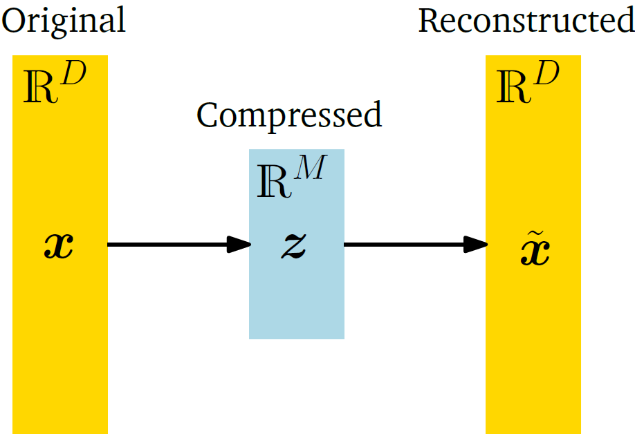

**[Reference]**  
$\bullet$ [MATHEMATICS FOR MACHINE LEARNING](https://mml-book.github.io/)
{: .notice--success}

# Introduction 

Working directly with high-dimensional data, such as images, comes with some difficulties: hard to analyze/interpretation/visualization and storage of the data vectors can be expensive.
However, high-dimensional data is often overcomplete.

Dimensionality of data can be reduced and it allows us to work with a more compact representation of the data, ideally without losing information.

In this chapter, we will discuss **_principal component analysis_** (PCA), an algorithm for linear dimensionality reduction.


# 1.Problem Setting

In PCA, we are interested in finding projections $\tilde{\vec{x}}_n$ of data points $\vec{x}_n$ that are as similar to the original data points as possible, but which have a significantly lower intrinsic dimensionality. 

Consider an i.i.d. dataset $$\mathcal{X} = \{\vec{x}_1, \dots, \vec{x}_N\}$$ whose mean is $\vec{0}$, where each $$\vec{x}_n \in \mathbb{R}^D$$, and its corresponding data matrix can be written as

$$\mathbf{X} = \begin{pmatrix} \vec{x}_1 & \dots & \vec{x}_N \end{pmatrix} = \begin{pmatrix} x_{1,1} & x_{1,2} & \dots & x_{1,N} \\ x_{2,1} & x_{2,2} & \dots & x_{2,N} \\ \vdots & \vdots & \ddots & \vdots \\ x_{D,1} & x_{D,2} & \dots & x_{D,N} \end{pmatrix} \in \mathbb{R}^{D \times N}, \tag{1.1}$$

and its covariance matrix $(\mathbf{\Sigma} := \frac{1}{N} \sum_{n=1}^{N} (\vec{x}_n - \bar{\vec{x}})(\vec{x}_n - \bar{\vec{x}})^\top)$ can be written as

$$ \mathbf{S} = \frac{1}{N} \sum_{n=1}^{N} \vec{x}_n \vec{x}_n^\top. \tag{1.2}$$

Furthermore, we assume there exists a low-dimensional compressed representation (code)

$$ \vec{z}_n = \mathbf{B}^\top \vec{x}_n \in \mathbb{R}^M \tag{1.3} $$

of $\vec{x}_n$, where we define the projection matrix

$$ \mathbf{B} := [\vec{b}_1, \dots, \vec{b}_M] \in \mathbb{R}^{D \times M}. \tag{1.4} $$

We assume that the columns of $\mathbf{B}$ are orthonormal (Definition 3.7) so that $\vec{b}_i^\top \vec{b}_j = 0$ if and only if $i \neq j$ and $\vec{b}_i^\top \vec{b}_i = 1$. 
We seek an $M$-dimensional subspace $U \subseteq \mathbb{R}^D$, $\text{dim}(U) = M < D$ onto which we project the data. 
We denote the projected data by $\tilde{\vec{x}}_n \in U$, and their coordinates (with respect to the basis vectors $\vec{b}_1, \dots, \vec{b}_M$ of $U$) by $\vec{z}_n$. 
Our aim is to find projections $\tilde{\vec{x}}_n \in \mathbb{R}^D$ (or equivalently the codes $\vec{z}_n$ and the basis vectors $\vec{b}_1, \dots, \vec{b}_M$) so that they are as similar to the original data $\vec{x}_n$ and minimize the loss due to compression.

Figure 1.2 illustrates the setting we consider in PCA, where $\vec{z}$ represents the lower-dimensional representation of the compressed data $\tilde{\vec{x}}$ and plays the role of a bottleneck, which controls how much information can flow between $\vec{x}$ and $\tilde{\vec{x}}$. 

<figure style="display: flex; flex-direction: column; align-items: center; margin-top: 0.5em; margin-bottom: 0.5em;">
  
   <figcaption style="font-size: 20px; margin-top: -0.5em;">
   Fig.1.1 Graphical illustration of PCA.
   </figcaption>
</figure> 

In PCA, we consider a linear relationship between the original data $\vec{x}$ and its low-dimensional code $\vec{z}$ so that $\vec{z} = \mathbf{B}^\top\vec{x}$ and $\tilde{\vec{x}} = \mathbf{B}\vec{z}$ for a suitable matrix $\mathbf{B}$. 
We can interpret the arrows in Figure 1.1 as a pair of operations representing encoders and decoders. 
The linear mapping represented by $\mathbf{B}$ can be thought of as a decoder, which maps the low-dimensional code $\vec{z} \in \mathbb{R}^M$ back into the original data space $\mathbb{R}^D$. 
Similarly, $\mathbf{B}^\top$ can be thought of an encoder, which encodes the original data $\vec{x}$ as a low-dimensional (compressed) code $\vec{z}$.




**Definition . ()** 




