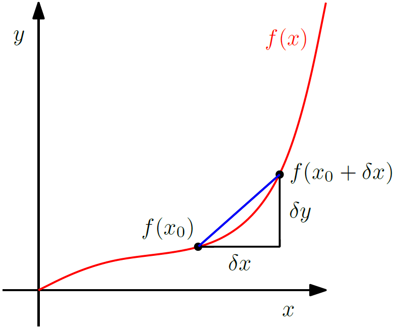

**[Reference]**  
$\bullet$ [MATHEMATICS FOR MACHINE LEARNING](https://mml-book.github.io/)
{: .notice--success}

# Introduction 

Many algorithms in machine learning can be framed as optimization problems, where we seek to find the best model parameters that describe a set of data. 
To solve these problems, we need a systematic way to find the direction of steepest ascent, which is given by the gradient.

This chapter introduces the fundamental tools of vector calculus needed to compute these gradients. 
We assume that funcitons are differentiable.


# 1.Differentiation of Univeariate Functions

Let's start with the difference quotient of a univariate function $y=f(x), x,y \in \mathbb{R}$.

<figure style="display: flex; flex-direction: column; align-items: center; margin-top: 0.5em; margin-bottom: 0.5em;">
  
   <figcaption style="font-size: 20px; margin-top: -0.5em;">
   Fig.5.1. The average incline of a function $f$ between $x_0$ and $x_0 + \delta x$ is the incline of the secant (blue) through $f(x_0)$ and $f(x_0 + \delta x)$ and given by $\delta y/\delta x$.
   </figcaption>
</figure> 


**Definition 5.1 (Difference Quotient)** 
The _difference quotient_ computes the slope of the secant line through two points on the graph of $f$.

$$\frac{\delta y}{\delta x} := \frac{f(x+\delta x) - f(x)}{\delta x} \tag{5.1}$$

It can also be considered the average slope of $f$ between $x$ and $x + \delta x$ if we assume $f$ to be a linear function. 
For $\delta x \rightarrow 0$, we obtain the tangent of $f$ at $x$ which is the derivate of $f$ at $x$, if $f$ is differentiable.



**Definition 5.2 (Derivative)** 
For $h \gt 0$ the derivataive of $f$ at $x$ is defined as the below and the secant in Fig.5.1 becomes a tangent.

$$\frac{\mathrm{d}f}{\mathrm{d}x} := \lim_{h \to 0} \frac{f(x+h) - f(x)}{h} \tag{5.2}$$

The derivative of $f$ points in the direction of steepest ascent of $f$.


## 1-1) Taylor Series
The Taylor series is a representation of a funciton $f$ as an infinite sum of terms.
These terms are determined using derivatives of $f$ evaluated at $x_0$.


**Definition 5.3 (Taylor Polynomial)** 
The _Taylor polynomial_ of degree $n$ of $f: \mathbb{R} \rightarrow \mathbb{R}$ at $x_0$ is defined as below where $f^{(k)}(x_0)$ is the $k$th derivative of $f$ at $x_0$ and $\frac{f^{(k)}(x_0)}{k!}$ are the coefficients of the polynomial.

$$T_n(x) := \sum_{k=0}^{n} \frac{f^{(k)}(x_0)}{k!} (x - x_0)^k, \tag{5.3}$$




**Definition 5.4 (Taylor Series)** 
For a smooth function $f \in \mathcal{C}^{\infty}, f:\mathbb{R} \rightarrow \mathbb{R}$, the _Taylor series_ of $f$ at $x_0$ is defined as below.

$$T_{\infty}(x) = \sum_{k=0}^{\infty} \frac{f^{(k)}(x_0)}{k!} (x - x_0)^k. \tag{5.4}$$

If $f(x)=T_{\infty}(x)$, then $f$ is called **_analytic_**.
For $x_0 = 0$, we obtain the _Maclaurin series_ as a special instance of the Taylor series.


## 1-2) Differentiation Rules
The basic differentiation rules are below.

$$\begin{align}
\text{Product rule:} \quad & (f(x)g(x))' = f'(x)g(x) + f(x)g'(x) \tag{5.5} \\
\text{Quotient rule:} \quad & \left(\frac{f(x)}{g(x)}\right)' = \frac{f'(x)g(x) - f(x)g'(x)}{(g(x))^2} \tag{5.6} \\
\text{Sum rule:} \quad & (f(x) + g(x))' = f'(x) + g'(x) \tag{5.7} \\
\text{Chain rule:} \quad & (g(f(x)))' = (g \circ f)'(x) = g'(f(x))f'(x) \tag{5.8}
\end{align}
$$

Here, $g \circ f$ denotes function composition $x \mapsto f(x) \mapsto g(f(x))$.


# 2.Partial Differentiation and Gradients

Let's consider the general case where the function $f$ depends on one or more variables $\vec{x} \in \mathbb{R}^n$. 


**Definition 5.5 (Partial Derivative)** 
For a function $f: \mathbb{R}^{n} \rightarrow \mathbb{R}, \vec{x} \mapsto f(\vec{x}), \vec{x} \in \mathbf{R}^n$ of $n$ variables $x_1, \dots, x_n$, we define the _partial derivatives_ as 

$$\begin{align}
\frac{\partial f}{\partial x_1} &= \lim_{h \to 0} \frac{f(x_1 + h, x_2, \dots, x_n) - f(\mathbf{x})}{h} \nonumber \\
& \ \ \vdots \tag{5.9} \\
\frac{\partial f}{\partial x_n} &= \lim_{h \to 0} \frac{f(x_1, \dots, x_{n-1}, x_n + h) - f(\mathbf{x})}{h} \nonumber
\end{align}$$

and collect them inthe row vector

$$\nabla_{\vec{x}} f = \text{grad} f = \frac{\mathrm{d}f}{\mathrm{d}\vec{x}} = \begin{bmatrix} \frac{\partial f(\vec{x})}{\partial x_1} & \frac{\partial f(\vec{x})}{\partial x_2} & \dots & \frac{\partial f(\vec{x})}{\partial x_n} \end{bmatrix} \in \mathbb{R}^{1 \times n}, \tag{5.10}$$

where $n$ is the number of variables and 1 is the dimension of the image/range/codomain of $f$.

Here, we defined the $\vec{x} = [x_1, \dots, x_n]^{\top} \in \mathbf{R}^{n}$ as the column vector and the **_gradient_** of $f$ (also called **_Jacobian_**) of (5.10) as the row vector.

This notation is called **_numerator layout_**. 
In this notation, the shape of the gradient is defined as $$\text{(output dimension)}\times \text{(input dimension)}$$.

In the case of the gradient of function $f:\mathbb{R}^n \rightarrow \mathbb{R}$, the shape of $\nabla f$ is $(1 \times n)$.

The reason why we define the gradient vector as a row vector is twofold:

- We can consistently generalize the gradient to vector-valued functions $f:\mathbb{R}^n \rightarrow \mathbb{R}^m$ (then the gradient becomes a matrix).
- We can immediately apply the multi-variate chain rule without paying attention to the dimension of the gradient.


**Example** 
For $f(x_1, x_2) = x_1^2x_2 + x_1x_2^3, f: \mathbb{R}^2 \rightarrow \mathbb{R}$, 

$$ \frac{\mathrm{d}f}{\mathrm{d}\vec{x}} = \begin{bmatrix} \frac{\partial f(x_1, x_2)}{\partial x_1} & \frac{\partial f(x_1, x_2)}{\partial x_2} \end{bmatrix} = \begin{bmatrix} 2x_1x_2 + x_2^3 & x_1^2 + 3x_1x_2^2 \end{bmatrix} \in \mathbb{R}^{1 \times 2}. $$




## 2-1) Basic Rules of Partial Differentiation
The basic differentiation rules with respect to vectors $\vec{x} \in \mathbb{R}^n$ are below. 
We need to pay attention: Our gradients now involve voctors and matrices, and matrix multiplication is not commutative, the order matters.

$$\begin{align}
\text{Product rule:} \quad & \frac{\partial}{\partial \vec{x}}(f(\vec{x})g(\vec{x})) = \frac{\partial f}{\partial \vec{x}}g(\vec{x}) + f(\vec{x})\frac{\partial g}{\partial \vec{x}} \tag{5.11} \\
\text{Sum rule:} \quad & \frac{\partial}{\partial \vec{x}}(f(\vec{x}) + g(\vec{x})) = \frac{\partial f}{\partial \vec{x}} + \frac{\partial g}{\partial \vec{x}} \tag{5.12} \\
\text{Chain rule:} \quad & \frac{\partial}{\partial \vec{x}}(g \circ f)(\vec{x}) = \frac{\partial}{\partial \vec{x}}(g(f(\vec{x}))) = \frac{\partial g}{\partial f}\frac{\partial f}{\partial \vec{x}} \tag{5.13}
\end{align}$$

## 2-2) Chain Rule
Consider a function $f: \mathbb{R}^2 \rightarrow \mathbb{R}$ of two variables $x_1, x_2$ which are functions of $t$ themselves, $x_1(t), x_2(t)$, $\vec{x}: \mathbb{R} \rightarrow \mathbb{R}^2$.
To compute the gradient of $f$ with respect to $t$, we need to apply the chain rule for multivariate functions where $\mathrm{d}$ denotes the gradient and $\partial$ partial derivatives.

$$\underbrace{\frac{\mathrm{d}f}{\mathrm{d}t}}_{(1\times 1)} = \underbrace{\frac{\mathrm{d}f}{\mathrm{d}\vec{x}}}_{(1\times 2)} \underbrace{\frac{\mathrm{d}\vec{x}}{\mathrm{d}t}}_{(2\times 1)} = \begin{bmatrix} \frac{\partial f}{\partial x_1} & \frac{\partial f}{\partial x_2} \end{bmatrix} \begin{bmatrix} \frac{\partial x_1(t)}{\partial t} \\ \frac{\partial x_2(t)}{\partial t} \end{bmatrix} = \frac{\partial f}{\partial x_1}\frac{\partial x_1}{\partial t} + \frac{\partial f}{\partial x_2}\frac{\partial x_2}{\partial t}, \tag{5.14}$$

If $f(x_1, x_2): \mathbb{R}^2 \rightarrow \mathbb{R}$ is a function of $x_1$ and $x_2$, where $x_1(s,t)$ and $x_2(s,t)$ are themselves functions of two variables $s$ and $t$, $$\vec{x}(s,t) = \begin{pmatrix} x_1(s,t) \\ x_2(s,t) \end{pmatrix}: \mathbb{R}^2 \rightarrow \mathbb{R}^2$$, the chain rule yields the partial derivatives below.

$$\begin{align}
\frac{\partial f}{\partial s} &= \frac{\partial f}{\partial x_1}\frac{\partial x_1}{\partial s} + \frac{\partial f}{\partial x_2}\frac{\partial x_2}{\partial s}, \tag{5.15} \\
\frac{\partial f}{\partial t} &= \frac{\partial f}{\partial x_1}\frac{\partial x_1}{\partial t} + \frac{\partial f}{\partial x_2}\frac{\partial x_2}{\partial t}, \tag{5.16}
\end{align}$$

And the gradient is obtained by the matrix multiplicaiton as below.

$$\underbrace{\frac{\mathrm{d}f}{\mathrm{d}(s,t)}}_{(1\times 2)} = \underbrace{\frac{\partial f}{\partial \vec{x}}}_{(1\times 2)} \underbrace{\frac{\partial \vec{x}}{\partial (s,t)}}_{(2 \times 2)} = 
\underbrace{
    \begin{bmatrix} \frac{\partial f}{\partial x_1} & \frac{\partial f}{\partial x_2} \end{bmatrix}
}_{=\frac{\partial f}{\partial \vec{x}}}
\underbrace{
    \begin{bmatrix} \frac{\partial x_1}{\partial s} & \frac{\partial x_1}{\partial t} \\ \frac{\partial x_2}{\partial s} & \frac{\partial x_2}{\partial t} \end{bmatrix}
}_{=\frac{\partial \vec{x}}{\partial (s,t)}}. \tag{5.17}$$

This may still be straightforward as long as the gradient is a vector or a matrix; however, when the gradient becomes a tensor, the transpose is no longer a triviality.


# 3.Gradients of Vector-Valued Functions

In the following, we will generalize the concept of the gradient to vector-valued functions (vector fields) $\vec{f}: \mathbb{R}^n \rightarrow \mathbb{R}^m$, where $n \ge 1$ and $m \gt 1$.

For a function $\vec{f}: \mathbb{R}^n \rightarrow \mathbb{R}^m$ and a vector $\vec{x}=[x_1, \dots, x_n]^{\top} \in \mathbb{R}^n$, the corresponding vector of function values is given as below.

$$\vec{f}(\vec{x}) = \begin{bmatrix} f_1(\vec{x}) \\ \vdots \\ f_m(\vec{x}) \end{bmatrix} \in \mathbb{R}^m. \tag{5.18}$$

In this form, the vector-valued function can be considered as a vector of scalar fucntions $[f_1, \dots, f_m]^{\top}$.
The differentiation rules for every $f_i$ are exactly the ones we discussed in **[2.Partial Differentiation and Gradients]**.

Therefore, the partial derivate of a vector-valued function $\vec{f}: \mathbb{R}^n \rightarrow \mathbb{R}^m$ with respect to $x_i \in \mathbb{R}$, $i=1,\dots, n$, is given as the vector below. 

$$\frac{\partial \vec{f}}{\partial x_i} = 
\begin{bmatrix} 
\frac{\partial f_1}{\partial x_i} \\ 
\vdots \\ 
\frac{\partial f_m}{\partial x_i} 
\end{bmatrix} 
= 
\begin{bmatrix} 
\lim\limits_{h \to 0} \frac{f_1(x_1, \dots, x_{i-1}, x_i+h, x_{i+1}, \dots, x_n) - f_1(\vec{x})}{h} \\ 
\vdots \\ 
\lim\limits_{h \to 0} \frac{f_m(x_1, \dots, x_{i-1}, x_i+h, x_{i+1}, \dots, x_n) - f_m(\vec{x})}{h} 
\end{bmatrix} 
\in \mathbb{R}^m. \tag{5.19}$$

We know that the gradient of $\vec{f}$ with respect to a vector is the row vector of the partial derivatives. 
Here, in (5.19), every partial derivative $\frac{\partial \vec{f}}{\partial x_i}$ is itself a column vector. 
Therefore, the gradient of $\vec{f}: \mathbb{R}^n \rightarrow \mathbb{R}^m$ with respect to $\vec{x} \in \mathbb{R}^n$ by collecting these partial derivatives as below.

$$\begin{align}
\frac{\mathrm{d}\vec{f}(\vec{x})}{\mathrm{d}\vec{x}} &= \begin{bmatrix} \frac{\partial\vec{f}(\vec{x})}{\partial x_1} & \dots & \frac{\partial\vec{f}(\vec{x})}{\partial x_n} \end{bmatrix} \tag{5.20a} \\
&= \begin{bmatrix}
\frac{\partial f_1(\vec{x})}{\partial x_1} & \dots & \frac{\partial f_1(\vec{x})}{\partial x_n} \\
\vdots & \ddots & \vdots \\
\frac{\partial f_m(\vec{x})}{\partial x_1} & \dots & \frac{\partial f_m(\vec{x})}{\partial x_n}
\end{bmatrix} \in \mathbb{R}^{m \times n}. \tag{5.20b}
\end{align}$$


**Definition 5.6 (Jacobian)** 
The collection of all first-order partial derivatives of a vector-valued function $\vec{f}: \mathbb{R}^n \rightarrow \mathbb{R}^m$ is called **_Jacobian_**, $\mathbf{J}$ which is an $m\times n$ matrix.

$$\begin{align}
\mathbf{J} = \nabla_{\vec{x}}\vec{f} &= \frac{\mathrm{d}\vec{f}(\vec{x})}{\mathrm{d}\vec{x}} = \begin{bmatrix} \frac{\partial\vec{f}(\vec{x})}{\partial x_1} & \dots & \frac{\partial\vec{f}(\vec{x})}{\partial x_n} \end{bmatrix} \tag{5.57} \\
&= \begin{bmatrix}
\frac{\partial f_1(\vec{x})}{\partial x_1} & \dots & \frac{\partial f_1(\vec{x})}{\partial x_n} \\
\vdots & \ddots & \vdots \\
\frac{\partial f_m(\vec{x})}{\partial x_1} & \dots & \frac{\partial f_m(\vec{x})}{\partial x_n}
\end{bmatrix}, \tag{5.58} \\
\vec{x} &= \begin{bmatrix} x_1 \\ \vdots \\ x_n \end{bmatrix}, \quad J(i,j) = \frac{\partial f_i}{\partial x_j}. \tag{5.59}
\end{align}$$




**Example (Gradient of a Vector-Valued Function)** 
Consider

$$ \vec{f}(\vec{x}) = \mathbf{A}\vec{x}, \quad \vec{f}(\vec{x}) \in \mathbb{R}^M, \quad \mathbf{A} \in \mathbb{R}^{M \times N}, \quad \vec{x} \in \mathbb{R}^N. $$

To compute the gradient $\frac{\mathrm{d}\vec{f}}{\mathrm{d}\vec{x}}$, 

- First determine the dimension of $\frac{\mathrm{d}\vec{f}}{\mathrm{d}\vec{x}}$. Since $\vec{f} : \mathbb{R}^N \to \mathbb{R}^M$, it follows that $\frac{\mathrm{d}\vec{f}}{\mathrm{d}\vec{x}} \in \mathbb{R}^{M \times N}$. 

- Second, to compute the gradient we determine the partial derivatives of $\vec{f}$ with respect to every $x_j$:

$$ f_i(\vec{x}) = \sum_{j=1}^{N} A_{ij}x_j \implies \frac{\partial f_i}{\partial x_j} = A_{ij}$$

We collect the partial derivatives in the Jacobian and obtain the gradient

$$ \frac{\mathrm{d}\vec{f}}{\mathrm{d}\vec{x}} = \begin{bmatrix} \frac{\partial f_1}{\partial x_1} & \dots & \frac{\partial f_1}{\partial x_N} \\ \vdots & \ddots & \vdots \\ \frac{\partial f_M}{\partial x_1} & \dots & \frac{\partial f_M}{\partial x_N} \end{bmatrix} = \begin{bmatrix} A_{11} & \dots & A_{1N} \\ \vdots & \ddots & \vdots \\ A_{M1} & \dots & A_{MN} \end{bmatrix} = \mathbf{A} \in \mathbb{R}^{M \times N}.$$

Differentiation is the process of finding the best linear approximation of a function at a certain point.

In other words, it's about finding the linear transformation that describes how the function changes in a very small region.

Since the function $\vec{f}(\vec{x}) = \mathbf{A}\vec{x}$ is linear from the start, the best linear transformation that approximates its change at any point is inevitably the function's matrix $\mathbf{A}$ itself.
As an analogy, it's like saying, "the tangent line that best approximates a straight line at any point is the original straight line itself."



**Example (Chain Rule)** 
Consider the function $h: \mathbb{R} \to \mathbb{R}$, $h(t) = (f \circ g)(t)$ with

$$\begin{align}
    f: \mathbb{R}^2 \to \mathbb{R}, \ g: \mathbb{R} \to \mathbb{R}^2 \text{ and } f(\vec{x}) = \exp(x_1x_2^2) \text{ and } \vec{x} = \begin{bmatrix} x_1 \\ x_2 \end{bmatrix} = g(t) = \begin{bmatrix} t\cos t \\ t\sin t \end{bmatrix}.
\end{align}$$

To compute the gradient of $h$ with respect to $t$, 

- First determine the dimension: 

$$\text{Since }f: \mathbb{R}^2 \to \mathbb{R} \text{ and } g: \mathbb{R} \to \mathbb{R}^2, \ \frac{\partial f}{\partial \vec{x}} \in \mathbb{R}^{1\times 2} \text{ and } \frac{\partial g}{\partial t} \in \mathbb{R}^{2\times 1}$$ 

- Second, applying the chain rule:

$$\begin{align}
    \frac{\mathrm{d}h}{\mathrm{d}t} &= \frac{\partial f}{\partial \vec{x}}\frac{\partial \vec{x}}{\partial t} = \begin{bmatrix} \frac{\partial f}{\partial x_1} & \frac{\partial f}{\partial x_2} \end{bmatrix} \begin{bmatrix} \frac{\partial x_1}{\partial t} \\ \frac{\partial x_2}{\partial t} \end{bmatrix} \\
    &= \begin{bmatrix} \exp(x_1x_2^2)x_2^2 & 2\exp(x_1x_2^2)x_1x_2 \end{bmatrix} \begin{bmatrix} \cos t - t\sin t \\ \sin t + t\cos t \end{bmatrix} \\
    &= \exp(x_1x_2^2)(x_2^2(\cos t - t\sin t) + 2x_1x_2(\sin t + t\cos t)), 
\end{align}$$

where $x_1 = t\cos t$ and $x_2 = t\sin t$.

Here, we can know that:

- The chain rule for multivariate functions can be expressed as the multiplication of the Jacobian matrices of each function.
- This example clearly shows the advantage of consistently defining the shape of a gradient/Jacobian as $\text{(output dimension)}\times \text{(input dimension)}$. With this convention, a complex chain rule can be calculated as a simple matrix multiplication without needing to worry about matching dimensions.



**Example (Gradient of a Least-Squares Loss in a Linear Model)** 
Consider the linear model 

$$\vec{y} = \mathbf{\Phi}\vec{\theta}, \ \begin{align} &\vec{\theta} \in \mathbb{R}^{D}: \text{Parameters we want to find} \\ &\mathbf{\Phi} \in \mathbb{R}^{N\times D}: \text{Input features} \\ &\vec{y} \in \mathbb{R}^{N}: \text{Corresponding observations} \end{align}$$

We define the error function and loss function as below.

$$\begin{align} \text{Loss function}: L(\vec{e}) &= \|\vec{e}\|^2 \\ \text{Error function}: \vec{e}(\vec{\theta}) &= \vec{y} - \mathbf{\Phi}\vec{\theta} \end{align}$$

To find best parameter $\vec{\theta}$ which minimize the loss function, we seek $\frac{\partial L}{\partial \vec{\theta}}$ using chain rule.

- Since flow of function is $\vec{\theta} \to \vec{e} \to L$, the chain rule allows us to comupute the gradients as below.

$$\frac{\partial L}{\partial \vec{\theta}} = \frac{\partial L}{\partial \vec{e}}\frac{\partial \vec{e}}{\partial \vec{\theta}}$$

- Calculation of $\frac{\partial L}{\partial \vec{e}}$

$$\frac{\partial L}{\partial \vec{e}} = 2\vec{e}^\top \in \mathbb{R}^{1 \times N}$$

- Calculation of $\frac{\partial \vec{e}}{\partial \vec{\theta}}$

$$\frac{\partial \vec{e}}{\partial \vec{\theta}} = -\mathbf{\Phi} \in \mathbb{R}^{N \times D}$$

- Calculation of $\frac{\partial L}{\partial \vec{\theta}}$

$$\frac{\partial L}{\partial \vec{\theta}} = -2\vec{e}^\top\mathbf{\Phi} = \underbrace{-2(\vec{y}^\top - \vec{\theta}^\top\mathbf{\Phi}^\top)}_{1 \times N}\underbrace{\mathbf{\Phi}}_{N \times D} \in \mathbb{R}^{1 \times D}$$

Here, we can know that

- It demonstrates that even for a complex function, we can compute the total derivative by breaking it into intermediate steps, differentiating each part, and then multiplying the resulting Jacobian matrices.

- It confirms that if we consistently define the dimension of each Jacobian as $\text{(output dimension)}\times \text{(input dimension)}$, the dimension of the final gradient ($1 \times D$) is automatically correct through matrix multiplication ($(1 \times N) \times (N \times D)$).






**Definition . ()** 




