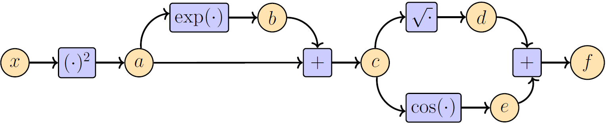
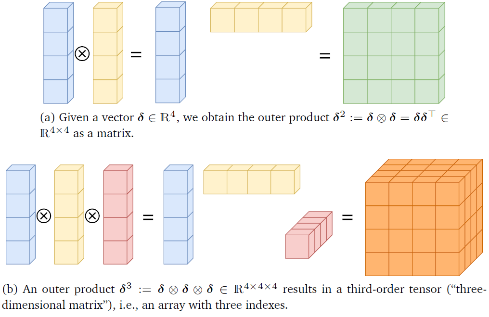

**[Reference]**  
$\bullet$ [MATHEMATICS FOR MACHINE LEARNING](https://mml-book.github.io/)
{: .notice--success}

# Introduction 

Many algorithms in machine learning can be framed as optimization problems, where we seek to find the best model parameters that describe a set of data. 
To solve these problems, we need a systematic way to find the direction of steepest ascent, which is given by the gradient.

This chapter introduces the fundamental tools of vector calculus needed to compute these gradients. 
We assume that funcitons are differentiable.


# 6.Backpropagation and Automatic Differentiation

In many machine learning applications, we find good model parameters by performing gradient descent. For a given objective function, we can obtain the gradient with respect to the model parameters using calculus and applying the chain rule. However, for deep learning models where numerous functions are nested, deriving the differentiation formula by hand leads to many problems - _Too slow and complex_.

**_Backpropagation_** is a brilliant algorithm that solves these problems. 
Instead of deriving the entire differentiation formula at once, it breaks down the computation into steps and efficiently calculates the derivative at each point by tracing backward.
In conclusion, backpropagation is the core engine that quickly and automatically computes the gradients of complex deep learning models, and it can be credited as a key contributor that made today's deep learning revolution possible.

## 6-1) Gradients in a Deep Network
One of the core components of deep learning model is backpropagation algorithm. A deep learning model is essentially a giant **composite function**, where numerous functions $(f_1, f_2,\dots, )$ are layered on top of each other. Input data ($x$) passes through these functions in sequence to produce a final prediction ($y$), and the difference between this prediction and the actual value is calculated as the loss ($L$).

Our goal is to find the gradient of this final loss ($L$) with respect to all the parameters ($A_i, b_i$) that make up the model, in order to minimize the loss. The gradient of such a deeply nested function can be found using the chain rule from mathematics. To find the gradient of the loss ($L$) with respect to a specific parameter ($\theta_i$), we must apply the chain rule continuously:

$$\frac{\partial L}{\partial \theta_i} = \frac{\partial L}{\partial f_K} \frac{\partial f_K}{\partial f_{K-1}} \cdots \frac{\partial f_{i+1}}{\partial \theta_i} \tag{5.34}$$

An important pattern emerges here: to calculate the gradient of any layer, you always need the gradient calculated from the next layer ($\frac{\partial L}{\partial f_{i+1}}$).

Backpropagation is an algorithm that leverages this very pattern. As its name suggests, it starts from the final loss $L$ and propagates the gradient at each point by moving backward through the neural network. The core of backpropagation lies in the reuse of calculations. The gradient value calculated at one layer is directly reused to calculate the gradient of the previous layer. This dramatically reduces redundant calculations, leading to immense computational efficiency.

In conclusion, backpropagation is the core engine that calculates the gradients of the giant composite function of deep learning in a very fast and efficient manner, based on the chain rule.


**Example (Backpropagation)** 

Consider the function and break down the complex function $f(x)$ into a sequence of simple steps as below.

<figure style="display: flex; flex-direction: column; align-items: center; margin-top: 0.5em; margin-bottom: 0.5em;">
  
   <figcaption style="font-size: 20px; margin-top: -0.5em;">
   </figcaption>
</figure> 

$$f(x) = \sqrt{x^2 + \exp(x^2)} + \cos(x^2 + \exp(x^2)), \quad \begin{cases}
a &= x^2, \\
b &= \exp(a), \\
c &= a + b, \\
d &= \sqrt{c}, \\
e &= \cos(c), \\
f &= d + e.
\end{cases}$$

This process of calculating from the input $x$ to the final output $f$ is called the forward pass.
Since each step is a very simple function, we can easily compute its derivative with respect to its input (the local gradient).

$$\begin{align*}
\frac{\partial a}{\partial x} &= 2x \\
\frac{\partial b}{\partial a} &= \exp(a) \\
\frac{\partial c}{\partial a} &= 1 = \frac{\partial c}{\partial b} \\
\frac{\partial d}{\partial c} &= \frac{1}{2\sqrt{c}} \\
\frac{\partial e}{\partial c} &= -\sin(c) \\
\frac{\partial f}{\partial d} &= 1 = \frac{\partial f}{\partial e}
\end{align*}$$

Now, to find our final goal, $\frac{\partial f}{\partial x}$, we apply the chain rule starting from the end of the graph and work our way backward to compute the derivatives.

**1. Start**: $\frac{\partial f}{\partial f} = 1$ (The derivative of a variable with respect to itself is 1).

**2. From f to d, e: Since $f=d+e$,**
- $\frac{\partial f}{\partial d} = \frac{\partial f}{\partial f} \frac{\partial f}{\partial d} = 1 \cdot 1 = 1$
- $\frac{\partial f}{\partial e} = \frac{\partial f}{\partial f} \frac{\partial f}{\partial e} = 1 \cdot 1 = 1$

**3. From d, e to c: Since $c$ affects both $d$ and $e$, we sum the gradients from both paths.**
- $\frac{\partial f}{\partial c} = \frac{\partial f}{\partial d}\frac{\partial d}{\partial c} + \frac{\partial f}{\partial e}\frac{\partial e}{\partial c} = (1) \cdot (\frac{1}{2\sqrt{c}}) + (1) \cdot (-\sin(c))$

**4. From c to a, b: We use the value of $\frac{\partial f}{\partial c}$ that we just computed.**
- $\frac{\partial f}{\partial b} = \frac{\partial f}{\partial c}\frac{\partial c}{\partial b} = \frac{\partial f}{\partial c} \cdot 1$
- $\frac{\partial f}{\partial a} = \frac{\partial f}{\partial b}\frac{\partial b}{\partial a} + \frac{\partial f}{\partial c}\frac{\partial c}{\partial a} = (\frac{\partial f}{\partial b}) \cdot (\exp(a)) + (\frac{\partial f}{\partial c}) \cdot 1$

**5. From a to x: Finally, we compute $\frac{\partial f}{\partial x}$.**
- $\frac{\partial f}{\partial x} = \frac{\partial f}{\partial a}\frac{\partial a}{\partial x} = (\frac{\partial f}{\partial a}) \cdot (2x)$

 

Here, we can know that 
- This example clearly shows that backpropagation is an algorithm that breaks down a complex function into a simple computation graph and uses the chain rule to compute gradients by working backward from the output to the input.
- We can see that the gradient value calculated in a later step is reused to compute gradients in earlier steps (e.g., $\frac{\partial f}{\partial c}$ is used to compute both $\frac{\partial f}{\partial a}$ and $\frac{\partial f}{\partial b}$). This is why backpropagation is so efficient.
- Algorithmic approach of backpropagation can compute the final derivative formula with a computational complexity similar to that of the function itself.




# 7.Higher-Order Derivatives

We have discussed gradients, i.e., first-order derivatives which tell us the direction of the steepest ascent at a specific point on a function. 
Then how can know the shape of the function at that point - Concave or Convex?
The **_Hessian matrix_** gives us informatino about the shape.
The Hessian matrix, $\mathbf{H}$ is a square matrix that collects all the second-order partial derivatives of a function.

Consider a function $f:\mathbb{R}^2 \to \mathbb{R}$ of two variables $x,y$.
If $f(x,y)$ is a twice (continuously) differentiable function, then 

$$\frac{\partial^2 f}{\partial x \partial y} = \frac{\partial^2 f}{\partial y \partial x}, \tag{5.35}$$

which is known as Schwarz's theorem, and the corresponding Hessian matrix can be written as below.

$$\mathbf{H} = \begin{bmatrix} 
\frac{\partial^2 f}{\partial x^2} & \frac{\partial^2 f}{\partial x \partial y} \\
\frac{\partial^2 f}{\partial x \partial y} & \frac{\partial^2 f}{\partial y^2} 
\end{bmatrix} \tag{5.36}$$

One of the most important properties of the Hessian is that it is always a **_symmetric matrix_** by Schwarz's theorem.
The Hessian is denoted as $\nabla^{2}_{x,y} f(x,y)$. 

The Hessian is the derivative of the gradient vector with respect to the input vector.
Generally, for $\vec{x} \in \mathbb{R}^n$ and $f: \mathbb{R}^n \to \mathbb{R}$, this means differentiating the gradient, $\nabla_{\vec{x}}f = \frac{\mathrm{d}f}{\mathrm{d}\vec{x}} = \left( \frac{\partial f(\vec{x})}{\partial x_{1}}, \dots, \frac{\partial f(\vec{x})}{\partial x_{n}} \right)$, which results in an $n \times n$ matrix as below.

$$\mathbf{H} = \nabla_{\vec{x}}^2 f = \begin{pmatrix}
\frac{\partial^2 f}{\partial x_1^2} & \frac{\partial^2 f}{\partial x_1 \partial x_2} & \cdots & \frac{\partial^2 f}{\partial x_1 \partial x_n} \\
\frac{\partial^2 f}{\partial x_2 \partial x_1} & \frac{\partial^2 f}{\partial x_2^2} & \cdots & \frac{\partial^2 f}{\partial x_2 \partial x_n} \\
\vdots & \vdots & \ddots & \vdots \\
\frac{\partial^2 f}{\partial x_n \partial x_1} & \frac{\partial^2 f}{\partial x_n \partial x_2} & \cdots & \frac{\partial^2 f}{\partial x_n^2}
\end{pmatrix} \tag{5.37}$$

The Hessian measures the curvature of the function or shape locally around $(x,y)$.
By analyzing the propoerties of the Hessian at a point where the gradient is zero, we can determine what kind of point it is.
- **Hessian is positive definite**
    

    The function is concave up in all directions, forming a local minimum.
    

- **Hessian is negative definite**
    

    The function is convex in all directions, forming a local maximum. 
    

- **Hessian is indefinite**
    

    The function is convex in some directions and concave in others, forming a saddle point.
    

This curvature information is crucial for **optimization**.
Second-order optimization algorithms like Newton's method use not only the gradient (which way is down) but also the Hessian (how steeply it goes down) to find the optimal point much more quickly and efficiently than gradient descent.


# 8.Linearization and Multivariate Taylor Series

In the following, we will discuss the approximation of function.
By using **_Taylor series_**, we can approximate any complex function with a simple polynomial.


**Definition 5.7 (Multivariate Taylor Series)** 
Consider a function that is smooth at $\vec{x}_0$.

$$\begin{align}
f: \mathbb{R}^D &\to \mathbb{R} \tag{5.38} \\
\vec{x} &\mapsto f(\vec{x}), \quad \vec{x} \in \mathbb{R}^D, \tag{5.39} \\
\end{align}$$

When we define the difference vector $\vec{\delta} := \vec{x} - \vec{x}_0$, the multivariate Taylor series of $f$ at $(\vec{x}_0)$ is defined as 

$$f(\vec{x}) = \sum_{k=0}^{\infty} \frac{D_{\vec{x}}^k f(\vec{x}_0)}{k!} \vec{\delta}^k, \tag{5.40}$$

where $D_{\vec{x}}^k f(\vec{x}_0)$ is the $k$-th (total) derivative of $f$ with respect to $\vec{x}$, evaluated at $\vec{x}_0$.



**Definition 5.8 (Taylor Polynomial)** 
The Taylor polynomial of degree $n$ of $f$ at $\vec{x}_0$ contains the first $n+1$ commponents of the series in (5.40) and is defined as below. 

$$T_n(\vec{x}) = \sum_{k=0}^{n} \frac{D_{\vec{x}}^k f(\vec{x}_0)}{k!} \vec{\delta}^k. \tag{5.41}$$



Here, $D_{\vec{x}}^k f$ and $\vec{\delta}^k$ are $k$-the order thensors, $k$-dimensional arrays.
The $k$-th order tensor $\vec{\delta}^k \in \mathbb{R}^{\overbrace{D\times D \times \dots \times D}^{\text{$k$ times}}}$ is obtained as a $k$-fold outer product, denoted by $\otimes$, of the vector $\vec{\delta} \in \mathbb{R}^D$.

For example, 

$$\vec{\delta}^2 := \vec{\delta} \otimes \vec{\delta} = \vec{\delta}\vec{\delta}^\top, \quad \delta^2[i, j] = \delta[i]\delta[j] \tag{5.42}$$

$$\vec{\delta}^3 := \vec{\delta} \otimes \vec{\delta} \otimes \vec{\delta}, \quad \delta^3[i, j, k] = \delta[i]\delta[j]\delta[k]. \tag{5.43}$$

<figure style="display: flex; flex-direction: column; align-items: center; margin-top: 0.5em; margin-bottom: 0.5em;">
  
   <figcaption style="font-size: 20px; margin-top: -0.5em;">
   Fig.5.2. Visualizing outer products. Outer products of vectors increase the dimensionality of the array by 1 per term. (a) The outer product of two vectors results in a matrix; (b) the outer product of three vectors yields a third-order tensor.
   </figcaption>
</figure> 

Figure.5.2 visualizes two such outer proudcts.
In general, we obtain the terms 

$$D_{\vec{x}}^k f(\vec{x}_0) \vec{\delta}^k = \sum_{i_1=1}^{D} \cdots \sum_{i_k=1}^{D} D_{\vec{x}}^k f(\vec{x}_0)[i_1, \dots, i_k] \delta[i_1] \cdots \delta[i_k] \tag{5.44}$$

in the Taylor series, where $D_{\vec{x}}^k f(\vec{x}_0) \vec{\delta}^k$ contains $k$-th order polynomials.


**Example** 
For $k=0,\dots, 3$ and $$\vec{\delta} := \vec{x} - \vec{x}_0$$, we can write down the first term $D_{\vec{x}}^k f(\vec{x}_0) \vec{\delta}^k$ as below.

$$\begin{align}
k=0: D_{\vec{x}}^0 f(\vec{x}_0)\vec{\delta}^0 &= f(\vec{x}_0) \in \mathbb{R} \\
k=1: D_{\vec{x}}^1 f(\vec{x}_0)\vec{\delta}^1 &= \underbrace{\nabla_{\vec{x}}f(\vec{x}_0)}_{1 \times D} \underbrace{\vec{\delta}}_{D \times 1} = \sum_{i=1}^{D} \nabla_{\vec{x}}f(\vec{x}_0)[i]\delta[i] \in \mathbb{R} \\
k=2: D_{\vec{x}}^2 f(\vec{x}_0)\vec{\delta}^2 &= \text{tr}(\underbrace{\mathbf{H}(\vec{x}_0)}_{D \times D} \underbrace{\vec{\delta}\vec{\delta}^\top}_{D \times 1 \ 1 \times D}) = \vec{\delta}^\top \mathbf{H}(\vec{x}_0) \vec{\delta} \\
&= \sum_{i=1}^{D} \sum_{j=1}^{D} H[i, j]\delta[i]\delta[j] \in \mathbb{R} \\
k=3: D_{\vec{x}}^3 f(\vec{x}_0)\vec{\delta}^3 &= \sum_{i=1}^{D} \sum_{j=1}^{D} \sum_{k=1}^{D} D_{\vec{x}}^3 f(\vec{x}_0)[i, j, k]\delta[i]\delta[j]\delta[k] \in \mathbb{R} 
\end{align}$$


