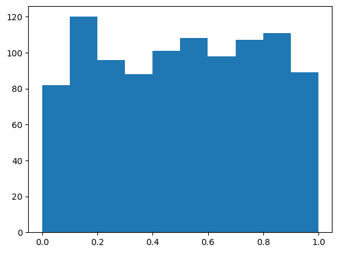
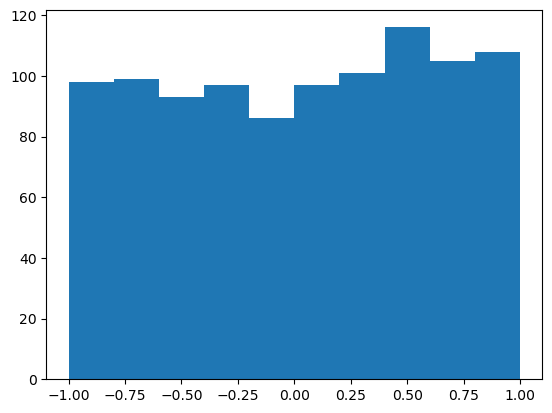
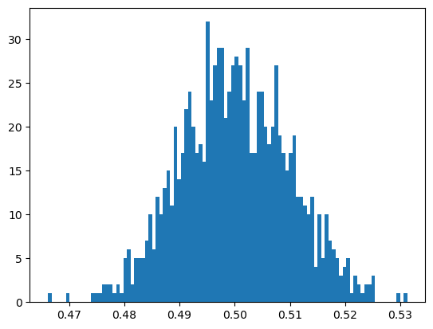

**[Reference]** <br>
$\bullet$ [홍정모의 파이썬 프로그래밍 추월코스](https://www.honglab.ai/courses/python)<br>
This post is written based on above lecture.<br>
All contents in this post are not the same with above lecture.<br>
Please show the detail at the his lecture.
{: .notice--success}

# Introduction

Python makes working with randomness with its built-in `random` module.


# 1.Integer Random Numbers

Using the `random` module, you can generate random numbers within a desired range with functions like `randrange()` and `randint()`.

## 1-1) `random.randrange()`

This function generates a random integer from a given range, similar to how `range()` works.
```python
import random

# Generate one random number from the sequence 1, 3, 5.
# (start, stop, step): Generates an integer >= start and < stop.
# The syntax of randrange() is a bit more general.
random.randrange(1, 7, 2)
```
```python
1
```


## 1-2) `random.randint()`

This function generates a random integer within a specified range, inclusive of both endpoints.
```python
# Generate a random integer between 1 and 6 (inclusive).
random.randint(1, 6)
```
```python
5
```



The random numbers generated by a computer are pseudo-random; they are produced by a deterministic algorithm. This means you can reproduce the same sequence of numbers by using a `seed()`.

For example, if you set the seed value and then generate random numbers, the same numbers will be produced every time. Fixing the seed is useful when you need to generate the same pattern of random numbers consistently, such as when debugging an algorithm.
```python
import random

# Set the seed to a fixed value
random.seed(1)

for i in range(0, 30):
    print(random.randint(1, 6), end=" ")
```
```python
2 5 1 3 1 4 4 6 4 2 1 4 1 4 4 5 1 6 4 3 6 2 5 1 3 1 1 1 1 6
```



# 2.Floating-Point Random Numbers

Here, "floating-point" refers to the `float` data type, which uses floating-point representation. The three most commonly used functions for this are `random()`, `uniform()`, and `gauss()`.

## 2-1) `random.random()`

This function returns a random `float` in the range [0.0, 1.0), meaning greater than or equal to 0.0 and less than 1.0. The numbers are generated from a uniform distribution.
```python
import random

# Returns a float where 0.0 <= x < 1.0
random.random()
```
```python
0.48697074933325946
```
<br>
**Example Histogram (1000 numbers)**<br>
This histogram shows that numbers are generated with roughly equal probability across the entire range from 0.0 to 1.0.
```python
import random
import matplotlib.pyplot as plt

random_float = []

for i in range(1000):
    random_float.append(random.random())

plt.hist(random_float)
```
```python
(array([ 82., 120.,  96.,  88., 101., 108.,  98., 107., 111.,  89.]),
 array([3.25081444e-04, 1.00237771e-01, 2.00150461e-01, 3.00063151e-01,
        3.99975841e-01, 4.99888531e-01, 5.99801221e-01, 6.99713911e-01,
        7.99626601e-01, 8.99539291e-01, 9.99451981e-01]),
 <BarContainer object of 10 artists>)
```
<figure style="display: flex; flex-direction: column; align-items: center; margin-top: 0.5em; margin-bottom: 0.5em;">
  
   <figcaption style="font-size: 20px; margin-top: -0.5em;">
   </figcaption>
</figure> 


## 2-2) `random.uniform()`

This function returns a random `float` from a uniform distribution within a specified range `[a, b]`, inclusive of both endpoints.
```python
import random

# random.uniform(a, b): Generates a random float with uniform probability
# in the range a <= x <= b.
random.uniform(-1.0, 1.0)
```
```python
0.30254975671280104
```
<br>
**Example Histogram (1000 numbers)**<br>
This histogram shows a uniform distribution of random numbers between -1.0 and 1.0.
```python
import random
import matplotlib.pyplot as plt

random_float = []

for i in range(1000):
    random_float.append(random.uniform(-1.0, 1.0))

plt.hist(random_float)
```
```python
(array([ 98.,  99.,  93.,  97.,  86.,  97., 101., 116., 105., 108.]),
 array([-9.99021728e-01, -7.99194524e-01, -5.99367321e-01, -3.99540117e-01,
        -1.99712914e-01,  1.14290059e-04,  1.99941494e-01,  3.99768697e-01,
         5.99595901e-01,  7.99423104e-01,  9.99250308e-01]),
 <BarContainer object of 10 artists>)
```
<figure style="display: flex; flex-direction: column; align-items: center; margin-top: 0.5em; margin-bottom: 0.5em;">
  
   <figcaption style="font-size: 20px; margin-top: -0.5em;">
   </figcaption>
</figure> 


## 2-3) `random.gauss()`

This function returns a random `float` from a Gaussian (or normal) distribution.
```python
import random
# random.gauss(mu, sigma): Samples from a normal distribution
# with a mean of mu and a standard deviation of sigma.
random.gauss(0.5, 0.01)
```
```python
0.4974177024596113
```
<br>
**Example Histogram (1000 numbers)**<br> 
The histogram shows that the generated numbers are clustered around the mean (0.5), with fewer numbers appearing as you move further away, which is characteristic of a normal distribution.
```python
import random
import matplotlib.pyplot as plt

random_float = []

for i in range(1000):
    random_float.append(random.gauss(0.5, 0.01))

plt.hist(random_float, 100)
```
```python
(array([ 1.,  0.,  0.,  0.,  0.,  1.,  0.,  0.,  0.,  0.,  0.,  0.,  1.,
         1.,  1.,  2.,  2.,  2.,  1.,  2.,  1.,  5.,  6.,  2.,  5.,  5.,
         5.,  7., 10.,  6., 12., 10., 13., 15., 11., 20., 14., 17., 22.,
        24., 20., 17., 18., 16., 32., 23., 27., 29., 29., 21., 24., 27.,
        28., 27., 23., 29., 17., 17., 24., 24., 20., 18., 20., 27., 19.,
        17., 15., 17., 19., 12., 12., 11., 10., 12.,  4., 10.,  5., 10.,
         7.,  6.,  5.,  3.,  4.,  5.,  1.,  3.,  2.,  1.,  2.,  2.,  3.,
         0.,  0.,  0.,  0.,  0.,  0.,  1.,  0.,  1.]),
 array([0.4661479 , 0.46679942, 0.46745093, 0.46810245, 0.46875397,
        0.46940548, 0.470057  , 0.47070851, 0.47136003, 0.47201154,
        0.47266306, 0.47331457, 0.47396609, 0.4746176 , 0.47526912,
        0.47592064, 0.47657215, 0.47722367, 0.47787518, 0.4785267 ,
        0.47917821, 0.47982973, 0.48048124, 0.48113276, 0.48178428,
        0.48243579, 0.48308731, 0.48373882, 0.48439034, 0.48504185,
        0.48569337, 0.48634488, 0.4869964 , 0.48764791, 0.48829943,
        0.48895095, 0.48960246, 0.49025398, 0.49090549, 0.49155701,
        0.49220852, 0.49286004, 0.49351155, 0.49416307, 0.49481459,
        0.4954661 , 0.49611762, 0.49676913, 0.49742065, 0.49807216,
        0.49872368, 0.49937519, 0.50002671, 0.50067822, 0.50132974,
        0.50198126, 0.50263277, 0.50328429, 0.5039358 , 0.50458732,
        0.50523883, 0.50589035, 0.50654186, 0.50719338, 0.50784489,
        0.50849641, 0.50914793, 0.50979944, 0.51045096, 0.51110247,
        0.51175399, 0.5124055 , 0.51305702, 0.51370853, 0.51436005,
        0.51501157, 0.51566308, 0.5163146 , 0.51696611, 0.51761763,
        0.51826914, 0.51892066, 0.51957217, 0.52022369, 0.5208752 ,
        0.52152672, 0.52217824, 0.52282975, 0.52348127, 0.52413278,
        0.5247843 , 0.52543581, 0.52608733, 0.52673884, 0.52739036,
        0.52804187, 0.52869339, 0.52934491, 0.52999642, 0.53064794,
        0.53129945]),
 <BarContainer object of 100 artists>)
```
<figure style="display: flex; flex-direction: column; align-items: center; margin-top: 0.5em; margin-bottom: 0.5em;">
  
   <figcaption style="font-size: 20px; margin-top: -0.5em;">
   </figcaption>
</figure> 



# 3.`random.choice()` 

The `choice()` function from the `random` module randomly selects and returns one item from a given sequence (such as a list).
```python
import random

a = ["A", "B", "C", "D"]

# Selects one random element from the list 'a'
print(random.choice(a))
```
```python
D
```
