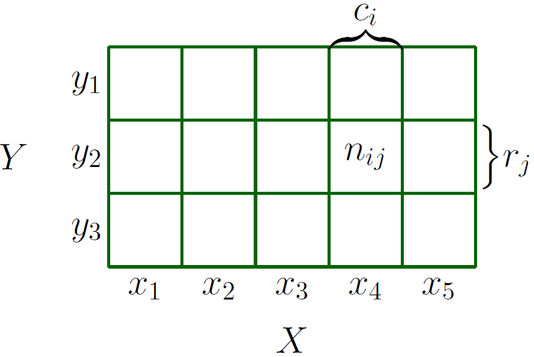

**[Reference]**  
$\bullet$ [MATHEMATICS FOR MACHINE LEARNING](https://mml-book.github.io/)
{: .notice--success}

# Introduction 

Probability is the study of uncertainty. 
Probability distributions are used as a building block for other concepts, such as probabilistic modeling, graphical models, and model selection.
In this section, we will look at:
- A probability space (the sample space, the events, and the probability of an event)
- The random variable


# 1.Construction of a Probability Space

The theory of probability aims at defining a mathematical structure to describe random outcomes of experiments.
Using this mathematical structure of probability, the goal is to perform automated reasoning, and in this sense, probability generalizes logical reasoning.

## 1-1) Philosophical Issues
Everyday reasoning and machine learning problems involve **uncertainty**, which is hard to express with simple true/false logic. 
**Probability theory** provides a mathematical framework to handle this **plausibility**, extending logic to enable **automated reasoning** under uncertainty.

In machine learning and statistics, there are two major ways to interpret probability:
- **Bayesian**: Probability represents a **degree of belief** or subjective certainty.
- **Frequentist**: Probability is the **relative frequency** of an event occurring over many trials in the long run.

Be aware that terms like "probability distribution" can sometimes be used ambiguously in machine learning literature. It's often helpful to clarify whether the context involves modeling **categorical** (discrete) or **continuous** variables.

## 1-2) Probability and Random Variables
To handle probability mathematically, we need to know the foundational framework first:
- The probability space
- A random variable


**Probability Space** 
A probability space is composed of three elements to mathematically model the random outcomes of an experiment.


**Sample space ($\Omega$)** 
The set of all possible elementary outcomes of the experiment.

Ex) (Two coin tosses): $$\Omega = \{hh, ht, th, tt\}$$



**Evnet space ($\mathcal{A}$)** 
A collection of events we are interested in, where each event is a subset of the sample space $\Omega$. (Technically, it must satisfy certain mathematical conditions.)

Ex) "Event of getting exactly one head" = $$\{ht, th\}$$



**Probability measure ($P$)** 
A function that assigns a probability $P(A)$ (a real number between 0 and 1) to each event $A \in \mathcal{A}$, representing the likelihood of that event occurring.

Ex) $$P(\{ ht, th \}) = 1/2$$


Modern probability theory is based on this probability space $(\Omega, \mathcal{A}, P)$.



**Random variable** 
Random variable translates outcomes to numbers $X: \Omega \to \mathcal{T}$

In practice, rather than working directly with the potentially complex sample space $\Omega$, we often use a function that maps each outcome to a more convenient value (usually a number). This function is called a Random Variable $X$.


**Target Space ($\mathcal{T}$)** 
The set of all possible values that the random variable $X$ can take (its range). 
The type of this space determines whether the random variable is discrete or continuous.



**Random Variable ($X$)** 
A function that maps each element $\omega$ in the sample space $\Omega$ to a specific value $X(\omega)$ in the target space $\mathcal{T}$.

Ex) Example (Counting heads in two coin tosses):
- $X(hh) = 2$
- $X(ht) = 1$
- $X(th) = 1$
- $X(tt) = 0$
- In this case, the target space is $\mathcal{T} = \{0, 1, 2\}$.

Despite its name, a random variable is neither random nor a variable; it is a **function**.



What we are often interested in is the probability within the target space $\mathcal{T}$. For instance, what's the probability of getting exactly one head ($P(X=1)$)?

This is linked back to the original probability space via the random variable $X$. 
The probability $P_X(S)$ of an event $S \subseteq \mathcal{T}$ in the target space is equal to the probability $P$ of the set of elements in the original sample space $\Omega$ that map to $S$ under $X$ (this set is called the pre-image $X^{-1}(S)$).

$$P_X(S) := P(X \in S) = P(X^{-1}(S)) = P(\{\omega \in \Omega \mid X(\omega) \in S\})$$

Ex) $$P_X(X=1) = P(\{ \omega \in \Omega \mid X(\omega) = 1 \}) = P(\{ ht, th \}) = 1/2$$

This function $P_X$ is called the **probability distribution** or **law** of the random variable $X$.

## 1-3) Statistics
In the following, we will look at the differences between **Probability Theory** and **Statistics**, and how they relate to Machine Learning. 
Both deal with uncertainty, but they approach it from opposite directions.


**Probability Theory: Cause $\to$ Effect (Model $\to$ Data)** 
- Perspective: Given a probabilistic model (e.g., a fair coin), it predicts what outcomes (data) are likely to result from it.

- Process: Assumes an underlying process (model) with uncertainty and uses the rules of probability to deduce what might happen in the future.

- Example: "If I flip a fair coin 100 times, about how many heads should I expect?"



**Statistics: Effect $\to$ Cause (Data $\to$ Model)** 
- Perspective: Given observed results (data), it infers what underlying process (model) might have generated that data.

- Process: Starts with the observed data and tries to find the probabilistic model that best explains it.

- Example: "I flipped a coin 100 times and got 70 heads. Can I conclude the coin is fair? If not, what is the estimated probability of getting heads?"


The goal of machine learning is to build a **model** that best explains and **generalizes** from given **data**. 
This is very similar to the goal of **statistics**, which infers the underlying process from observations. 
Machine learning uses the rules of probability to find the "best-fitting" model for the data.

Machine learning aims for models that perform well not just on the training data, but also on **new**, **unseen future data**. 
Analyzing and predicting this future performance (generalization ability) relies heavily on both probability and statistics.


# 2.Discrete and Continuous Probabilities

Depending on whether the target space ($\mathcal{T}$) is discrete or continuous, the natural way to refer to distributions is different.


**Discrete probability** 
When the target space $\mathcal{T}$ is discrete, we can specify the probability that a random variable $X$ takes a particular value $x \in \mathcal{T}$.

$P(X=x)$

The expression $P(X=x)$ for a discrete random variable $X$ is known as the **probability mass function** (PMF). The sum of probabilities for all possible values is 1 $\left( \sum\limits_{x \in \mathcal{T}} P(X=x) = 1 \right)$.

Examples: Uniform, Bernoulli, Binomial, Poisson, Geometric


**Uniform distribution** 
Describes a situation where all integer values from $a$ to $b$ (inclusive) are equally likely to be chosen.

$$\text{The probability of any single value $i$ is $p_X(i) = \frac{1}{b-a+1}$}$$




**Bernoulli distribution** 
Models a single trial that results in one of two outcomes (e.g., success/failure, head/tail). 
If the probability of success is $p$, then the probability of success (value 1) is $p$, and the probability of failure (value 0) is $1-p$.

$$X \sim \text{Bernoulli}(p) \to \begin{cases} p_X(1) = p \\ p_X(0) = 1-p \end{cases}$$




**Binomial distribution** 
Models the number of successes ($k$) in a fixed number of independent Bernoulli trials ($n$), where the probability of success in each trial is $p$.

$$X \sim \text{Binomial}(n, p) \to p_X(k) = \binom{n}{k}p^k(1-p)^{n-k}$$




**Poisson distribution** 
Models the number of events occurring in a fixed interval of time or space, often derived as the limit of the Binomial distribution when the number of trials $n$ is very large, the success probability $p$ is very small, and the average number of successes $np = \lambda$ remains constant.

$$p_X(k) = e^{-\lambda}\frac{\lambda^k}{k!} \ (\text{for } k=0, 1, 2, \dots)$$




**Geometric distribution** 
Models the number of independent Bernoulli trials ($k$) needed until the first success occurs, where the success probability is $p$.

$$p_X(k) = (1-p)^{k-1}p \ (\text{for } k=1, 2, 3, \dots)$$






**Continuous probability** 
When the target space $\mathcal{T}$ is continuous, it is more natural to specify the probability that a random variable $X$ is in an interval.

$P(a \le X \le b)$ for $a \lt b$

By convention, we specify the probaility that a random variable $X$ is less than a particular value $x$, denoted by $P(X \le x)$.
The expression $P(X \le x)$ for a continuous random variable $X$ is known as the **cumulative distribution funciton** (CDF).

The CDF $F(x)$ doesn't have a total area equal to 1; instead, its maximum value is 1.

$$\lim\limits_{x \to \infty} F(x) = \lim\limits_{x \to \infty} P(X \le x) = 1$$



We will use the phrase: 
- **Univariate distribution**: Refers to the probability distribution of a single random variable $X$.
- **Multivariate distribution**: Refers to the probability distribution of multiple random variables (usually represented as a vector $\vec{x}$).

## 2-1) Discrete Probabilities
When the target space is discrete, we can imagine the probability distribution of multiple random variables.


**Joint PMF** 
The probability that two random variables $X$ and $Y$ **simultaneously** take on specific values $x_i$ and $y_j$ is called the **joint probability**, denoted as $P(X=x_i, Y=y_j)$ or simply $p(x_i, y_j)$.
This is equivalent to the probability of the intersection of the two events, $P(X=x_i \cap Y=y_j)$.

<figure style="display: flex; flex-direction: column; align-items: center; margin-top: 0.5em; margin-bottom: 0.5em;">
  
   <figcaption style="font-size: 20px; margin-top: -0.5em;">
   Fig.6.1. Visualization of a discrete bivariate probability mass function, with random variables $X$ and $Y$.
   </figcaption>
</figure> 

In the table from Figure 6.1, the value in each cell, $n_{ij}$ (or this value divided by the total count $N$), represents the joint probability. 

$$P(X=x_i, Y=y_j) = \frac{n_{ij}}{N} \tag{6.1}$$

The complete set of these joint probabilities for all possible pairs $(x_i, y_j)$ constitutes the joint **probability distribution**.



**Marginal PMF** 
The marginal probability refers to the probability of a single random variable taking a specific value, regardless of the value of the other random variable(s).

For example, $P(X=x_i)$ is the probability that $X$ equals $x_i$, irrespective of the value of $Y$. 
It is obtained by summing the joint probabilities over all prossible valeus of $Y$ for the given $X=x_i$. 

$$P(X = x_i) = \sum_j P(X = x_i, Y = y_j)$$

In Figure 6.1, this corresponds to the sum of the $i$-th column ($c_i$).

We write $X ~ p(x)$ to denote that the random variable $X$ is distributed accroding to $p(x)$.



**Conditional PMF** 
The conditional probability is the probability of one random variable taking a specific value **given that** another random variable has taken a specific value.

The probability of $Y=y_j$ given $X=x_i$ is denoted as $P(Y=y_j | X=x_i)$ or simply $p(y_j | x_i)$.
Conditional probability is calculated using the joint and marginal probabilities as follows:

$$P(Y=y_j | X=x_i) = \frac{P(X=x_i, Y=y_j)}{P(X=x_i)}$$

In the context of Figure 6.2, this can be interpreted as the proportion of the value in a specific cell ($n_{ij}$) relative to the sum of its column ($c_i$).

These concepts of discrete probability distributions are essential for modeling **categorical variables** – variables that take values from a finite set without a specific order (e.g., word occurrences in document classification, object labels in image recognition).

Joint, marginal, and conditional probabilities are fundamental tools for analyzing dependencies between variables and constructing predictive models.

## 2-2) Continuous Probabilities
Here, we will describe probabilities when a random variable can take on continuous values, such as real numbers.


**Continuous random variable** 
A continuous random variable can take any value within a certain interval. 

Ex) A person's height or the temperature of a component

Their target space $\mathcal{T}$ is typically the set of real numbers $\mathbb{R}$ or $\mathbb{R}^D$ (D-dimensional real vector space).

Handling continuous spaces requires more rigorous mathematical definitions (like measure theory, Borel $\sigma$-algebra, etc.) compared to discrete spaces, but we will focus on the core concepts here.



**Definition 6.1 (Probability Density Function, PDF)** 
For a continuous random variable, the probability of it taking any single specific value is zero ($P(X=x)=0$). 
Therefore, instead of defining the probability at a specific point like the PMF, we use the Probability Density Function (PDF) $f(x)$.

A function $f: \mathbb{R}^D \to \mathbb{R}$ is a PDF if it satisfies two conditions:
1. Non-negativity: $\forall \vec{x} \in \mathbb{R}^D: f(\vec{x}) \ge 0$
2. Normalization: The integral of the function over its entire domain is 1.

    $$\int_{\mathbb{R}^D} f(\vec{x}) d\vec{x} = 1 \tag{6.2}$$

The PDF itself is not a probability. However, its integral over a specific interval $[a, b]$ gives the probability that the random variable $X$ falls within that interval.

$$P(a \le X \le b) = \int_a^b f(\vec{x}) d\vec{x} \tag{6.3}$$

In essence, the PDF describes how **densely** the probability is distributed over different intervals.



**Definition 6.2 (Cumulative Distribution Function, CDF)** 
The Cumulative Distribution Function (CDF), $F_{\vec{X}}(\vec{x})$, is another important function for describing continuous random variables. 
The CDF represents the probability that the random variable $X$ takes a value less than or equal to a specific value $\vec{x}$.

A CDF of multivariate real-valued random variable $X$ with states $\vec{x} \in \mathbb{R}^D$ is given by

$$F_{\vec{X}}(\vec{x}) = P(X_1 \le x_1, \dots, X_D \le x_D). \tag{6.4}$$

Here, $\vec{X} = [X_1, \dots, X_D]^\top$ is the random vector, and $\vec{x} = [x_1, \dots, x_D]^\top$ is a specific vector of values.

The CDF can be expressed also as the integral of the probability density function $f(\vec{x})$ so that

$$F_{\vec{X}}(\vec{x}) = \int_{-\infty}^{x_1} \cdots \int_{-\infty}^{x_D} f(z_1, \dots, z_D) dz_1 \dots dz_D \tag{6.5}$$

Conversely, the PDF can be obtained by differentiating the CDF ($f(x) = \frac{dF(x)}{dx}$). (Note: Not all CDFs have a corresponding PDF.)



**Exponential distribution** 
The Exponential distribution is a continuous probability distribution often used to model the waiting time until an event occurs. 
It has one parameter $\lambda > 0$.

$$\text{PDF: $f_X(x) = \lambda e^{-\lambda x}$ (for $x \ge 0$)}$$

$$\text{CDF: $F_X(x) = 1 - e^{-\lambda x}$ (for $x \ge 0$)}$$

$$\text{CCDF (Complementary CDF): $P(X \ge x) = e^{-\lambda x}$, showing the waiting time probability decays exponentially.}$$

$$\text{Mean/Variance: $\mathbb{E}[X] = 1/\lambda$, $\text{var}[X] = 1/\lambda^2$}.$$



When dealing with two or more continuous random variables, like $X$ and $Y$, we use the following concepts:


**Joint PDF** 
The probability that the pair $(X, Y)$ falls within a specific region $B$ is found by double integrating, $f_{X,Y}(x,y)$, the joint PDF over that region.

$$\mathbb{P}((X,Y) \in B) = \iint_B f_{X,Y}(x,y) dx dy$$




**Marginal PDF** 
The PDF of a single variable, irrespective of the other variables' values.

$f_X(x)$ or $f_Y(y)$

It's obtained by integrating the joint PDF over the entire range of the variable(s) you are not interested in.

$$f_X(x) = \int_{-\infty}^\infty f_{X,Y}(x,y) dy$$

$$f_Y(y) = \int_{-\infty}^\infty f_{X,Y}(x,y) dx$$




**Conditional PDF** 
The PDF of one variable $X$, given that another variable $Y$ has taken a specific value $y$.

$f_{X \vert Y}(x \vert y)$

$$\text{$f_{X \vert Y}(x \vert y)$ = $\frac{f_{X,Y}(x,y)}{f_Y(y)}$ (provided $f_Y(y) > 0$)}$$

For a fixed value $y$, the conditional PDF $f_{X\vert Y}(x\vert y)$ integrates to 1 over all $x$ ($\int_{-\infty}^{\infty} f_{X\vert Y}(x\vert y) dx = 1$), meaning it is a valid PDF itself.



# 3.Sum Rule, Product Rule, and Bayes's Theorem

Once we have defined probability distributions, corresponding to the uncertainties of the data and out problem, it turns out that there are only two fundamental rules, the **sum rule** and the **product rule**.

Let belows:
- $p(\vec{x}, \vec{y})$ : the joint distribution of the two random variables $\vec{x}$, $\vec{y}$
- $p(\vec{x})$ and $p(\vec{y})$: the corresponding marginal distributions
- $p(\vec{y} \vert \vec{x})$: the conditional distribution of $\vec{y}$ given $\vec{x}$

Given the difinitions of the marginal and conditional probability for discrete and continuous random variables, we can now present the two fundamental rules in probability theory.


**Sum rules** 
Describes how to calculate a marginal probability from a joint probability distribution. 
We can sum (for discrete variables) or integrate (for continuous variables) the joint probability over all possible values of the variable(s) we are not interested in.


$$ 
\begin{array}{|c|c|}
\hline
\text{Discrete Case} & \text{Continuous Case} \\
\hline
p_X(\vec{x}) = \sum_y p_{X,Y}(\vec{x},\vec{y}) & f_X(\vec{x}) = \int f_{X,Y}(\vec{x},\vec{y}) d\vec{y} \\
\hline
\end{array}
$$


The same principle applies to many variables. 
The marginal probability of $X_i$ is found by integrating (or summing) the joint probability over all variables except $X_i$.
However, it is computationally challenging for high-dimensional sums or integrals.



**Product rule** 
Describes how to decompose a joint probability into the product of a marginal probability and a conditional probability.

$$p_{X,Y}(\vec{x},\vec{y}) = p_X(\vec{x}) \cdot p_{Y \vert X}(\vec{y}\vert \vec{x}) = p_Y(\vec{y}) \cdot p_{X \vert Y}(\vec{x} \vert \vec{y})$$

The probability of two events occurring simultaneously is the probability of one event occurring multiplied by the probability of the second event occurring given that the first event has occurred.



**Bayes's Rule** 
Uses the product rule to reverse the direction of conditional probabilities. 
It allows calculating $P(X|Y)$ when you know $P(Y|X)$.

Used for inference, specifically to find the probability of a cause/state ($X$) given an observed result/effect ($Y$). 
It combines the likelihood ($P(Y|X)$), the prior probability ($P(X)$), and the evidence ($P(Y)$) to compute the posterior probability ($P(X|Y)$).

$$\underbrace{p(\vec{x} | \vec{y})}_{\text{posterior}} = \frac{\overbrace{p(\vec{y} | \vec{x})}^{\text{likelihood}} \overbrace{p(\vec{x})}^{\text{prior}}}{\underbrace{p(\vec{y})}_{\text{evidence}}}$$

The evidence $P(Y)$ acts as a normalization constant, calculated using the sum rule: $P(Y) = \sum_{x'} P(X=x')P(Y\vert X=x')$ (discrete) or $P(Y) = \int P(X=x')P(Y\vert X=x') dx'$ (continuous).

Bayes' rule can also be applied when one variable is discrete and the other is continuous.


**Inference of the Discrete Variable K given continuous value Y** 
This is the case where we want to find the probability $p(K=k|Y=y)$ that the discrete cause variable $K$ is in a specific state $k$, given that we have observed a continuous value $Y=y$.

$$\underbrace{p_{K\vert Y}(k\vert y)}_{\text{Posterior probability}} = \frac{\overbrace{p_K(k)}^{\text{Prior probability}} \overbrace{f_{Y\vert K}(y\vert k)}^{\text{Likelihood}}}{\underbrace{f_Y(y)}_{\text{Evidence}}}$$

**Inference of the Continuous Variable Y given discrete variable K** 
This is the case where we know the discrete cause variable $K$ is in state $k$, and we want to find the probability density function $f(Y=y|K=k)$ of the continuous result variable $Y$.

$$\underbrace{f_{Y|K}(y|k)}_{\text{Likelihood}} = \frac{\overbrace{f_Y(y)}^{\text{Evidence}} \overbrace{p_{K|Y}(k|y)}^{\text{Posterior}}}{\underbrace{p_K(k)}_{\text{Prior}}}$$

- $p_{K\vert Y}(k\vert y)$ (Posterior Probability): The probability that the cause is $k$ after observing $y$ (this is a PMF)
- $p_K(k)$ (Prior Probability): The probability that the cause is $k$ before observing $y$ (this is a PMF).
- $f_{Y\vert K}(y\vert k)$ (Likelihood): The probability density of observing the value $y$ assuming the cause is $k$ (this is a PDF).
- $f_Y(y)$ (Evidence): The overall probability density of observing $y$ (this is a PDF). It acts as a normalization constant and is calculated by summing (or integrating) the product of the prior and likelihood over all possible states $k'$: $$f_Y(y) = \sum_{k'} p_K(k') f_{Y\vert K}(y\vert k')$$




# 4.Summary Statistics and Independence

Here, we will discuss about summarizing sets of random variables and comparing pairs of random variables. 

- **Statistic**: A value obtained by applying a deterministic function to a random variable. 
    

    Ex) the mean or maximum value of several random variable outcomes
    

- **Summary statistics**: Numbers that summarize and characterize the features of a probability distribution. They provide a useful view of how a random variable generally behaves.
    

    Ex) the mean and the variance
    

- **Comparing pairs of random variables**: there are two ways to compare a pair of random variables
    

    $\cdot$ Independence: How to define when two random variables do not influence each other. 
    $\cdot$ Inner Product: Another way to measure the relationship between two random variables (which will later lead to concepts like covariance).
    

## 4-1) Means and Covariances

## 4-5) Statistical Independence

**Definition 6.10 (Independence)** 
Two random variables $X,Y$ are statistically independent under below condition. 

$$p(\vec{x}, \vec{y}) = p(\vec{x})p(\vec{y})$$

Two random variables $X$ and $Y$ are statistically independent if knowing the value of one variable provides no additional information about the other variable.
If $X$ and $Y$ are independent, the following important properties hold:

- Conditional equals Marginal

$$p(\vec{y} \vert \vec{x}) = p(\vec{y}) \text{ and } p(\vec{x} \vert \vec{y}) = p(\vec{x})$$

- Variance Sums

$$Var(\vec{x} + \vec{y}) = Var(\vec{x}) + Var(\vec{y})$$

- Covariance is Zero

$$Cov(\vec{x}, \vec{y}) = \vec{0}$$

Zero covariance does not necessarily imply independence. Covariance only measures linear dependence, so variables that are nonlinearly dependent can still have zero covariance.


In machine learning, it is often assumed that data samples are **independent and identically distributed** (i.i.d.).

$\cdot$ Independent: When dealing with more than two random variables ($X_1, \dots, X_N$), "independent" usually refers to mutually independent, meaning all subsets of the variables are independent of each other.  
$\cdot$ Identically Distributed: This means that all the random variables are drawn from the same probability distribution (e.g., all data points come from the same Gaussian distribution).


**Definition 6.11 (Conditional Independence)** 
Conditional independence is a crucial concept in machine learning. 
It describes the situation where two variables $X$ and $Y$ become independent given the value of a third variable $Z$.

$$p(\vec{x}, \vec{y} \vert \vec{z}) = p(\vec{x} \vert \vec{z})p(\vec{y} \vert \vec{z})$$

This is denoted as $$ X \perp \!\!\! \perp Y \vert Z$$ .

This definition can be interpreted in two ways:
- Factorization perspective: "Given information about $\vec{z}$, the distribution of $\vec{x}$ and $\vec{y}$ factorizes."
- Information perspective: "Given knowledge about $\vec{z}$, additional information about $\vec{y}$ does not change our knowledge about $\vec{x}$" (and vice versa).






**Definition . ()** 




