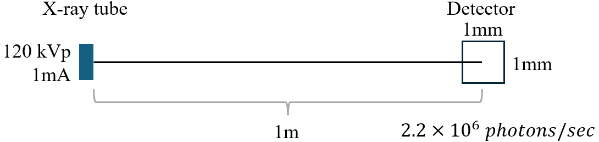

**[Reference]**  
$\bullet$ Computed Tomography: Principles, Design, Artifacts, and Recent Advances  
$\bullet$ Computed Tomography: From Photon Statistics to Modern Cone-Beam CT
{: .notice--success}

# 0.Introduction
We will explore the ways in which X-ray photons, generated by electrons striking a target material, interact with matter.

# 1.Number of photons, $N_0$
When we scan the object, X-ray and object are interact. Before we delve into these interactions, let's first establish the number of photons we are dealing with. The diagram below illustrates a basic X-ray tube and detector setup. 

<figure style="display: flex; flex-direction: column; align-items: center;">
  
   <figcaption style="font-size: 20px; margin-top: -0.5em;">
   Fig.1.1 Simple illustration of x-ray source and detector set.
   </figcaption>
</figure> 

Let's assume an X-ray tube operating at 120 kVp and 1 mA. A detector with a 1 $mm^2$ area, placed 1 meter away, detects $2.2 \times 10^6$ photons per second. We will define this as the total number of incident photons, $N_0$.